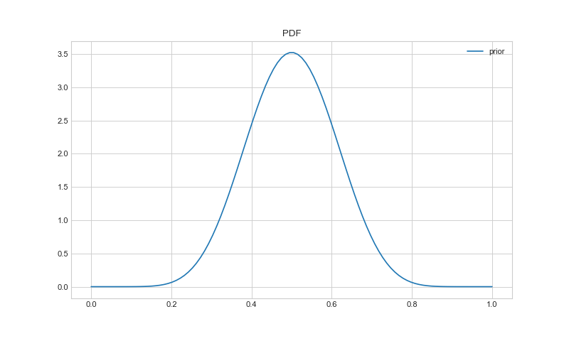
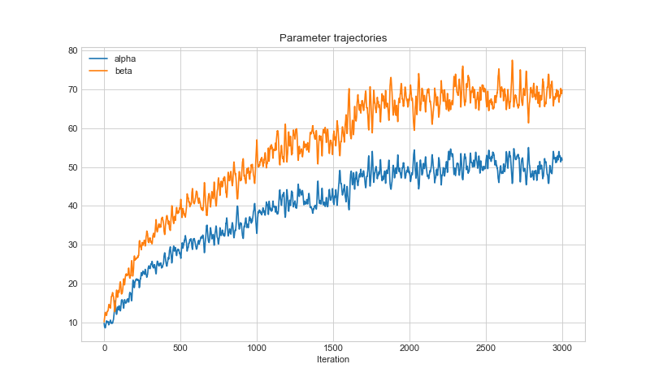
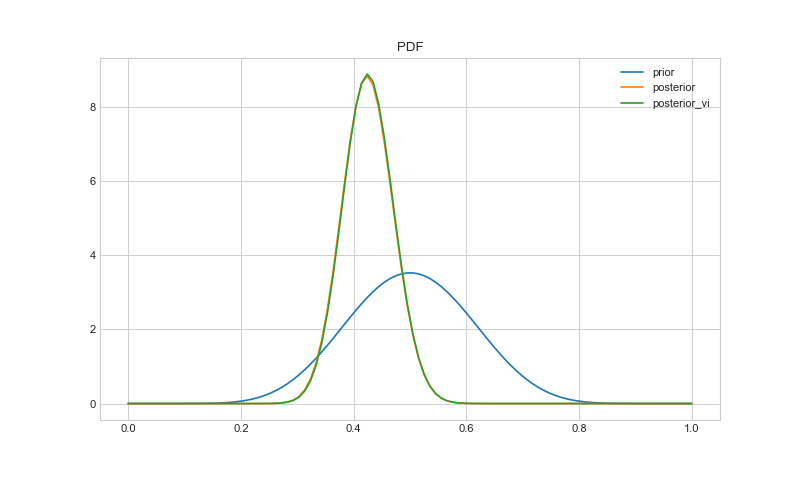
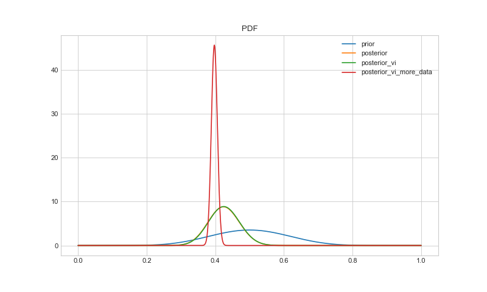

 # Fitting a Beta Distribution with Pyro

 Here we assume we are flipping a slightly biased coin.
 We think the probability of a heads is close to 0.5, but we are not sure.
 We want to fit a beta distribution to the random observed data.

 References:
   * [http://pyro.ai/examples/svi_part_i.html](http://pyro.ai/examples/svi_part_i.html)

 Import the required libraries:


```python
import numpy as np
import torch
from torch.distributions import constraints
import pyro
import pyro.infer
import pyro.optim
import pyro.distributions as dist

import matplotlib.pyplot as plt

plt.style.use("seaborn-whitegrid")
torch.manual_seed(0)
```

 ## Generate observed data
 We use the distribution module of pytorch to generate random data from Bernoulli trials with a known probability of success $$P(p)=0.4$$.


```python
# Generate data from actual distribution
true_dist = dist.Bernoulli(0.4)
n = 100
data = true_dist.sample(sample_shape=(n, 1))
```

 ## Prior distribution
 We propose the probability of a heads comes from a beta distribution.
 We assume that the probability is close to 0.5 but with some error.
 This is characterised in the prior distribution as follows:


```python
prior = dist.Beta(10, 10)

plt.figure(num=None, figsize=(10, 6), dpi=80)
x_range = np.linspace(0, 1, num=100)

y_values = torch.exp(prior.log_prob(torch.tensor(x_range)))
plt.plot(x_range, y_values, label="prior")

plt.title("PDF")
plt.legend()
plt.savefig("images/beta_prior_pdf.png")
plt.show()
```

 

 ## Analytical Posterior
 Using the random data we have generated, we can calculate the posterior distribution.
 In the case of a beta distribution - the posterior has an analytical solution,
 based on conjugacy:


```python
# Analytical posterior
posterior = dist.Beta(
    prior.concentration1 + data.sum(),
    prior.concentration0 + len(data) - data.sum(),
)
```

 ## Variational inference
 We can solve the same problem with variational inference using `pyro`.
 We setup the model to sample from a Bernoulli trial,
 where the probability of a heads comes from a beta distribution.
 The model is conditioned to give the generated data when it is sampled from.


```python
def data_model(params):
    # returns a Bernoulli trial outcome
    beta = pyro.sample("beta_dist", dist.Beta(params[0], params[1]))
    return pyro.sample("data_dist", dist.Bernoulli(beta))


conditioned_data_model = pyro.condition(data_model, data={"data_dist": data})
```

 The guide function creates a pyro beta distribution object given a set of parameters,
 which we will track.


```python
def guide(params):
    # returns the Bernoulli probablility
    alpha = pyro.param(
        "alpha", torch.tensor(params[0]), constraint=constraints.positive
    )
    beta = pyro.param(
        "beta", torch.tensor(params[1]), constraint=constraints.positive
    )
    return pyro.sample("beta_dist", dist.Beta(alpha, beta))
```

 We iterate over the above functions, starting from our prior distribution.
 Each step we converge towards an ideal posterior form of the guide.


```python
svi = pyro.infer.SVI(
    model=conditioned_data_model,
    guide=guide,
    optim=pyro.optim.SGD({"lr": 0.001, "momentum": 0.8}),
    loss=pyro.infer.Trace_ELBO(),
)

params_prior = [prior.concentration1, prior.concentration0]

# Iterate over all the data and store results
losses, alpha, beta = [], [], []
pyro.clear_param_store()

num_steps = 3000
for t in range(num_steps):
    losses.append(svi.step(params_prior))
    alpha.append(pyro.param("alpha").item())
    beta.append(pyro.param("beta").item())

posterior_vi = dist.Beta(alpha[-1], beta[-1])
```

 We plot the trajectories of the parameters to show they have converged sufficiently:


```python
plt.figure(num=None, figsize=(10, 6), dpi=80)
plt.plot(alpha, label='alpha')
plt.plot(beta, label='beta')
plt.title("Parameter trajectories")
plt.xlabel("Iteration")
plt.legend()
plt.savefig("images/beta_trajectories.png")
plt.show()
```

 

 ## Comparing distributions
 We can compare the variational inference distribution to the analytical posterior.


```python
plt.figure(num=None, figsize=(10, 6), dpi=80)
x_range = np.linspace(0, 1, num=100)

y_values = torch.exp(prior.log_prob(torch.tensor(x_range)))
plt.plot(x_range, y_values, label="prior")

y_values = torch.exp(posterior.log_prob(torch.tensor(x_range)))
plt.plot(x_range, y_values, label="posterior")

y_values = torch.exp(posterior_vi.log_prob(torch.tensor(x_range)))
plt.plot(x_range, y_values, label="posterior_vi")

plt.title("PDF")
plt.legend()
plt.savefig("images/beta_pdfs.png")
plt.show()
```

 

 The estimated posterior from variational inference is very similar to the analytical posterior.

 ## Extra: More Data
 If we generate much more data and repeat the process,
 we can get a tighter posterior:


```python
n = 10000
data_more = true_dist.sample(sample_shape=(n, 1))
conditioned_data_model_more = pyro.condition(data_model, data={"data_dist": data_more})

svi = pyro.infer.SVI(
    model=conditioned_data_model_more,
    guide=guide,
    optim=pyro.optim.SGD({"lr": 0.0001, "momentum": 0.8}),
    loss=pyro.infer.Trace_ELBO(),
)

# Iterate over all the data and store results
losses, alpha, beta = [], [], []
pyro.clear_param_store()

num_steps = 3000
for t in range(num_steps):
    losses.append(svi.step(params_prior))
    alpha.append(pyro.param("alpha").item())
    beta.append(pyro.param("beta").item())

posterior_vim = dist.Beta(alpha[-1], beta[-1])

plt.figure(num=None, figsize=(10, 6), dpi=80)
x_range = np.linspace(0, 1, num=1000)

y_values = torch.exp(prior.log_prob(torch.tensor(x_range)))
plt.plot(x_range, y_values, label="prior")

y_values = torch.exp(posterior.log_prob(torch.tensor(x_range)))
plt.plot(x_range, y_values, label="posterior")

y_values = torch.exp(posterior_vi.log_prob(torch.tensor(x_range)))
plt.plot(x_range, y_values, label="posterior_vi")

y_values = torch.exp(posterior_vim.log_prob(torch.tensor(x_range)))
plt.plot(x_range, y_values, label="posterior_vi_more_data")

plt.title("PDF")
plt.legend()
plt.savefig("images/beta_pdfs_more.png")
plt.show()
```

 
