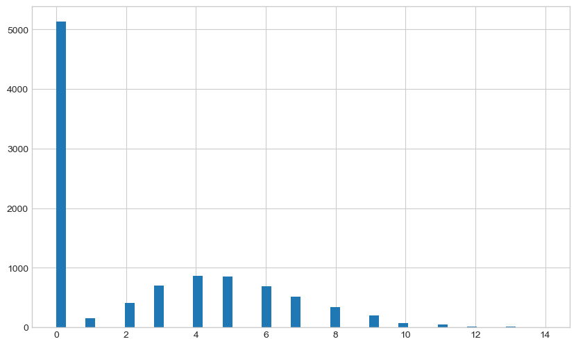
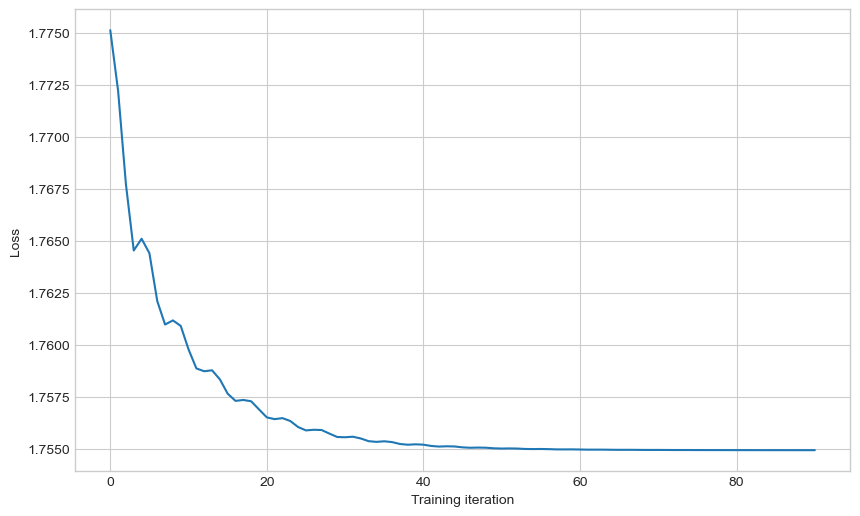
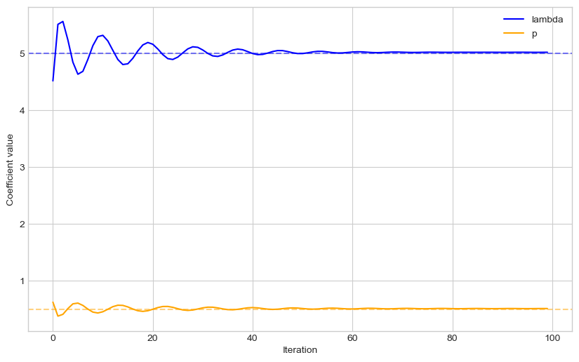
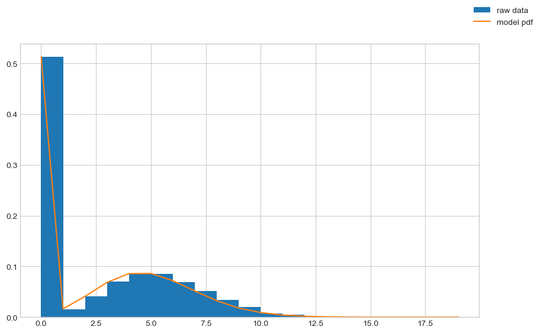
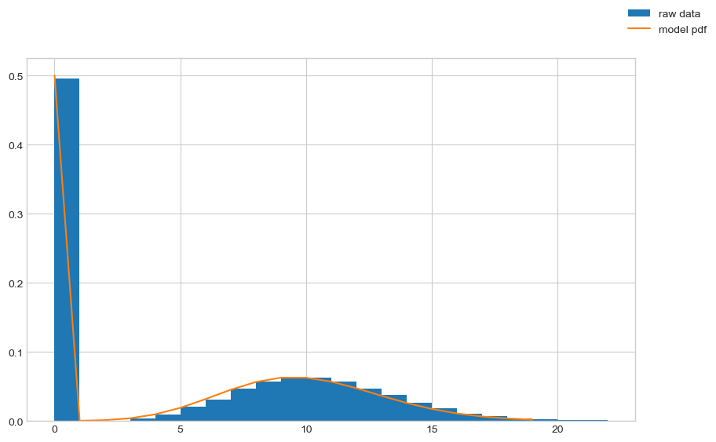

# Fitting a zero-inflated Poisson distribution

Can we generate and then fit a distribution with gradient descent?

Outline:
*   Generate random data from the target distribution - https://en.wikipedia.org/wiki/Zero-inflated_model
*   Propose a distribution with Pytorch
*   Fit with gradient descent via PyTorch


Poisson distribution product mass function:
$${\frac {\lambda^{k} e^{-\lambda}}{k!}}$$
$$\!f(k; \lambda)= \Pr(X{=}k)= \frac{\lambda^k e^{-\lambda}}{k!},$$

The zero-inflated Poisson can switch the Poisson distribution in or out at random.
$${\displaystyle \Pr(Y=0)=\pi +(1-\pi )e^{-\lambda }}$$
$${\displaystyle \Pr(Y=y_{i})=(1-\pi ){\frac {\lambda ^{y_{i}}e^{-\lambda }}{y_{i}!}},\qquad y_{i}=1,2,3,...}$$

## Generate random data

I'll make random data from two beta distributions and then select from them randomly to get two peaks.
I'll deliberately make the distributions fairly distinct to make the initial analysis easier to visualise.


```python
import numpy as np
import matplotlib.pyplot as plt

plt.style.use("seaborn-whitegrid")

# true distribution parameters
p_d1 = 0.5
p_lambda = 5

n = 10000
rand_gen = np.random.default_rng(seed=0)

poisson_samples = rand_gen.poisson(lam=p_lambda, size=(n, 1))
mix_samples = rand_gen.binomial(n=1, p=p_d1, size=(n, 1))
rand_samples = mix_samples * poisson_samples

fig, ax = plt.subplots(figsize=(10, 6))
ax.hist(rand_samples, bins=50)
plt.show()

```

    /var/folders/ky/4qby95090jbbq38_mh94x72r0000gn/T/ipykernel_82119/2487205322.py:4: MatplotlibDeprecationWarning: The seaborn styles shipped by Matplotlib are deprecated since 3.6, as they no longer correspond to the styles shipped by seaborn. However, they will remain available as 'seaborn-v0_8-<style>'. Alternatively, directly use the seaborn API instead.
      plt.style.use("seaborn-whitegrid")


    

    


## Creating a PyTorch model

Assuming we know the underlying generating model (...strong assumption...?), we can construct a network that builds the equivalent distribution objects in PyTorch.

We are fitting the distribution parameters.
As such we have no input features for the forward pass, only the output values.
We use negative log likelihood as the loss function to optimise.


```python
import pytorch_lightning as pl
import torch


class ZIPModel(pl.LightningModule):
    def __init__(
        self,
        learning_rate=1e-3,
        init_mix_parameter: float = 0.5,
        init_poisson_lambda: float = 1.0,
    ):
        super().__init__()
        self.mixture_prob = torch.nn.Parameter(torch.tensor([init_mix_parameter]))
        self.poisson_lambda = torch.nn.Parameter(torch.tensor([init_poisson_lambda]))

        self.train_log_error = []
        self.val_log_error = []
        self.mixture_prob_log = []
        self.poisson_lambda_log = []
        self.learning_rate = learning_rate

    def forward(self):
        # ensure correct domain for params
        mixture_prob_norm = torch.sigmoid(self.mixture_prob)
        poisson_lambda_norm = torch.nn.functional.softplus(self.poisson_lambda)
        poisson_lambda_norm = torch.concat(
            (torch.tensor([0.0]), poisson_lambda_norm)
        )  # maintains grad

        mix = torch.distributions.Categorical(
            torch.concat((mixture_prob_norm, 1 - mixture_prob_norm))
        )
        poissons = torch.distributions.Poisson(poisson_lambda_norm)

        mixture_dist = torch.distributions.MixtureSameFamily(mix, poissons)
        return mixture_dist

    def configure_optimizers(self):
        optimizer = torch.optim.Adam(
            self.parameters(),
            lr=self.learning_rate,
        )
        return optimizer

    def training_step(self, batch, batch_idx):
        y = batch[0]

        mixture_dist = self.forward()

        negloglik = -mixture_dist.log_prob(y)
        loss = torch.mean(negloglik)

        self.train_log_error.append(loss.detach().numpy())
        self.poisson_lambda_log.append(
            torch.nn.functional.softplus(self.poisson_lambda).detach().numpy()
        )
        self.mixture_prob_log.append(torch.sigmoid(self.mixture_prob).detach().numpy())
        return loss

    def validation_step(self, batch, batch_idx):
        y = batch[0]

        mixture_dist = self.forward()

        negloglik = -mixture_dist.log_prob(y)
        loss = torch.mean(negloglik)

        self.train_log_error.append(loss.detach().numpy())
        return loss

```

Lets create the model:


```python
# create model
torch.manual_seed(1)
model = ZIPModel(learning_rate=1e-0, init_mix_parameter=0.5, init_poisson_lambda=4.5)

```

Now we can generate distribution objects from the model by calling the forward pass method.


```python
# get some samples
output_dist = model()
output_samples = output_dist.sample((n, 1)).numpy().squeeze()

fig, ax = plt.subplots(figsize=(10, 6))
ax.hist(output_samples, bins=50)
plt.show()

```


    

    


## Fitting the model distribution
To train the model with our random sample data created above, we need to setup a dataloader to pass to the trainer.


```python
# training on the whole dataset each batch
from torch.utils.data import TensorDataset, DataLoader

rand_samples_t = torch.Tensor(rand_samples)
dataset_train = TensorDataset(rand_samples_t)
dataloader_train = DataLoader(dataset_train, batch_size=len(rand_samples))

# test loading a batch
rand_samples_batch = next(iter(dataloader_train))
rand_samples_batch[0].shape

```


    torch.Size([10000, 1])


Now we can train the model via PyTorch Lightning's Trainer object.


```python
# fit network
trainer = pl.Trainer(
    max_epochs=100,
)
trainer.fit(model, dataloader_train)

```

    GPU available: True (mps), used: False
    TPU available: False, using: 0 TPU cores
    IPU available: False, using: 0 IPUs
    HPU available: False, using: 0 HPUs
    /Users/rich/Developer/miniconda3/envs/pytorch_env/lib/python3.10/site-packages/pytorch_lightning/trainer/trainer.py:1789: UserWarning: MPS available but not used. Set `accelerator` and `devices` using `Trainer(accelerator='mps', devices=1)`.
      rank_zero_warn(
    /Users/rich/Developer/miniconda3/envs/pytorch_env/lib/python3.10/site-packages/pytorch_lightning/trainer/configuration_validator.py:107: PossibleUserWarning: You defined a `validation_step` but have no `val_dataloader`. Skipping val loop.
      rank_zero_warn(
    
      | Name | Type | Params
    ------------------------------
    ------------------------------
    2         Trainable params
    0         Non-trainable params
    2         Total params
    0.000     Total estimated model params size (MB)
    /Users/rich/Developer/miniconda3/envs/pytorch_env/lib/python3.10/site-packages/pytorch_lightning/trainer/connectors/data_connector.py:236: PossibleUserWarning: The dataloader, train_dataloader, does not have many workers which may be a bottleneck. Consider increasing the value of the `num_workers` argument` (try 8 which is the number of cpus on this machine) in the `DataLoader` init to improve performance.
      rank_zero_warn(
    /Users/rich/Developer/miniconda3/envs/pytorch_env/lib/python3.10/site-packages/pytorch_lightning/trainer/trainer.py:1892: PossibleUserWarning: The number of training batches (1) is smaller than the logging interval Trainer(log_every_n_steps=50). Set a lower value for log_every_n_steps if you want to see logs for the training epoch.
      rank_zero_warn(


    Training: 0it [00:00, ?it/s]


    `Trainer.fit` stopped: `max_epochs=100` reached.


We can see the training loss has converged ok.


```python
def moving_average(a, n=10):
    ret = np.cumsum(a, dtype=float)
    ret[n:] = ret[n:] - ret[:-n]
    return ret[n - 1 :] / n


fig, ax = plt.subplots(figsize=(10, 6))
ax.plot(moving_average(np.array(model.train_log_error)))
ax.set_ylabel("Loss")
ax.set_xlabel("Training iteration")
fig.show()

```

    /var/folders/ky/4qby95090jbbq38_mh94x72r0000gn/T/ipykernel_82119/2590399248.py:11: UserWarning: Matplotlib is currently using module://matplotlib_inline.backend_inline, which is a non-GUI backend, so cannot show the figure.
      fig.show()


    

    


```python
fig, ax = plt.subplots(figsize=(10, 6))
ax.plot(model.poisson_lambda_log, color="b", label="lambda")
ax.plot(model.mixture_prob_log, color="orange", label="p")
ax.axhline(y=p_lambda, linestyle="--", color="b", alpha=0.5)
ax.axhline(y=p_d1, linestyle="--", color="orange", alpha=0.5)
ax.legend()
ax.set_xlabel("Iteration")
ax.set_ylabel("Coefficient value")
fig.show()

```

    /var/folders/ky/4qby95090jbbq38_mh94x72r0000gn/T/ipykernel_82119/2571154232.py:9: UserWarning: Matplotlib is currently using module://matplotlib_inline.backend_inline, which is a non-GUI backend, so cannot show the figure.
      fig.show()


    

    


## Checking results
Now we can check the resulting distribution that comes out of our model and compare that directly to the random samples.


```python
# plot pdf
output_dist = model()
x = torch.arange(0, 20)
y = torch.exp(output_dist.log_prob(x))

fig, ax = plt.subplots(figsize=(10, 6))
ax.hist(
    rand_samples,
    bins=rand_samples.max() - rand_samples.min(),
    density=True,
    label="raw data",
)
ax.plot(x.detach().numpy(), y.detach().numpy(), label="model pdf")
fig.legend()
plt.show()

```


    

    


We can see that the trained distribution parameters now are close to the underlying parameters.


```python
print("Final mix:", model.mixture_prob_log[-1][0])
print("Final lambda:", model.poisson_lambda_log[-1][0])

print("True mix:", p_d1)
print("True lambda:", p_lambda)

```

    Final mix: 0.5104645
    Final lambda: 5.013678
    True mix: 0.5
    True lambda: 5


### Random seeding
We can start the training from different random initialisations to see how smooth the objective function surface is.


```python
import random

seed_model_params = []
for _idx in range(10):
    print(_idx)
    init_params = [random.random(), random.random() * 10]
    model = ZIPModel(
        learning_rate=1e-0,
        init_mix_parameter=init_params[0],
        init_poisson_lambda=init_params[1],
    )

    # fit network
    trainer = pl.Trainer(
        max_epochs=100,
    )
    trainer.fit(model, dataloader_train)

    seed_model_params.append(
        {
            "err": model.train_log_error[-1],
            "mixture": model.mixture_prob_log[-1],
            "lambda": model.poisson_lambda_log[-1],
            "mixture_init": init_params[0],
            "lambda_init": init_params[1],
        }
    )

```

    0


    GPU available: True (mps), used: False
    TPU available: False, using: 0 TPU cores
    IPU available: False, using: 0 IPUs
    HPU available: False, using: 0 HPUs
    
      | Name | Type | Params
    ------------------------------
    ------------------------------
    2         Trainable params
    0         Non-trainable params
    2         Total params
    0.000     Total estimated model params size (MB)


    Training: 0it [00:00, ?it/s]


    `Trainer.fit` stopped: `max_epochs=100` reached.


    1


    GPU available: True (mps), used: False
    TPU available: False, using: 0 TPU cores
    IPU available: False, using: 0 IPUs
    HPU available: False, using: 0 HPUs
    
      | Name | Type | Params
    ------------------------------
    ------------------------------
    2         Trainable params
    0         Non-trainable params
    2         Total params
    0.000     Total estimated model params size (MB)


    Training: 0it [00:00, ?it/s]


    `Trainer.fit` stopped: `max_epochs=100` reached.


    2


    GPU available: True (mps), used: False
    TPU available: False, using: 0 TPU cores
    IPU available: False, using: 0 IPUs
    HPU available: False, using: 0 HPUs
    
      | Name | Type | Params
    ------------------------------
    ------------------------------
    2         Trainable params
    0         Non-trainable params
    2         Total params
    0.000     Total estimated model params size (MB)


    Training: 0it [00:00, ?it/s]


    `Trainer.fit` stopped: `max_epochs=100` reached.


    3


    GPU available: True (mps), used: False
    TPU available: False, using: 0 TPU cores
    IPU available: False, using: 0 IPUs
    HPU available: False, using: 0 HPUs
    
      | Name | Type | Params
    ------------------------------
    ------------------------------
    2         Trainable params
    0         Non-trainable params
    2         Total params
    0.000     Total estimated model params size (MB)


    Training: 0it [00:00, ?it/s]


    `Trainer.fit` stopped: `max_epochs=100` reached.


    4


    GPU available: True (mps), used: False
    TPU available: False, using: 0 TPU cores
    IPU available: False, using: 0 IPUs
    HPU available: False, using: 0 HPUs
    
      | Name | Type | Params
    ------------------------------
    ------------------------------
    2         Trainable params
    0         Non-trainable params
    2         Total params
    0.000     Total estimated model params size (MB)


    Training: 0it [00:00, ?it/s]


    `Trainer.fit` stopped: `max_epochs=100` reached.


    5


    GPU available: True (mps), used: False
    TPU available: False, using: 0 TPU cores
    IPU available: False, using: 0 IPUs
    HPU available: False, using: 0 HPUs
    
      | Name | Type | Params
    ------------------------------
    ------------------------------
    2         Trainable params
    0         Non-trainable params
    2         Total params
    0.000     Total estimated model params size (MB)


    Training: 0it [00:00, ?it/s]


    `Trainer.fit` stopped: `max_epochs=100` reached.


    6


    GPU available: True (mps), used: False
    TPU available: False, using: 0 TPU cores
    IPU available: False, using: 0 IPUs
    HPU available: False, using: 0 HPUs
    
      | Name | Type | Params
    ------------------------------
    ------------------------------
    2         Trainable params
    0         Non-trainable params
    2         Total params
    0.000     Total estimated model params size (MB)


    Training: 0it [00:00, ?it/s]


    `Trainer.fit` stopped: `max_epochs=100` reached.


    7


    GPU available: True (mps), used: False
    TPU available: False, using: 0 TPU cores
    IPU available: False, using: 0 IPUs
    HPU available: False, using: 0 HPUs
    
      | Name | Type | Params
    ------------------------------
    ------------------------------
    2         Trainable params
    0         Non-trainable params
    2         Total params
    0.000     Total estimated model params size (MB)


    Training: 0it [00:00, ?it/s]


    `Trainer.fit` stopped: `max_epochs=100` reached.


    8


    GPU available: True (mps), used: False
    TPU available: False, using: 0 TPU cores
    IPU available: False, using: 0 IPUs
    HPU available: False, using: 0 HPUs
    
      | Name | Type | Params
    ------------------------------
    ------------------------------
    2         Trainable params
    0         Non-trainable params
    2         Total params
    0.000     Total estimated model params size (MB)


    Training: 0it [00:00, ?it/s]


    `Trainer.fit` stopped: `max_epochs=100` reached.


    9


    GPU available: True (mps), used: False
    TPU available: False, using: 0 TPU cores
    IPU available: False, using: 0 IPUs
    HPU available: False, using: 0 HPUs
    
      | Name | Type | Params
    ------------------------------
    ------------------------------
    2         Trainable params
    0         Non-trainable params
    2         Total params
    0.000     Total estimated model params size (MB)


    Training: 0it [00:00, ?it/s]


    `Trainer.fit` stopped: `max_epochs=100` reached.


```python
import pandas as pd

pd.DataFrame(seed_model_params)

```


<div>
<style scoped>
    .dataframe tbody tr th:only-of-type {
        vertical-align: middle;
    }

    .dataframe tbody tr th {
        vertical-align: top;
    }

    .dataframe thead th {
        text-align: right;
    }
</style>
<table border="1" class="dataframe">
  <thead>
    <tr style="text-align: right;">
      <th></th>
      <th>err</th>
      <th>mixture</th>
      <th>lambda</th>
      <th>mixture_init</th>
      <th>lambda_init</th>
    </tr>
  </thead>
  <tbody>
    <tr>
      <th>0</th>
      <td>1.7549713</td>
      <td>[0.5084596]</td>
      <td>[4.990373]</td>
      <td>0.206126</td>
      <td>1.271737</td>
    </tr>
    <tr>
      <th>1</th>
      <td>1.7549436</td>
      <td>[0.5095606]</td>
      <td>[5.0154147]</td>
      <td>0.957375</td>
      <td>5.609975</td>
    </tr>
    <tr>
      <th>2</th>
      <td>1.75495</td>
      <td>[0.50945556]</td>
      <td>[5.0249567]</td>
      <td>0.113368</td>
      <td>9.019589</td>
    </tr>
    <tr>
      <th>3</th>
      <td>1.7549486</td>
      <td>[0.51113284]</td>
      <td>[5.019183]</td>
      <td>0.024360</td>
      <td>2.504726</td>
    </tr>
    <tr>
      <th>4</th>
      <td>1.7549453</td>
      <td>[0.50945634]</td>
      <td>[5.0075474]</td>
      <td>0.422956</td>
      <td>6.300903</td>
    </tr>
    <tr>
      <th>5</th>
      <td>1.7549646</td>
      <td>[0.5087664]</td>
      <td>[4.992894]</td>
      <td>0.317083</td>
      <td>1.335294</td>
    </tr>
    <tr>
      <th>6</th>
      <td>1.7549437</td>
      <td>[0.50981426]</td>
      <td>[5.016553]</td>
      <td>0.569097</td>
      <td>3.339710</td>
    </tr>
    <tr>
      <th>7</th>
      <td>1.7549523</td>
      <td>[0.51095116]</td>
      <td>[5.002224]</td>
      <td>0.146055</td>
      <td>8.153884</td>
    </tr>
    <tr>
      <th>8</th>
      <td>1.7549479</td>
      <td>[0.50936157]</td>
      <td>[5.022941]</td>
      <td>0.538195</td>
      <td>3.024650</td>
    </tr>
    <tr>
      <th>9</th>
      <td>1.7549556</td>
      <td>[0.50825804]</td>
      <td>[5.0001493]</td>
      <td>0.075363</td>
      <td>9.901132</td>
    </tr>
  </tbody>
</table>
</div>


Compared with the true parameters, it looks like we're converging well in each case.

So seems successful overall! This approach makes it quite easy to train fairly complex distributions without having to understand the particular methods for fitting that distribution type (if they even exist).

## Creating a PyTorch distribution object

The solution is a bit hacky - we need to define the mixture of two of the same types, so we used a Poisson distribution with a $\lambda$ of 0.
Can we reformulate this is a pytorch distribution class instead?

The poisson class in PyTorch is based around the following (simplified) form:
```python
class Poisson(ExponentialFamily):
    def __init__(self, rate, validate_args=None):
        self.rate = rate
        super(Poisson, self).__init__(batch_shape, validate_args=validate_args)

    def sample(self, sample_shape=torch.Size()):
        with torch.no_grad():
            return torch.poisson(self.rate.expand(shape))

    def log_prob(self, value):
        return value.xlogy(self.rate) - self.rate - (value + 1).lgamma()

    ...
```

Can we build the equivalent zero-inflated Poisson distribution?

We need to specify a `sample` and `log-prob` method. For both of those we need to find an expression for the product mass function (PMF).

### PMF
Poisson PMF:
$$\mathrm{P_{s}}(Y=k | \lambda) = \frac{\lambda^{k} e^{-\lambda }} {k!}$$

Bernoulli PMF:
$$
\begin{align*}
\mathrm{P_{d}}(Y=0) &= \pi\\
\mathrm{P_{d}}(Y!=0) &= 1-\pi
\end{align*}
$$

Mixture distribution:
$$\mathrm{P}(Y) = \mathrm{P_{d}}(Y) \mathrm{P_{s}}(Y)$$

This is the expression we implement to create the `sample` method.


We need to dig further to get the full expression.
The zero case:
$$
\begin{align*}
\mathrm{P}(Y=0) &= \mathrm{P_{d}}(Y=0) + \mathrm{P_{d}}(Y=1) \mathrm{P_{s}}(Y=0 | \lambda)\\
                &= \pi + (1-\pi) \frac{\lambda^{0} e^{-\lambda }} {0!}\\
                &= \pi + (1-\pi) e^{-\lambda }
\end{align*}
$$

The non-zero case:
$$\mathrm{P}(Y=k) = (1-\pi) \frac{\lambda^{k} e^{-\lambda }} {k!}$$

### Log probs
Log of the above:
$$\log{\mathrm{P}(Y=0)} = \log(\pi + (1-\pi) e^{-\lambda })$$

Non zero case:
$$
\begin{align*}
\log{\mathrm{P}(Y=k)} &= \log((1-\pi) \frac{\lambda^{k} e^{-\lambda }} {k!})\\
                      &= \log(1-\pi) + \log(\frac{\lambda^{k} e^{-\lambda }} {k!})\\
                      &= \log(1-\pi) + \log(\lambda^{k} e^{-\lambda }) -\log(k!)\\
                      &= \log(1-\pi) + k\log(\lambda) -\lambda -\log(\Gamma(k+1))
\end{align*}
$$


We can create those expression inside a new class:


```python
from numbers import Number

import torch
from torch.distributions import constraints
from torch.distributions.exp_family import ExponentialFamily
from torch.distributions.utils import broadcast_all


class ZeroInflatedPoisson(ExponentialFamily):
    arg_constraints = {"p": constraints.unit_interval, "rate": constraints.nonnegative}
    support = constraints.nonnegative_integer

    def __init__(self, p, rate, validate_args=None):
        self.p, self.rate = broadcast_all(p, rate)
        if isinstance(rate, Number):
            batch_shape = torch.Size()
        else:
            batch_shape = self.rate.size()
        super(ZeroInflatedPoisson, self).__init__(
            batch_shape, validate_args=validate_args
        )

    def sample(self, sample_shape=torch.Size()):
        shape = self._extended_shape(sample_shape)
        with torch.no_grad():
            zero = torch.bernoulli(self.p.expand(shape))
            poisson = torch.poisson(self.rate.expand(shape))
            return zero * poisson

    def log_prob(self, value):
        if self._validate_args:
            self._validate_sample(value)
        rate, p, value = broadcast_all(self.rate, self.p, value)
        poisson_log_prob = value.xlogy(rate) - rate - (value + 1).lgamma()
        poisson_log_prob[torch.where(value == 0.0)] = torch.log(
            p + (1 - p) * torch.exp(-rate)
        )[torch.where(value == 0.0)]
        poisson_log_prob[value > 0.0] = (
            torch.log(1 - p)[value > 0.0] + poisson_log_prob[value > 0.0]
        )
        return poisson_log_prob

```

We can sample from the distribution object and it looks good:


```python
dist = ZeroInflatedPoisson(p=0.5, rate=10.0)
samples = dist.sample(sample_shape=(10000,))

fig, ax = plt.subplots(figsize=(10, 6))
ax.hist(
    samples, bins=int(samples.max() - samples.min()), density=True, label="raw data"
)

# plot pdf
x = torch.arange(0, 20)
y = torch.exp(dist.log_prob(x))

ax.plot(x.detach().numpy(), y.detach().numpy(), label="model pdf")
fig.legend()
plt.show()

```


    

    


Can we fit the same model with the output as a `ZeroInflatedPoisson`?

We can build the model class with the new distribution object as the output:


```python
class DistZIPModel(ZIPModel):
    def __init__(self, **kwargs):
        super().__init__(**kwargs)

    def forward(self):
        # ensure correct domain for params
        mixture_prob_norm = torch.sigmoid(self.mixture_prob)
        poisson_lambda_norm = torch.nn.functional.softplus(self.poisson_lambda)

        zip_dist = ZeroInflatedPoisson(p=mixture_prob_norm, rate=poisson_lambda_norm)
        return zip_dist

```

Similarly to before, we can then fit the model multiple times from random starting seeds.


```python
import random

seed_model_params = []
for _idx in range(10):
    print(_idx)
    init_params = [random.random(), random.random() * 10]
    model = DistZIPModel(
        learning_rate=1e-0,
        init_mix_parameter=init_params[0],
        init_poisson_lambda=init_params[1],
    )

    # fit network
    trainer = pl.Trainer(
        max_epochs=100,
    )
    trainer.fit(model, dataloader_train)

    seed_model_params.append(
        {
            "err": model.train_log_error[-1],
            "mixture": model.mixture_prob_log[-1][0],
            "lambda": model.poisson_lambda_log[-1][0],
            "mixture_init": init_params[0],
            "lambda_init": init_params[1],
        }
    )

```

    0


    GPU available: True (mps), used: False
    TPU available: False, using: 0 TPU cores
    IPU available: False, using: 0 IPUs
    HPU available: False, using: 0 HPUs
    /Users/rich/Developer/miniconda3/envs/pytorch_env/lib/python3.10/site-packages/pytorch_lightning/trainer/trainer.py:1789: UserWarning: MPS available but not used. Set `accelerator` and `devices` using `Trainer(accelerator='mps', devices=1)`.
      rank_zero_warn(
    /Users/rich/Developer/miniconda3/envs/pytorch_env/lib/python3.10/site-packages/pytorch_lightning/trainer/configuration_validator.py:107: PossibleUserWarning: You defined a `validation_step` but have no `val_dataloader`. Skipping val loop.
      rank_zero_warn(
    
      | Name | Type | Params
    ------------------------------
    ------------------------------
    2         Trainable params
    0         Non-trainable params
    2         Total params
    0.000     Total estimated model params size (MB)
    /Users/rich/Developer/miniconda3/envs/pytorch_env/lib/python3.10/site-packages/pytorch_lightning/trainer/connectors/data_connector.py:236: PossibleUserWarning: The dataloader, train_dataloader, does not have many workers which may be a bottleneck. Consider increasing the value of the `num_workers` argument` (try 8 which is the number of cpus on this machine) in the `DataLoader` init to improve performance.
      rank_zero_warn(
    /Users/rich/Developer/miniconda3/envs/pytorch_env/lib/python3.10/site-packages/pytorch_lightning/trainer/trainer.py:1892: PossibleUserWarning: The number of training batches (1) is smaller than the logging interval Trainer(log_every_n_steps=50). Set a lower value for log_every_n_steps if you want to see logs for the training epoch.
      rank_zero_warn(


    Training: 0it [00:00, ?it/s]


    `Trainer.fit` stopped: `max_epochs=100` reached.


    1


    GPU available: True (mps), used: False
    TPU available: False, using: 0 TPU cores
    IPU available: False, using: 0 IPUs
    HPU available: False, using: 0 HPUs
    
      | Name | Type | Params
    ------------------------------
    ------------------------------
    2         Trainable params
    0         Non-trainable params
    2         Total params
    0.000     Total estimated model params size (MB)


    Training: 0it [00:00, ?it/s]


    `Trainer.fit` stopped: `max_epochs=100` reached.


    2


    GPU available: True (mps), used: False
    TPU available: False, using: 0 TPU cores
    IPU available: False, using: 0 IPUs
    HPU available: False, using: 0 HPUs
    
      | Name | Type | Params
    ------------------------------
    ------------------------------
    2         Trainable params
    0         Non-trainable params
    2         Total params
    0.000     Total estimated model params size (MB)


    Training: 0it [00:00, ?it/s]


    `Trainer.fit` stopped: `max_epochs=100` reached.


    3


    GPU available: True (mps), used: False
    TPU available: False, using: 0 TPU cores
    IPU available: False, using: 0 IPUs
    HPU available: False, using: 0 HPUs
    
      | Name | Type | Params
    ------------------------------
    ------------------------------
    2         Trainable params
    0         Non-trainable params
    2         Total params
    0.000     Total estimated model params size (MB)


    Training: 0it [00:00, ?it/s]


    `Trainer.fit` stopped: `max_epochs=100` reached.


    4


    GPU available: True (mps), used: False
    TPU available: False, using: 0 TPU cores
    IPU available: False, using: 0 IPUs
    HPU available: False, using: 0 HPUs
    
      | Name | Type | Params
    ------------------------------
    ------------------------------
    2         Trainable params
    0         Non-trainable params
    2         Total params
    0.000     Total estimated model params size (MB)


    Training: 0it [00:00, ?it/s]


    `Trainer.fit` stopped: `max_epochs=100` reached.


    5


    GPU available: True (mps), used: False
    TPU available: False, using: 0 TPU cores
    IPU available: False, using: 0 IPUs
    HPU available: False, using: 0 HPUs
    
      | Name | Type | Params
    ------------------------------
    ------------------------------
    2         Trainable params
    0         Non-trainable params
    2         Total params
    0.000     Total estimated model params size (MB)


    Training: 0it [00:00, ?it/s]


    `Trainer.fit` stopped: `max_epochs=100` reached.


    6


    GPU available: True (mps), used: False
    TPU available: False, using: 0 TPU cores
    IPU available: False, using: 0 IPUs
    HPU available: False, using: 0 HPUs
    
      | Name | Type | Params
    ------------------------------
    ------------------------------
    2         Trainable params
    0         Non-trainable params
    2         Total params
    0.000     Total estimated model params size (MB)


    Training: 0it [00:00, ?it/s]


    `Trainer.fit` stopped: `max_epochs=100` reached.


    7


    GPU available: True (mps), used: False
    TPU available: False, using: 0 TPU cores
    IPU available: False, using: 0 IPUs
    HPU available: False, using: 0 HPUs
    
      | Name | Type | Params
    ------------------------------
    ------------------------------
    2         Trainable params
    0         Non-trainable params
    2         Total params
    0.000     Total estimated model params size (MB)


    Training: 0it [00:00, ?it/s]


    `Trainer.fit` stopped: `max_epochs=100` reached.


    8


    GPU available: True (mps), used: False
    TPU available: False, using: 0 TPU cores
    IPU available: False, using: 0 IPUs
    HPU available: False, using: 0 HPUs
    
      | Name | Type | Params
    ------------------------------
    ------------------------------
    2         Trainable params
    0         Non-trainable params
    2         Total params
    0.000     Total estimated model params size (MB)


    Training: 0it [00:00, ?it/s]


    `Trainer.fit` stopped: `max_epochs=100` reached.


    9


    GPU available: True (mps), used: False
    TPU available: False, using: 0 TPU cores
    IPU available: False, using: 0 IPUs
    HPU available: False, using: 0 HPUs
    
      | Name | Type | Params
    ------------------------------
    ------------------------------
    2         Trainable params
    0         Non-trainable params
    2         Total params
    0.000     Total estimated model params size (MB)


    Training: 0it [00:00, ?it/s]


    `Trainer.fit` stopped: `max_epochs=100` reached.


We get similar results to last time, so the training is working:


```python
import pandas as pd

pd.DataFrame(seed_model_params)

```


<div>
<style scoped>
    .dataframe tbody tr th:only-of-type {
        vertical-align: middle;
    }

    .dataframe tbody tr th {
        vertical-align: top;
    }

    .dataframe thead th {
        text-align: right;
    }
</style>
<table border="1" class="dataframe">
  <thead>
    <tr style="text-align: right;">
      <th></th>
      <th>err</th>
      <th>mixture</th>
      <th>lambda</th>
      <th>mixture_init</th>
      <th>lambda_init</th>
    </tr>
  </thead>
  <tbody>
    <tr>
      <th>0</th>
      <td>1.7549562</td>
      <td>0.509187</td>
      <td>4.996997</td>
      <td>0.903635</td>
      <td>2.128501</td>
    </tr>
    <tr>
      <th>1</th>
      <td>1.75495</td>
      <td>0.510270</td>
      <td>5.002354</td>
      <td>0.465512</td>
      <td>8.292895</td>
    </tr>
    <tr>
      <th>2</th>
      <td>1.7549443</td>
      <td>0.509034</td>
      <td>5.013655</td>
      <td>0.527130</td>
      <td>5.674198</td>
    </tr>
    <tr>
      <th>3</th>
      <td>1.7549495</td>
      <td>0.510738</td>
      <td>5.004287</td>
      <td>0.960527</td>
      <td>7.272479</td>
    </tr>
    <tr>
      <th>4</th>
      <td>1.7549485</td>
      <td>0.510341</td>
      <td>5.022951</td>
      <td>0.543747</td>
      <td>7.638310</td>
    </tr>
    <tr>
      <th>5</th>
      <td>1.7549614</td>
      <td>0.509203</td>
      <td>5.032393</td>
      <td>0.378267</td>
      <td>0.567890</td>
    </tr>
    <tr>
      <th>6</th>
      <td>1.7549452</td>
      <td>0.509837</td>
      <td>5.007850</td>
      <td>0.241634</td>
      <td>1.943764</td>
    </tr>
    <tr>
      <th>7</th>
      <td>1.754977</td>
      <td>0.508137</td>
      <td>5.037724</td>
      <td>0.597536</td>
      <td>0.653239</td>
    </tr>
    <tr>
      <th>8</th>
      <td>1.7549465</td>
      <td>0.510558</td>
      <td>5.019430</td>
      <td>0.807217</td>
      <td>6.436518</td>
    </tr>
    <tr>
      <th>9</th>
      <td>1.754944</td>
      <td>0.509288</td>
      <td>5.011004</td>
      <td>0.871826</td>
      <td>8.402232</td>
    </tr>
  </tbody>
</table>
</div>


So in summary, we can create a PyTorch distribution class by constructing the `log_prob` of the distribution product mass function. We can then fit that distribution to data via gradient descent without needing to know any particular fitting proceedure for that distribution.
