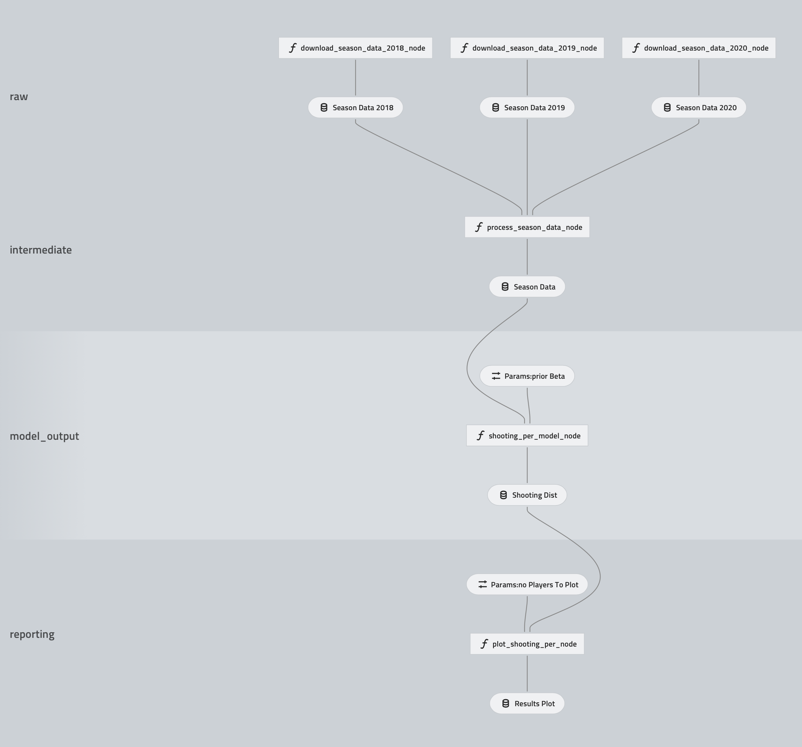
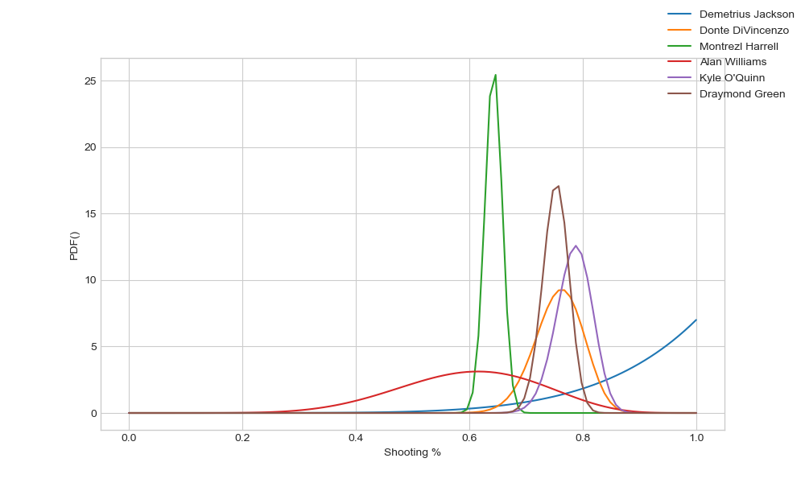

# NBA Analysis

## Overview
This is a project for NBA analysis built using the [Kedro](https://kedro.readthedocs.io) package.

Pipeline overview:

## `dp`
This is a data processing pipeline to extract data from basketball reference.

Steps involved:

* Get season data from basketball reference
    * Multiple seasons are collected with different nodes
* Clean data and merge into single file

Todo:

* Can we output a partitioned parquet dataset partitioned by season year?

## `shooting_per`
This pipeline estimates the shooting percent of players and produces a plot of a random subset of players.

Steps involved:

* Build bayesian model to get posterior distributions for player scoring %
    * Initially start with all players have uninformed beta distributions
    * This prior is taken from the `parameters.yml`
* Take a random subset of players and plot into a single figure
    * The number of players to plot is from `parameters.yml`

Typical results:

Todo:

* Converge with data sequentially
    * Give new posterior after each season
    * match by match
* Hierarchical model which gives position based priors
* Extend so that each player has a different ability per year
* Build dashboard to explore different players
