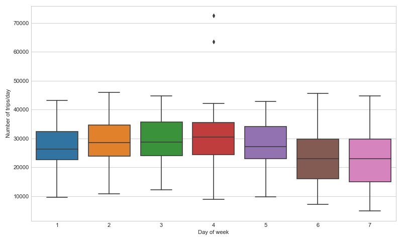
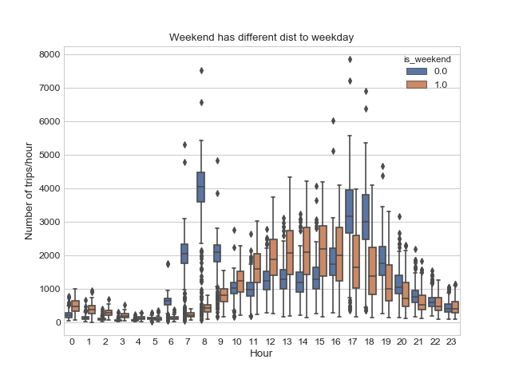
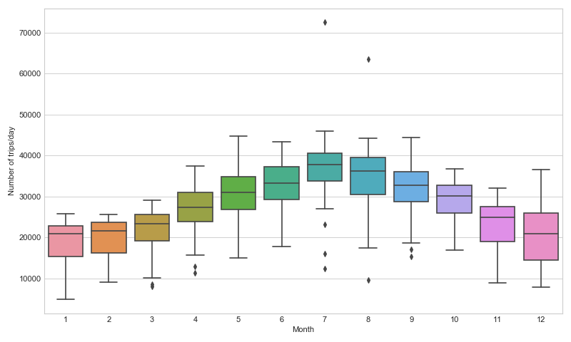
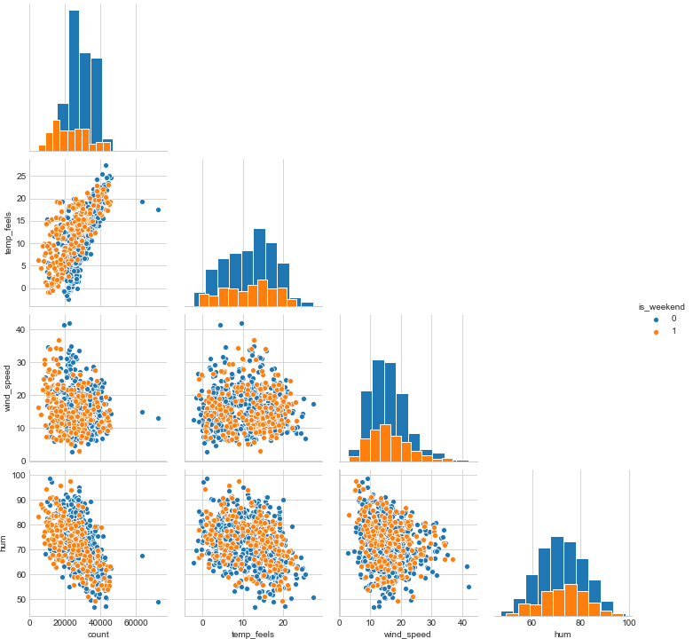

# TFL Cycle Analysis

## Todo
* Add new features to regression model
* Add is_holiday feature
* Add short term weather trend - in case people cycle based on yesterdays weather and not todays forcast

## Dataset
The dataset counts the number of journeys made per hour in each day of 2015-2017.  
## Findings
Seasonal trends in number of journeys per day  


### Weekly data
Weekends have fewer journeys per day  


Journeys by hour peak during morning and evening rush hour. They have a different distribution on weekends.  


Splitting by hour/day of the week. Shows Friday evening has fewer journeys and Thursday/Friday evening peak is more widely distributed  
 

### Monthly data
Winters are not as popular for cycling  


Splitting by hour/month of the year shows the winter months have fewer journeys and have a tighter distribution at evening rush hour. During the summer months a higher proportion of journeys are made latter into the evening.  
 

### Weather data
Weather features are engineered by averaging the various weather measures over the whole day.  
Better conditions generally correlate with high number of journeys. This is likely part confounded by the seasonality seen.  


### Regression analysis
Looking at the correlation of features to journey numbers there are multiple fairly strong correlations  


Fitting a linear regression model to the number of journeys per day:  
```
count ~ temp_feels + wind_speed + hum + is_weekend + is_raining
```
Rain was the only weather code with a significant effect on the number of journeys.  
A Poisson regression model would suit count data, however a Poisson distribution converges towards a Gaussian distribution when the lambda parameter > 30, in this case we are > 10000.  

```
OLS Regression Results                            
==============================================================================
Dep. Variable:                  count   R-squared:                       0.756
Model:                            OLS   Adj. R-squared:                  0.755
Method:                 Least Squares   F-statistic:                     449.8
Date:                Sun, 29 Dec 2019   Prob (F-statistic):          2.83e-219
Time:                        22:01:07   Log-Likelihood:                -7133.8
No. Observations:                 730   AIC:                         1.428e+04
Df Residuals:                     724   BIC:                         1.431e+04
Df Model:                           5                                         
Covariance Type:            nonrobust                                         
======================================================================================
                         coef    std err          t      P>|t|      [0.025      0.975]
--------------------------------------------------------------------------------------
Intercept           4.984e+04   1648.154     30.240      0.000    4.66e+04    5.31e+04
is_weekend[T.True] -5030.0978    349.562    -14.390      0.000   -5716.373   -4343.823
is_raining[T.True] -4977.1807    555.850     -8.954      0.000   -6068.451   -3885.910
temp_feels           756.7294     27.383     27.635      0.000     702.970     810.489
wind_speed          -334.4409     26.222    -12.754      0.000    -385.921    -282.961
hum                 -332.2860     18.949    -17.535      0.000    -369.488    -295.084
==============================================================================
Omnibus:                      123.845   Durbin-Watson:                   1.392
Prob(Omnibus):                  0.000   Jarque-Bera (JB):             1282.323
Skew:                           0.394   Prob(JB):                    3.52e-279
Kurtosis:                       9.445   Cond. No.                         792.
==============================================================================
```

Adding a sinusoidal term which has a period equal to a year helps to model season trends  
  

The regression results are better:
```
OLS Regression Results                            
==============================================================================
Dep. Variable:                  count   R-squared:                       0.765
Model:                            OLS   Adj. R-squared:                  0.763
Method:                 Least Squares   F-statistic:                     392.2
Date:                Sun, 29 Dec 2019   Prob (F-statistic):          1.82e-223
Time:                        22:04:36   Log-Likelihood:                -7120.9
No. Observations:                 730   AIC:                         1.426e+04
Df Residuals:                     723   BIC:                         1.429e+04
Df Model:                           6                                         
Covariance Type:            nonrobust                                         
======================================================================================
                         coef    std err          t      P>|t|      [0.025      0.975]
--------------------------------------------------------------------------------------
Intercept           4.635e+04   1759.078     26.349      0.000    4.29e+04    4.98e+04
is_weekend[T.True] -5088.6783    343.868    -14.798      0.000   -5763.777   -4413.580
is_raining[T.True] -5202.1710    548.268     -9.488      0.000   -6278.559   -4125.783
temp_feels           570.0986     45.430     12.549      0.000     480.908     659.289
wind_speed          -297.7811     26.764    -11.126      0.000    -350.325    -245.237
hum                 -292.0572     20.231    -14.436      0.000    -331.776    -252.338
seasonal            2183.3833    428.106      5.100      0.000    1342.904    3023.863
==============================================================================
Omnibus:                      135.236   Durbin-Watson:                   1.429
Prob(Omnibus):                  0.000   Jarque-Bera (JB):             1497.302
Skew:                           0.458   Prob(JB):                         0.00
Kurtosis:                       9.956   Cond. No.                         864.
==============================================================================
```
The model residuals are typically lower than 10000 journeys.  
Symmetrical residuals show linear model was a fair choice 
  
Against time there isnt a clear seasonality in residuals  
  
This suggests different features would be required to improve the predictability further