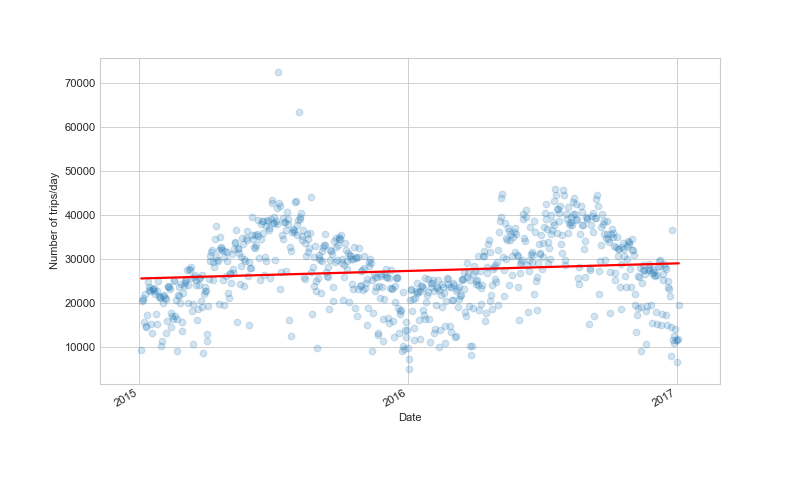
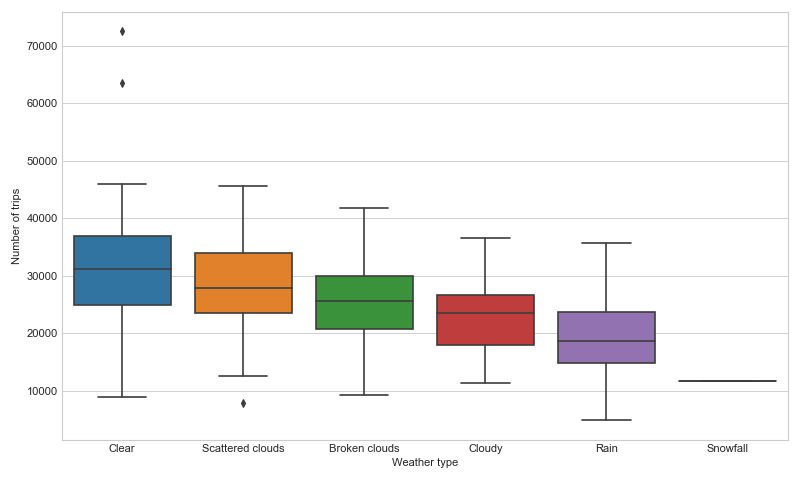

# TFL Cycle Analysis

## Todo
* Regression analysis

## Dataset
The dataset counts the number of journeys made per hour in each day of 2015-2017.  
## Findings
Seasonal trends in number of journeys per day  

### Weekly data
Weekends have fewer journeys per day  

Journeys by hour peak during morning and evening rush hour. They have a different distribution on weekends.  

Splitting by hour/day of the week. Shows Friday evening has fewer journeys and Thursday/Friday evening peak is more widely distributed
 

### Monthly data
Winters are not as popular for cycling  

Splitting by hour/month of the year shows the winter months have fewer journeys and have a tighter distribution at evening rush hour. During the summer months a higher proportion of journeys are made latter into the evening.  
 

### Weather data
Weather features are engineered by averaging the various weather measures over the whole day.  
Better conditions generally correlate with high number of journeys. This is likely part confounded by the seasonality seen.  

### Regression analysis
Looking at the correlation of features to journey numbers there are multiple fairly strong correlations  

