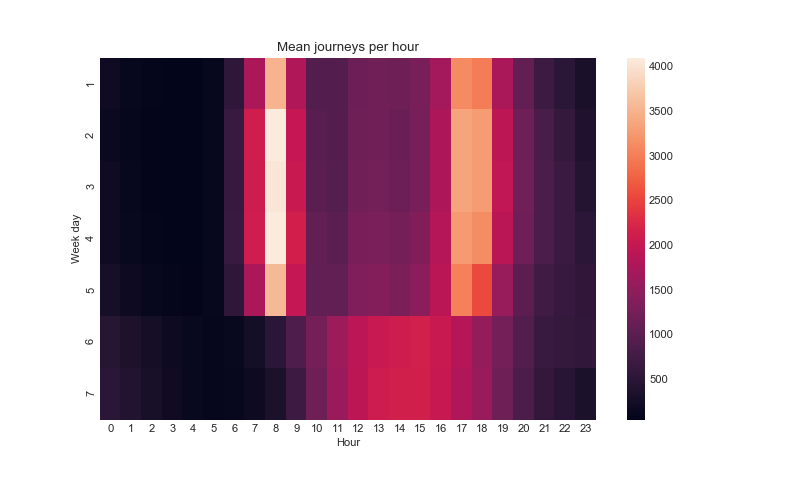
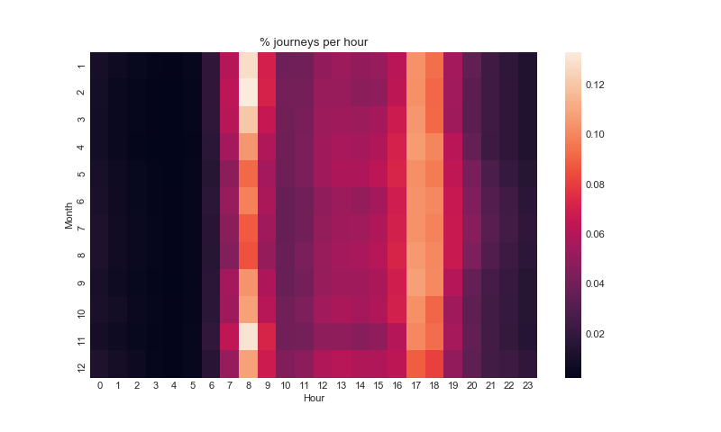

 # Transport for London Cycle Data Exploration

 ## Dataset
 The data was provided from TFL and was retrieved from Kaggle: https://www.kaggle.com/hmavrodiev/london-bike-sharing-dataset
 The dataset counts the number of journeys made per hour in each day of 2015-2017.
 There are 17414 rows.


```python
import data_proc as dp
cycle_data = dp.load_tfl_csv()
# cycle_data.head().to_markdown()

```

 |    | timestamp           |   cnt |   t1 |   t2 |   hum |   wind_speed |   weather_code |   is_holiday |   is_weekend |   season |
 |---:|:--------------------|------:|-----:|-----:|------:|-------------:|---------------:|-------------:|-------------:|---------:|
 |  0 | 2015-01-04 00:00:00 |   182 |  3   |  2   |  93   |          6   |              3 |            0 |            1 |        3 |
 |  1 | 2015-01-04 01:00:00 |   138 |  3   |  2.5 |  93   |          5   |              1 |            0 |            1 |        3 |
 |  2 | 2015-01-04 02:00:00 |   134 |  2.5 |  2.5 |  96.5 |          0   |              1 |            0 |            1 |        3 |
 |  3 | 2015-01-04 03:00:00 |    72 |  2   |  2   | 100   |          0   |              1 |            0 |            1 |        3 |
 |  4 | 2015-01-04 04:00:00 |    47 |  2   |  0   |  93   |          6.5 |              1 |            0 |            1 |        3 |

 ## Preprocessing
 The data is preprocessed to change column names and convert some columns. We also aggregate the data into days and save it for later use.

 The details of the functions can be found in the `data_proc.py` file


```python
cycle_data = dp.change_column_names(cycle_data)
cycle_data = dp.convert_to_timestamp_objects(cycle_data)
cycle_day_data = dp.aggregate_data_over_each_day(cycle_data)
dp.export_parquet(cycle_day_data)


```

 # Looking at time trends
 Against week day there are generally fewer journeys on weekends than
 weekdays, but not by a large amount.


```python
import seaborn as sns
import matplotlib.pyplot as plt
sns.set_style("whitegrid")
plt.style.use('seaborn-whitegrid')

```


```python
plt.figure(num=None, figsize=(10, 6), dpi=80)
sns.boxplot(x="week_day", y="count", data=cycle_day_data.reset_index())
plt.tight_layout()
plt.xlabel("Day of week")
plt.ylabel("Number of trips/day")
plt.savefig("images/journeys_per_week.png")
plt.show()

```

 
 However, breaking it down by hour shows that the distribution of journeys
 over the day are very different. There are two clear commuting times per
 weekday, whereas the weekend has a flatter distribution. Friday evening
 also suggest fewer journeys are made.


```python
plt.figure(num=None, figsize=(10, 6), dpi=80)
agr_counts = (
    cycle_data[["week_day", "hour", "count"]]
    .groupby(by=["week_day", "hour"], axis=0)
    .mean()
)
agr_counts_pivot = agr_counts.reset_index().pivot(
    index="week_day", columns="hour", values="count"
)
sns.heatmap(agr_counts_pivot)
plt.title("Mean journeys per hour")
plt.xlabel("Hour")
plt.ylabel("Week day")
plt.savefig("images/journeys_per_hour.png")
plt.show()

```

 
 Against month - there are fewer journeys made in winter time:


```python
plt.figure(num=None, figsize=(10, 6), dpi=80)
sns.boxplot(x="month", y="count", data=cycle_day_data.reset_index())
plt.tight_layout()
plt.xlabel("Month")
plt.ylabel("Number of trips/day")
plt.savefig("images/journeys_per_month.png")
plt.show()

```

 
 Looking at the distribution over the day against each month, shows that in
 summer a higher proportion of journeys are made later in the evening.
 The two commuting peaks are more spread out.


```python
plt.figure(num=None, figsize=(10, 6), dpi=80)
agr_counts = (
    cycle_data[["month", "hour", "count"]].groupby(by=["month", "hour"], axis=0).mean()
)

# Normalise over the sum of each day
agr_counts_norm = agr_counts.groupby("month").transform(lambda x: (x / x.sum()))
agr_counts_norm_pivot = agr_counts_norm.reset_index().pivot(
    index="month", columns="hour", values="count"
)
sns.heatmap(agr_counts_norm_pivot)
plt.title("% journeys per hour")
plt.xlabel("Hour")
plt.ylabel("Month")
plt.savefig("images/journeys_per_hour_month_prop.png")
plt.show()

```

 

 Is there an increase in journeys over time?


```python
import statsmodels.api as sm
import datetime

# generate datenum as regress on the number of journeys
temp = cycle_day_data.reset_index().copy()
temp["datetime"] = temp.apply(
    func=lambda x: datetime.date(x["year"], x["month"], x["day"]), axis=1
)
temp["datetimeint"] = temp["datetime"].apply(lambda x: x.toordinal())
temp["datetimeint"] = temp["datetimeint"] - temp["datetimeint"].mean()

temp = sm.add_constant(temp)
model = sm.OLS(temp['count'], temp.loc[:, ['const','datetimeint']])

results = model.fit()
print(results.summary())

```

 The coefficient for the datetime feature is a statistically significant and positive.
 ```
                   coef    std err          t      P>|t|      [0.025      0.975]
 -------------------------------------------------------------------------------
 const        2.727e+04    316.652     86.115      0.000    2.66e+04    2.79e+04
 datetimeint     4.7294      1.501      3.151      0.002       1.783       7.676
 ```
 This suggests the number of journeys is increasing on average by 4.7 journeys each day.


```python
import matplotlib.dates as mdates

fig = plt.figure(num=None, figsize=(8, 6), dpi=80)
ax = fig.subplots()

# add trend
temp['exp'] = results.predict(temp.loc[:, ['const','datetimeint']])
ax.scatter("datetime", "count", data=temp, alpha=0.2)
plt.plot(temp['datetime'], temp['exp'], 'r-', lw=2)
plt.xlabel("Date")
plt.ylabel("Number of trips/day")

# format the ticks
ax.xaxis.set_major_locator(mdates.YearLocator())
ax.xaxis.set_major_formatter(mdates.DateFormatter("%Y"))
ax.xaxis.set_minor_locator(mdates.MonthLocator())

fig.autofmt_xdate()
plt.savefig("images/against_time.png")
plt.show()

```

 

 # Weather data

 Convert to jupyter notebook -> Export current (no output)
 # Convert to markdown file
 `jupyter nbconvert data_proc.ipynb --to markdown`
