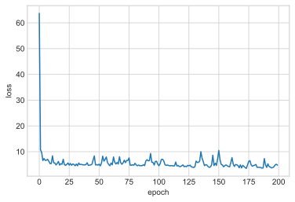
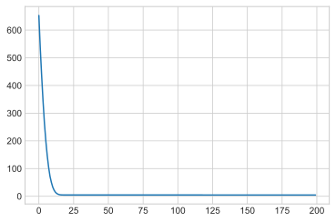
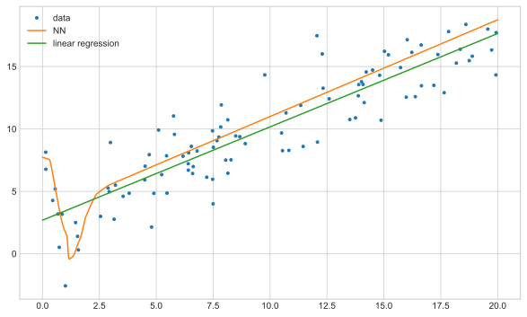

# Do Neural Networks overfit?

This brief post is exploring overfitting neural networks. It comes from reading the paper:

Towards Understanding Generalization of Deep Learning: Perspective of Loss Landscapes
https://arxiv.org/pdf/1706.10239.pdf

We show that fitting a hugely overparameterised model to some linear regression data works absolutely fine... The results are quite cool so I thought I would double check.


```python
import numpy as np
import tensorflow as tf
import matplotlib.pyplot as plt
plt.style.use("seaborn-whitegrid")
rng = np.random.RandomState(0)
tf.random.set_seed(0)
```

Lets generate some linear regression data. We only generate **100 data points**. This is simply a straight line with Gaussian noise - a problem linear regression is optimal for.


```python
x = np.random.uniform(0, 20, size=(100))
true_data = lambda x: 3 + 0.7*x
y = true_data(x) + np.random.normal(scale=2.0, size=(100))

fig, ax = plt.subplots(figsize=(10,6))
ax.plot(x, y, '.')
plt.show()
```


Lets try fit this with a neural network. The network is deliberating over complex with over **40,000 parameters** to tune and the relu activation function for non-linearity.


```python
model = tf.keras.Sequential(
    [
        tf.keras.layers.Dense(
            100, input_shape=(1,), activation=tf.keras.activations.relu
        ),
        tf.keras.layers.Dense(
            100, activation=tf.keras.activations.relu
        ),
        tf.keras.layers.Dense(
            100, activation=tf.keras.activations.relu
        ),
        tf.keras.layers.Dense(
            100, activation=tf.keras.activations.relu
        ),
        tf.keras.layers.Dense(
            100, activation=tf.keras.activations.relu
        ),
        tf.keras.layers.Dense(1),
    ]
)
model.compile(
    optimizer=tf.optimizers.Adam(learning_rate=0.01), loss=tf.keras.losses.mse
)
model.summary()
```

    Model: "sequential"
    _________________________________________________________________
    Layer (type)                 Output Shape              Param #   
    =================================================================
    dense (Dense)                (None, 100)               200       
    _________________________________________________________________
    dense_1 (Dense)              (None, 100)               10100     
    _________________________________________________________________
    dense_2 (Dense)              (None, 100)               10100     
    _________________________________________________________________
    dense_3 (Dense)              (None, 100)               10100     
    _________________________________________________________________
    dense_4 (Dense)              (None, 100)               10100     
    _________________________________________________________________
    dense_5 (Dense)              (None, 1)                 101       
    =================================================================
    Total params: 40,701
    Trainable params: 40,701
    Non-trainable params: 0
    _________________________________________________________________


```python
history = model.fit(x, y, epochs=200, verbose=False)
plt.plot(history.history["loss"])
plt.xlabel('epoch')
plt.ylabel('loss')
plt.show()
```





If we make predictions from the overly complex neural network we would expect some drastically overfit results...


```python
x_eval = np.linspace(0, 20, 1000)
y_eval = model.predict(x_eval)

fig, ax = plt.subplots(figsize=(10,6))
ax.plot(x, y, '.', label='data')
ax.plot(x_eval, y_eval, label='NN')
plt.legend()
plt.show()
```


The results are pretty reasonable! There isnt a crazy line that passing through all our points.

We can compare this to the results from linear regression. For laziness, we do this in tensorflow using a single layer linear network:


```python
model_linear = tf.keras.Sequential(
    [
        tf.keras.layers.Dense(1, input_shape=(1,)),
    ]
)

model_linear.compile(
    optimizer=tf.optimizers.Adam(learning_rate=0.05), loss=tf.keras.losses.mse
)
model_linear.summary()
```

    Model: "sequential_1"
    _________________________________________________________________
    Layer (type)                 Output Shape              Param #   
    =================================================================
    dense_6 (Dense)              (None, 1)                 2         
    =================================================================
    Total params: 2
    Trainable params: 2
    Non-trainable params: 0
    _________________________________________________________________


```python
history_linear = model_linear.fit(x, y, epochs=200, verbose=False)
plt.plot(history_linear.history["loss"])
y_linear_eval = model_linear.predict(x_eval)
```





```python
fig, ax = plt.subplots(figsize=(10,6))
ax.plot(x, y, '.', label='data')
ax.plot(x_eval, y_eval, label='NN')
ax.plot(x_eval, y_linear_eval, label='linear regression')
plt.legend()
plt.show()
```





The two models look pretty similar. For more details on why this is the case - please refer to the paper in the introduction.