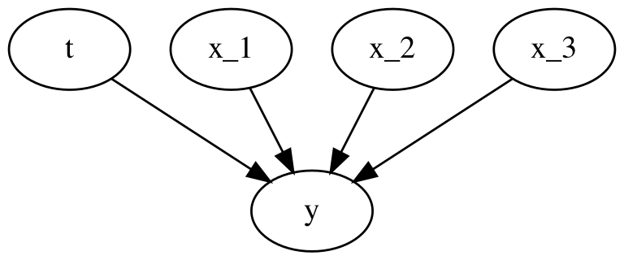
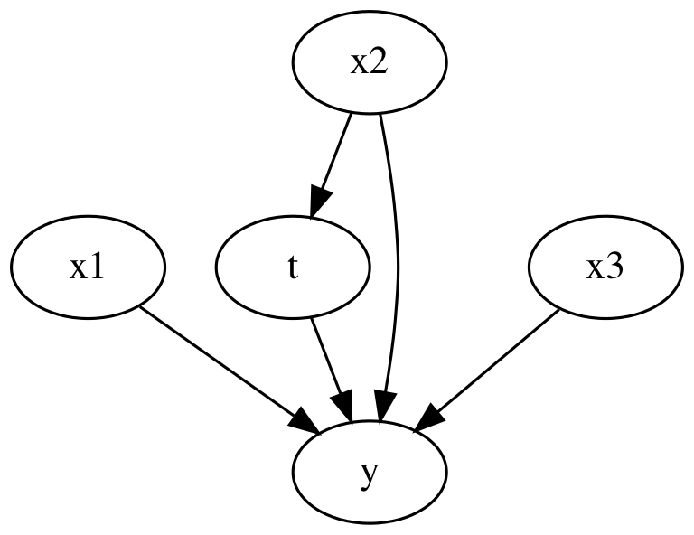
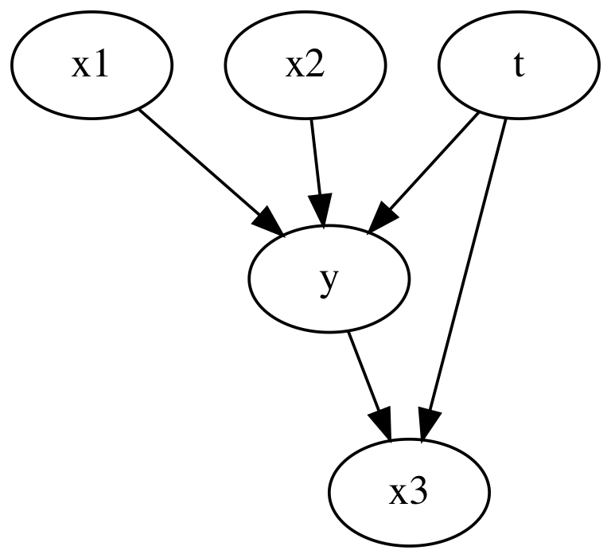
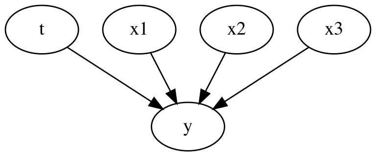

# Exploring DoWhy for causal inference

Quick exploration into the DoWhy library. I will apply it to the same simple scenarios previously [CausalInference/causal_regression_coefficient.ipynb](CausalInference/causal_regression_coefficient.ipynb), where we have a single confounder or a single collider.

DoWhy can help find the correct variables to include in our model to control for confounders but not control for colliders.

Outline:
*   Generate random linear data
*   Estimate treatment effects with DoWhy
*   Repeat in the presence on confounder variables
*   Repeat in the presence on collider variables


```python
import pandas as pd
import numpy as np
import dowhy
from IPython.display import Image, display
```

## Simple data generating case

For the first simple case we have no confounding variables and no collider variables.


```python
n_samples = 1000
n_features = 3
treatment_binary = False

rand = np.random.default_rng(0)
x = rand.normal(loc=rand.normal(size=n_features), size=(n_samples, n_features))
if treatment_binary:
    t = rand.binomial(n=1, p=0.5, size=(n_samples, 1))
else:
    t = rand.normal(size=(n_samples, 1))
bias = rand.normal()
weights = rand.normal(size=(n_features + 1, 1))
y = bias + np.dot(np.concatenate([t, x], axis=1), weights) + rand.normal()

x_cols = [f"x_{idx+1}" for idx in range(3)]
t_col = "t"
y_col = "y"
df = pd.DataFrame(x, columns=x_cols)
df[t_col] = t
df[y_col] = y
df = df[[y_col, t_col] + x_cols]
```


```python
causal_graph = """
digraph {
    t -> y;
    x_1 -> y;
    x_2 -> y;
    x_3 -> y;
}
"""

causal_model = dowhy.CausalModel(
    data=df, graph=causal_graph.replace("\n", " "), treatment=t_col, outcome=y_col
)
causal_model.view_model()
display(Image(filename="causal_model.png"))
```


    

    


Fitting a linear regression model will let us estimate the coefficients and therefore treatment effect.
We can do this adding one feature at a time to see how the extra features change the coefficients of the treatment effect.


```python
# fit linear regression with adding a feature at a time
import sklearn.linear_model

fitted_bias = []
fitted_coef = []
for idx in range(n_features + 1):
    model = sklearn.linear_model.LinearRegression()
    model.fit(df[[t_col] + x_cols[:idx]], df[y_col])
    fitted_bias.append(model.intercept_)
    fitted_coef.append(model.coef_)

print("\n")
print("True weights:")
print(bias, weights)


df_coef = pd.DataFrame(fitted_coef, columns=[t_col] + x_cols)
df_coef["bias"] = fitted_bias
df_coef
```

    
    
    True weights:
    0.9782301660508295 [[ 1.28538192]
     [-0.76594247]
     [-0.36045389]
     [ 0.10708349]]


<div>
<style scoped>
    .dataframe tbody tr th:only-of-type {
        vertical-align: middle;
    }

    .dataframe tbody tr th {
        vertical-align: top;
    }

    .dataframe thead th {
        text-align: right;
    }
</style>
<table border="1" class="dataframe">
  <thead>
    <tr style="text-align: right;">
      <th></th>
      <th>t</th>
      <th>x_1</th>
      <th>x_2</th>
      <th>x_3</th>
      <th>bias</th>
    </tr>
  </thead>
  <tbody>
    <tr>
      <th>0</th>
      <td>1.245206</td>
      <td>NaN</td>
      <td>NaN</td>
      <td>NaN</td>
      <td>2.726630</td>
    </tr>
    <tr>
      <th>1</th>
      <td>1.255579</td>
      <td>-0.762654</td>
      <td>NaN</td>
      <td>NaN</td>
      <td>2.744223</td>
    </tr>
    <tr>
      <th>2</th>
      <td>1.288720</td>
      <td>-0.766852</td>
      <td>-0.362704</td>
      <td>NaN</td>
      <td>2.705192</td>
    </tr>
    <tr>
      <th>3</th>
      <td>1.285382</td>
      <td>-0.765942</td>
      <td>-0.360454</td>
      <td>0.107083</td>
      <td>2.640259</td>
    </tr>
  </tbody>
</table>
</div>


### Estimate treatment effect via DoWhy

1. First we specify a causal model that underlies the data we observed.
2. Then we identify what parameteric model we can solve to estimate the treatment of interest.
3. Then we solve the model to get an estimate.
4. Then we try and refute the causal model to check if we correctly specified it.

Step 1. was complete a few cells ago.
We created a causal graph of how each variables connects to each other.
The next step (2) is to identify what parameteric model we need to solve:


```python
# Identify the causal effect
estimands = causal_model.identify_effect()
print(estimands)
```

    Estimand type: nonparametric-ate
    
    ### Estimand : 1
    Estimand name: backdoor
    Estimand expression:
     d        
    ────(E[y])
    d[t]      
    Estimand assumption 1, Unconfoundedness: If U→{t} and U→y then P(y|t,,U) = P(y|t,)
    
    ### Estimand : 2
    Estimand name: iv
    No such variable(s) found!
    
    ### Estimand : 3
    Estimand name: frontdoor
    No such variable(s) found!
    


As there are no confounders or colliders, to estimate the treatment effect we only need to include the treatment variable when fitting a model to the outcome variable `y`.
We can then go ahead and fit that model. Here we use linear regression as before for the model.


```python
# Causal Effect Estimation
estimate = causal_model.estimate_effect(
    estimands, method_name="backdoor.linear_regression"
)
print(estimate)
```

    linear_regression
    {'control_value': 0, 'treatment_value': 1, 'test_significance': None, 'evaluate_effect_strength': False, 'confidence_intervals': False, 'target_units': 'ate', 'effect_modifiers': ['x_1', 'x_2', 'x_3']}
    *** Causal Estimate ***
    
    ## Identified estimand
    Estimand type: nonparametric-ate
    
    ### Estimand : 1
    Estimand name: backdoor
    Estimand expression:
     d        
    ────(E[y])
    d[t]      
    Estimand assumption 1, Unconfoundedness: If U→{t} and U→y then P(y|t,,U) = P(y|t,)
    
    ## Realized estimand
    b: y~t+t*x_1+t*x_2+t*x_3
    Target units: ate
    
    ## Estimate
    Mean value: 1.243359973232372
    ### Conditional Estimates
    __categorical__x_1             __categorical__x_2  __categorical__x_3
    (-3.6479999999999997, -0.795]  (-4.033, -0.914]    (-2.475, -0.29]       1.262603
                                                       (-0.29, 0.34]         1.299003
                                                       (0.34, 0.871]         1.306842
                                                       (0.871, 1.504]        1.322065
                                                       (1.504, 3.49]         1.340334
                                                                               ...   
    (0.831, 3.192]                 (0.713, 2.84]       (-2.475, -0.29]       1.145563
                                                       (-0.29, 0.34]         1.158862
                                                       (0.34, 0.871]         1.188445
                                                       (0.871, 1.504]        1.198101
                                                       (1.504, 3.49]         1.204719
    Length: 125, dtype: float64


We get a mean value of `1.24` which matches the initial regression model we ran when we only included the treatment variable (first row). This value is close to the true underlying value. Any difference would be due to noise in the data rather than bias from including the wrong variables. Including the other variables would help explain away some of the variance we see in the outcome variable and make for a better fit model, however they are not need to stop bias in the treatment effect.

Next we refute the model with various methods. Descriptions were taken from [https://medium.com/geekculture/a-quickstart-for-causal-analysis-decision-making-with-dowhy-2ce2d4d1efa9](https://medium.com/geekculture/a-quickstart-for-causal-analysis-decision-making-with-dowhy-2ce2d4d1efa9)

*   Adding a randomly-generated confounder: "random_common_cause"
    *   add an independent random variable as a common cause to the dataset; If the assumption was correct, the estimation should not change.
*   Replacing the treatment with a placebo (random) variable): "placebo_treatment_refuter"
    *   replace the true treatment variable with an independent random variable; If the assumption was correct, the estimate should go close to zero.
*   Removing a random subset of the data: "data_subset_refuter"
    *   replace the given dataset with a randomly selected subset; If the assumption was correct, the estimation should not change that much.
*   Adding a confounder that is associated with both treatment and outcome: "add_unobserved_common_cause" - won't be using
    *   https://microsoft.github.io/dowhy/example_notebooks/dowhy_simple_example.html#Adding-an-unobserved-common-cause-variable

This reruns the model with different data multiple times. This can take a while so I've limited the number of trials to save time.


```python
def refute_estimate(estimands, estimate, num_simulations=10):
    # limiting the simulation numbers to save time - makes accuracy worse
    refutels = {}
    refutels["random_common_cause"] = causal_model.refute_estimate(
        estimands, estimate, "random_common_cause", num_simulations=num_simulations
    )
    refutels["data_subset_refuter"] = causal_model.refute_estimate(
        estimands, estimate, "data_subset_refuter", num_simulations=num_simulations
    )
    refutels["placebo_treatment_refuter"] = causal_model.refute_estimate(
        estimands,
        estimate,
        "placebo_treatment_refuter",
        num_simulations=num_simulations,
    )
    # try:
    #     refutels["add_unobserved_common_cause"] = causal_model.refute_estimate(
    #         estimands,
    #         estimate,
    #         "add_unobserved_common_cause",
    #         num_simulations=num_simulations,
    #     )
    # except ValueError:
    #     pass
    return refutels


refutels = refute_estimate(estimands, estimate)
```

    {'control_value': 0, 'treatment_value': 1, 'test_significance': False, 'evaluate_effect_strength': False, 'confidence_intervals': False, 'target_units': 'ate', 'effect_modifiers': ['x_1', 'x_2', 'x_3']}
    {'control_value': 0, 'treatment_value': 1, 'test_significance': False, 'evaluate_effect_strength': False, 'confidence_intervals': False, 'target_units': 'ate', 'effect_modifiers': ['x_1', 'x_2', 'x_3']}
    {'control_value': 0, 'treatment_value': 1, 'test_significance': False, 'evaluate_effect_strength': False, 'confidence_intervals': False, 'target_units': 'ate', 'effect_modifiers': ['x_1', 'x_2', 'x_3']}
    {'control_value': 0, 'treatment_value': 1, 'test_significance': False, 'evaluate_effect_strength': False, 'confidence_intervals': False, 'target_units': 'ate', 'effect_modifiers': ['x_1', 'x_2', 'x_3']}
    {'control_value': 0, 'treatment_value': 1, 'test_significance': False, 'evaluate_effect_strength': False, 'confidence_intervals': False, 'target_units': 'ate', 'effect_modifiers': ['x_1', 'x_2', 'x_3']}
    {'control_value': 0, 'treatment_value': 1, 'test_significance': False, 'evaluate_effect_strength': False, 'confidence_intervals': False, 'target_units': 'ate', 'effect_modifiers': ['x_1', 'x_2', 'x_3']}
    {'control_value': 0, 'treatment_value': 1, 'test_significance': False, 'evaluate_effect_strength': False, 'confidence_intervals': False, 'target_units': 'ate', 'effect_modifiers': ['x_1', 'x_2', 'x_3']}
    {'control_value': 0, 'treatment_value': 1, 'test_significance': False, 'evaluate_effect_strength': False, 'confidence_intervals': False, 'target_units': 'ate', 'effect_modifiers': ['x_1', 'x_2', 'x_3']}
    {'control_value': 0, 'treatment_value': 1, 'test_significance': False, 'evaluate_effect_strength': False, 'confidence_intervals': False, 'target_units': 'ate', 'effect_modifiers': ['x_1', 'x_2', 'x_3']}
    {'control_value': 0, 'treatment_value': 1, 'test_significance': False, 'evaluate_effect_strength': False, 'confidence_intervals': False, 'target_units': 'ate', 'effect_modifiers': ['x_1', 'x_2', 'x_3']}
    {'control_value': 0, 'treatment_value': 1, 'test_significance': False, 'evaluate_effect_strength': False, 'confidence_intervals': False, 'target_units': 'ate', 'effect_modifiers': ['x_1', 'x_2', 'x_3']}
    {'control_value': 0, 'treatment_value': 1, 'test_significance': False, 'evaluate_effect_strength': False, 'confidence_intervals': False, 'target_units': 'ate', 'effect_modifiers': ['x_1', 'x_2', 'x_3']}
    {'control_value': 0, 'treatment_value': 1, 'test_significance': False, 'evaluate_effect_strength': False, 'confidence_intervals': False, 'target_units': 'ate', 'effect_modifiers': ['x_1', 'x_2', 'x_3']}
    {'control_value': 0, 'treatment_value': 1, 'test_significance': False, 'evaluate_effect_strength': False, 'confidence_intervals': False, 'target_units': 'ate', 'effect_modifiers': ['x_1', 'x_2', 'x_3']}
    {'control_value': 0, 'treatment_value': 1, 'test_significance': False, 'evaluate_effect_strength': False, 'confidence_intervals': False, 'target_units': 'ate', 'effect_modifiers': ['x_1', 'x_2', 'x_3']}
    {'control_value': 0, 'treatment_value': 1, 'test_significance': False, 'evaluate_effect_strength': False, 'confidence_intervals': False, 'target_units': 'ate', 'effect_modifiers': ['x_1', 'x_2', 'x_3']}
    {'control_value': 0, 'treatment_value': 1, 'test_significance': False, 'evaluate_effect_strength': False, 'confidence_intervals': False, 'target_units': 'ate', 'effect_modifiers': ['x_1', 'x_2', 'x_3']}
    {'control_value': 0, 'treatment_value': 1, 'test_significance': False, 'evaluate_effect_strength': False, 'confidence_intervals': False, 'target_units': 'ate', 'effect_modifiers': ['x_1', 'x_2', 'x_3']}
    {'control_value': 0, 'treatment_value': 1, 'test_significance': False, 'evaluate_effect_strength': False, 'confidence_intervals': False, 'target_units': 'ate', 'effect_modifiers': ['x_1', 'x_2', 'x_3']}
    {'control_value': 0, 'treatment_value': 1, 'test_significance': False, 'evaluate_effect_strength': False, 'confidence_intervals': False, 'target_units': 'ate', 'effect_modifiers': ['x_1', 'x_2', 'x_3']}
    {'control_value': 0, 'treatment_value': 1, 'test_significance': False, 'evaluate_effect_strength': False, 'confidence_intervals': False, 'target_units': 'ate', 'effect_modifiers': ['x_1', 'x_2', 'x_3']}


    /Users/Rich/Developer/miniconda3/envs/causal_inf_env/lib/python3.10/site-packages/statsmodels/regression/linear_model.py:1918: RuntimeWarning: divide by zero encountered in double_scalars
      return np.sqrt(eigvals[0]/eigvals[-1])


    {'control_value': 0, 'treatment_value': 1, 'test_significance': False, 'evaluate_effect_strength': False, 'confidence_intervals': False, 'target_units': 'ate', 'effect_modifiers': ['x_1', 'x_2', 'x_3']}


    /Users/Rich/Developer/miniconda3/envs/causal_inf_env/lib/python3.10/site-packages/statsmodels/regression/linear_model.py:1918: RuntimeWarning: divide by zero encountered in double_scalars
      return np.sqrt(eigvals[0]/eigvals[-1])


    {'control_value': 0, 'treatment_value': 1, 'test_significance': False, 'evaluate_effect_strength': False, 'confidence_intervals': False, 'target_units': 'ate', 'effect_modifiers': ['x_1', 'x_2', 'x_3']}


    /Users/Rich/Developer/miniconda3/envs/causal_inf_env/lib/python3.10/site-packages/statsmodels/regression/linear_model.py:1918: RuntimeWarning: divide by zero encountered in double_scalars
      return np.sqrt(eigvals[0]/eigvals[-1])


    {'control_value': 0, 'treatment_value': 1, 'test_significance': False, 'evaluate_effect_strength': False, 'confidence_intervals': False, 'target_units': 'ate', 'effect_modifiers': ['x_1', 'x_2', 'x_3']}


    /Users/Rich/Developer/miniconda3/envs/causal_inf_env/lib/python3.10/site-packages/statsmodels/regression/linear_model.py:1918: RuntimeWarning: divide by zero encountered in double_scalars
      return np.sqrt(eigvals[0]/eigvals[-1])


    {'control_value': 0, 'treatment_value': 1, 'test_significance': False, 'evaluate_effect_strength': False, 'confidence_intervals': False, 'target_units': 'ate', 'effect_modifiers': ['x_1', 'x_2', 'x_3']}


    /Users/Rich/Developer/miniconda3/envs/causal_inf_env/lib/python3.10/site-packages/statsmodels/regression/linear_model.py:1918: RuntimeWarning: divide by zero encountered in double_scalars
      return np.sqrt(eigvals[0]/eigvals[-1])


    {'control_value': 0, 'treatment_value': 1, 'test_significance': False, 'evaluate_effect_strength': False, 'confidence_intervals': False, 'target_units': 'ate', 'effect_modifiers': ['x_1', 'x_2', 'x_3']}


    /Users/Rich/Developer/miniconda3/envs/causal_inf_env/lib/python3.10/site-packages/statsmodels/regression/linear_model.py:1918: RuntimeWarning: divide by zero encountered in double_scalars
      return np.sqrt(eigvals[0]/eigvals[-1])


    {'control_value': 0, 'treatment_value': 1, 'test_significance': False, 'evaluate_effect_strength': False, 'confidence_intervals': False, 'target_units': 'ate', 'effect_modifiers': ['x_1', 'x_2', 'x_3']}


    /Users/Rich/Developer/miniconda3/envs/causal_inf_env/lib/python3.10/site-packages/statsmodels/regression/linear_model.py:1918: RuntimeWarning: divide by zero encountered in double_scalars
      return np.sqrt(eigvals[0]/eigvals[-1])


    {'control_value': 0, 'treatment_value': 1, 'test_significance': False, 'evaluate_effect_strength': False, 'confidence_intervals': False, 'target_units': 'ate', 'effect_modifiers': ['x_1', 'x_2', 'x_3']}


    /Users/Rich/Developer/miniconda3/envs/causal_inf_env/lib/python3.10/site-packages/statsmodels/regression/linear_model.py:1918: RuntimeWarning: divide by zero encountered in double_scalars
      return np.sqrt(eigvals[0]/eigvals[-1])


    {'control_value': 0, 'treatment_value': 1, 'test_significance': False, 'evaluate_effect_strength': False, 'confidence_intervals': False, 'target_units': 'ate', 'effect_modifiers': ['x_1', 'x_2', 'x_3']}


    /Users/Rich/Developer/miniconda3/envs/causal_inf_env/lib/python3.10/site-packages/statsmodels/regression/linear_model.py:1918: RuntimeWarning: divide by zero encountered in double_scalars
      return np.sqrt(eigvals[0]/eigvals[-1])


    {'control_value': 0, 'treatment_value': 1, 'test_significance': False, 'evaluate_effect_strength': False, 'confidence_intervals': False, 'target_units': 'ate', 'effect_modifiers': ['x_1', 'x_2', 'x_3']}


    /Users/Rich/Developer/miniconda3/envs/causal_inf_env/lib/python3.10/site-packages/statsmodels/regression/linear_model.py:1918: RuntimeWarning: divide by zero encountered in double_scalars
      return np.sqrt(eigvals[0]/eigvals[-1])
    /Users/Rich/Developer/miniconda3/envs/causal_inf_env/lib/python3.10/site-packages/dowhy/causal_refuter.py:201: RuntimeWarning: invalid value encountered in double_scalars
      z_score = (estimate.value - mean_refute_values)/ std_dev_refute_values


```python
for key, val in refutels.items():
    print(key)
    print(val)
```

    random_common_cause
    Refute: Add a random common cause
    Estimated effect:1.243359973232372
    New effect:1.2435519068195893
    p value:0.2712947998872679
    
    data_subset_refuter
    Refute: Use a subset of data
    Estimated effect:1.243359973232372
    New effect:1.2477990182050194
    p value:0.24327501255794381
    
    placebo_treatment_refuter
    Refute: Use a Placebo Treatment
    Estimated effect:1.243359973232372
    New effect:0.0
    p value:nan
    


None of the refutals came back positive, which suggests the model was ok. Seeing as we made the data generating function ourselves, we were correct.

Adding a random common cause did not change our treatment effect. Using subsets of the data didn't change the treatment effect. Adding a random placebo treatment in place of our actual treatment gave a new treatment effect of 0.

## Confounding variables

We can repeat the above proceedure for scenarios including confounding variables. Here, `x2` can influence the treatment as well as the outcome.


```python
n_samples = 1000
n_features = 3
treatment_binary = True

rand = np.random.default_rng(0)
x = rand.normal(loc=rand.normal(size=n_features), size=(n_samples, n_features))


def logit(p):
    return np.log(p) - np.log(1 - p)


def inv_logit(p):
    return np.exp(p) / (1 + np.exp(p))


# confound t with x_2
if treatment_binary:
    t = rand.binomial(n=1, p=inv_logit(x[:, [1]]), size=(n_samples, 1))
else:
    t = rand.normal(size=(n_samples, 1)) + x[:, [1]]
bias = rand.normal()
weights = rand.normal(size=(n_features + 1, 1))
y = bias + np.dot(np.concatenate([t, x], axis=1), weights) + rand.normal()

x_cols = [f"x{idx+1}" for idx in range(3)]
t_col = "t"
y_col = "y"
df = pd.DataFrame(x, columns=x_cols)
df[t_col] = t
df[y_col] = y
df = df[[y_col, t_col] + x_cols]


print("\n")
print("True weights:")
print(bias, weights)
```

    
    
    True weights:
    2.0066816575193047 [[ 1.64781487]
     [-0.30894266]
     [-1.6550682 ]
     [-1.02182841]]


```python
causal_graph = """
digraph {
    t -> y;
    x1 -> y;
    x2 -> y;
    x3 -> y;
    x2 -> t;
}
"""

causal_model = dowhy.CausalModel(
    data=df, graph=causal_graph.replace("\n", " "), treatment=t_col, outcome=y_col
)
causal_model.view_model()
display(Image(filename="causal_model.png"))
```


    

    


DoWhy will now interpret the causal graph and identify that the model needs to include the variable `x2` in order to get an unbiased effect for the treatment.
We can then solve that model using linear regression again.


```python
# Identify the causal effect
estimands = causal_model.identify_effect()

# Causal Effect Estimation
estimate = causal_model.estimate_effect(
    estimands, method_name="backdoor.linear_regression"
)
print(estimate)
```

    linear_regression
    {'control_value': 0, 'treatment_value': 1, 'test_significance': None, 'evaluate_effect_strength': False, 'confidence_intervals': False, 'target_units': 'ate', 'effect_modifiers': ['x1', 'x3']}
    *** Causal Estimate ***
    
    ## Identified estimand
    Estimand type: nonparametric-ate
    
    ### Estimand : 1
    Estimand name: backdoor
    Estimand expression:
     d           
    ────(E[y|x2])
    d[t]         
    Estimand assumption 1, Unconfoundedness: If U→{t} and U→y then P(y|t,x2,U) = P(y|t,x2)
    
    ## Realized estimand
    b: y~t+x2+t*x1+t*x3
    Target units: ate
    
    ## Estimate
    Mean value: 1.6558814585308035
    ### Conditional Estimates
    __categorical__x1              __categorical__x3
    (-3.6479999999999997, -0.795]  (-2.475, -0.29]      3.483315
                                   (-0.29, 0.34]        2.618815
                                   (0.34, 0.871]        2.097113
                                   (0.871, 1.504]       1.521005
                                   (1.504, 3.49]        0.687862
    (-0.795, -0.247]               (-2.475, -0.29]      3.231508
                                   (-0.29, 0.34]        2.381683
                                   (0.34, 0.871]        1.795791
                                   (0.871, 1.504]       1.249445
                                   (1.504, 3.49]        0.316830
    (-0.247, 0.259]                (-2.475, -0.29]      3.137250
                                   (-0.29, 0.34]        2.273432
                                   (0.34, 0.871]        1.682171
                                   (0.871, 1.504]       1.101436
                                   (1.504, 3.49]        0.121108
    (0.259, 0.831]                 (-2.475, -0.29]      2.966303
                                   (-0.29, 0.34]        2.074694
                                   (0.34, 0.871]        1.493285
                                   (0.871, 1.504]       0.888685
                                   (1.504, 3.49]       -0.021719
    (0.831, 3.192]                 (-2.475, -0.29]      2.820000
                                   (-0.29, 0.34]        1.758788
                                   (0.34, 0.871]        1.301321
                                   (0.871, 1.504]       0.639663
                                   (1.504, 3.49]       -0.200667
    dtype: float64


We see the identified estimand is `P(y|t,x2)`, so the regression will include both `t` and `x2`.
The realized estimand includes interactions with `x`, not 100% sure why, I suspect to give some measure of conditional treatment effects, so the change in treatment depending on `x`.
The estimated treatment effect is 1.66, which is very close to the true value of 1.65.

We can fit the same model directly with `sklearn` to double check our understanding.


```python
import sklearn.linear_model


model = sklearn.linear_model.LinearRegression()
model.fit(df[[t_col, x_cols[1]]], df[y_col])
print(model.coef_)
```

    [ 1.65844162 -1.63579395]


The (1st) coefficient is very close.


```python
refutels = refute_estimate(estimands, estimate)
```

    {'control_value': 0, 'treatment_value': 1, 'test_significance': False, 'evaluate_effect_strength': False, 'confidence_intervals': False, 'target_units': 'ate', 'effect_modifiers': ['x1', 'x3']}
    {'control_value': 0, 'treatment_value': 1, 'test_significance': False, 'evaluate_effect_strength': False, 'confidence_intervals': False, 'target_units': 'ate', 'effect_modifiers': ['x1', 'x3']}
    {'control_value': 0, 'treatment_value': 1, 'test_significance': False, 'evaluate_effect_strength': False, 'confidence_intervals': False, 'target_units': 'ate', 'effect_modifiers': ['x1', 'x3']}
    {'control_value': 0, 'treatment_value': 1, 'test_significance': False, 'evaluate_effect_strength': False, 'confidence_intervals': False, 'target_units': 'ate', 'effect_modifiers': ['x1', 'x3']}
    {'control_value': 0, 'treatment_value': 1, 'test_significance': False, 'evaluate_effect_strength': False, 'confidence_intervals': False, 'target_units': 'ate', 'effect_modifiers': ['x1', 'x3']}
    {'control_value': 0, 'treatment_value': 1, 'test_significance': False, 'evaluate_effect_strength': False, 'confidence_intervals': False, 'target_units': 'ate', 'effect_modifiers': ['x1', 'x3']}
    {'control_value': 0, 'treatment_value': 1, 'test_significance': False, 'evaluate_effect_strength': False, 'confidence_intervals': False, 'target_units': 'ate', 'effect_modifiers': ['x1', 'x3']}
    {'control_value': 0, 'treatment_value': 1, 'test_significance': False, 'evaluate_effect_strength': False, 'confidence_intervals': False, 'target_units': 'ate', 'effect_modifiers': ['x1', 'x3']}
    {'control_value': 0, 'treatment_value': 1, 'test_significance': False, 'evaluate_effect_strength': False, 'confidence_intervals': False, 'target_units': 'ate', 'effect_modifiers': ['x1', 'x3']}
    {'control_value': 0, 'treatment_value': 1, 'test_significance': False, 'evaluate_effect_strength': False, 'confidence_intervals': False, 'target_units': 'ate', 'effect_modifiers': ['x1', 'x3']}
    {'control_value': 0, 'treatment_value': 1, 'test_significance': False, 'evaluate_effect_strength': False, 'confidence_intervals': False, 'target_units': 'ate', 'effect_modifiers': ['x1', 'x3']}
    {'control_value': 0, 'treatment_value': 1, 'test_significance': False, 'evaluate_effect_strength': False, 'confidence_intervals': False, 'target_units': 'ate', 'effect_modifiers': ['x1', 'x3']}
    {'control_value': 0, 'treatment_value': 1, 'test_significance': False, 'evaluate_effect_strength': False, 'confidence_intervals': False, 'target_units': 'ate', 'effect_modifiers': ['x1', 'x3']}
    {'control_value': 0, 'treatment_value': 1, 'test_significance': False, 'evaluate_effect_strength': False, 'confidence_intervals': False, 'target_units': 'ate', 'effect_modifiers': ['x1', 'x3']}
    {'control_value': 0, 'treatment_value': 1, 'test_significance': False, 'evaluate_effect_strength': False, 'confidence_intervals': False, 'target_units': 'ate', 'effect_modifiers': ['x1', 'x3']}
    {'control_value': 0, 'treatment_value': 1, 'test_significance': False, 'evaluate_effect_strength': False, 'confidence_intervals': False, 'target_units': 'ate', 'effect_modifiers': ['x1', 'x3']}
    {'control_value': 0, 'treatment_value': 1, 'test_significance': False, 'evaluate_effect_strength': False, 'confidence_intervals': False, 'target_units': 'ate', 'effect_modifiers': ['x1', 'x3']}
    {'control_value': 0, 'treatment_value': 1, 'test_significance': False, 'evaluate_effect_strength': False, 'confidence_intervals': False, 'target_units': 'ate', 'effect_modifiers': ['x1', 'x3']}
    {'control_value': 0, 'treatment_value': 1, 'test_significance': False, 'evaluate_effect_strength': False, 'confidence_intervals': False, 'target_units': 'ate', 'effect_modifiers': ['x1', 'x3']}
    {'control_value': 0, 'treatment_value': 1, 'test_significance': False, 'evaluate_effect_strength': False, 'confidence_intervals': False, 'target_units': 'ate', 'effect_modifiers': ['x1', 'x3']}
    {'control_value': 0, 'treatment_value': 1, 'test_significance': False, 'evaluate_effect_strength': False, 'confidence_intervals': False, 'target_units': 'ate', 'effect_modifiers': ['x1', 'x3']}


    /Users/Rich/Developer/miniconda3/envs/causal_inf_env/lib/python3.10/site-packages/statsmodels/regression/linear_model.py:1918: RuntimeWarning: divide by zero encountered in double_scalars
      return np.sqrt(eigvals[0]/eigvals[-1])


    {'control_value': 0, 'treatment_value': 1, 'test_significance': False, 'evaluate_effect_strength': False, 'confidence_intervals': False, 'target_units': 'ate', 'effect_modifiers': ['x1', 'x3']}


    /Users/Rich/Developer/miniconda3/envs/causal_inf_env/lib/python3.10/site-packages/statsmodels/regression/linear_model.py:1918: RuntimeWarning: divide by zero encountered in double_scalars
      return np.sqrt(eigvals[0]/eigvals[-1])


    {'control_value': 0, 'treatment_value': 1, 'test_significance': False, 'evaluate_effect_strength': False, 'confidence_intervals': False, 'target_units': 'ate', 'effect_modifiers': ['x1', 'x3']}


    /Users/Rich/Developer/miniconda3/envs/causal_inf_env/lib/python3.10/site-packages/statsmodels/regression/linear_model.py:1918: RuntimeWarning: divide by zero encountered in double_scalars
      return np.sqrt(eigvals[0]/eigvals[-1])


    {'control_value': 0, 'treatment_value': 1, 'test_significance': False, 'evaluate_effect_strength': False, 'confidence_intervals': False, 'target_units': 'ate', 'effect_modifiers': ['x1', 'x3']}


    /Users/Rich/Developer/miniconda3/envs/causal_inf_env/lib/python3.10/site-packages/statsmodels/regression/linear_model.py:1918: RuntimeWarning: divide by zero encountered in double_scalars
      return np.sqrt(eigvals[0]/eigvals[-1])


    {'control_value': 0, 'treatment_value': 1, 'test_significance': False, 'evaluate_effect_strength': False, 'confidence_intervals': False, 'target_units': 'ate', 'effect_modifiers': ['x1', 'x3']}


    /Users/Rich/Developer/miniconda3/envs/causal_inf_env/lib/python3.10/site-packages/statsmodels/regression/linear_model.py:1918: RuntimeWarning: divide by zero encountered in double_scalars
      return np.sqrt(eigvals[0]/eigvals[-1])


    {'control_value': 0, 'treatment_value': 1, 'test_significance': False, 'evaluate_effect_strength': False, 'confidence_intervals': False, 'target_units': 'ate', 'effect_modifiers': ['x1', 'x3']}


    /Users/Rich/Developer/miniconda3/envs/causal_inf_env/lib/python3.10/site-packages/statsmodels/regression/linear_model.py:1918: RuntimeWarning: divide by zero encountered in double_scalars
      return np.sqrt(eigvals[0]/eigvals[-1])


    {'control_value': 0, 'treatment_value': 1, 'test_significance': False, 'evaluate_effect_strength': False, 'confidence_intervals': False, 'target_units': 'ate', 'effect_modifiers': ['x1', 'x3']}


    /Users/Rich/Developer/miniconda3/envs/causal_inf_env/lib/python3.10/site-packages/statsmodels/regression/linear_model.py:1918: RuntimeWarning: divide by zero encountered in double_scalars
      return np.sqrt(eigvals[0]/eigvals[-1])


    {'control_value': 0, 'treatment_value': 1, 'test_significance': False, 'evaluate_effect_strength': False, 'confidence_intervals': False, 'target_units': 'ate', 'effect_modifiers': ['x1', 'x3']}


    /Users/Rich/Developer/miniconda3/envs/causal_inf_env/lib/python3.10/site-packages/statsmodels/regression/linear_model.py:1918: RuntimeWarning: divide by zero encountered in double_scalars
      return np.sqrt(eigvals[0]/eigvals[-1])


    {'control_value': 0, 'treatment_value': 1, 'test_significance': False, 'evaluate_effect_strength': False, 'confidence_intervals': False, 'target_units': 'ate', 'effect_modifiers': ['x1', 'x3']}


    /Users/Rich/Developer/miniconda3/envs/causal_inf_env/lib/python3.10/site-packages/statsmodels/regression/linear_model.py:1918: RuntimeWarning: divide by zero encountered in double_scalars
      return np.sqrt(eigvals[0]/eigvals[-1])


    {'control_value': 0, 'treatment_value': 1, 'test_significance': False, 'evaluate_effect_strength': False, 'confidence_intervals': False, 'target_units': 'ate', 'effect_modifiers': ['x1', 'x3']}


    /Users/Rich/Developer/miniconda3/envs/causal_inf_env/lib/python3.10/site-packages/statsmodels/regression/linear_model.py:1918: RuntimeWarning: divide by zero encountered in double_scalars
      return np.sqrt(eigvals[0]/eigvals[-1])
    /Users/Rich/Developer/miniconda3/envs/causal_inf_env/lib/python3.10/site-packages/dowhy/causal_refuter.py:201: RuntimeWarning: invalid value encountered in double_scalars
      z_score = (estimate.value - mean_refute_values)/ std_dev_refute_values


```python
for key, val in refutels.items():
    print(key)
    print(val)
```

    random_common_cause
    Refute: Add a random common cause
    Estimated effect:1.6558814585308035
    New effect:1.6559121366050296
    p value:0.48935012225920616
    
    data_subset_refuter
    Refute: Use a subset of data
    Estimated effect:1.6558814585308035
    New effect:1.6479939336574945
    p value:0.3596717419465921
    
    placebo_treatment_refuter
    Refute: Use a Placebo Treatment
    Estimated effect:1.6558814585308035
    New effect:0.0
    p value:nan
    


Similarly to before our refutels support the model identified.

## Collider variables

Now we insert a collider variable in to the mix. `x3` can influence the treatment as well as the outcome.


```python
n_samples = 1000
n_features = 3
treatment_binary = True

rand = np.random.default_rng(0)
x = rand.normal(loc=rand.normal(size=n_features), size=(n_samples, n_features))


if treatment_binary:
    t = rand.binomial(n=1, p=0.5, size=(n_samples, 1))
else:
    t = rand.normal(size=(n_samples, 1))
bias = rand.normal()
weights = rand.normal(size=(n_features + 1, 1))
y = bias + np.dot(np.concatenate([t, x], axis=1), weights) + rand.normal()
# collider variable
x[:, [2]] = y + 0.2 * t + 2 * rand.normal(size=(n_samples, 1))

x_cols = [f"x{idx+1}" for idx in range(3)]
t_col = "t"
y_col = "y"
df = pd.DataFrame(x, columns=x_cols)
df[t_col] = t
df[y_col] = y
df = df[[y_col, t_col] + x_cols]


print("\n")
print("True weights:")
print(bias, weights)
```

    
    
    True weights:
    2.0066816575193047 [[ 1.64781487]
     [-0.30894266]
     [-1.6550682 ]
     [-1.02182841]]


```python
causal_graph = """
digraph {
    t -> y;
    x1 -> y;
    x2 -> y;
    t -> x3;
    y -> x3;
}
"""

causal_model = dowhy.CausalModel(
    data=df, graph=causal_graph.replace("\n", " "), treatment=t_col, outcome=y_col
)
causal_model.view_model()
display(Image(filename="causal_model.png"))
```


    

    


DoWhy will now interpret the causal graph and identify that the model needs to include the variable `x2` in order to get an unbiased effect for the treatment.
We can then solve that model using linear regression again.


```python
# Identify the causal effect
estimands = causal_model.identify_effect()

# Causal Effect Estimation
estimate = causal_model.estimate_effect(
    estimands, method_name="backdoor.linear_regression"
)
print(estimate)
```

    linear_regression
    {'control_value': 0, 'treatment_value': 1, 'test_significance': None, 'evaluate_effect_strength': False, 'confidence_intervals': False, 'target_units': 'ate', 'effect_modifiers': ['x1', 'x2']}
    *** Causal Estimate ***
    
    ## Identified estimand
    Estimand type: nonparametric-ate
    
    ### Estimand : 1
    Estimand name: backdoor
    Estimand expression:
     d        
    ────(E[y])
    d[t]      
    Estimand assumption 1, Unconfoundedness: If U→{t} and U→y then P(y|t,,U) = P(y|t,)
    
    ## Realized estimand
    b: y~t+t*x1+t*x2
    Target units: ate
    
    ## Estimate
    Mean value: 1.5900908094683575
    ### Conditional Estimates
    __categorical__x1              __categorical__x2
    (-3.6479999999999997, -0.795]  (-4.033, -0.914]     4.134894
                                   (-0.914, -0.387]     2.862192
                                   (-0.387, 0.149]      1.984205
                                   (0.149, 0.713]       1.039797
                                   (0.713, 2.84]       -0.277969
    (-0.795, -0.247]               (-4.033, -0.914]     3.749180
                                   (-0.914, -0.387]     2.619580
                                   (-0.387, 0.149]      1.751531
                                   (0.149, 0.713]       0.869879
                                   (0.713, 2.84]       -0.699789
    (-0.247, 0.259]                (-4.033, -0.914]     3.903593
                                   (-0.914, -0.387]     2.470803
                                   (-0.387, 0.149]      1.632219
                                   (0.149, 0.713]       0.828609
                                   (0.713, 2.84]       -0.578924
    (0.259, 0.831]                 (-4.033, -0.914]     3.590775
                                   (-0.914, -0.387]     2.315370
                                   (-0.387, 0.149]      1.382715
                                   (0.149, 0.713]       0.644014
                                   (0.713, 2.84]       -0.921695
    (0.831, 3.192]                 (-4.033, -0.914]     3.351572
                                   (-0.914, -0.387]     2.192876
                                   (-0.387, 0.149]      1.310838
                                   (0.149, 0.713]       0.411773
                                   (0.713, 2.84]       -0.837114
    dtype: float64


We see the identified estimand is `P(y|t)`, so the regression will include only `t` and importantly not `x3`. The estimated treatment effect is 1.59, which is somewhat close to the true value of 1.65.
I assume this difference is due to noise in the data generating process rather than bias. If we repeat the same process with a larger data size, this coefficient error reduces towards 0.

We can fit the same model directly with `sklearn` to double check our understanding.


```python
causal_model._treatment
# dir(causal_model)
```


    ['t']


```python
import sklearn.linear_model


model = sklearn.linear_model.LinearRegression()
model.fit(df[[t_col]], df[y_col])
print(model.coef_)
```

    [1.51943408]


We don't get a match here. Might be a couple reasons for this. Notice we are using interaction terms in the realized estimand in DoWhy. Including those interactions below:


```python
model = sklearn.linear_model.LinearRegression()
model.fit(
    pd.concat(
        [df[[t_col]], df[t_col] * df["x1"], df[t_col] * df["x2"], df[["x1", "x2"]]],
        axis=1,
    ),
    df[y_col],
)
print(model.coef_)
```

    [ 1.65722491  0.11560781 -0.00563896 -0.35203446 -1.63576398]


    /Users/Rich/Developer/miniconda3/envs/causal_inf_env/lib/python3.10/site-packages/sklearn/utils/validation.py:1688: FutureWarning: Feature names only support names that are all strings. Got feature names with dtypes: ['int', 'str']. An error will be raised in 1.2.
      warnings.warn(


Still not the same, maybe there are some other differences between `sklearn` and `statsmodels` used by DoWhy...?


```python
refutels = refute_estimate(estimands, estimate)
```

    {'control_value': 0, 'treatment_value': 1, 'test_significance': False, 'evaluate_effect_strength': False, 'confidence_intervals': False, 'target_units': 'ate', 'effect_modifiers': ['x1', 'x2']}
    {'control_value': 0, 'treatment_value': 1, 'test_significance': False, 'evaluate_effect_strength': False, 'confidence_intervals': False, 'target_units': 'ate', 'effect_modifiers': ['x1', 'x2']}
    {'control_value': 0, 'treatment_value': 1, 'test_significance': False, 'evaluate_effect_strength': False, 'confidence_intervals': False, 'target_units': 'ate', 'effect_modifiers': ['x1', 'x2']}
    {'control_value': 0, 'treatment_value': 1, 'test_significance': False, 'evaluate_effect_strength': False, 'confidence_intervals': False, 'target_units': 'ate', 'effect_modifiers': ['x1', 'x2']}
    {'control_value': 0, 'treatment_value': 1, 'test_significance': False, 'evaluate_effect_strength': False, 'confidence_intervals': False, 'target_units': 'ate', 'effect_modifiers': ['x1', 'x2']}
    {'control_value': 0, 'treatment_value': 1, 'test_significance': False, 'evaluate_effect_strength': False, 'confidence_intervals': False, 'target_units': 'ate', 'effect_modifiers': ['x1', 'x2']}
    {'control_value': 0, 'treatment_value': 1, 'test_significance': False, 'evaluate_effect_strength': False, 'confidence_intervals': False, 'target_units': 'ate', 'effect_modifiers': ['x1', 'x2']}
    {'control_value': 0, 'treatment_value': 1, 'test_significance': False, 'evaluate_effect_strength': False, 'confidence_intervals': False, 'target_units': 'ate', 'effect_modifiers': ['x1', 'x2']}
    {'control_value': 0, 'treatment_value': 1, 'test_significance': False, 'evaluate_effect_strength': False, 'confidence_intervals': False, 'target_units': 'ate', 'effect_modifiers': ['x1', 'x2']}
    {'control_value': 0, 'treatment_value': 1, 'test_significance': False, 'evaluate_effect_strength': False, 'confidence_intervals': False, 'target_units': 'ate', 'effect_modifiers': ['x1', 'x2']}
    {'control_value': 0, 'treatment_value': 1, 'test_significance': False, 'evaluate_effect_strength': False, 'confidence_intervals': False, 'target_units': 'ate', 'effect_modifiers': ['x1', 'x2']}
    {'control_value': 0, 'treatment_value': 1, 'test_significance': False, 'evaluate_effect_strength': False, 'confidence_intervals': False, 'target_units': 'ate', 'effect_modifiers': ['x1', 'x2']}
    {'control_value': 0, 'treatment_value': 1, 'test_significance': False, 'evaluate_effect_strength': False, 'confidence_intervals': False, 'target_units': 'ate', 'effect_modifiers': ['x1', 'x2']}
    {'control_value': 0, 'treatment_value': 1, 'test_significance': False, 'evaluate_effect_strength': False, 'confidence_intervals': False, 'target_units': 'ate', 'effect_modifiers': ['x1', 'x2']}
    {'control_value': 0, 'treatment_value': 1, 'test_significance': False, 'evaluate_effect_strength': False, 'confidence_intervals': False, 'target_units': 'ate', 'effect_modifiers': ['x1', 'x2']}
    {'control_value': 0, 'treatment_value': 1, 'test_significance': False, 'evaluate_effect_strength': False, 'confidence_intervals': False, 'target_units': 'ate', 'effect_modifiers': ['x1', 'x2']}
    {'control_value': 0, 'treatment_value': 1, 'test_significance': False, 'evaluate_effect_strength': False, 'confidence_intervals': False, 'target_units': 'ate', 'effect_modifiers': ['x1', 'x2']}
    {'control_value': 0, 'treatment_value': 1, 'test_significance': False, 'evaluate_effect_strength': False, 'confidence_intervals': False, 'target_units': 'ate', 'effect_modifiers': ['x1', 'x2']}
    {'control_value': 0, 'treatment_value': 1, 'test_significance': False, 'evaluate_effect_strength': False, 'confidence_intervals': False, 'target_units': 'ate', 'effect_modifiers': ['x1', 'x2']}
    {'control_value': 0, 'treatment_value': 1, 'test_significance': False, 'evaluate_effect_strength': False, 'confidence_intervals': False, 'target_units': 'ate', 'effect_modifiers': ['x1', 'x2']}
    {'control_value': 0, 'treatment_value': 1, 'test_significance': False, 'evaluate_effect_strength': False, 'confidence_intervals': False, 'target_units': 'ate', 'effect_modifiers': ['x1', 'x2']}
    {'control_value': 0, 'treatment_value': 1, 'test_significance': False, 'evaluate_effect_strength': False, 'confidence_intervals': False, 'target_units': 'ate', 'effect_modifiers': ['x1', 'x2']}


    /Users/Rich/Developer/miniconda3/envs/causal_inf_env/lib/python3.10/site-packages/statsmodels/regression/linear_model.py:1918: RuntimeWarning: divide by zero encountered in double_scalars
      return np.sqrt(eigvals[0]/eigvals[-1])
    /Users/Rich/Developer/miniconda3/envs/causal_inf_env/lib/python3.10/site-packages/statsmodels/regression/linear_model.py:1918: RuntimeWarning: divide by zero encountered in double_scalars
      return np.sqrt(eigvals[0]/eigvals[-1])


    {'control_value': 0, 'treatment_value': 1, 'test_significance': False, 'evaluate_effect_strength': False, 'confidence_intervals': False, 'target_units': 'ate', 'effect_modifiers': ['x1', 'x2']}


    /Users/Rich/Developer/miniconda3/envs/causal_inf_env/lib/python3.10/site-packages/statsmodels/regression/linear_model.py:1918: RuntimeWarning: divide by zero encountered in double_scalars
      return np.sqrt(eigvals[0]/eigvals[-1])


    {'control_value': 0, 'treatment_value': 1, 'test_significance': False, 'evaluate_effect_strength': False, 'confidence_intervals': False, 'target_units': 'ate', 'effect_modifiers': ['x1', 'x2']}


    /Users/Rich/Developer/miniconda3/envs/causal_inf_env/lib/python3.10/site-packages/statsmodels/regression/linear_model.py:1918: RuntimeWarning: divide by zero encountered in double_scalars
      return np.sqrt(eigvals[0]/eigvals[-1])


    {'control_value': 0, 'treatment_value': 1, 'test_significance': False, 'evaluate_effect_strength': False, 'confidence_intervals': False, 'target_units': 'ate', 'effect_modifiers': ['x1', 'x2']}


    /Users/Rich/Developer/miniconda3/envs/causal_inf_env/lib/python3.10/site-packages/statsmodels/regression/linear_model.py:1918: RuntimeWarning: divide by zero encountered in double_scalars
      return np.sqrt(eigvals[0]/eigvals[-1])


    {'control_value': 0, 'treatment_value': 1, 'test_significance': False, 'evaluate_effect_strength': False, 'confidence_intervals': False, 'target_units': 'ate', 'effect_modifiers': ['x1', 'x2']}


    /Users/Rich/Developer/miniconda3/envs/causal_inf_env/lib/python3.10/site-packages/statsmodels/regression/linear_model.py:1918: RuntimeWarning: divide by zero encountered in double_scalars
      return np.sqrt(eigvals[0]/eigvals[-1])


    {'control_value': 0, 'treatment_value': 1, 'test_significance': False, 'evaluate_effect_strength': False, 'confidence_intervals': False, 'target_units': 'ate', 'effect_modifiers': ['x1', 'x2']}


    /Users/Rich/Developer/miniconda3/envs/causal_inf_env/lib/python3.10/site-packages/statsmodels/regression/linear_model.py:1918: RuntimeWarning: divide by zero encountered in double_scalars
      return np.sqrt(eigvals[0]/eigvals[-1])


    {'control_value': 0, 'treatment_value': 1, 'test_significance': False, 'evaluate_effect_strength': False, 'confidence_intervals': False, 'target_units': 'ate', 'effect_modifiers': ['x1', 'x2']}


    /Users/Rich/Developer/miniconda3/envs/causal_inf_env/lib/python3.10/site-packages/statsmodels/regression/linear_model.py:1918: RuntimeWarning: divide by zero encountered in double_scalars
      return np.sqrt(eigvals[0]/eigvals[-1])


    {'control_value': 0, 'treatment_value': 1, 'test_significance': False, 'evaluate_effect_strength': False, 'confidence_intervals': False, 'target_units': 'ate', 'effect_modifiers': ['x1', 'x2']}


    /Users/Rich/Developer/miniconda3/envs/causal_inf_env/lib/python3.10/site-packages/statsmodels/regression/linear_model.py:1918: RuntimeWarning: divide by zero encountered in double_scalars
      return np.sqrt(eigvals[0]/eigvals[-1])


    {'control_value': 0, 'treatment_value': 1, 'test_significance': False, 'evaluate_effect_strength': False, 'confidence_intervals': False, 'target_units': 'ate', 'effect_modifiers': ['x1', 'x2']}


    /Users/Rich/Developer/miniconda3/envs/causal_inf_env/lib/python3.10/site-packages/statsmodels/regression/linear_model.py:1918: RuntimeWarning: divide by zero encountered in double_scalars
      return np.sqrt(eigvals[0]/eigvals[-1])
    /Users/Rich/Developer/miniconda3/envs/causal_inf_env/lib/python3.10/site-packages/dowhy/causal_refuter.py:201: RuntimeWarning: invalid value encountered in double_scalars
      z_score = (estimate.value - mean_refute_values)/ std_dev_refute_values


```python
for key, val in refutels.items():
    print(key)
    print(val)
```

    random_common_cause
    Refute: Add a random common cause
    Estimated effect:1.5900908094683575
    New effect:1.5904289771228746
    p value:0.382057118037738
    
    data_subset_refuter
    Refute: Use a subset of data
    Estimated effect:1.5900908094683575
    New effect:1.5724141604488584
    p value:0.3051778456440396
    
    placebo_treatment_refuter
    Refute: Use a Placebo Treatment
    Estimated effect:1.5900908094683575
    New effect:0.0
    p value:nan
    


Similarly to before our refutels support the model identified.

## Mis-specified model
If we mis-specify a causal model, can we refute it?

We use the data from the confounding example but fail to identify the confounders correctly.


```python
n_samples = 1000
n_features = 3
treatment_binary = True

rand = np.random.default_rng(0)
x = rand.normal(loc=rand.normal(size=n_features), size=(n_samples, n_features))


def logit(p):
    return np.log(p) - np.log(1 - p)


def inv_logit(p):
    return np.exp(p) / (1 + np.exp(p))


# confound t with x_2
if treatment_binary:
    t = rand.binomial(n=1, p=inv_logit(x[:, [1]]), size=(n_samples, 1))
else:
    t = rand.normal(size=(n_samples, 1)) + x[:, [1]]
bias = rand.normal()
weights = rand.normal(size=(n_features + 1, 1))
y = bias + np.dot(np.concatenate([t, x], axis=1), weights) + rand.normal()

x_cols = [f"x{idx+1}" for idx in range(3)]
t_col = "t"
y_col = "y"
df = pd.DataFrame(x, columns=x_cols)
df[t_col] = t
df[y_col] = y
df = df[[y_col, t_col] + x_cols]


print("\n")
print("True weights:")
print(bias, weights)
```

    
    
    True weights:
    2.0066816575193047 [[ 1.64781487]
     [-0.30894266]
     [-1.6550682 ]
     [-1.02182841]]


```python
causal_graph = """
digraph {
    t -> y;
    x1 -> y;
    x2 -> y;
    x3 -> y;
}
"""

causal_model = dowhy.CausalModel(
    data=df, graph=causal_graph.replace("\n", " "), treatment=t_col, outcome=y_col
)
causal_model.view_model()
display(Image(filename="causal_model.png"))
```


    

    


DoWhy will now interpret the causal graph and identify that the model needs to include the variable `x2` in order to get an unbiased effect for the treatment.
We can then solve that model using linear regression again.


```python
# Identify the causal effect
estimands = causal_model.identify_effect()
print(estimands)

# Causal Effect Estimation
estimate = causal_model.estimate_effect(
    estimands, method_name="backdoor.linear_regression"
)
print(estimate)
```

    Estimand type: nonparametric-ate
    
    ### Estimand : 1
    Estimand name: backdoor
    Estimand expression:
     d        
    ────(E[y])
    d[t]      
    Estimand assumption 1, Unconfoundedness: If U→{t} and U→y then P(y|t,,U) = P(y|t,)
    
    ### Estimand : 2
    Estimand name: iv
    No such variable(s) found!
    
    ### Estimand : 3
    Estimand name: frontdoor
    No such variable(s) found!
    
    linear_regression
    {'control_value': 0, 'treatment_value': 1, 'test_significance': None, 'evaluate_effect_strength': False, 'confidence_intervals': False, 'target_units': 'ate', 'effect_modifiers': ['x1', 'x3', 'x2']}
    *** Causal Estimate ***
    
    ## Identified estimand
    Estimand type: nonparametric-ate
    
    ### Estimand : 1
    Estimand name: backdoor
    Estimand expression:
     d        
    ────(E[y])
    d[t]      
    Estimand assumption 1, Unconfoundedness: If U→{t} and U→y then P(y|t,,U) = P(y|t,)
    
    ## Realized estimand
    b: y~t+t*x1+t*x3+t*x2
    Target units: ate
    
    ## Estimate
    Mean value: 1.0108913223370428
    ### Conditional Estimates
    __categorical__x1              __categorical__x3  __categorical__x2
    (-3.6479999999999997, -0.795]  (-2.475, -0.29]    (-4.033, -0.914]     4.955052
                                                      (-0.914, -0.387]     3.408271
                                                      (-0.387, 0.149]      2.836762
                                                      (0.149, 0.713]       2.294142
                                                      (0.713, 2.84]        0.632615
                                                                             ...   
    (0.831, 3.192]                 (1.504, 3.49]      (-4.033, -0.914]     1.309001
                                                      (-0.914, -0.387]     0.107905
                                                      (-0.387, 0.149]     -1.047651
                                                      (0.149, 0.713]      -2.007707
                                                      (0.713, 2.84]       -2.944927
    Length: 125, dtype: float64


We see the identified estimand is `P(y|t,x2)`, so the regression will include both `t` and `x2`.
The realized estimand includes interactions with `x`, not 100% sure why, I suspect to give some measure of conditional treatment effects, so the change in treatment depending on `x`.
The estimated treatment effect is 1.66, which is very close to the true value of 1.65.

We can fit the same model directly with `sklearn` to double check our understanding.


```python
import statsmodels.formula.api

# model = statsmodels.formula.api.ols('y~t+t*x3+t*x1+t*x2', data=df)
model = statsmodels.formula.api.ols("y~t", data=df)
model_fit = model.fit()
model_fit.summary()
```


<table class="simpletable">
<caption>OLS Regression Results</caption>
<tr>
  <th>Dep. Variable:</th>            <td>y</td>        <th>  R-squared:         </th> <td>   0.009</td>
</tr>
<tr>
  <th>Model:</th>                   <td>OLS</td>       <th>  Adj. R-squared:    </th> <td>   0.008</td>
</tr>
<tr>
  <th>Method:</th>             <td>Least Squares</td>  <th>  F-statistic:       </th> <td>   9.312</td>
</tr>
<tr>
  <th>Date:</th>             <td>Thu, 28 Apr 2022</td> <th>  Prob (F-statistic):</th>  <td>0.00234</td>
</tr>
<tr>
  <th>Time:</th>                 <td>23:13:50</td>     <th>  Log-Likelihood:    </th> <td> -2007.2</td>
</tr>
<tr>
  <th>No. Observations:</th>      <td>  1000</td>      <th>  AIC:               </th> <td>   4018.</td>
</tr>
<tr>
  <th>Df Residuals:</th>          <td>   998</td>      <th>  BIC:               </th> <td>   4028.</td>
</tr>
<tr>
  <th>Df Model:</th>              <td>     1</td>      <th>                     </th>     <td> </td>   
</tr>
<tr>
  <th>Covariance Type:</th>      <td>nonrobust</td>    <th>                     </th>     <td> </td>   
</tr>
</table>
<table class="simpletable">
<tr>
      <td></td>         <th>coef</th>     <th>std err</th>      <th>t</th>      <th>P>|t|</th>  <th>[0.025</th>    <th>0.975]</th>  
</tr>
<tr>
  <th>Intercept</th> <td>    1.9824</td> <td>    0.080</td> <td>   24.835</td> <td> 0.000</td> <td>    1.826</td> <td>    2.139</td>
</tr>
<tr>
  <th>t</th>         <td>    0.3480</td> <td>    0.114</td> <td>    3.052</td> <td> 0.002</td> <td>    0.124</td> <td>    0.572</td>
</tr>
</table>
<table class="simpletable">
<tr>
  <th>Omnibus:</th>       <td> 2.367</td> <th>  Durbin-Watson:     </th> <td>   1.936</td>
</tr>
<tr>
  <th>Prob(Omnibus):</th> <td> 0.306</td> <th>  Jarque-Bera (JB):  </th> <td>   2.217</td>
</tr>
<tr>
  <th>Skew:</th>          <td> 0.052</td> <th>  Prob(JB):          </th> <td>   0.330</td>
</tr>
<tr>
  <th>Kurtosis:</th>      <td> 2.794</td> <th>  Cond. No.          </th> <td>    2.60</td>
</tr>
</table><br/><br/>Notes:<br/>[1] Standard Errors assume that the covariance matrix of the errors is correctly specified.


```python
import sklearn.linear_model


model = sklearn.linear_model.LinearRegression()
model.fit(df[[t_col]], df[y_col])
print(model.coef_)
```

    [0.34797089]


The (1st) coefficient is very close.


```python
refutels = refute_estimate(estimands, estimate)
```

    {'control_value': 0, 'treatment_value': 1, 'test_significance': False, 'evaluate_effect_strength': False, 'confidence_intervals': False, 'target_units': 'ate', 'effect_modifiers': ['x1', 'x3', 'x2']}
    {'control_value': 0, 'treatment_value': 1, 'test_significance': False, 'evaluate_effect_strength': False, 'confidence_intervals': False, 'target_units': 'ate', 'effect_modifiers': ['x1', 'x3', 'x2']}
    {'control_value': 0, 'treatment_value': 1, 'test_significance': False, 'evaluate_effect_strength': False, 'confidence_intervals': False, 'target_units': 'ate', 'effect_modifiers': ['x1', 'x3', 'x2']}
    {'control_value': 0, 'treatment_value': 1, 'test_significance': False, 'evaluate_effect_strength': False, 'confidence_intervals': False, 'target_units': 'ate', 'effect_modifiers': ['x1', 'x3', 'x2']}
    {'control_value': 0, 'treatment_value': 1, 'test_significance': False, 'evaluate_effect_strength': False, 'confidence_intervals': False, 'target_units': 'ate', 'effect_modifiers': ['x1', 'x3', 'x2']}
    {'control_value': 0, 'treatment_value': 1, 'test_significance': False, 'evaluate_effect_strength': False, 'confidence_intervals': False, 'target_units': 'ate', 'effect_modifiers': ['x1', 'x3', 'x2']}
    {'control_value': 0, 'treatment_value': 1, 'test_significance': False, 'evaluate_effect_strength': False, 'confidence_intervals': False, 'target_units': 'ate', 'effect_modifiers': ['x1', 'x3', 'x2']}
    {'control_value': 0, 'treatment_value': 1, 'test_significance': False, 'evaluate_effect_strength': False, 'confidence_intervals': False, 'target_units': 'ate', 'effect_modifiers': ['x1', 'x3', 'x2']}
    {'control_value': 0, 'treatment_value': 1, 'test_significance': False, 'evaluate_effect_strength': False, 'confidence_intervals': False, 'target_units': 'ate', 'effect_modifiers': ['x1', 'x3', 'x2']}
    {'control_value': 0, 'treatment_value': 1, 'test_significance': False, 'evaluate_effect_strength': False, 'confidence_intervals': False, 'target_units': 'ate', 'effect_modifiers': ['x1', 'x3', 'x2']}
    {'control_value': 0, 'treatment_value': 1, 'test_significance': False, 'evaluate_effect_strength': False, 'confidence_intervals': False, 'target_units': 'ate', 'effect_modifiers': ['x1', 'x3', 'x2']}
    {'control_value': 0, 'treatment_value': 1, 'test_significance': False, 'evaluate_effect_strength': False, 'confidence_intervals': False, 'target_units': 'ate', 'effect_modifiers': ['x1', 'x3', 'x2']}
    {'control_value': 0, 'treatment_value': 1, 'test_significance': False, 'evaluate_effect_strength': False, 'confidence_intervals': False, 'target_units': 'ate', 'effect_modifiers': ['x1', 'x3', 'x2']}
    {'control_value': 0, 'treatment_value': 1, 'test_significance': False, 'evaluate_effect_strength': False, 'confidence_intervals': False, 'target_units': 'ate', 'effect_modifiers': ['x1', 'x3', 'x2']}
    {'control_value': 0, 'treatment_value': 1, 'test_significance': False, 'evaluate_effect_strength': False, 'confidence_intervals': False, 'target_units': 'ate', 'effect_modifiers': ['x1', 'x3', 'x2']}
    {'control_value': 0, 'treatment_value': 1, 'test_significance': False, 'evaluate_effect_strength': False, 'confidence_intervals': False, 'target_units': 'ate', 'effect_modifiers': ['x1', 'x3', 'x2']}
    {'control_value': 0, 'treatment_value': 1, 'test_significance': False, 'evaluate_effect_strength': False, 'confidence_intervals': False, 'target_units': 'ate', 'effect_modifiers': ['x1', 'x3', 'x2']}
    {'control_value': 0, 'treatment_value': 1, 'test_significance': False, 'evaluate_effect_strength': False, 'confidence_intervals': False, 'target_units': 'ate', 'effect_modifiers': ['x1', 'x3', 'x2']}
    {'control_value': 0, 'treatment_value': 1, 'test_significance': False, 'evaluate_effect_strength': False, 'confidence_intervals': False, 'target_units': 'ate', 'effect_modifiers': ['x1', 'x3', 'x2']}
    {'control_value': 0, 'treatment_value': 1, 'test_significance': False, 'evaluate_effect_strength': False, 'confidence_intervals': False, 'target_units': 'ate', 'effect_modifiers': ['x1', 'x3', 'x2']}
    {'control_value': 0, 'treatment_value': 1, 'test_significance': False, 'evaluate_effect_strength': False, 'confidence_intervals': False, 'target_units': 'ate', 'effect_modifiers': ['x1', 'x3', 'x2']}


    /Users/Rich/Developer/miniconda3/envs/causal_inf_env/lib/python3.10/site-packages/statsmodels/regression/linear_model.py:1918: RuntimeWarning: divide by zero encountered in double_scalars
      return np.sqrt(eigvals[0]/eigvals[-1])


    {'control_value': 0, 'treatment_value': 1, 'test_significance': False, 'evaluate_effect_strength': False, 'confidence_intervals': False, 'target_units': 'ate', 'effect_modifiers': ['x1', 'x3', 'x2']}


    /Users/Rich/Developer/miniconda3/envs/causal_inf_env/lib/python3.10/site-packages/statsmodels/regression/linear_model.py:1918: RuntimeWarning: divide by zero encountered in double_scalars
      return np.sqrt(eigvals[0]/eigvals[-1])


    {'control_value': 0, 'treatment_value': 1, 'test_significance': False, 'evaluate_effect_strength': False, 'confidence_intervals': False, 'target_units': 'ate', 'effect_modifiers': ['x1', 'x3', 'x2']}


    /Users/Rich/Developer/miniconda3/envs/causal_inf_env/lib/python3.10/site-packages/statsmodels/regression/linear_model.py:1918: RuntimeWarning: divide by zero encountered in double_scalars
      return np.sqrt(eigvals[0]/eigvals[-1])


    {'control_value': 0, 'treatment_value': 1, 'test_significance': False, 'evaluate_effect_strength': False, 'confidence_intervals': False, 'target_units': 'ate', 'effect_modifiers': ['x1', 'x3', 'x2']}


    /Users/Rich/Developer/miniconda3/envs/causal_inf_env/lib/python3.10/site-packages/statsmodels/regression/linear_model.py:1918: RuntimeWarning: divide by zero encountered in double_scalars
      return np.sqrt(eigvals[0]/eigvals[-1])


    {'control_value': 0, 'treatment_value': 1, 'test_significance': False, 'evaluate_effect_strength': False, 'confidence_intervals': False, 'target_units': 'ate', 'effect_modifiers': ['x1', 'x3', 'x2']}


    /Users/Rich/Developer/miniconda3/envs/causal_inf_env/lib/python3.10/site-packages/statsmodels/regression/linear_model.py:1918: RuntimeWarning: divide by zero encountered in double_scalars
      return np.sqrt(eigvals[0]/eigvals[-1])


    {'control_value': 0, 'treatment_value': 1, 'test_significance': False, 'evaluate_effect_strength': False, 'confidence_intervals': False, 'target_units': 'ate', 'effect_modifiers': ['x1', 'x3', 'x2']}


    /Users/Rich/Developer/miniconda3/envs/causal_inf_env/lib/python3.10/site-packages/statsmodels/regression/linear_model.py:1918: RuntimeWarning: divide by zero encountered in double_scalars
      return np.sqrt(eigvals[0]/eigvals[-1])


    {'control_value': 0, 'treatment_value': 1, 'test_significance': False, 'evaluate_effect_strength': False, 'confidence_intervals': False, 'target_units': 'ate', 'effect_modifiers': ['x1', 'x3', 'x2']}


    /Users/Rich/Developer/miniconda3/envs/causal_inf_env/lib/python3.10/site-packages/statsmodels/regression/linear_model.py:1918: RuntimeWarning: divide by zero encountered in double_scalars
      return np.sqrt(eigvals[0]/eigvals[-1])


    {'control_value': 0, 'treatment_value': 1, 'test_significance': False, 'evaluate_effect_strength': False, 'confidence_intervals': False, 'target_units': 'ate', 'effect_modifiers': ['x1', 'x3', 'x2']}


    /Users/Rich/Developer/miniconda3/envs/causal_inf_env/lib/python3.10/site-packages/statsmodels/regression/linear_model.py:1918: RuntimeWarning: divide by zero encountered in double_scalars
      return np.sqrt(eigvals[0]/eigvals[-1])


    {'control_value': 0, 'treatment_value': 1, 'test_significance': False, 'evaluate_effect_strength': False, 'confidence_intervals': False, 'target_units': 'ate', 'effect_modifiers': ['x1', 'x3', 'x2']}


    /Users/Rich/Developer/miniconda3/envs/causal_inf_env/lib/python3.10/site-packages/statsmodels/regression/linear_model.py:1918: RuntimeWarning: divide by zero encountered in double_scalars
      return np.sqrt(eigvals[0]/eigvals[-1])


    {'control_value': 0, 'treatment_value': 1, 'test_significance': False, 'evaluate_effect_strength': False, 'confidence_intervals': False, 'target_units': 'ate', 'effect_modifiers': ['x1', 'x3', 'x2']}


    /Users/Rich/Developer/miniconda3/envs/causal_inf_env/lib/python3.10/site-packages/statsmodels/regression/linear_model.py:1918: RuntimeWarning: divide by zero encountered in double_scalars
      return np.sqrt(eigvals[0]/eigvals[-1])
    /Users/Rich/Developer/miniconda3/envs/causal_inf_env/lib/python3.10/site-packages/dowhy/causal_refuter.py:201: RuntimeWarning: invalid value encountered in double_scalars
      z_score = (estimate.value - mean_refute_values)/ std_dev_refute_values


```python
for key, val in refutels.items():
    print(key)
    print(val)
```

    random_common_cause
    Refute: Add a random common cause
    Estimated effect:1.0108913223370428
    New effect:1.010283572953169
    p value:0.26543355668430113
    
    data_subset_refuter
    Refute: Use a subset of data
    Estimated effect:1.0108913223370428
    New effect:1.0233681139370223
    p value:0.2920080472880545
    
    placebo_treatment_refuter
    Refute: Use a Placebo Treatment
    Estimated effect:1.0108913223370428
    New effect:0.0
    p value:nan
    


Similarly to before our refutels support the model identified.

## Conclusion

Make sure you add the confounders, but not the colliders!
