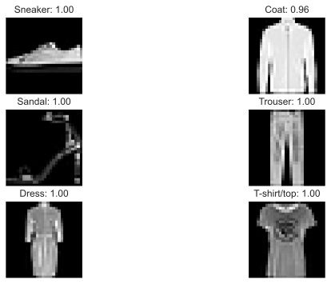

# Building a Convolution Neural Network For Fashion Data

In this post we will build a Convolution Neural Network (CNN) in order to classify images from the fashion MNIST dataset. CNNs are commonly used with image data to efficiently exploit spatial relationships between nearby pixels.

First, import some stuff:


```python
import numpy as np

import tensorflow as tf
import tensorflow_datasets as tfds

tfk = tf.keras
tfkl = tf.keras.layers
```

## Fashion MNIST dataset
The fashion MNIST is available through the `tensorflow_datasets` library. We download it to a `data` directory. There are 10 different classes of items in the dataset which are printed below.


```python
datasets, datasets_info = tfds.load(
    name="fashion_mnist", with_info=True, as_supervised=False, data_dir="data"
)
datasets_info.features["label"].names
```


    ['T-shirt/top',
     'Trouser',
     'Pullover',
     'Dress',
     'Coat',
     'Sandal',
     'Shirt',
     'Sneaker',
     'Bag',
     'Ankle boot']


The fashion MNIST is made up of many 28x28 images of various fashion items. Some examples from the library are shown below:


```python
fig = tfds.show_examples(datasets["train"], datasets_info)
```


    

    


## Data preperation
For this simple example we extract the first 1000 images from the dataset for training the network, we extract the next 1000 images for a validation test set. The labels are converted to classes with one-hot encoding.


```python
from tensorflow.keras.utils import to_categorical

train_data = datasets["train"].batch(1000)
train_data = iter(train_data)

# get first batch as training data
batch_1 = next(train_data)
X_train = batch_1["image"].numpy()
Y_train = to_categorical(batch_1["label"].numpy())

# get second batch as testing data
batch_2 = next(train_data)
X_test = batch_2["image"].numpy()
Y_test = to_categorical(batch_2["label"].numpy())

input_shape = datasets_info.features["image"].shape
num_classes = datasets_info.features["label"].num_classes
```

## Model fitting
The model is composed of several convolution layers. Each conv layer contains 32 convolution kernels and a `relu` activation function. The max pooling layers that follow convolution layers are used to reduce the dimension of the hidden layers so that when we pass the outputs to a fully connected dense layer the number of neurons is fewer. The dropout layer is used to reduce overfitting on the training set. A softmax activation is used to convert the network output to a probability for each class.


```python
model = tfk.Sequential(
    [
        tfk.layers.Convolution2D(
            32, kernel_size=5, input_shape=input_shape, activation=tfk.activations.relu
        ),
        tfk.layers.MaxPooling2D(pool_size=2),
        tfk.layers.Convolution2D(
            32, kernel_size=4, activation=tfk.activations.relu, padding="same"
        ),
        tfk.layers.MaxPooling2D(pool_size=2),
        tfk.layers.Convolution2D(32, kernel_size=3, activation=tfk.activations.relu),
        tfk.layers.Flatten(),
        tfk.layers.Dropout(rate=0.2),
        tfk.layers.Dense(num_classes),
        tfk.layers.Activation("softmax"),
    ]
)

model.compile(loss="categorical_crossentropy", optimizer="adam", metrics=["accuracy"])

model.summary()
```

    Model: "sequential"
    _________________________________________________________________
    Layer (type)                 Output Shape              Param #   
    =================================================================
    conv2d (Conv2D)              (None, 24, 24, 32)        832       
    _________________________________________________________________
    max_pooling2d (MaxPooling2D) (None, 12, 12, 32)        0         
    _________________________________________________________________
    conv2d_1 (Conv2D)            (None, 12, 12, 32)        16416     
    _________________________________________________________________
    max_pooling2d_1 (MaxPooling2 (None, 6, 6, 32)          0         
    _________________________________________________________________
    conv2d_2 (Conv2D)            (None, 4, 4, 32)          9248      
    _________________________________________________________________
    flatten (Flatten)            (None, 512)               0         
    _________________________________________________________________
    dropout (Dropout)            (None, 512)               0         
    _________________________________________________________________
    dense (Dense)                (None, 10)                5130      
    _________________________________________________________________
    activation (Activation)      (None, 10)                0         
    =================================================================
    Total params: 31,626
    Trainable params: 31,626
    Non-trainable params: 0
    _________________________________________________________________


The model is trained via the ADAM optimiser for 100 epochs.


```python
history = model.fit(
    X_train,
    Y_train,
    validation_data=(X_test, Y_test),
    batch_size=64,
    epochs=100,
    verbose=1,
)
```

    Epoch 1/100
    16/16 [==============================] - 1s 52ms/step - loss: 11.0994 - accuracy: 0.2300 - val_loss: 1.7835 - val_accuracy: 0.4470
    Epoch 2/100
    16/16 [==============================] - 1s 40ms/step - loss: 1.5810 - accuracy: 0.4690 - val_loss: 1.1647 - val_accuracy: 0.5710
    Epoch 3/100
    16/16 [==============================] - 1s 40ms/step - loss: 1.1094 - accuracy: 0.5990 - val_loss: 0.9348 - val_accuracy: 0.6590
    Epoch 4/100
    16/16 [==============================] - 1s 39ms/step - loss: 0.8786 - accuracy: 0.6810 - val_loss: 0.7860 - val_accuracy: 0.7340
    Epoch 5/100
    16/16 [==============================] - 1s 41ms/step - loss: 0.7583 - accuracy: 0.7200 - val_loss: 0.7140 - val_accuracy: 0.7540
    Epoch 6/100
    16/16 [==============================] - 1s 40ms/step - loss: 0.6591 - accuracy: 0.7500 - val_loss: 0.6625 - val_accuracy: 0.7630
    Epoch 7/100
    16/16 [==============================] - 1s 39ms/step - loss: 0.5634 - accuracy: 0.7860 - val_loss: 0.6441 - val_accuracy: 0.7570
    Epoch 8/100
    16/16 [==============================] - 1s 39ms/step - loss: 0.5409 - accuracy: 0.7950 - val_loss: 0.6480 - val_accuracy: 0.7820
    Epoch 9/100
    16/16 [==============================] - 1s 40ms/step - loss: 0.5111 - accuracy: 0.8040 - val_loss: 0.6437 - val_accuracy: 0.7770
    Epoch 10/100
    16/16 [==============================] - 1s 40ms/step - loss: 0.4641 - accuracy: 0.8140 - val_loss: 0.6124 - val_accuracy: 0.7880
    Epoch 11/100
    16/16 [==============================] - 1s 41ms/step - loss: 0.4341 - accuracy: 0.8320 - val_loss: 0.5967 - val_accuracy: 0.7860
    Epoch 12/100
    16/16 [==============================] - 1s 39ms/step - loss: 0.4176 - accuracy: 0.8500 - val_loss: 0.6085 - val_accuracy: 0.7960
    Epoch 13/100
    16/16 [==============================] - 1s 39ms/step - loss: 0.3691 - accuracy: 0.8600 - val_loss: 0.5998 - val_accuracy: 0.7840
    Epoch 14/100
    16/16 [==============================] - 1s 39ms/step - loss: 0.3595 - accuracy: 0.8650 - val_loss: 0.5895 - val_accuracy: 0.8070
    Epoch 15/100
    16/16 [==============================] - 1s 39ms/step - loss: 0.3174 - accuracy: 0.8810 - val_loss: 0.5928 - val_accuracy: 0.8060
    Epoch 16/100
    16/16 [==============================] - 1s 39ms/step - loss: 0.3200 - accuracy: 0.8830 - val_loss: 0.6274 - val_accuracy: 0.8060
    Epoch 17/100
    16/16 [==============================] - 1s 39ms/step - loss: 0.3295 - accuracy: 0.8710 - val_loss: 0.6192 - val_accuracy: 0.7920
    Epoch 18/100
    16/16 [==============================] - 1s 40ms/step - loss: 0.3123 - accuracy: 0.8820 - val_loss: 0.6459 - val_accuracy: 0.8080
    Epoch 19/100
    16/16 [==============================] - 1s 40ms/step - loss: 0.2910 - accuracy: 0.8930 - val_loss: 0.5898 - val_accuracy: 0.8210
    Epoch 20/100
    16/16 [==============================] - 1s 39ms/step - loss: 0.2551 - accuracy: 0.9110 - val_loss: 0.6265 - val_accuracy: 0.7970
    Epoch 21/100
    16/16 [==============================] - 1s 39ms/step - loss: 0.2284 - accuracy: 0.9260 - val_loss: 0.6231 - val_accuracy: 0.8110
    Epoch 22/100
    16/16 [==============================] - 1s 39ms/step - loss: 0.2128 - accuracy: 0.9250 - val_loss: 0.6283 - val_accuracy: 0.8120
    Epoch 23/100
    16/16 [==============================] - 1s 38ms/step - loss: 0.2200 - accuracy: 0.9230 - val_loss: 0.6349 - val_accuracy: 0.8130
    Epoch 24/100
    16/16 [==============================] - 1s 40ms/step - loss: 0.2159 - accuracy: 0.9400 - val_loss: 0.6436 - val_accuracy: 0.8200
    Epoch 25/100
    16/16 [==============================] - 1s 39ms/step - loss: 0.2087 - accuracy: 0.9310 - val_loss: 0.6548 - val_accuracy: 0.8060
    Epoch 26/100
    16/16 [==============================] - 1s 38ms/step - loss: 0.1719 - accuracy: 0.9440 - val_loss: 0.6777 - val_accuracy: 0.8200
    Epoch 27/100
    16/16 [==============================] - 1s 38ms/step - loss: 0.1627 - accuracy: 0.9520 - val_loss: 0.6141 - val_accuracy: 0.8280
    Epoch 28/100
    16/16 [==============================] - 1s 38ms/step - loss: 0.1386 - accuracy: 0.9580 - val_loss: 0.6065 - val_accuracy: 0.8220
    Epoch 29/100
    16/16 [==============================] - 1s 39ms/step - loss: 0.1238 - accuracy: 0.9670 - val_loss: 0.6627 - val_accuracy: 0.8120
    Epoch 30/100
    16/16 [==============================] - 1s 45ms/step - loss: 0.1342 - accuracy: 0.9550 - val_loss: 0.6854 - val_accuracy: 0.8210
    Epoch 31/100
    16/16 [==============================] - 1s 39ms/step - loss: 0.1277 - accuracy: 0.9550 - val_loss: 0.6378 - val_accuracy: 0.8170
    Epoch 32/100
    16/16 [==============================] - 1s 39ms/step - loss: 0.1201 - accuracy: 0.9630 - val_loss: 0.6450 - val_accuracy: 0.8140
    Epoch 33/100
    16/16 [==============================] - 1s 39ms/step - loss: 0.1308 - accuracy: 0.9560 - val_loss: 0.7124 - val_accuracy: 0.8020
    Epoch 34/100
    16/16 [==============================] - 1s 40ms/step - loss: 0.1115 - accuracy: 0.9690 - val_loss: 0.7183 - val_accuracy: 0.8130
    Epoch 35/100
    16/16 [==============================] - 1s 40ms/step - loss: 0.1026 - accuracy: 0.9670 - val_loss: 0.6873 - val_accuracy: 0.8040
    Epoch 36/100
    16/16 [==============================] - 1s 39ms/step - loss: 0.0873 - accuracy: 0.9710 - val_loss: 0.6798 - val_accuracy: 0.8230
    Epoch 37/100
    16/16 [==============================] - 1s 38ms/step - loss: 0.0734 - accuracy: 0.9820 - val_loss: 0.7247 - val_accuracy: 0.8150
    Epoch 38/100
    16/16 [==============================] - 1s 39ms/step - loss: 0.0931 - accuracy: 0.9660 - val_loss: 0.7050 - val_accuracy: 0.8160
    Epoch 39/100
    16/16 [==============================] - 1s 39ms/step - loss: 0.0861 - accuracy: 0.9730 - val_loss: 0.7085 - val_accuracy: 0.8250
    Epoch 40/100
    16/16 [==============================] - 1s 41ms/step - loss: 0.0700 - accuracy: 0.9770 - val_loss: 0.7096 - val_accuracy: 0.8260
    Epoch 41/100
    16/16 [==============================] - 1s 40ms/step - loss: 0.0688 - accuracy: 0.9740 - val_loss: 0.7529 - val_accuracy: 0.8010
    Epoch 42/100
    16/16 [==============================] - 1s 39ms/step - loss: 0.0830 - accuracy: 0.9740 - val_loss: 0.6820 - val_accuracy: 0.8080
    Epoch 43/100
    16/16 [==============================] - 1s 38ms/step - loss: 0.0631 - accuracy: 0.9810 - val_loss: 0.7788 - val_accuracy: 0.8180
    Epoch 44/100
    16/16 [==============================] - 1s 40ms/step - loss: 0.0576 - accuracy: 0.9820 - val_loss: 0.7366 - val_accuracy: 0.8150
    Epoch 45/100
    16/16 [==============================] - 1s 40ms/step - loss: 0.0774 - accuracy: 0.9770 - val_loss: 0.8036 - val_accuracy: 0.8010
    Epoch 46/100
    16/16 [==============================] - 1s 38ms/step - loss: 0.0617 - accuracy: 0.9820 - val_loss: 0.7350 - val_accuracy: 0.8280
    Epoch 47/100
    16/16 [==============================] - 1s 40ms/step - loss: 0.0552 - accuracy: 0.9860 - val_loss: 0.7633 - val_accuracy: 0.8250
    Epoch 48/100
    16/16 [==============================] - 1s 40ms/step - loss: 0.0431 - accuracy: 0.9920 - val_loss: 0.8296 - val_accuracy: 0.8140
    Epoch 49/100
    16/16 [==============================] - 1s 39ms/step - loss: 0.0475 - accuracy: 0.9880 - val_loss: 0.7683 - val_accuracy: 0.8230
    Epoch 50/100
    16/16 [==============================] - 1s 39ms/step - loss: 0.0514 - accuracy: 0.9870 - val_loss: 0.8441 - val_accuracy: 0.8110
    Epoch 51/100
    16/16 [==============================] - 1s 38ms/step - loss: 0.0621 - accuracy: 0.9840 - val_loss: 0.8153 - val_accuracy: 0.8180
    Epoch 52/100
    16/16 [==============================] - 1s 38ms/step - loss: 0.0689 - accuracy: 0.9790 - val_loss: 0.7843 - val_accuracy: 0.8140
    Epoch 53/100
    16/16 [==============================] - 1s 39ms/step - loss: 0.0600 - accuracy: 0.9860 - val_loss: 0.8060 - val_accuracy: 0.8280
    Epoch 54/100
    16/16 [==============================] - 1s 39ms/step - loss: 0.0585 - accuracy: 0.9810 - val_loss: 0.8841 - val_accuracy: 0.8190
    Epoch 55/100
    16/16 [==============================] - 1s 39ms/step - loss: 0.0669 - accuracy: 0.9780 - val_loss: 0.7918 - val_accuracy: 0.8190
    Epoch 56/100
    16/16 [==============================] - 1s 41ms/step - loss: 0.0633 - accuracy: 0.9760 - val_loss: 0.8102 - val_accuracy: 0.8170
    Epoch 57/100
    16/16 [==============================] - 1s 38ms/step - loss: 0.0566 - accuracy: 0.9810 - val_loss: 0.8169 - val_accuracy: 0.8230
    Epoch 58/100
    16/16 [==============================] - 1s 38ms/step - loss: 0.0482 - accuracy: 0.9830 - val_loss: 0.7963 - val_accuracy: 0.8250
    Epoch 59/100
    16/16 [==============================] - 1s 39ms/step - loss: 0.0373 - accuracy: 0.9910 - val_loss: 0.8476 - val_accuracy: 0.8320
    Epoch 60/100
    16/16 [==============================] - 1s 40ms/step - loss: 0.0381 - accuracy: 0.9910 - val_loss: 0.8119 - val_accuracy: 0.8230
    Epoch 61/100
    16/16 [==============================] - 1s 40ms/step - loss: 0.0298 - accuracy: 0.9920 - val_loss: 0.8845 - val_accuracy: 0.8210
    Epoch 62/100
    16/16 [==============================] - 1s 40ms/step - loss: 0.0375 - accuracy: 0.9910 - val_loss: 0.8269 - val_accuracy: 0.8290
    Epoch 63/100
    16/16 [==============================] - 1s 40ms/step - loss: 0.0304 - accuracy: 0.9910 - val_loss: 0.8511 - val_accuracy: 0.8170
    Epoch 64/100
    16/16 [==============================] - 1s 40ms/step - loss: 0.0310 - accuracy: 0.9930 - val_loss: 0.8584 - val_accuracy: 0.8150
    Epoch 65/100
    16/16 [==============================] - 1s 40ms/step - loss: 0.0357 - accuracy: 0.9900 - val_loss: 0.8854 - val_accuracy: 0.8020
    Epoch 66/100
    16/16 [==============================] - 1s 40ms/step - loss: 0.0354 - accuracy: 0.9890 - val_loss: 0.8568 - val_accuracy: 0.8150
    Epoch 67/100
    16/16 [==============================] - 1s 40ms/step - loss: 0.0331 - accuracy: 0.9920 - val_loss: 0.9174 - val_accuracy: 0.8200
    Epoch 68/100
    16/16 [==============================] - 1s 40ms/step - loss: 0.0329 - accuracy: 0.9920 - val_loss: 0.9947 - val_accuracy: 0.8200
    Epoch 69/100
    16/16 [==============================] - 1s 40ms/step - loss: 0.0504 - accuracy: 0.9810 - val_loss: 0.9072 - val_accuracy: 0.8070
    Epoch 70/100
    16/16 [==============================] - 1s 40ms/step - loss: 0.0315 - accuracy: 0.9900 - val_loss: 0.8761 - val_accuracy: 0.8210
    Epoch 71/100
    16/16 [==============================] - 1s 40ms/step - loss: 0.0309 - accuracy: 0.9940 - val_loss: 0.8966 - val_accuracy: 0.8110
    Epoch 72/100
    16/16 [==============================] - 1s 48ms/step - loss: 0.0430 - accuracy: 0.9880 - val_loss: 0.8528 - val_accuracy: 0.8250
    Epoch 73/100
    16/16 [==============================] - 1s 41ms/step - loss: 0.0554 - accuracy: 0.9770 - val_loss: 0.8083 - val_accuracy: 0.8190
    Epoch 74/100
    16/16 [==============================] - 1s 40ms/step - loss: 0.0291 - accuracy: 0.9930 - val_loss: 0.8896 - val_accuracy: 0.8240
    Epoch 75/100
    16/16 [==============================] - 1s 41ms/step - loss: 0.0267 - accuracy: 0.9930 - val_loss: 0.9195 - val_accuracy: 0.8240
    Epoch 76/100
    16/16 [==============================] - 1s 42ms/step - loss: 0.0182 - accuracy: 0.9960 - val_loss: 0.9136 - val_accuracy: 0.8260
    Epoch 77/100
    16/16 [==============================] - 1s 43ms/step - loss: 0.0180 - accuracy: 0.9950 - val_loss: 0.9056 - val_accuracy: 0.8200
    Epoch 78/100
    16/16 [==============================] - 1s 42ms/step - loss: 0.0201 - accuracy: 0.9960 - val_loss: 0.9293 - val_accuracy: 0.8160
    Epoch 79/100
    16/16 [==============================] - 1s 40ms/step - loss: 0.0252 - accuracy: 0.9940 - val_loss: 0.9385 - val_accuracy: 0.8280
    Epoch 80/100
    16/16 [==============================] - 1s 40ms/step - loss: 0.0200 - accuracy: 0.9960 - val_loss: 0.9639 - val_accuracy: 0.8210
    Epoch 81/100
    16/16 [==============================] - 1s 41ms/step - loss: 0.0229 - accuracy: 0.9930 - val_loss: 0.9178 - val_accuracy: 0.8220
    Epoch 82/100
    16/16 [==============================] - 1s 42ms/step - loss: 0.0396 - accuracy: 0.9900 - val_loss: 0.8715 - val_accuracy: 0.8260
    Epoch 83/100
    16/16 [==============================] - 1s 43ms/step - loss: 0.0272 - accuracy: 0.9920 - val_loss: 0.8736 - val_accuracy: 0.8150
    Epoch 84/100
    16/16 [==============================] - 1s 42ms/step - loss: 0.0244 - accuracy: 0.9930 - val_loss: 0.9222 - val_accuracy: 0.8190
    Epoch 85/100
    16/16 [==============================] - 1s 44ms/step - loss: 0.0178 - accuracy: 0.9970 - val_loss: 0.9414 - val_accuracy: 0.8250
    Epoch 86/100
    16/16 [==============================] - 1s 43ms/step - loss: 0.0264 - accuracy: 0.9940 - val_loss: 0.9166 - val_accuracy: 0.8220
    Epoch 87/100
    16/16 [==============================] - 1s 43ms/step - loss: 0.0189 - accuracy: 0.9940 - val_loss: 0.9115 - val_accuracy: 0.8310
    Epoch 88/100
    16/16 [==============================] - 1s 43ms/step - loss: 0.0165 - accuracy: 0.9960 - val_loss: 0.9488 - val_accuracy: 0.8200
    Epoch 89/100
    16/16 [==============================] - 1s 44ms/step - loss: 0.0243 - accuracy: 0.9880 - val_loss: 0.9871 - val_accuracy: 0.8240
    Epoch 90/100
    16/16 [==============================] - 1s 44ms/step - loss: 0.0114 - accuracy: 0.9990 - val_loss: 0.9542 - val_accuracy: 0.8200
    Epoch 91/100
    16/16 [==============================] - 1s 43ms/step - loss: 0.0103 - accuracy: 0.9990 - val_loss: 0.9791 - val_accuracy: 0.8200
    Epoch 92/100
    16/16 [==============================] - 1s 43ms/step - loss: 0.0134 - accuracy: 0.9970 - val_loss: 0.9831 - val_accuracy: 0.8220
    Epoch 93/100
    16/16 [==============================] - 1s 43ms/step - loss: 0.0202 - accuracy: 0.9940 - val_loss: 1.0575 - val_accuracy: 0.8230
    Epoch 94/100
    16/16 [==============================] - 1s 43ms/step - loss: 0.0243 - accuracy: 0.9910 - val_loss: 0.9646 - val_accuracy: 0.8020
    Epoch 95/100
    16/16 [==============================] - 1s 46ms/step - loss: 0.0233 - accuracy: 0.9920 - val_loss: 0.9380 - val_accuracy: 0.8230
    Epoch 96/100
    16/16 [==============================] - 1s 45ms/step - loss: 0.0197 - accuracy: 0.9960 - val_loss: 0.9690 - val_accuracy: 0.8260
    Epoch 97/100
    16/16 [==============================] - 1s 44ms/step - loss: 0.0266 - accuracy: 0.9950 - val_loss: 0.8947 - val_accuracy: 0.8110
    Epoch 98/100
    16/16 [==============================] - 1s 44ms/step - loss: 0.0198 - accuracy: 0.9930 - val_loss: 1.1166 - val_accuracy: 0.8200
    Epoch 99/100
    16/16 [==============================] - 1s 43ms/step - loss: 0.0437 - accuracy: 0.9820 - val_loss: 1.1608 - val_accuracy: 0.8070
    Epoch 100/100
    16/16 [==============================] - 1s 43ms/step - loss: 0.0475 - accuracy: 0.9790 - val_loss: 0.9530 - val_accuracy: 0.8110


We can see that the performance of the network has converged well, and we would not expect any further performance gains with more training.
The performance of the test set is expectedly worse than the training set. It has converged to an accuracy >80%.


```python
import matplotlib.pyplot as plt

plt.style.use("seaborn-whitegrid")
plt.plot(history.history["accuracy"], label="Train")
plt.plot(history.history["val_accuracy"], label="Test")
plt.title("Accuracy")
plt.xlabel("Epoch")
plt.legend()
plt.show()
```


    

    


## Predictions
We can run some of the test set through the model to get some predictions. The model outputs a probability for each possible class. Alongside each image we display the class that was assigned the highest probability along and the associated value.


```python
n_images = 6
test_images = X_test[np.random.randint(0, high=X_test.shape[0], size=n_images)]
predictions = model(test_images)

fig, ax = plt.subplots(ncols=2, nrows=int(np.ceil(n_images / 2)), figsize=(10, 6))

for i in range(n_images):
    ax[i // 2, i % 2].imshow(np.reshape(test_images[i], [28, 28]), cmap="gray")
    pred_name = datasets_info.features["label"].names[np.argmax(predictions.numpy()[i])]
    pred_conf = predictions.numpy()[i][np.argmax(predictions.numpy()[i])]
    ax[i // 2, i % 2].set_title(f"{pred_name}: {pred_conf:.2f}")
    ax[i // 2, i % 2].axis("off")

plt.show()
```


    

    


After making predictions on the whole test set, we can generate a confusion matrix to show which classes are more commonly confused by the model.


```python
from sklearn.metrics import confusion_matrix

all_predictions = model(X_test)
all_pred_conf = np.max(all_predictions, axis=1)
pred_label = np.argmax(all_predictions, axis=1)
true_label = np.argmax(Y_test, axis=1)

conf_matrix = confusion_matrix(true_label, pred_label, normalize="true")

fig, ax = plt.subplots(figsize=(10, 10))
# ax.imshow(conf_matrix, cmap='gray')
ax.matshow(conf_matrix, cmap="gray")
ax.set_xticks(np.arange(len(datasets_info.features["label"].names)))
ax.set_yticks(np.arange(len(datasets_info.features["label"].names)))
ax.set_xticklabels(datasets_info.features["label"].names)
ax.set_yticklabels(datasets_info.features["label"].names)
plt.xlabel("Predicted")
plt.ylabel("True")
plt.show()
```


    

    


The above matrix shows out of all items - pullovers, shirts and coats are the most confused. There is also some confusion on some sneakers and ankle boots. This all makes sense as those items are more similar.

The model is generally very confidence on its predictions:


```python
plt.subplots(figsize=(10, 6))
plt.hist(all_pred_conf)
plt.title("Prediction confidence")
plt.show()
```


    

    


We can plot some examples of the least confident predictions made by the model:


```python
n_images = 6
idx = np.argsort(all_pred_conf)[:n_images]

fig, ax = plt.subplots(ncols=2, nrows=int(np.ceil(n_images / 2)), figsize=(10, 6))

for i, id in enumerate(idx):
    ax[i // 2, i % 2].imshow(np.reshape(X_test[id], [28, 28]), cmap="gray")
    pred_name = datasets_info.features["label"].names[
        np.argmax(all_predictions.numpy()[id])
    ]
    pred_conf = all_predictions.numpy()[id][np.argmax(all_predictions.numpy()[id])]
    ax[i // 2, i % 2].set_title(f"{pred_name}: {pred_conf:.2f}")
    ax[i // 2, i % 2].axis("off")

plt.show()
```


    

    

