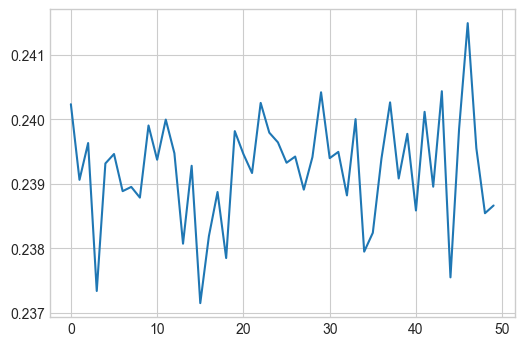
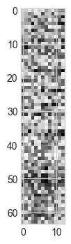
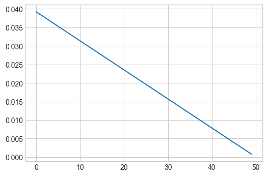
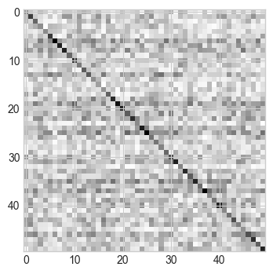
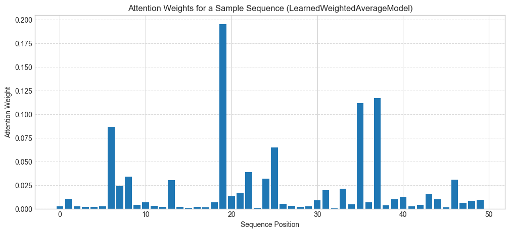

```python

```

## Data sources


```python
import src.data_sources

df = src.data_sources.load_uci_census_dataset(create_multi_task=True)
df["train"]
```


<div><style>
.dataframe > thead > tr,
.dataframe > tbody > tr {
  text-align: right;
  white-space: pre-wrap;
}
</style>
<small>shape: (30_162, 17)</small><table border="1" class="dataframe"><thead><tr><th>age</th><th>workclass</th><th>fnlwgt</th><th>education</th><th>education_num</th><th>marital_status</th><th>occupation</th><th>relationship</th><th>race</th><th>sex</th><th>capital_gain</th><th>capital_loss</th><th>hours_per_week</th><th>native_country</th><th>income</th><th>income_binary</th><th>marital_status_binary</th></tr><tr><td>i64</td><td>str</td><td>str</td><td>str</td><td>str</td><td>str</td><td>str</td><td>str</td><td>str</td><td>str</td><td>str</td><td>str</td><td>str</td><td>str</td><td>str</td><td>i8</td><td>i8</td></tr></thead><tbody><tr><td>39</td><td>&quot;State-gov&quot;</td><td>&quot;77516&quot;</td><td>&quot;Bachelors&quot;</td><td>&quot;13&quot;</td><td>&quot;Never-married&quot;</td><td>&quot;Adm-clerical&quot;</td><td>&quot;Not-in-family&quot;</td><td>&quot;White&quot;</td><td>&quot;Male&quot;</td><td>&quot;2174&quot;</td><td>&quot;0&quot;</td><td>&quot;40&quot;</td><td>&quot;United-States&quot;</td><td>&quot;&lt;=50K&quot;</td><td>0</td><td>0</td></tr><tr><td>50</td><td>&quot;Self-emp-not-inc&quot;</td><td>&quot;83311&quot;</td><td>&quot;Bachelors&quot;</td><td>&quot;13&quot;</td><td>&quot;Married-civ-spouse&quot;</td><td>&quot;Exec-managerial&quot;</td><td>&quot;Husband&quot;</td><td>&quot;White&quot;</td><td>&quot;Male&quot;</td><td>&quot;0&quot;</td><td>&quot;0&quot;</td><td>&quot;13&quot;</td><td>&quot;United-States&quot;</td><td>&quot;&lt;=50K&quot;</td><td>0</td><td>1</td></tr><tr><td>38</td><td>&quot;Private&quot;</td><td>&quot;215646&quot;</td><td>&quot;HS-grad&quot;</td><td>&quot;9&quot;</td><td>&quot;Divorced&quot;</td><td>&quot;Handlers-cleaners&quot;</td><td>&quot;Not-in-family&quot;</td><td>&quot;White&quot;</td><td>&quot;Male&quot;</td><td>&quot;0&quot;</td><td>&quot;0&quot;</td><td>&quot;40&quot;</td><td>&quot;United-States&quot;</td><td>&quot;&lt;=50K&quot;</td><td>0</td><td>0</td></tr><tr><td>53</td><td>&quot;Private&quot;</td><td>&quot;234721&quot;</td><td>&quot;11th&quot;</td><td>&quot;7&quot;</td><td>&quot;Married-civ-spouse&quot;</td><td>&quot;Handlers-cleaners&quot;</td><td>&quot;Husband&quot;</td><td>&quot;Black&quot;</td><td>&quot;Male&quot;</td><td>&quot;0&quot;</td><td>&quot;0&quot;</td><td>&quot;40&quot;</td><td>&quot;United-States&quot;</td><td>&quot;&lt;=50K&quot;</td><td>0</td><td>1</td></tr><tr><td>28</td><td>&quot;Private&quot;</td><td>&quot;338409&quot;</td><td>&quot;Bachelors&quot;</td><td>&quot;13&quot;</td><td>&quot;Married-civ-spouse&quot;</td><td>&quot;Prof-specialty&quot;</td><td>&quot;Wife&quot;</td><td>&quot;Black&quot;</td><td>&quot;Female&quot;</td><td>&quot;0&quot;</td><td>&quot;0&quot;</td><td>&quot;40&quot;</td><td>&quot;Cuba&quot;</td><td>&quot;&lt;=50K&quot;</td><td>0</td><td>1</td></tr><tr><td>&hellip;</td><td>&hellip;</td><td>&hellip;</td><td>&hellip;</td><td>&hellip;</td><td>&hellip;</td><td>&hellip;</td><td>&hellip;</td><td>&hellip;</td><td>&hellip;</td><td>&hellip;</td><td>&hellip;</td><td>&hellip;</td><td>&hellip;</td><td>&hellip;</td><td>&hellip;</td><td>&hellip;</td></tr><tr><td>27</td><td>&quot;Private&quot;</td><td>&quot;257302&quot;</td><td>&quot;Assoc-acdm&quot;</td><td>&quot;12&quot;</td><td>&quot;Married-civ-spouse&quot;</td><td>&quot;Tech-support&quot;</td><td>&quot;Wife&quot;</td><td>&quot;White&quot;</td><td>&quot;Female&quot;</td><td>&quot;0&quot;</td><td>&quot;0&quot;</td><td>&quot;38&quot;</td><td>&quot;United-States&quot;</td><td>&quot;&lt;=50K&quot;</td><td>0</td><td>1</td></tr><tr><td>40</td><td>&quot;Private&quot;</td><td>&quot;154374&quot;</td><td>&quot;HS-grad&quot;</td><td>&quot;9&quot;</td><td>&quot;Married-civ-spouse&quot;</td><td>&quot;Machine-op-inspct&quot;</td><td>&quot;Husband&quot;</td><td>&quot;White&quot;</td><td>&quot;Male&quot;</td><td>&quot;0&quot;</td><td>&quot;0&quot;</td><td>&quot;40&quot;</td><td>&quot;United-States&quot;</td><td>&quot;&gt;50K&quot;</td><td>1</td><td>1</td></tr><tr><td>58</td><td>&quot;Private&quot;</td><td>&quot;151910&quot;</td><td>&quot;HS-grad&quot;</td><td>&quot;9&quot;</td><td>&quot;Widowed&quot;</td><td>&quot;Adm-clerical&quot;</td><td>&quot;Unmarried&quot;</td><td>&quot;White&quot;</td><td>&quot;Female&quot;</td><td>&quot;0&quot;</td><td>&quot;0&quot;</td><td>&quot;40&quot;</td><td>&quot;United-States&quot;</td><td>&quot;&lt;=50K&quot;</td><td>0</td><td>0</td></tr><tr><td>22</td><td>&quot;Private&quot;</td><td>&quot;201490&quot;</td><td>&quot;HS-grad&quot;</td><td>&quot;9&quot;</td><td>&quot;Never-married&quot;</td><td>&quot;Adm-clerical&quot;</td><td>&quot;Own-child&quot;</td><td>&quot;White&quot;</td><td>&quot;Male&quot;</td><td>&quot;0&quot;</td><td>&quot;0&quot;</td><td>&quot;20&quot;</td><td>&quot;United-States&quot;</td><td>&quot;&lt;=50K&quot;</td><td>0</td><td>0</td></tr><tr><td>52</td><td>&quot;Self-emp-inc&quot;</td><td>&quot;287927&quot;</td><td>&quot;HS-grad&quot;</td><td>&quot;9&quot;</td><td>&quot;Married-civ-spouse&quot;</td><td>&quot;Exec-managerial&quot;</td><td>&quot;Wife&quot;</td><td>&quot;White&quot;</td><td>&quot;Female&quot;</td><td>&quot;15024&quot;</td><td>&quot;0&quot;</td><td>&quot;40&quot;</td><td>&quot;United-States&quot;</td><td>&quot;&gt;50K&quot;</td><td>1</td><td>1</td></tr></tbody></table></div>


```python
import polars as pl

df["train"].group_by("workclass", "marital_status_binary").len().pivot(
    on="marital_status_binary", values="len"
)
# df["train"].group_by("relationship", "marital_status").len().filter(pl.col('relationship')=='Unmarried')
```


<div><style>
.dataframe > thead > tr,
.dataframe > tbody > tr {
  text-align: right;
  white-space: pre-wrap;
}
</style>
<small>shape: (7, 3)</small><table border="1" class="dataframe"><thead><tr><th>workclass</th><th>1</th><th>0</th></tr><tr><td>str</td><td>u32</td><td>u32</td></tr></thead><tbody><tr><td>&quot;Private&quot;</td><td>9850</td><td>12436</td></tr><tr><td>&quot;Self-emp-not-inc&quot;</td><td>1688</td><td>811</td></tr><tr><td>&quot;Federal-gov&quot;</td><td>476</td><td>467</td></tr><tr><td>&quot;Local-gov&quot;</td><td>1034</td><td>1033</td></tr><tr><td>&quot;Self-emp-inc&quot;</td><td>806</td><td>268</td></tr><tr><td>&quot;State-gov&quot;</td><td>593</td><td>686</td></tr><tr><td>&quot;Without-pay&quot;</td><td>9</td><td>5</td></tr></tbody></table></div>


```python
import src.data_sources

synthetic_data = src.data_sources.create_synthetic_dataset(
    num_samples=5000, num_features=10, num_tasks=3, task_correlations=[1.0, 0.8, 0.2]
)
synthetic_data
```


    {'train': shape: (4_000, 13)
     ┌───────────┬───────────┬───────────┬───────────┬───┬───────────┬────────┬────────┬────────┐
     │ feature_0 ┆ feature_1 ┆ feature_2 ┆ feature_3 ┆ … ┆ feature_9 ┆ task_0 ┆ task_1 ┆ task_2 │
     │ ---       ┆ ---       ┆ ---       ┆ ---       ┆   ┆ ---       ┆ ---    ┆ ---    ┆ ---    │
     │ f64       ┆ f64       ┆ f64       ┆ f64       ┆   ┆ f64       ┆ i32    ┆ i32    ┆ i32    │
     ╞═══════════╪═══════════╪═══════════╪═══════════╪═══╪═══════════╪════════╪════════╪════════╡
     │ 0.496714  ┆ -0.138264 ┆ 0.647689  ┆ 1.52303   ┆ … ┆ 0.54256   ┆ 1      ┆ 1      ┆ 0      │
     │ -0.463418 ┆ -0.46573  ┆ 0.241962  ┆ -1.91328  ┆ … ┆ -1.412304 ┆ 0      ┆ 0      ┆ 1      │
     │ 1.465649  ┆ -0.225776 ┆ 0.067528  ┆ -1.424748 ┆ … ┆ -0.291694 ┆ 0      ┆ 0      ┆ 1      │
     │ -0.601707 ┆ 1.852278  ┆ -0.013497 ┆ -1.057711 ┆ … ┆ 0.196861  ┆ 0      ┆ 0      ┆ 0      │
     │ 0.738467  ┆ 0.171368  ┆ -0.115648 ┆ -0.301104 ┆ … ┆ -1.76304  ┆ 0      ┆ 0      ┆ 1      │
     │ …         ┆ …         ┆ …         ┆ …         ┆ … ┆ …         ┆ …      ┆ …      ┆ …      │
     │ -0.407131 ┆ -0.110781 ┆ 0.892763  ┆ 0.983321  ┆ … ┆ 1.278756  ┆ 1      ┆ 1      ┆ 0      │
     │ 0.221594  ┆ 0.814231  ┆ 0.012686  ┆ -0.052168 ┆ … ┆ 0.320955  ┆ 1      ┆ 1      ┆ 0      │
     │ 1.474828  ┆ 1.662893  ┆ -0.924278 ┆ -0.574215 ┆ … ┆ -0.710791 ┆ 0      ┆ 0      ┆ 0      │
     │ -0.79059  ┆ 0.492624  ┆ -0.063768 ┆ -0.241301 ┆ … ┆ 0.772791  ┆ 1      ┆ 1      ┆ 1      │
     │ 1.829253  ┆ 0.993487  ┆ 0.158516  ┆ -0.597658 ┆ … ┆ 0.355974  ┆ 1      ┆ 1      ┆ 0      │
     └───────────┴───────────┴───────────┴───────────┴───┴───────────┴────────┴────────┴────────┘,
     'test': shape: (1_000, 13)
     ┌───────────┬───────────┬───────────┬───────────┬───┬───────────┬────────┬────────┬────────┐
     │ feature_0 ┆ feature_1 ┆ feature_2 ┆ feature_3 ┆ … ┆ feature_9 ┆ task_0 ┆ task_1 ┆ task_2 │
     │ ---       ┆ ---       ┆ ---       ┆ ---       ┆   ┆ ---       ┆ ---    ┆ ---    ┆ ---    │
     │ f64       ┆ f64       ┆ f64       ┆ f64       ┆   ┆ f64       ┆ i32    ┆ i32    ┆ i32    │
     ╞═══════════╪═══════════╪═══════════╪═══════════╪═══╪═══════════╪════════╪════════╪════════╡
     │ -0.471858 ┆ 1.012702  ┆ -0.198187 ┆ 0.090569  ┆ … ┆ -1.831116 ┆ 1      ┆ 1      ┆ 1      │
     │ -1.043291 ┆ 2.02388   ┆ 0.232035  ┆ 0.003551  ┆ … ┆ 0.610284  ┆ 0      ┆ 0      ┆ 0      │
     │ 1.765707  ┆ -0.580478 ┆ 0.302875  ┆ 1.004394  ┆ … ┆ -0.141137 ┆ 1      ┆ 1      ┆ 0      │
     │ 1.799587  ┆ -1.645468 ┆ 0.064956  ┆ -1.478855 ┆ … ┆ 0.460467  ┆ 0      ┆ 0      ┆ 1      │
     │ -1.531903 ┆ -0.634932 ┆ 2.540992  ┆ 0.329237  ┆ … ┆ 2.193315  ┆ 1      ┆ 1      ┆ 0      │
     │ …         ┆ …         ┆ …         ┆ …         ┆ … ┆ …         ┆ …      ┆ …      ┆ …      │
     │ -1.801115 ┆ -1.269297 ┆ 0.220678  ┆ -0.233577 ┆ … ┆ 0.597508  ┆ 0      ┆ 0      ┆ 1      │
     │ -1.085776 ┆ 0.512296  ┆ 1.139106  ┆ -0.823333 ┆ … ┆ 2.110287  ┆ 1      ┆ 1      ┆ 0      │
     │ 0.625084  ┆ 0.313912  ┆ 0.013779  ┆ -1.313539 ┆ … ┆ -2.505187 ┆ 0      ┆ 0      ┆ 1      │
     │ 0.040727  ┆ 0.433389  ┆ 0.897684  ┆ 0.143323  ┆ … ┆ 0.577845  ┆ 1      ┆ 1      ┆ 0      │
     │ 0.197389  ┆ -0.738124 ┆ -0.342293 ┆ 1.51012   ┆ … ┆ 1.515811  ┆ 1      ┆ 1      ┆ 0      │
     └───────────┴───────────┴───────────┴───────────┴───┴───────────┴────────┴────────┴────────┘}


```python
import src.data_sources

synthetic_data = src.data_sources.generate_mmoe_synthetic_data(num_features=10)
synthetic_data["train"]
```


<div><style>
.dataframe > thead > tr,
.dataframe > tbody > tr {
  text-align: right;
  white-space: pre-wrap;
}
</style>
<small>shape: (8_000, 12)</small><table border="1" class="dataframe"><thead><tr><th>feature_0</th><th>feature_1</th><th>feature_2</th><th>feature_3</th><th>feature_4</th><th>feature_5</th><th>feature_6</th><th>feature_7</th><th>feature_8</th><th>feature_9</th><th>task_0</th><th>task_1</th></tr><tr><td>f64</td><td>f64</td><td>f64</td><td>f64</td><td>f64</td><td>f64</td><td>f64</td><td>f64</td><td>f64</td><td>f64</td><td>i32</td><td>i32</td></tr></thead><tbody><tr><td>1.465649</td><td>-0.225776</td><td>0.067528</td><td>-1.424748</td><td>-0.544383</td><td>0.110923</td><td>-1.150994</td><td>0.375698</td><td>-0.600639</td><td>-0.291694</td><td>1</td><td>1</td></tr><tr><td>-0.601707</td><td>1.852278</td><td>-0.013497</td><td>-1.057711</td><td>0.822545</td><td>-1.220844</td><td>0.208864</td><td>-1.95967</td><td>-1.328186</td><td>0.196861</td><td>1</td><td>0</td></tr><tr><td>0.738467</td><td>0.171368</td><td>-0.115648</td><td>-0.301104</td><td>-1.478522</td><td>-0.719844</td><td>-0.460639</td><td>1.057122</td><td>0.343618</td><td>-1.76304</td><td>0</td><td>1</td></tr><tr><td>0.324084</td><td>-0.385082</td><td>-0.676922</td><td>0.611676</td><td>1.031</td><td>0.93128</td><td>-0.839218</td><td>-0.309212</td><td>0.331263</td><td>0.975545</td><td>0</td><td>1</td></tr><tr><td>-0.479174</td><td>-0.185659</td><td>-1.106335</td><td>-1.196207</td><td>0.812526</td><td>1.35624</td><td>-0.07201</td><td>1.003533</td><td>0.361636</td><td>-0.64512</td><td>1</td><td>1</td></tr><tr><td>&hellip;</td><td>&hellip;</td><td>&hellip;</td><td>&hellip;</td><td>&hellip;</td><td>&hellip;</td><td>&hellip;</td><td>&hellip;</td><td>&hellip;</td><td>&hellip;</td><td>&hellip;</td><td>&hellip;</td></tr><tr><td>0.144411</td><td>-1.951835</td><td>-0.230421</td><td>0.210127</td><td>-0.907807</td><td>1.727076</td><td>-1.125823</td><td>-1.015248</td><td>0.691618</td><td>0.278781</td><td>0</td><td>1</td></tr><tr><td>-0.452371</td><td>1.007218</td><td>0.243769</td><td>1.849153</td><td>-1.778455</td><td>-0.521728</td><td>1.65432</td><td>0.480447</td><td>-0.105249</td><td>-0.403483</td><td>1</td><td>1</td></tr><tr><td>0.349823</td><td>-1.144816</td><td>-1.434423</td><td>0.563284</td><td>0.855341</td><td>0.940865</td><td>-0.429319</td><td>-0.468957</td><td>-0.003343</td><td>-0.993488</td><td>0</td><td>1</td></tr><tr><td>0.664001</td><td>-0.296116</td><td>-0.066586</td><td>-0.175382</td><td>0.514054</td><td>0.28613</td><td>1.90632</td><td>-0.384143</td><td>1.792852</td><td>-1.811744</td><td>0</td><td>0</td></tr><tr><td>0.489523</td><td>-1.585606</td><td>-1.023891</td><td>-0.97466</td><td>-1.052472</td><td>-0.608075</td><td>2.200501</td><td>-0.878055</td><td>-1.613795</td><td>0.493704</td><td>1</td><td>1</td></tr></tbody></table></div>


## Data loaders


```python
import src.data_sources
import src.torch_datasets

census_data = src.data_sources.load_uci_census_dataset(create_multi_task=True)

# Define categorical columns
categorical_cols = [
    "workclass",
    "education",
    # "marital_status",
    "occupation",
    # "relationship",
    "race",
    "sex",
    "native_country",
]

# Define feature columns (exclude target columns)
feature_cols = [
    col
    for col in census_data["train"].columns
    if col
    not in [
        "marital_status",
        "relationship",
        "income",
        "income_binary",
        "marital_status_binary",
    ]
]

# Create dataset and dataloaders
dataset_kwargs = {
    "feature_cols": feature_cols,
    "task_cols": ["income_binary", "marital_status_binary"],
    "categorical_cols": categorical_cols,
    "normalize_features": True,
}

dataloaders = src.torch_datasets.create_train_test_dataloaders(
    census_data["train"],
    census_data["test"],
    batch_size=64,
    dataset_kwargs=dataset_kwargs,
)

print("\nSynthetic data dataloader batch shapes:")
for split, loader in dataloaders.items():
    if split == "preprocessor":
        continue
    batch = next(iter(loader))
    print(f"{split}:")
    for key, value in batch.items():
        print(f"  {key}: {value.shape}")
```

    
    Synthetic data dataloader batch shapes:
    train:
      features: torch.Size([64, 20667])
      income_binary: torch.Size([64])
      marital_status_binary: torch.Size([64])
    val:
      features: torch.Size([64, 20667])
      income_binary: torch.Size([64])
      marital_status_binary: torch.Size([64])
    test:
      features: torch.Size([64, 20667])
      income_binary: torch.Size([64])
      marital_status_binary: torch.Size([64])


```python
import src.data_sources
import src.torch_datasets

synthetic_data = src.data_sources.create_synthetic_dataset(
    num_samples=5000, num_features=10, num_tasks=3, task_correlations=[1.0, 0.8, 0.2]
)

# Create dataset and dataloaders
dataset_kwargs = {
    "feature_cols": [f"feature_{i}" for i in range(10)],
    "task_cols": [f"task_{i}" for i in range(3)],
}

dataloaders = src.torch_datasets.create_train_test_dataloaders(
    synthetic_data["train"],
    synthetic_data["test"],
    batch_size=32,
    dataset_kwargs=dataset_kwargs,
)

print("\nSynthetic data dataloader batch shapes:")
for split, loader in dataloaders.items():
    if split == "preprocessor":
        continue
    batch = next(iter(loader))
    print(f"{split}:")
    for key, value in batch.items():
        print(f"  {key}: {value.shape}")
```

    
    Synthetic data dataloader batch shapes:
    train:
      features: torch.Size([32, 10])
      task_0: torch.Size([32])
      task_1: torch.Size([32])
      task_2: torch.Size([32])
    val:
      features: torch.Size([32, 10])
      task_0: torch.Size([32])
      task_1: torch.Size([32])
      task_2: torch.Size([32])
    test:
      features: torch.Size([32, 10])
      task_0: torch.Size([32])
      task_1: torch.Size([32])
      task_2: torch.Size([32])


```python
import src.data_sources
import src.torch_datasets

synthetic_data = src.data_sources.generate_mmoe_synthetic_data(num_features=10)

# Create dataset and dataloaders
dataset_kwargs = {
    "feature_cols": [f"feature_{i}" for i in range(10)],
    "task_cols": [f"task_{i}" for i in range(2)],
}

dataloaders = src.torch_datasets.create_train_test_dataloaders(
    synthetic_data["train"],
    synthetic_data["test"],
    batch_size=32,
    dataset_kwargs=dataset_kwargs,
)

print("\nSynthetic data dataloader batch shapes:")
for split, loader in dataloaders.items():
    if split == "preprocessor":
        continue
    batch = next(iter(loader))
    print(f"{split}:")
    for key, value in batch.items():
        print(f"  {key}: {value.shape}")
```

    
    Synthetic data dataloader batch shapes:
    train:
      features: torch.Size([32, 10])
      task_0: torch.Size([32])
      task_1: torch.Size([32])
    val:
      features: torch.Size([32, 10])
      task_0: torch.Size([32])
      task_1: torch.Size([32])
    test:
      features: torch.Size([32, 10])
      task_0: torch.Size([32])
      task_1: torch.Size([32])


## Models


```python
import src.models
import src.data_sources
import src.torch_datasets

synthetic_data = src.data_sources.create_synthetic_dataset(
    num_samples=5000, num_features=10, num_tasks=3, task_correlations=[1.0, 0.8, 0.2]
)

# Create dataset and dataloaders
dataset_kwargs = {
    "feature_cols": [f"feature_{i}" for i in range(10)],
    "task_cols": [f"task_{i}" for i in range(3)],
}

dataloaders = src.torch_datasets.create_train_test_dataloaders(
    synthetic_data["train"],
    synthetic_data["test"],
    batch_size=32,
    dataset_kwargs=dataset_kwargs,
)
```


```python
dataloaders["train"]


batch = next(iter(dataloaders["train"]))
print(f"{split}:")
for key, value in batch.items():
    print(f"  {key}: {value.shape}")
```

    preprocessor:
      features: torch.Size([64, 20667])
      income_binary: torch.Size([64])
      marital_status_binary: torch.Size([64])


```python
dataloaders["train"].dataset[0]["features"].shape[0]
dataloaders["train"].dataset.dataset.feature_dim
```


    20667


```python
model = src.models.get_model(
    model_name="MultiSingleTaskModel",
    num_tabular_features=10,
    task_names=dataset_kwargs["task_cols"],
    task_types={"task_0": "binary", "task_1": "binary", "task_2": "binary"},
    # model_params
)
model
```


    MultiSingleTaskModel(
      (task_models): ModuleDict(
        (task_0): Sequential(
          (0): Linear(in_features=10, out_features=64, bias=True)
          (1): ReLU()
          (2): Linear(in_features=64, out_features=32, bias=True)
          (3): ReLU()
          (4): Linear(in_features=32, out_features=1, bias=True)
        )
        (task_1): Sequential(
          (0): Linear(in_features=10, out_features=64, bias=True)
          (1): ReLU()
          (2): Linear(in_features=64, out_features=32, bias=True)
          (3): ReLU()
          (4): Linear(in_features=32, out_features=1, bias=True)
        )
        (task_2): Sequential(
          (0): Linear(in_features=10, out_features=64, bias=True)
          (1): ReLU()
          (2): Linear(in_features=64, out_features=32, bias=True)
          (3): ReLU()
          (4): Linear(in_features=32, out_features=1, bias=True)
        )
      )
    )


```python
model = src.models.get_model(
    model_name="SharedBottomModel",
    num_tabular_features=10,
    task_names=dataset_kwargs["task_cols"],
    task_types={"task_0": "binary", "task_1": "binary", "task_2": "binary"},
    # model_params
)
model
```


    SharedBottomModel(
      (shared_bottom): Sequential(
        (0): Linear(in_features=10, out_features=64, bias=True)
        (1): ReLU()
        (2): Linear(in_features=64, out_features=32, bias=True)
        (3): ReLU()
      )
      (task_heads): ModuleDict(
        (income_binary): Linear(in_features=32, out_features=1, bias=True)
        (marital_status_binary): Linear(in_features=32, out_features=1, bias=True)
      )
    )


```python
model = src.models.get_model(
    model_name="MixtureOfExperts",
    num_tabular_features=10,
    task_names=dataset_kwargs["task_cols"],
    task_types={"task_0": "binary", "task_1": "binary", "task_2": "binary"},
    # model_params
)
model
```


    MixtureOfExperts(
      (experts): ModuleList(
        (0-3): 4 x Expert(
          (network): Sequential(
            (0): Linear(in_features=10, out_features=64, bias=True)
            (1): ReLU()
            (2): Linear(in_features=64, out_features=32, bias=True)
            (3): ReLU()
          )
        )
      )
      (gate): Sequential(
        (0): Linear(in_features=10, out_features=64, bias=True)
        (1): ReLU()
        (2): Linear(in_features=64, out_features=4, bias=True)
      )
      (task_heads): ModuleDict(
        (task_0): Linear(in_features=32, out_features=1, bias=True)
        (task_1): Linear(in_features=32, out_features=1, bias=True)
        (task_2): Linear(in_features=32, out_features=1, bias=True)
      )
    )


```python
model = src.models.get_model(
    model_name="MultiGateMixtureOfExperts",
    num_tabular_features=10,
    task_names=dataset_kwargs["task_cols"],
    task_types={"task_0": "binary", "task_1": "binary", "task_2": "binary"},
    # model_params
)
model
```


    ---------------------------------------------------------------------------

    NotImplementedError                       Traceback (most recent call last)

    Cell In[4], line 1
    ----> 1 model = src.models.get_model(
          2     model_name="MultiGateMixtureOfExperts",
          3     num_tabular_features=10,
          4     task_names=dataset_kwargs["task_cols"],
          5     task_types={"task_0": "binary", "task_1": "binary", "task_2": "binary"},
          6     # model_params
          7 )
          8 model


    File ~/Documents/VariousProjects/github/data-analysis/neural_networks/mixture_of_experts/src/models.py:135, in get_model(model_name, num_tabular_features, task_names, task_types, model_params)
        132     gate_dims = model_params.get("gate_dims", [64])
        134     # This is a placeholder for the future MMoE implementation
    --> 135     raise NotImplementedError("MultiGateMixtureOfExperts is not yet implemented")
        137 else:
        138     raise ValueError(f"Unknown model name: {model_name}")


    NotImplementedError: MultiGateMixtureOfExperts is not yet implemented


```python
import src.train

data_config = src.train.prepare_uci_census_data()
data_config
```


    {'dataloaders': {'train': <torch.utils.data.dataloader.DataLoader at 0x168c04770>,
      'val': <torch.utils.data.dataloader.DataLoader at 0x168261a30>,
      'test': <torch.utils.data.dataloader.DataLoader at 0x30924ac60>,
      'preprocessor': <src.torch_datasets.TabularDataPreprocessor at 0x1399d40e0>},
     'feature_dim': 20680,
     'task_names': ['income_binary', 'marital_status_binary'],
     'task_types': {'income_binary': 'binary', 'marital_status_binary': 'binary'}}


```python
dataloaders = data_config["dataloaders"]
feature_dim = data_config["feature_dim"]
task_names = data_config["task_names"]
task_types = data_config["task_types"]
```


```python
feature_dim
```


    20680


```python
model = src.models.get_model(
    model_name="SharedBottomModel",
    num_tabular_features=feature_dim,
    task_names=task_names,
    task_types=task_types,
)
model
```


    SharedBottomModel(
      (shared_bottom): Sequential(
        (0): Linear(in_features=20680, out_features=64, bias=True)
        (1): ReLU()
        (2): Linear(in_features=64, out_features=32, bias=True)
        (3): ReLU()
      )
      (task_heads): ModuleDict(
        (income_binary): Linear(in_features=32, out_features=1, bias=True)
        (marital_status_binary): Linear(in_features=32, out_features=1, bias=True)
      )
    )


```python
import pytorch_lightning as pl
import src.train

lightning_model = src.train.MultiTaskLightningModule(
    model=model, task_weights=None, learning_rate=1e-3
)

trainer = pl.Trainer(
    max_epochs=2,
    # logger=logger,
    # callbacks=callbacks,
    log_every_n_steps=10,
)

# Train model
trainer.fit(
    lightning_model,
    train_dataloaders=dataloaders["train"],
    val_dataloaders=dataloaders["val"],
)
```

    💡 Tip: For seamless cloud uploads and versioning, try installing [litmodels](https://pypi.org/project/litmodels/) to enable LitModelCheckpoint, which syncs automatically with the Lightning model registry.
    GPU available: True (mps), used: True
    TPU available: False, using: 0 TPU cores
    HPU available: False, using: 0 HPUs
    /Users/stantoon/Documents/VariousProjects/github/data-analysis/neural_networks/mixture_of_experts/.venv/lib/python3.12/site-packages/pytorch_lightning/trainer/connectors/logger_connector/logger_connector.py:76: Starting from v1.9.0, `tensorboardX` has been removed as a dependency of the `pytorch_lightning` package, due to potential conflicts with other packages in the ML ecosystem. For this reason, `logger=True` will use `CSVLogger` as the default logger, unless the `tensorboard` or `tensorboardX` packages are found. Please `pip install lightning[extra]` or one of them to enable TensorBoard support by default
    
      | Name  | Type              | Params | Mode 
    ----------------------------------------------------
    0 | model | SharedBottomModel | 1.3 M  | train
    ----------------------------------------------------
    1.3 M     Trainable params
    0         Non-trainable params
    1.3 M     Total params
    5.303     Total estimated model params size (MB)
    9         Modules in train mode
    0         Modules in eval mode


    Sanity Checking: |          | 0/? [00:00<?, ?it/s]

    /Users/stantoon/Documents/VariousProjects/github/data-analysis/neural_networks/mixture_of_experts/.venv/lib/python3.12/site-packages/pytorch_lightning/trainer/connectors/data_connector.py:425: The 'val_dataloader' does not have many workers which may be a bottleneck. Consider increasing the value of the `num_workers` argument` to `num_workers=7` in the `DataLoader` to improve performance.


                                                                               

    /Users/stantoon/Documents/VariousProjects/github/data-analysis/neural_networks/mixture_of_experts/.venv/lib/python3.12/site-packages/pytorch_lightning/trainer/connectors/data_connector.py:425: The 'train_dataloader' does not have many workers which may be a bottleneck. Consider increasing the value of the `num_workers` argument` to `num_workers=7` in the `DataLoader` to improve performance.


    Epoch 1: 100%|██████████| 802/802 [00:13<00:00, 58.67it/s, v_num=2, train_loss=0.200, train_income_binary_loss=0.200, train_income_binary_accuracy=0.800, train_marital_status_binary_loss=0.000133, train_marital_status_binary_accuracy=1.000, val_loss=0.289, val_income_binary_loss=0.288, val_income_binary_accuracy=0.862, val_marital_status_binary_loss=0.000531, val_marital_status_binary_accuracy=1.000] 

    `Trainer.fit` stopped: `max_epochs=2` reached.


    Epoch 1: 100%|██████████| 802/802 [00:13<00:00, 58.49it/s, v_num=2, train_loss=0.200, train_income_binary_loss=0.200, train_income_binary_accuracy=0.800, train_marital_status_binary_loss=0.000133, train_marital_status_binary_accuracy=1.000, val_loss=0.289, val_income_binary_loss=0.288, val_income_binary_accuracy=0.862, val_marital_status_binary_loss=0.000531, val_marital_status_binary_accuracy=1.000]


```python
test_results = trainer.test(lightning_model, dataloaders=dataloaders["test"])
```

    /Users/stantoon/Documents/VariousProjects/github/data-analysis/neural_networks/mixture_of_experts/.venv/lib/python3.12/site-packages/pytorch_lightning/trainer/connectors/data_connector.py:425: The 'test_dataloader' does not have many workers which may be a bottleneck. Consider increasing the value of the `num_workers` argument` to `num_workers=7` in the `DataLoader` to improve performance.


    Testing DataLoader 0: 100%|██████████| 471/471 [00:03<00:00, 144.82it/s]
    ────────────────────────────────────────────────────────────────────────────────────────────────────────────────────────
                Test metric                       DataLoader 0
    ────────────────────────────────────────────────────────────────────────────────────────────────────────────────────────
        test_income_binary_accuracy            0.8590969443321228
          test_income_binary_loss               0.30391925573349
                 test_loss                     0.30445167422294617
    test_marital_status_binary_accuracy                1.0
      test_marital_status_binary_loss         0.0005323474761098623
    ────────────────────────────────────────────────────────────────────────────────────────────────────────────────────────


```python
batch = next(iter(dataloaders["train"]))
print(f"{split}:")
for key, value in batch.items():
    print(f"  {key}: {value.shape}")

batch["features"]

# # Extract features and targets
# features = batch["features"]
# targets = {task: batch[task] for task in self.model.task_names}

# # Forward pass
# outputs = self.forward(features)

model.forward(batch["features"])
```

    test:
      features: torch.Size([64, 20673])
      income_binary: torch.Size([64])
      marital_status_binary: torch.Size([64])


    ---------------------------------------------------------------------------

    RuntimeError                              Traceback (most recent call last)

    Cell In[11], line 15
          6 batch['features']
          8 # # Extract features and targets
          9 # features = batch["features"]
         10 # targets = {task: batch[task] for task in self.model.task_names}
         11 
         12 # # Forward pass
         13 # outputs = self.forward(features)
    ---> 15 model.forward(batch['features'])


    File ~/Documents/VariousProjects/github/data-analysis/neural_networks/mixture_of_experts/src/models.py:289, in SharedBottomModel.forward(self, x)
        279 """
        280 Forward pass through the model.
        281 
       (...)    286     Dict[str, torch.Tensor]: Dictionary mapping task names to predictions
        287 """
        288 # Pass input through shared bottom layers
    --> 289 shared_features = self.shared_bottom(x)
        291 # Pass shared features through task-specific heads
        292 outputs = {}


    File ~/Documents/VariousProjects/github/data-analysis/neural_networks/mixture_of_experts/.venv/lib/python3.12/site-packages/torch/nn/modules/module.py:1751, in Module._wrapped_call_impl(self, *args, **kwargs)
       1749     return self._compiled_call_impl(*args, **kwargs)  # type: ignore[misc]
       1750 else:
    -> 1751     return self._call_impl(*args, **kwargs)


    File ~/Documents/VariousProjects/github/data-analysis/neural_networks/mixture_of_experts/.venv/lib/python3.12/site-packages/torch/nn/modules/module.py:1762, in Module._call_impl(self, *args, **kwargs)
       1757 # If we don't have any hooks, we want to skip the rest of the logic in
       1758 # this function, and just call forward.
       1759 if not (self._backward_hooks or self._backward_pre_hooks or self._forward_hooks or self._forward_pre_hooks
       1760         or _global_backward_pre_hooks or _global_backward_hooks
       1761         or _global_forward_hooks or _global_forward_pre_hooks):
    -> 1762     return forward_call(*args, **kwargs)
       1764 result = None
       1765 called_always_called_hooks = set()


    File ~/Documents/VariousProjects/github/data-analysis/neural_networks/mixture_of_experts/.venv/lib/python3.12/site-packages/torch/nn/modules/container.py:240, in Sequential.forward(self, input)
        238 def forward(self, input):
        239     for module in self:
    --> 240         input = module(input)
        241     return input


    File ~/Documents/VariousProjects/github/data-analysis/neural_networks/mixture_of_experts/.venv/lib/python3.12/site-packages/torch/nn/modules/module.py:1751, in Module._wrapped_call_impl(self, *args, **kwargs)
       1749     return self._compiled_call_impl(*args, **kwargs)  # type: ignore[misc]
       1750 else:
    -> 1751     return self._call_impl(*args, **kwargs)


    File ~/Documents/VariousProjects/github/data-analysis/neural_networks/mixture_of_experts/.venv/lib/python3.12/site-packages/torch/nn/modules/module.py:1762, in Module._call_impl(self, *args, **kwargs)
       1757 # If we don't have any hooks, we want to skip the rest of the logic in
       1758 # this function, and just call forward.
       1759 if not (self._backward_hooks or self._backward_pre_hooks or self._forward_hooks or self._forward_pre_hooks
       1760         or _global_backward_pre_hooks or _global_backward_hooks
       1761         or _global_forward_hooks or _global_forward_pre_hooks):
    -> 1762     return forward_call(*args, **kwargs)
       1764 result = None
       1765 called_always_called_hooks = set()


    File ~/Documents/VariousProjects/github/data-analysis/neural_networks/mixture_of_experts/.venv/lib/python3.12/site-packages/torch/nn/modules/linear.py:125, in Linear.forward(self, input)
        124 def forward(self, input: Tensor) -> Tensor:
    --> 125     return F.linear(input, self.weight, self.bias)


    RuntimeError: mat1 and mat2 shapes cannot be multiplied (64x20673 and 10x64)


```python
# Define categorical columns
categorical_cols = [
    "workclass",
    "education",
    "marital_status",
    "occupation",
    "relationship",
    "race",
    "sex",
    "native_country",
]

# Define feature columns (exclude target columns)
feature_cols = [
    col
    for col in census_data["train"].columns
    if col not in ["marital_status", "income", "income_binary", "marital_status_binary"]
]

# Define task columns and types
task_cols = ["income_binary", "marital_status_binary"]
task_types = {task: "binary" for task in task_cols}

# Create dataset and dataloaders
dataset_kwargs = {
    "feature_cols": feature_cols,
    "task_cols": task_cols,
    "categorical_cols": categorical_cols,
    "normalize_features": True,
}

dataloaders = create_train_test_dataloaders(
    census_data["train"],
    census_data["test"],
    batch_size=batch_size,
    val_ratio=val_ratio,
    dataset_kwargs=dataset_kwargs,
)

# Create a temporary dataset to get feature dimension
temp_dataset = MultiTaskTabularDataset(census_data["train"], **dataset_kwargs)
# TODO replace with feature_cols len?
```


```python
test_results = trainer.test(lightning_model, dataloaders=dataloaders["test"])
```


```python

```


```python

```


```python

```


```python

```


```python

```

Model inspection


```python
import mlflow

mlflow.set_tracking_uri("../mlruns")
mlflow.set_experiment("Sequence Data Models")
```


    <Experiment: artifact_location='file:///Users/rich/Developer/Github/VariousDataAnalysis/neural_networks/sequence_data/mlruns/201944266504181987', creation_time=1751841024163, experiment_id='201944266504181987', last_update_time=1751841024163, lifecycle_stage='active', name='Sequence Data Models', tags={}>


## LearnedStaticPositionalWeightingModel


```python
from src.utils import load_pytorch_model_from_mlflow

run_id = "0324ad9edf374ce8841d8e975c784922"
model = mlflow.pytorch.load_model(f"runs:/{run_id}/model").model

learned_weights = model.weights.detach().cpu().numpy()
print(f"Learned Weights (shape: {learned_weights.shape}):")
print(learned_weights)
```

    Downloading artifacts:   0%|          | 0/1 [00:00<?, ?it/s]
    Downloading artifacts: 100%|██████████| 6/6 [00:00<00:00, 5150.60it/s] 

    Learned Weights (shape: (50,)):
    [0.24023308 0.23906164 0.2396315  0.23733984 0.23931545 0.23946194
     0.23888628 0.23895231 0.23878641 0.2399039  0.23937318 0.23999524
     0.23947386 0.23807284 0.23927958 0.23715158 0.2381904  0.23887299
     0.23785008 0.23981637 0.23946124 0.2391674  0.24025369 0.23979273
     0.23964237 0.23932655 0.23942229 0.23890992 0.23941404 0.24041791
     0.23939718 0.23949492 0.23882079 0.24000193 0.23794933 0.23824155
     0.23939043 0.24026161 0.23908286 0.2397744  0.2385869  0.24011537
     0.2389554  0.24043447 0.23755093 0.23985153 0.24148926 0.23955193
     0.23854436 0.23866434]


    


```python
import matplotlib.pyplot as plt

plt.style.use("seaborn-v0_8-whitegrid")
fig, ax = plt.subplots(figsize=(6, 4))
ax.plot(learned_weights)
```


    [<matplotlib.lines.Line2D at 0x1611ddd00>]


    

    


## StatisticalAggregationModel


```python
from src.utils import load_pytorch_model_from_mlflow

run_id = "b358d164d3c64d2bb7e3c93c978b83b6"
model = mlflow.pytorch.load_model(f"runs:/{run_id}/model").model

learned_weights = model.fc1.weight.detach().cpu().numpy()
print(f"Learned Weights (shape: {learned_weights.shape}):")
print(learned_weights)
```

    Downloading artifacts:   0%|          | 0/1 [00:00<?, ?it/s]
    Downloading artifacts: 100%|██████████| 6/6 [00:00<00:00, 4440.77it/s]

    Learned Weights (shape: (64, 13)):
    [[-1.68459788e-01 -1.07183389e-01 -2.70194948e-01 -6.66769296e-02
      -3.10654998e-01 -1.03008285e-01 -2.24077657e-01  8.72391462e-02
      -5.35358675e-02 -2.36867443e-01  2.03478918e-03  1.18097186e-01
       1.79339916e-01]
     [-9.62610841e-02 -3.94420587e-02  9.10662711e-02  2.70728040e-02
      -1.75908819e-01 -1.71005085e-01  2.50668168e-01 -7.69333169e-02
      -8.32660496e-02  2.46623605e-01 -1.77794352e-01 -1.22916242e-02
      -4.87714969e-02]
     [-1.16875395e-01 -3.74347307e-02 -3.75486761e-02  8.19243118e-02
       2.86012948e-01 -8.85075331e-02 -3.68636660e-02 -8.51450022e-03
      -7.48179033e-02 -2.05039908e-03  1.13123029e-01  1.31240994e-01
       3.81412089e-01]
     [-1.26528069e-01  3.89429443e-02  1.67902455e-01 -1.15320511e-01
      -6.43346086e-02  1.50085658e-01  4.16606665e-03  1.74641922e-01
      -2.42008016e-01 -1.10909846e-02 -1.40996978e-01  2.30334267e-01
      -6.15678206e-02]
     [ 6.48786547e-03  3.56986700e-03 -1.69070903e-03  3.84662569e-01
      -7.78453127e-02  1.88602895e-01  2.44030207e-01 -4.05802391e-02
       5.03797345e-02  7.86510259e-02  9.92530212e-02  3.34717304e-01
       3.71323198e-01]
     [-5.04689738e-02 -1.55678794e-01 -2.21422330e-01 -6.40426427e-02
       4.62929858e-03  4.20797616e-02  1.61683068e-01  2.11126789e-01
      -2.80098319e-01 -1.78297475e-01 -2.29204923e-01 -1.68450713e-01
       1.07500978e-01]
     [-1.10459916e-01  1.24256119e-01 -9.00413468e-02  3.44065070e-01
       2.56108195e-01 -8.63340050e-02 -1.31078348e-01  2.63980240e-01
       2.28290692e-01  1.97839633e-01 -2.34591756e-02  1.63721234e-01
       2.22402751e-01]
     [-6.55849054e-02 -2.72565661e-03  9.03935730e-02 -1.53558061e-01
      -1.45928543e-02  3.12833376e-02 -2.10654419e-02 -1.15472995e-01
      -9.85916033e-02 -3.07713635e-02 -3.18455361e-02  6.47152886e-02
      -1.72684401e-01]
     [ 6.00675233e-02 -4.20336388e-02 -1.07459031e-01  1.49780884e-01
       1.36493221e-01 -9.56843123e-02  1.25441596e-01 -1.80084392e-01
      -2.28992924e-02 -8.85497630e-02 -3.27506125e-01  1.38003930e-01
      -6.30070921e-03]
     [ 1.79973945e-01 -7.04328762e-03  4.27360460e-02  2.82005101e-01
      -7.42962807e-02  3.34512621e-01  2.85322040e-01  1.04449384e-01
       8.81400853e-02  4.49668542e-02  2.84449011e-01 -8.65698457e-02
       3.60272169e-01]
     [ 9.96755734e-02  1.93782359e-01 -2.34458327e-01  1.29312769e-01
      -1.18650950e-01  1.91133067e-01 -1.76327944e-01 -1.71095371e-01
       7.10190460e-02 -2.15405241e-01  4.89264727e-02 -2.28388935e-01
       1.17965512e-01]
     [ 2.20270351e-01  3.69539827e-01  2.09901378e-01  5.61816692e-02
       1.26125246e-01  7.02045187e-02 -2.79981662e-02  2.52534449e-01
       6.06510900e-02  1.43902600e-01 -1.22001827e-01 -1.00529425e-01
       3.38876665e-01]
     [ 2.20844612e-01  5.80454208e-02 -2.39046261e-01  1.31725892e-01
      -1.54709145e-01  2.63430536e-01 -1.37445673e-01  2.21039116e-01
       2.52024829e-01 -1.01898804e-01  2.55459517e-01  6.22187927e-02
      -2.54930764e-01]
     [ 2.24686176e-01  9.71872509e-02 -1.35935610e-02 -1.44981772e-01
      -6.28639385e-02  1.54109731e-01  2.16780946e-01  2.38705829e-01
      -2.26069167e-01  2.47316539e-01  1.68399513e-01  1.30395502e-01
       1.36685118e-01]
     [-2.08442315e-01 -2.11120248e-01 -4.70313877e-02  2.07579911e-01
      -8.19282681e-02 -2.18096487e-02 -1.80819392e-01 -1.64008081e-01
       1.61920309e-01 -6.30285665e-02  7.13540092e-02  2.25621521e-01
       2.22546816e-01]
     [ 2.45976821e-01  4.23874483e-02 -3.73309068e-02  1.49813741e-01
      -4.04073894e-02 -1.93965316e-01 -1.63933009e-01 -1.22515522e-02
      -2.74734318e-01  7.37705082e-03 -2.37446919e-01 -8.77482593e-02
      -2.40596175e-01]
     [-2.31795833e-01  2.05485791e-01 -1.03255734e-01  1.47683308e-01
       2.09471568e-01 -4.37079407e-02 -1.78225428e-01 -2.74474621e-01
       1.76921859e-01 -1.09403178e-01 -1.20920010e-01  2.19280809e-01
      -1.85954988e-01]
     [-1.62053853e-01 -8.05516634e-03  2.21879333e-01 -1.12426497e-01
      -1.84516132e-01  2.23061159e-01  1.15505494e-01  1.39402270e-01
      -2.64949203e-01 -8.51105526e-02  8.61117244e-02  5.00937402e-02
      -1.08569831e-01]
     [-6.64578080e-02 -1.25029013e-01  2.06236225e-02  1.52538463e-01
       3.96542549e-01  2.94537336e-01  2.36794159e-01  1.62045315e-01
       2.63291985e-01  6.21208996e-02  1.91186041e-01  2.81672239e-01
       4.24102366e-01]
     [-2.51237184e-01 -7.02120960e-02 -2.52089173e-01 -1.71286717e-01
      -5.12630679e-02  2.01982725e-02 -1.52114317e-01  8.03964362e-02
       5.86880594e-02 -1.23822883e-01  1.39621198e-01  2.72854835e-01
      -2.69725144e-01]
     [-1.23252057e-01  5.69410920e-02  9.24075916e-02 -2.34485388e-01
       1.57519504e-01 -2.63319641e-01  2.67876506e-01 -1.95158288e-01
       1.52955689e-02  2.12565944e-01  1.84811145e-01  2.76404244e-05
      -2.22573027e-01]
     [ 2.59255975e-01  2.46437520e-01  1.98158458e-01  4.07188945e-02
       2.06554726e-01 -2.35477492e-01 -4.77406755e-03 -1.79995030e-01
      -3.17553021e-02  2.18240619e-01  9.46929455e-02  2.35237945e-02
       1.89424261e-01]
     [-2.34031320e-01 -3.32784772e-01 -2.48884574e-01  1.47056384e-02
      -2.32161224e-01 -5.08919321e-02  3.55384462e-02 -1.13189928e-01
      -1.63311720e-01 -2.84503549e-01 -2.11064950e-01  1.03997953e-01
       1.70370027e-01]
     [ 1.18420668e-01  1.61729544e-01  1.78216398e-01 -3.68471965e-02
       1.30323574e-01 -2.69463927e-01  2.66343147e-01  3.33790518e-02
      -1.12026542e-01 -6.39769658e-02 -5.79511896e-02  4.97001596e-02
      -2.55260170e-01]
     [ 3.08796942e-01 -5.89389354e-02 -8.22838396e-02 -8.55442850e-05
      -1.45371165e-02 -6.48759902e-02  3.53584260e-01 -1.31240800e-01
       1.98649794e-01  3.10909599e-01  3.73299450e-01  3.58535022e-01
       2.71248460e-01]
     [-8.14907774e-02 -2.33645171e-01 -1.12545989e-01 -8.03641006e-02
       2.12254122e-01 -7.73927867e-02 -7.23743662e-02  3.39030288e-02
      -1.25553655e-02 -1.26906903e-02  9.19871032e-02 -2.42236078e-01
      -5.11233769e-02]
     [ 2.84794301e-01  1.71458557e-01  1.37796968e-01 -1.87218338e-01
      -1.97488293e-01  4.50673848e-02 -1.49103835e-01 -1.64966539e-01
       2.97711372e-01 -7.62071535e-02 -1.84966385e-01 -9.99409407e-02
       2.06348404e-01]
     [ 2.21354499e-01 -2.22204179e-01  8.40773061e-02  8.00270289e-02
      -1.99145183e-01 -1.69708535e-01 -1.02172136e-01 -2.61473089e-01
      -1.88142389e-01  1.78359360e-01  6.24488434e-03  7.09361359e-02
      -1.98475599e-01]
     [ 1.18137464e-01 -8.68503079e-02 -4.54997569e-02  2.09917396e-01
      -3.08473036e-02 -2.45955549e-02  3.02446544e-01  3.58593225e-01
       1.40039213e-02  3.82484794e-01  3.86656761e-01 -7.70014748e-02
       2.38833860e-01]
     [ 1.89127117e-01  2.53490090e-01  8.77701789e-02  2.04570845e-01
      -2.17206717e-01 -2.30767027e-01  2.74386436e-01  8.30211565e-02
       4.86395415e-03 -2.33642254e-02 -6.55793175e-02 -2.18799517e-01
      -2.62947291e-01]
     [ 1.19863659e-01 -2.12514192e-01 -9.11111683e-02 -1.39635816e-01
      -1.67758733e-01 -1.09202787e-01  9.35813189e-02  1.41948417e-01
       1.58899501e-01  3.84816871e-04 -1.76741198e-01 -3.80250905e-03
      -1.09995268e-01]
     [ 2.72210121e-01  2.89496571e-01 -1.49112314e-01  1.22700326e-01
       3.09745073e-01  3.68402153e-01  1.56051666e-01 -1.33142248e-01
       2.92237639e-01 -5.69863133e-02  1.98210627e-01  8.88799652e-02
       1.85161501e-01]
     [-1.66797698e-01 -2.05075279e-01 -2.36464188e-01  2.73760021e-01
      -2.44864494e-01 -1.68978974e-01  2.00313821e-01  2.63362993e-02
      -9.66131687e-02 -2.38954082e-01  2.23758165e-02  7.85099790e-02
      -9.77234468e-02]
     [-2.66726881e-01 -1.46633342e-01 -4.93433140e-02 -1.99518770e-01
      -1.30364612e-01  2.73615737e-02 -1.29838184e-01 -2.54636377e-01
       2.18361959e-01 -1.28388882e-01 -1.45259857e-01  2.10282467e-02
      -2.04392537e-01]
     [ 2.57442355e-01 -7.01080188e-02  3.94792855e-02 -8.01256523e-02
       2.28170946e-01 -1.51656628e-01 -1.19013317e-01 -1.75841600e-01
       9.89794359e-02 -6.34642020e-02  1.61926262e-02  2.19557211e-01
      -2.45544970e-01]
     [ 9.50169638e-02  7.76020139e-02 -5.15250228e-02 -1.15863234e-01
      -3.64792421e-02 -1.45495251e-01 -1.24935478e-01 -2.34241709e-01
       1.71181504e-02 -1.89705387e-01 -7.58805051e-02 -2.44017169e-01
      -1.67444333e-01]
     [ 5.55703603e-02 -2.65241750e-02  4.01273876e-01 -9.55997929e-02
       2.19931584e-02 -1.21855929e-01  4.55467813e-02 -5.43493368e-02
       3.38745207e-01 -6.49436265e-02  6.78459704e-02  3.14589381e-01
       3.39419216e-01]
     [ 3.32733989e-01  2.03022972e-01 -5.74722141e-02 -1.08887725e-01
       9.21306014e-02  2.23589033e-01 -2.24271491e-02  3.35957557e-01
       1.24702327e-01  8.63097161e-02  2.78116494e-01  2.52456695e-01
       4.00912434e-01]
     [ 1.04228863e-02 -2.70860553e-01 -6.25257790e-02 -2.62171179e-01
      -2.51153976e-01  7.92168304e-02 -6.82476088e-02  1.51495174e-01
       4.27939557e-02  2.71981150e-01 -1.89918712e-01  1.44919798e-01
      -7.74681419e-02]
     [-1.30303174e-01 -2.64439732e-01  5.40978648e-03  1.85678318e-01
      -1.81330964e-01 -2.31804460e-01 -7.33757392e-03 -1.75483630e-03
       1.58565342e-01  6.13349602e-02  8.92094709e-03 -6.37482060e-03
      -2.54457057e-01]
     [ 2.41485387e-01 -3.86744412e-03 -2.06442058e-01  2.73958623e-01
      -1.61877275e-01 -1.84809327e-01  2.68880725e-01  2.39064172e-01
       9.16395783e-02 -1.17032930e-01  1.74922451e-01 -2.16347352e-01
      -2.41647303e-01]
     [-3.21241915e-01  1.16022944e-01  3.74911800e-02 -2.41648883e-01
       2.28626862e-01 -2.78457820e-01  1.36111170e-01  1.65962070e-01
       2.21091479e-01 -4.69403453e-02 -2.40737230e-01  1.73449859e-01
       2.15606824e-01]
     [-8.80306810e-02  1.58053800e-01  8.84292573e-02 -1.87099844e-01
       1.17585905e-01  1.61002591e-01  1.47101581e-01  6.19407371e-02
      -6.03825897e-02 -7.37786368e-02 -2.12786004e-01 -2.22663581e-01
      -3.03075258e-02]
     [-1.88040271e-01 -3.39445174e-01  2.16509160e-02  1.00323081e-01
       1.68449298e-01 -2.98576981e-01  1.45634487e-01 -2.66250700e-01
      -2.37458184e-01 -1.32979378e-01 -3.41258645e-01 -1.40783519e-01
       1.58097818e-01]
     [-1.25046466e-02 -2.25373775e-01  1.19429780e-02 -2.73109209e-02
      -2.30974928e-01  2.61489004e-01  2.19655141e-01  9.80074555e-02
      -1.98092312e-01  5.11559434e-02 -2.73889005e-01 -5.75716309e-02
      -7.29620233e-02]
     [-1.72522143e-01  2.58643985e-01  2.21313499e-02 -7.11079687e-03
       1.14215456e-01 -7.14365765e-02 -1.24247506e-01 -5.70450723e-03
       1.01223826e-01 -2.41648629e-01  7.27810413e-02  4.62103933e-02
      -1.89562321e-01]
     [ 9.71267968e-02  3.84788103e-02 -1.57011926e-01  2.72259414e-01
       1.57340303e-01 -1.18823670e-01  1.01393305e-01  1.63825646e-01
       1.81645468e-01 -1.63790006e-02  5.06233387e-02 -1.38017729e-01
      -7.68431574e-02]
     [ 2.76464354e-02  1.38261423e-01  3.00744995e-02  4.27486515e-03
      -6.26564473e-02  9.14143026e-02  2.22814843e-01  4.27063972e-01
      -6.71558157e-02  6.89851195e-02 -1.92177612e-02  2.18963012e-01
       1.78604305e-01]
     [-2.25981697e-01 -1.97247848e-01  2.53061563e-01  2.30683699e-01
       3.64714414e-02 -1.37543846e-02 -2.22432807e-01 -4.86531295e-02
      -1.72904104e-01 -2.10615262e-01  1.28723532e-01 -5.59721887e-03
      -2.67091133e-02]
     [ 4.30375487e-02  2.56214023e-01 -8.72720629e-02  3.01856130e-01
       3.37088704e-01 -4.03530672e-02  3.55217129e-01  3.44358146e-01
       1.02202810e-01  2.78972741e-02  1.10185280e-01  1.55543700e-01
       1.98466942e-01]
     [ 2.28215102e-02  3.63948762e-01  2.46608168e-01  3.44668299e-01
       1.91687256e-01  1.53917581e-01  2.95516878e-01  3.44030857e-01
      -6.42041024e-03  1.36575282e-01  1.96916908e-01 -6.22225814e-02
       3.47152889e-01]
     [ 1.85544237e-01  2.10537851e-01  3.02679092e-01 -7.72136152e-02
       8.04598927e-02  8.63310844e-02  3.62113506e-01  3.98542672e-01
       2.55754858e-01 -1.35734966e-02  6.85780570e-02  3.20746899e-01
       2.79893875e-01]
     [ 3.35294306e-01 -3.03280111e-02  2.25337759e-01  3.10945183e-01
      -1.10037506e-01  2.43681699e-01  1.70995593e-01  3.01171452e-01
       3.11118662e-01  1.22657411e-01  2.66642690e-01  1.93785101e-01
       2.09678590e-01]
     [-8.10594112e-02  8.50630775e-02  4.97724675e-02  2.56760716e-01
      -4.43653278e-02  2.31520027e-01 -9.50802490e-02  2.60502040e-01
       2.30634943e-01 -1.87916994e-01  2.62176126e-01 -1.62168190e-01
      -5.71822189e-02]
     [-9.07138884e-02  5.92164993e-02 -8.63491446e-02  2.02409774e-01
       2.04990476e-01 -2.64537334e-01 -2.28149211e-03 -6.42583296e-02
       2.50437707e-01  2.10254163e-01 -5.06658889e-02 -7.09851384e-02
      -1.96725234e-01]
     [ 1.41462684e-01  9.31382477e-02  1.05675392e-01  8.57617706e-03
       3.31635416e-01  3.60573351e-01  1.77357778e-01  2.67935336e-01
       1.27826557e-01  7.60875493e-02  4.46741469e-02 -4.74981032e-02
       2.68765539e-01]
     [ 4.13651839e-02 -2.29792595e-01  2.27932423e-01 -1.31722793e-01
       1.01095080e-01  1.06261857e-01  6.92712963e-02  7.28814155e-02
      -1.83185324e-01  2.35030651e-01  4.18801010e-02 -1.33264929e-01
      -6.62612692e-02]
     [-2.17960030e-01 -1.71538740e-02 -1.79571137e-01  2.10916121e-02
       1.38927698e-01  5.36673926e-02  2.52288371e-01  1.91849902e-01
       4.48510703e-03  2.22583413e-01 -1.90677762e-01 -1.51966885e-01
       1.17023028e-01]
     [ 1.27253205e-01  1.96939766e-01 -4.08912972e-02 -1.67849450e-03
       2.70416737e-01  1.40478790e-01 -4.38696519e-02  1.48803741e-01
      -1.19102784e-02 -8.14693868e-02  2.59899259e-01 -1.53229490e-01
      -2.50781894e-01]
     [ 1.52889833e-01  1.68693423e-01 -2.25583196e-01  1.36315003e-01
       6.23982213e-02  1.92394201e-03  1.16739031e-02 -1.66218970e-02
      -3.38083267e-01 -1.92994356e-01  1.44232333e-01 -1.12070572e-02
       2.86523066e-02]
     [-2.19835997e-01 -9.54021811e-02  3.72469909e-02  2.26904437e-01
       1.83786243e-01  9.37120467e-02  2.34810591e-01  5.50833642e-02
      -1.09095961e-01 -1.76040400e-02  6.43874109e-02 -9.20416228e-03
      -1.30857766e-01]
     [ 2.03195289e-01  1.40752137e-01  2.40751788e-01  6.79866523e-02
       2.76132733e-01  3.38532716e-01  2.70815104e-01  2.39914700e-01
       2.65614130e-02  3.18563253e-01 -4.90702912e-02 -1.12094916e-01
       1.63097799e-01]
     [-1.12057291e-01  2.52093047e-01 -2.13228807e-01  7.65486360e-02
       1.95155904e-01  5.08651249e-02 -2.67900407e-01  2.60771096e-01
       1.32017314e-01  1.17119681e-02 -2.48932078e-01  2.16936097e-01
      -1.37335286e-01]
     [ 3.85143869e-02 -1.98291868e-01 -2.76125856e-02  1.71085238e-01
       2.34616682e-01 -7.43641108e-02  1.56313434e-01 -2.03233063e-01
       4.66564391e-03  4.93031777e-02 -1.18407972e-01 -1.77173063e-01
      -1.38515458e-01]]


    


```python
import matplotlib.pyplot as plt

plt.style.use("seaborn-v0_8-whitegrid")
fig, ax = plt.subplots(figsize=(6, 4))
ax.imshow(learned_weights)
```


    <matplotlib.image.AxesImage at 0x162650f20>


    

    


## FixedPositionalWeightingModel


```python
from src.utils import load_pytorch_model_from_mlflow

run_id = "31c716f36cc647259ed8b620f8f8fa61"
model = mlflow.pytorch.load_model(f"runs:/{run_id}/model").model

learned_weights = model.weights.detach().cpu().numpy()
print(f"Learned Weights (shape: {learned_weights.shape}):")
print(learned_weights)
```

    Downloading artifacts:   0%|          | 0/1 [00:00<?, ?it/s]

    Downloading artifacts:   0%|          | 0/1 [00:00<?, ?it/s]
    Downloading artifacts: 100%|██████████| 6/6 [00:00<00:00, 4095.33it/s] 

    Learned Weights (shape: (50,)):
    [0.03921569 0.03843137 0.03764706 0.03686275 0.03607843 0.03529412
     0.0345098  0.03372549 0.03294118 0.03215686 0.03137255 0.03058824
     0.02980392 0.02901961 0.02823529 0.02745098 0.02666667 0.02588235
     0.02509804 0.02431373 0.02352941 0.0227451  0.02196078 0.02117647
     0.02039216 0.01960784 0.01882353 0.01803922 0.0172549  0.01647059
     0.01568628 0.01490196 0.01411765 0.01333333 0.01254902 0.01176471
     0.01098039 0.01019608 0.00941176 0.00862745 0.00784314 0.00705882
     0.00627451 0.0054902  0.00470588 0.00392157 0.00313725 0.00235294
     0.00156863 0.00078431]


    


```python
import matplotlib.pyplot as plt

plt.style.use("seaborn-v0_8-whitegrid")
fig, ax = plt.subplots(figsize=(6, 4))
ax.plot(learned_weights)
```


    [<matplotlib.lines.Line2D at 0x16111f560>]


    

    


## LearnedWeightedAverageModel


```python
from src.utils import load_pytorch_model_from_mlflow

run_id = "b460904118f94243ad92297067c31c4b"
model = mlflow.pytorch.load_model(f"runs:/{run_id}/model").model

learned_weights = model.attention_weights_layer.weight.detach().cpu().numpy()
print(f"Learned Weights (shape: {learned_weights.shape}):")
print(learned_weights)
```

    Downloading artifacts:   0%|          | 0/1 [00:00<?, ?it/s]

    
    Downloading artifacts: 100%|██████████| 6/6 [00:00<00:00, 3353.65it/s] 

    Learned Weights (shape: (50, 50)):
    [[ 0.14164446 -0.01187719 -0.09224537 ...  0.01199239 -0.20156069
      -0.09843999]
     [ 0.02072372  0.34916437 -0.04156952 ...  0.12031327 -0.00204253
       0.00521968]
     [ 0.02196335 -0.06762531  0.24261996 ... -0.15697846 -0.01285474
      -0.23455758]
     ...
     [-0.08971421 -0.15872017 -0.0733152  ...  0.38403177 -0.19500503
      -0.053104  ]
     [-0.03490916 -0.07352149 -0.01341225 ...  0.02899938  0.26292452
      -0.09566893]
     [-0.23879413 -0.0557177   0.01365461 ... -0.09195599 -0.01929743
       0.4086451 ]]


    


```python
import matplotlib.pyplot as plt

plt.style.use("seaborn-v0_8-whitegrid")
fig, ax = plt.subplots(figsize=(6, 4))
ax.imshow(learned_weights)
```


    <matplotlib.image.AxesImage at 0x162551940>


    

    


```python
from src.data_generator import generate_dummy_data

data = generate_dummy_data()
print(data.head())
```

    shape: (5, 12)
    ┌───────────┬───────────┬───────────┬───────────┬───┬───────────┬───────────┬───────────┬──────────┐
    │ feature_0 ┆ feature_1 ┆ feature_2 ┆ feature_3 ┆ … ┆ feature_8 ┆ feature_9 ┆ sequence  ┆ target   │
    │ ---       ┆ ---       ┆ ---       ┆ ---       ┆   ┆ ---       ┆ ---       ┆ ---       ┆ ---      │
    │ f64       ┆ f64       ┆ f64       ┆ f64       ┆   ┆ f64       ┆ f64       ┆ list[f64] ┆ f64      │
    ╞═══════════╪═══════════╪═══════════╪═══════════╪═══╪═══════════╪═══════════╪═══════════╪══════════╡
    │ 0.785813  ┆ 0.829861  ┆ 0.09568   ┆ 0.186483  ┆ … ┆ 0.59445   ┆ 0.499451  ┆ [0.880778 ┆ 25.50606 │
    │           ┆           ┆           ┆           ┆   ┆           ┆           ┆ ,         ┆          │
    │           ┆           ┆           ┆           ┆   ┆           ┆           ┆ 0.767049, ┆          │
    │           ┆           ┆           ┆           ┆   ┆           ┆           ┆ …         ┆          │
    │           ┆           ┆           ┆           ┆   ┆           ┆           ┆ 0.49374…  ┆          │
    │ 0.130819  ┆ 0.960177  ┆ 0.815585  ┆ 0.44813   ┆ … ┆ 0.108394  ┆ 0.232706  ┆ [0.634496 ┆ 24.63697 │
    │           ┆           ┆           ┆           ┆   ┆           ┆           ┆ ,         ┆ 9        │
    │           ┆           ┆           ┆           ┆   ┆           ┆           ┆ 0.84875,  ┆          │
    │           ┆           ┆           ┆           ┆   ┆           ┆           ┆ …         ┆          │
    │           ┆           ┆           ┆           ┆   ┆           ┆           ┆ 0.419191… ┆          │
    │ 0.690476  ┆ 0.606939  ┆ 0.956967  ┆ 0.457938  ┆ … ┆ 0.220847  ┆ 0.224883  ┆ [0.596069 ┆ 28.31263 │
    │           ┆           ┆           ┆           ┆   ┆           ┆           ┆ ,         ┆ 9        │
    │           ┆           ┆           ┆           ┆   ┆           ┆           ┆ 0.446583, ┆          │
    │           ┆           ┆           ┆           ┆   ┆           ┆           ┆ …         ┆          │
    │           ┆           ┆           ┆           ┆   ┆           ┆           ┆ 0.58044…  ┆          │
    │ 0.058731  ┆ 0.686521  ┆ 0.616221  ┆ 0.611091  ┆ … ┆ 0.890362  ┆ 0.513123  ┆ [0.288354 ┆ 27.42974 │
    │           ┆           ┆           ┆           ┆   ┆           ┆           ┆ ,         ┆ 2        │
    │           ┆           ┆           ┆           ┆   ┆           ┆           ┆ 0.698766, ┆          │
    │           ┆           ┆           ┆           ┆   ┆           ┆           ┆ …         ┆          │
    │           ┆           ┆           ┆           ┆   ┆           ┆           ┆ 0.88911…  ┆          │
    │ 0.644672  ┆ 0.453527  ┆ 0.93187   ┆ 0.063228  ┆ … ┆ 0.777638  ┆ 0.041282  ┆ [0.522222 ┆ 26.29599 │
    │           ┆           ┆           ┆           ┆   ┆           ┆           ┆ ,         ┆ 8        │
    │           ┆           ┆           ┆           ┆   ┆           ┆           ┆ 0.059218, ┆          │
    │           ┆           ┆           ┆           ┆   ┆           ┆           ┆ …         ┆          │
    │           ┆           ┆           ┆           ┆   ┆           ┆           ┆ 0.79649…  ┆          │
    └───────────┴───────────┴───────────┴───────────┴───┴───────────┴───────────┴───────────┴──────────┘


```python
import torch

# If you don't want to modify the model, you can manually run the attention part:
attention_scores = model.attention_weights_layer(torch.tensor(data["sequence"][[4]]))
attention_weights = torch.softmax(attention_scores, dim=1).detach().cpu().numpy()
print(f"\nAttention Weights for a sample sequence (shape: {attention_weights.shape}):")
print(attention_weights)
plt.figure(figsize=(12, 5))
plt.bar(range(len(attention_weights[0])), attention_weights[0])
plt.title(f"Attention Weights for a Sample Sequence ({type(model).__name__})")
plt.xlabel("Sequence Position")
plt.ylabel("Attention Weight")
plt.grid(axis="y", linestyle="--", alpha=0.7)
plt.show()
```

    
    Attention Weights for a sample sequence (shape: (1, 50)):
    [[0.00238355 0.01042967 0.00234975 0.00170573 0.00211266 0.00224353
      0.08633858 0.02385835 0.03379937 0.00402481 0.00648931 0.00315276
      0.00200823 0.03020733 0.00190775 0.00074539 0.00176165 0.00145836
      0.00690064 0.1952561  0.01328168 0.01657071 0.03877772 0.00093138
      0.03158072 0.0647755  0.00513717 0.00308173 0.00167014 0.00222792
      0.00866039 0.0196475  0.00042589 0.02089953 0.00463927 0.11145581
      0.00695245 0.11676871 0.00370867 0.0096703  0.01244857 0.00224368
      0.00410355 0.01526033 0.00976703 0.00124061 0.03085751 0.00621397
      0.00847192 0.00939613]]


    

    

