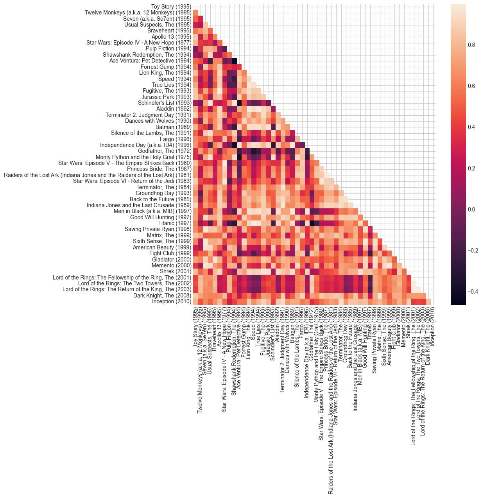

# Explore embeddings

Load and explore embeddings from different methods


Install required packages:
```
uv add pyarrow nbformat plotly
```


```python
import matplotlib.pyplot as plt
import seaborn as sns
import numpy as np
import polars as pl

plt.style.use("seaborn-v0_8-whitegrid")

import sys
from pathlib import Path

sys.path.append(str(Path().absolute().parent))

import utilities
```

Load embeddings


```python
from pathlib import Path

basepath = Path("../data/embeddings/")

movie_embeddings_dfs = {
    filepath.name.split(".")[0]: pl.read_parquet(filepath)
    for filepath in basepath.glob("**/*")
}

if 0:
    movie_embeddings_dfs = pl.concat(
        [
            pl.read_parquet(filepath).with_columns(
                name=pl.lit(filepath.name.split(".")[0])
            )
            for filepath in basepath.glob("**/*")
        ],
        how="vertical_relaxed",
    )

movie_embeddings_dfs
```


    {'word2vec_20': shape: (50, 21)
     ┌─────────┬───────────┬───────────┬───────────┬───┬───────────┬───────────┬───────────┬───────────┐
     │ movieId ┆ column_0  ┆ column_1  ┆ column_2  ┆ … ┆ column_16 ┆ column_17 ┆ column_18 ┆ column_19 │
     │ ---     ┆ ---       ┆ ---       ┆ ---       ┆   ┆ ---       ┆ ---       ┆ ---       ┆ ---       │
     │ i64     ┆ f32       ┆ f32       ┆ f32       ┆   ┆ f32       ┆ f32       ┆ f32       ┆ f32       │
     ╞═════════╪═══════════╪═══════════╪═══════════╪═══╪═══════════╪═══════════╪═══════════╪═══════════╡
     │ 1       ┆ 0.170268  ┆ 0.005285  ┆ 0.173711  ┆ … ┆ -0.195489 ┆ -0.429596 ┆ 0.263023  ┆ 0.047042  │
     │ 32      ┆ -0.508879 ┆ -0.034648 ┆ -0.601913 ┆ … ┆ -0.543937 ┆ -0.180518 ┆ -0.055841 ┆ 0.024215  │
     │ 47      ┆ -0.031499 ┆ 0.355408  ┆ -0.286842 ┆ … ┆ 0.356284  ┆ 0.213535  ┆ -0.142556 ┆ 0.032458  │
     │ 50      ┆ -0.324363 ┆ 0.060988  ┆ 0.007004  ┆ … ┆ -0.237505 ┆ 0.496448  ┆ -0.316936 ┆ 0.07419   │
     │ 110     ┆ 0.246857  ┆ -0.459349 ┆ 0.304814  ┆ … ┆ -0.408665 ┆ -0.622425 ┆ 0.272464  ┆ -0.16026  │
     │ …       ┆ …         ┆ …         ┆ …         ┆ … ┆ …         ┆ …         ┆ …         ┆ …         │
     │ 4993    ┆ -0.006215 ┆ 0.108027  ┆ -0.323896 ┆ … ┆ 0.52161   ┆ -0.08282  ┆ 0.690598  ┆ -0.103665 │
     │ 5952    ┆ -0.558613 ┆ -0.147518 ┆ 0.790067  ┆ … ┆ 0.568712  ┆ 0.614561  ┆ -0.481618 ┆ -0.443433 │
     │ 7153    ┆ 0.006625  ┆ 0.832853  ┆ -0.093344 ┆ … ┆ -0.033553 ┆ 0.367805  ┆ 0.717005  ┆ -0.464248 │
     │ 58559   ┆ -0.44002  ┆ 0.347676  ┆ -0.26734  ┆ … ┆ 0.646975  ┆ 0.42879   ┆ 0.039636  ┆ -0.365519 │
     │ 79132   ┆ 0.323736  ┆ 0.066623  ┆ 0.029123  ┆ … ┆ 0.050276  ┆ 0.12261   ┆ -0.061714 ┆ -0.458745 │
     └─────────┴───────────┴───────────┴───────────┴───┴───────────┴───────────┴───────────┴───────────┘,
     'word2vec': shape: (50, 6)
     ┌─────────┬───────────┬───────────┬───────────┬───────────┬───────────┐
     │ movieId ┆ column_0  ┆ column_1  ┆ column_2  ┆ column_3  ┆ column_4  │
     │ ---     ┆ ---       ┆ ---       ┆ ---       ┆ ---       ┆ ---       │
     │ i64     ┆ f32       ┆ f32       ┆ f32       ┆ f32       ┆ f32       │
     ╞═════════╪═══════════╪═══════════╪═══════════╪═══════════╪═══════════╡
     │ 1       ┆ 0.068795  ┆ 0.025874  ┆ 0.284137  ┆ -0.507019 ┆ 0.481121  │
     │ 32      ┆ 0.060176  ┆ -0.461341 ┆ 0.312993  ┆ 0.07501   ┆ 0.266572  │
     │ 47      ┆ 0.037277  ┆ -0.380582 ┆ 0.309627  ┆ 0.1528    ┆ -0.11481  │
     │ 50      ┆ -0.114972 ┆ -0.873773 ┆ 0.210852  ┆ 0.18071   ┆ -0.496176 │
     │ 110     ┆ -0.321313 ┆ 0.102094  ┆ -0.277805 ┆ -0.43775  ┆ 0.334661  │
     │ …       ┆ …         ┆ …         ┆ …         ┆ …         ┆ …         │
     │ 4993    ┆ 0.509145  ┆ 0.747123  ┆ 0.315635  ┆ 0.640307  ┆ -1.26944  │
     │ 5952    ┆ -0.426653 ┆ 1.205433  ┆ -1.009278 ┆ 1.044002  ┆ -0.15817  │
     │ 7153    ┆ -0.066239 ┆ 0.821045  ┆ -0.85884  ┆ -0.963343 ┆ -1.261717 │
     │ 58559   ┆ -0.105613 ┆ 0.015367  ┆ -0.467748 ┆ 0.429286  ┆ -0.762041 │
     │ 79132   ┆ -0.216232 ┆ 0.083683  ┆ -0.473124 ┆ 0.344681  ┆ -0.8463   │
     └─────────┴───────────┴───────────┴───────────┴───────────┴───────────┘,
     'tf_idf': shape: (62_423, 6)
     ┌─────────┬───────────┬───────────┬───────────┬───────────┬───────────┐
     │ movieId ┆ column_0  ┆ column_1  ┆ column_2  ┆ column_3  ┆ column_4  │
     │ ---     ┆ ---       ┆ ---       ┆ ---       ┆ ---       ┆ ---       │
     │ i64     ┆ f64       ┆ f64       ┆ f64       ┆ f64       ┆ f64       │
     ╞═════════╪═══════════╪═══════════╪═══════════╪═══════════╪═══════════╡
     │ 1       ┆ -0.293057 ┆ 0.049286  ┆ -0.015613 ┆ 0.062947  ┆ 0.01893   │
     │ 2       ┆ -0.174829 ┆ -0.175218 ┆ -0.019354 ┆ 0.079596  ┆ 0.083039  │
     │ 3       ┆ -0.331659 ┆ 0.486516  ┆ -0.002736 ┆ -0.05339  ┆ 0.64031   │
     │ 4       ┆ 0.082251  ┆ 0.526241  ┆ 0.009123  ┆ -0.099687 ┆ 0.509489  │
     │ 5       ┆ -0.507267 ┆ 0.68719   ┆ 0.005605  ┆ -0.049001 ┆ -0.204164 │
     │ …       ┆ …         ┆ …         ┆ …         ┆ …         ┆ …         │
     │ 209157  ┆ 0.766441  ┆ 0.090956  ┆ 0.021121  ┆ -0.110573 ┆ -0.130891 │
     │ 209159  ┆ -0.272379 ┆ -0.423134 ┆ 0.783925  ┆ -0.317768 ┆ -0.047578 │
     │ 209163  ┆ 0.144679  ┆ 0.648684  ┆ 0.020468  ┆ -0.111679 ┆ -0.250299 │
     │ 209169  ┆ -0.270156 ┆ -0.427931 ┆ -0.601973 ┆ -0.598266 ┆ -0.063921 │
     │ 209171  ┆ 0.154303  ┆ -0.135781 ┆ -0.036427 ┆ 0.179147  ┆ 0.016933  │
     └─────────┴───────────┴───────────┴───────────┴───────────┴───────────┘,
     'nn': shape: (50, 6)
     ┌─────────┬───────────┬───────────┬───────────┬──────────┬───────────┐
     │ movieId ┆ column_0  ┆ column_1  ┆ column_2  ┆ column_3 ┆ column_4  │
     │ ---     ┆ ---       ┆ ---       ┆ ---       ┆ ---      ┆ ---       │
     │ i64     ┆ f32       ┆ f32       ┆ f32       ┆ f32      ┆ f32       │
     ╞═════════╪═══════════╪═══════════╪═══════════╪══════════╪═══════════╡
     │ 1       ┆ -0.885328 ┆ 0.870582  ┆ -0.792143 ┆ 1.266269 ┆ 0.677347  │
     │ 32      ┆ -1.047286 ┆ 0.69256   ┆ 0.918989  ┆ 1.006697 ┆ 0.845061  │
     │ 47      ┆ -0.929454 ┆ -0.870986 ┆ -0.470708 ┆ 0.933349 ┆ 0.245565  │
     │ 50      ┆ -1.070057 ┆ -1.315013 ┆ -0.490561 ┆ 0.29235  ┆ 0.898556  │
     │ 110     ┆ -1.614677 ┆ -0.343168 ┆ 0.305123  ┆ 1.494823 ┆ -0.108502 │
     │ …       ┆ …         ┆ …         ┆ …         ┆ …        ┆ …         │
     │ 4993    ┆ -2.018685 ┆ -1.066033 ┆ 1.505956  ┆ 1.819823 ┆ 1.933123  │
     │ 5952    ┆ -2.108399 ┆ -0.893311 ┆ 1.508261  ┆ 1.956049 ┆ 1.621082  │
     │ 7153    ┆ -2.17588  ┆ -1.034511 ┆ 1.683046  ┆ 1.807697 ┆ 1.909006  │
     │ 58559   ┆ -1.166956 ┆ 0.297906  ┆ -0.431728 ┆ 0.798115 ┆ 1.201315  │
     │ 79132   ┆ -1.340377 ┆ 0.313471  ┆ -0.673191 ┆ 0.351552 ┆ 0.209364  │
     └─────────┴───────────┴───────────┴───────────┴──────────┴───────────┘}


```python
ratings_df = utilities.load_ratings()
movies_df = utilities.load_movies()
top_movie_ids = utilities.get_most_frequent_movies(ratings_df)
top_movies_df = movies_df.join(top_movie_ids, on="movieId")
labels = top_movies_df["title"].to_list()
top_movies_df
```


<div><style>
.dataframe > thead > tr,
.dataframe > tbody > tr {
  text-align: right;
  white-space: pre-wrap;
}
</style>
<small>shape: (50, 3)</small><table border="1" class="dataframe"><thead><tr><th>movieId</th><th>title</th><th>genres</th></tr><tr><td>i64</td><td>str</td><td>str</td></tr></thead><tbody><tr><td>1</td><td>&quot;Toy Story (1995)&quot;</td><td>&quot;Adventure|Animation|Children|C…</td></tr><tr><td>32</td><td>&quot;Twelve Monkeys (a.k.a. 12 Monk…</td><td>&quot;Mystery|Sci-Fi|Thriller&quot;</td></tr><tr><td>47</td><td>&quot;Seven (a.k.a. Se7en) (1995)&quot;</td><td>&quot;Mystery|Thriller&quot;</td></tr><tr><td>50</td><td>&quot;Usual Suspects, The (1995)&quot;</td><td>&quot;Crime|Mystery|Thriller&quot;</td></tr><tr><td>110</td><td>&quot;Braveheart (1995)&quot;</td><td>&quot;Action|Drama|War&quot;</td></tr><tr><td>&hellip;</td><td>&hellip;</td><td>&hellip;</td></tr><tr><td>4993</td><td>&quot;Lord of the Rings: The Fellows…</td><td>&quot;Adventure|Fantasy&quot;</td></tr><tr><td>5952</td><td>&quot;Lord of the Rings: The Two Tow…</td><td>&quot;Adventure|Fantasy&quot;</td></tr><tr><td>7153</td><td>&quot;Lord of the Rings: The Return …</td><td>&quot;Action|Adventure|Drama|Fantasy&quot;</td></tr><tr><td>58559</td><td>&quot;Dark Knight, The (2008)&quot;</td><td>&quot;Action|Crime|Drama|IMAX&quot;</td></tr><tr><td>79132</td><td>&quot;Inception (2010)&quot;</td><td>&quot;Action|Crime|Drama|Mystery|Sci…</td></tr></tbody></table></div>


### Cosine similarity

Use cosine similarity on embedding pairs to find similar titles.


```python
from sklearn.metrics.pairwise import cosine_similarity


def get_embedding_vectors(movie_embeddings_df: pl.DataFrame) -> np.array:
    # limit to top movies only
    return (
        top_movies_df["movieId", "title"]
        .join(movie_embeddings_df, on="movieId", how="left")
        .drop(["movieId", "title"])
        .to_numpy()
    )


def get_cosine_similarities(
    movie_embeddings_df: pl.DataFrame, lower_triangle: bool = True
) -> np.array:
    embedding_values = get_embedding_vectors(movie_embeddings_df)

    similarity_matrix = cosine_similarity(embedding_values)
    # limit to lower triangle only
    if lower_triangle:
        similarity_matrix[np.triu_indices(similarity_matrix.shape[0], k=0)] = np.nan

    return similarity_matrix
```

The strongest and weakest similarities:


```python
for name, movie_embeddings_df in movie_embeddings_dfs.items():
    print(name)
    similarity_matrix = get_cosine_similarities(movie_embeddings_df)
    utilities.get_extreme_similarities(
        similarity_matrix=similarity_matrix, labels=labels, top_n=10
    )
    print()
```

    word2vec_20
    Most similar:
    0.56 - Memento (2000), Fight Club (1999)
    0.51 - Indiana Jones and the Last Crusade (1989), Princess Bride, The (1987)
    0.50 - Sixth Sense, The (1999), Good Will Hunting (1997)
    0.50 - Sixth Sense, The (1999), Godfather, The (1972)
    0.47 - Aladdin (1992), Seven (a.k.a. Se7en) (1995)
    0.46 - Lord of the Rings: The Fellowship of the Ring, The (2001), Memento (2000)
    0.46 - Independence Day (a.k.a. ID4) (1996), Aladdin (1992)
    0.46 - Aladdin (1992), Speed (1994)
    0.45 - Fargo (1996), Ace Ventura: Pet Detective (1994)
    0.44 - American Beauty (1999), Usual Suspects, The (1995)
    
    Least similar:
    -0.60 - Inception (2010), Lion King, The (1994)
    -0.56 - Dark Knight, The (2008), Aladdin (1992)
    -0.55 - Indiana Jones and the Last Crusade (1989), Fargo (1996)
    -0.54 - Titanic (1997), Schindler's List (1993)
    -0.54 - Dark Knight, The (2008), Men in Black (a.k.a. MIB) (1997)
    -0.53 - Groundhog Day (1993), Shawshank Redemption, The (1994)
    -0.53 - Inception (2010), Independence Day (a.k.a. ID4) (1996)
    -0.52 - Fight Club (1999), Batman (1989)
    -0.52 - Gladiator (2000), Usual Suspects, The (1995)
    -0.52 - Godfather, The (1972), Fugitive, The (1993)
    
    word2vec
    Most similar:
    0.99 - Inception (2010), Dark Knight, The (2008)
    0.98 - Batman (1989), Dances with Wolves (1990)
    0.96 - Batman (1989), Apollo 13 (1995)
    0.96 - Aladdin (1992), Speed (1994)
    0.95 - Shrek (2001), Gladiator (2000)
    0.95 - Gladiator (2000), Good Will Hunting (1997)
    0.94 - Batman (1989), Toy Story (1995)
    0.93 - Dances with Wolves (1990), Apollo 13 (1995)
    0.93 - Fugitive, The (1993), Apollo 13 (1995)
    0.93 - Dances with Wolves (1990), Toy Story (1995)
    
    Least similar:
    -0.99 - Terminator, The (1984), Pulp Fiction (1994)
    -0.98 - Groundhog Day (1993), Shawshank Redemption, The (1994)
    -0.97 - Memento (2000), Independence Day (a.k.a. ID4) (1996)
    -0.97 - Lord of the Rings: The Return of the King, The (2003), Ace Ventura: Pet Detective (1994)
    -0.96 - Dark Knight, The (2008), Toy Story (1995)
    -0.95 - Sixth Sense, The (1999), Star Wars: Episode IV - A New Hope (1977)
    -0.94 - American Beauty (1999), Terminator 2: Judgment Day (1991)
    -0.91 - Lord of the Rings: The Two Towers, The (2002), Speed (1994)
    -0.91 - Inception (2010), Toy Story (1995)
    -0.90 - Inception (2010), True Lies (1994)
    
    tf_idf
    Most similar:
    1.00 - Matrix, The (1999), Terminator, The (1984)
    1.00 - Indiana Jones and the Last Crusade (1989), Raiders of the Lost Ark (Indiana Jones and the Raiders of the Lost Ark) (1981)
    1.00 - Star Wars: Episode VI - Return of the Jedi (1983), Star Wars: Episode V - The Empire Strikes Back (1980)
    1.00 - Star Wars: Episode VI - Return of the Jedi (1983), Star Wars: Episode IV - A New Hope (1977)
    1.00 - American Beauty (1999), Good Will Hunting (1997)
    1.00 - American Beauty (1999), Titanic (1997)
    1.00 - Star Wars: Episode V - The Empire Strikes Back (1980), Star Wars: Episode IV - A New Hope (1977)
    1.00 - Memento (2000), Seven (a.k.a. Se7en) (1995)
    1.00 - Independence Day (a.k.a. ID4) (1996), Jurassic Park (1993)
    1.00 - Titanic (1997), Good Will Hunting (1997)
    
    Least similar:
    -0.99 - Aladdin (1992), Schindler's List (1993)
    -0.99 - Schindler's List (1993), Toy Story (1995)
    -0.99 - Monty Python and the Holy Grail (1975), Schindler's List (1993)
    -0.98 - Ace Ventura: Pet Detective (1994), Apollo 13 (1995)
    -0.98 - Dances with Wolves (1990), Ace Ventura: Pet Detective (1994)
    -0.94 - Back to the Future (1985), Schindler's List (1993)
    -0.88 - Monty Python and the Holy Grail (1975), Dances with Wolves (1990)
    -0.86 - Aladdin (1992), Shawshank Redemption, The (1994)
    -0.86 - Godfather, The (1972), Aladdin (1992)
    -0.85 - Men in Black (a.k.a. MIB) (1997), Schindler's List (1993)
    
    nn
    Most similar:
    1.00 - Lord of the Rings: The Return of the King, The (2003), Lord of the Rings: The Fellowship of the Ring, The (2001)
    1.00 - Star Wars: Episode V - The Empire Strikes Back (1980), Star Wars: Episode IV - A New Hope (1977)
    1.00 - Lord of the Rings: The Return of the King, The (2003), Lord of the Rings: The Two Towers, The (2002)
    0.99 - Lord of the Rings: The Two Towers, The (2002), Lord of the Rings: The Fellowship of the Ring, The (2001)
    0.99 - Memento (2000), American Beauty (1999)
    0.99 - Titanic (1997), Speed (1994)
    0.99 - Aladdin (1992), Lion King, The (1994)
    0.99 - Raiders of the Lost Ark (Indiana Jones and the Raiders of the Lost Ark) (1981), Princess Bride, The (1987)
    0.99 - True Lies (1994), Lion King, The (1994)
    0.99 - Aladdin (1992), True Lies (1994)
    
    Least similar:
    -0.47 - Ace Ventura: Pet Detective (1994), Shawshank Redemption, The (1994)
    -0.43 - Titanic (1997), Godfather, The (1972)
    -0.38 - Schindler's List (1993), Ace Ventura: Pet Detective (1994)
    -0.38 - Monty Python and the Holy Grail (1975), Ace Ventura: Pet Detective (1994)
    -0.38 - Independence Day (a.k.a. ID4) (1996), Shawshank Redemption, The (1994)
    -0.35 - Godfather, The (1972), Speed (1994)
    -0.30 - Independence Day (a.k.a. ID4) (1996), Schindler's List (1993)
    -0.29 - Titanic (1997), Shawshank Redemption, The (1994)
    -0.26 - Monty Python and the Holy Grail (1975), Independence Day (a.k.a. ID4) (1996)
    -0.23 - Godfather, The (1972), True Lies (1994)
    


Plotting similarities for all 50x50 pairs:


```python
for name, movie_embeddings_df in movie_embeddings_dfs.items():
    print(name)
    similarity_matrix = get_cosine_similarities(movie_embeddings_df)

    utilities.plot_similarities(similarity_matrix=similarity_matrix, labels=labels)
```

    word2vec_20
    word2vec


    /Users/stantoon/Documents/VariousProjects/github/data-analysis/neural_networks/movie_lens/utilities.py:86: UserWarning: FigureCanvasAgg is non-interactive, and thus cannot be shown
      fig.show()
    /Users/stantoon/Documents/VariousProjects/github/data-analysis/neural_networks/movie_lens/utilities.py:86: UserWarning: FigureCanvasAgg is non-interactive, and thus cannot be shown
      fig.show()


    tf_idf
    nn


    /Users/stantoon/Documents/VariousProjects/github/data-analysis/neural_networks/movie_lens/utilities.py:86: UserWarning: FigureCanvasAgg is non-interactive, and thus cannot be shown
      fig.show()
    /Users/stantoon/Documents/VariousProjects/github/data-analysis/neural_networks/movie_lens/utilities.py:86: UserWarning: FigureCanvasAgg is non-interactive, and thus cannot be shown
      fig.show()


    

    


    

    


    

    


    

    


### T-SNE clusters


```python
import plotly.express as px
from sklearn.manifold import TSNE


def plot_tsne_scatter(movie_embeddings_df, name: str):
    tsne_df = top_movies_df["movieId", "title"].join(
        movie_embeddings_df, on="movieId", how="left"
    )

    embedding_vectors = tsne_df.drop(["movieId", "title"]).to_numpy()
    tsne = TSNE(n_components=2, random_state=42)
    tsne_embeddings = tsne.fit_transform(embedding_vectors)
    tsne_df = tsne_df.with_columns(
        tsne_embeddings_0=tsne_embeddings[:, 0], tsne_embeddings_1=tsne_embeddings[:, 1]
    )

    fig = px.scatter(
        tsne_df.to_pandas(),
        x="tsne_embeddings_0",
        y="tsne_embeddings_1",
        hover_data=["title"],
        height=800,
        width=1000,
        template="seaborn",
        text="title",
        title=f"Embedding TSNE - {name}",
    )
    fig.show()


# plot_tsne_scatter(movie_embeddings_dfs["word2vec"], "word2vec")
# plot_tsne_scatter(movie_embeddings_dfs["tf_idf"], "tf-idf")
plot_tsne_scatter(movie_embeddings_dfs["nn"], "nn")
```


```python
plot_tsne_scatter(movie_embeddings_dfs["word2vec_20"], "word2vec_20")
```


Hierarchical clusters


```python
import scipy.spatial.distance
import scipy.cluster


def plot_hierarchical_clusters(movie_embeddings_df, name: str):
    similarity_matrix = get_cosine_similarities(
        movie_embeddings_df, lower_triangle=False
    )
    distance_matrix = 1 - similarity_matrix

    np.fill_diagonal(distance_matrix, 0)
    dist_linkage = scipy.cluster.hierarchy.ward(
        scipy.spatial.distance.squareform(distance_matrix)
    )

    # fig, ax = plt.subplots(figsize=(10, 30), dpi=200)
    fig, ax = plt.subplots(figsize=(6, 12))
    _ = scipy.cluster.hierarchy.dendrogram(
        dist_linkage, labels=labels, ax=ax, orientation="right"
    )
    ax.set(title=name)
    fig.show()


plot_hierarchical_clusters(movie_embeddings_dfs["nn"], "nn")
```

    /var/folders/_v/nlh4h1yx2n1gd6f3szjlgxt40000gr/T/ipykernel_67250/1913525207.py:22: UserWarning:
    
    FigureCanvasAgg is non-interactive, and thus cannot be shown
    


    

    

