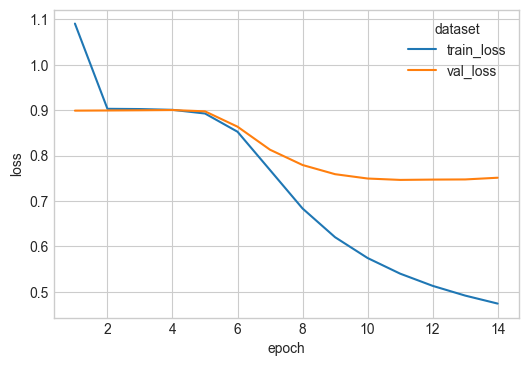
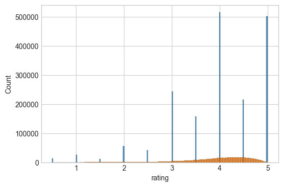
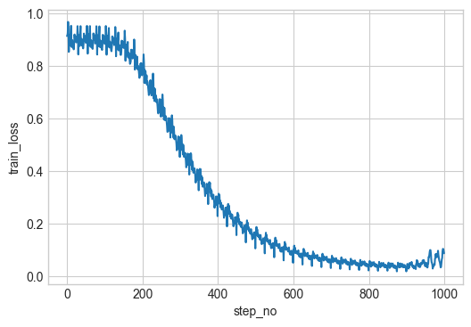
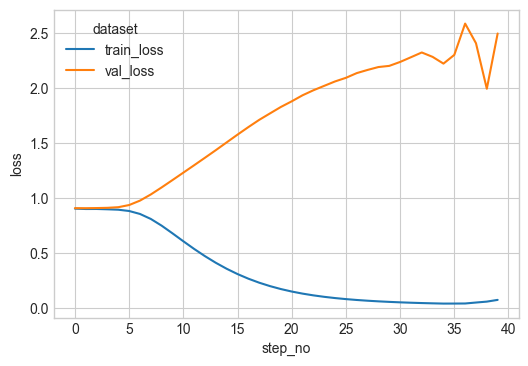
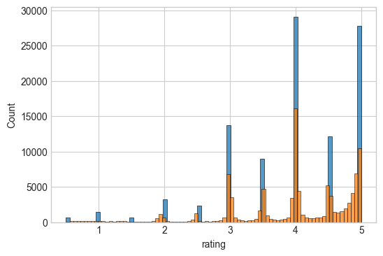

# NN matrix decomposition for movie similarities

Collaborative filter:
Movies and customer embeddings.
Predict the rates as inner product of the two embeddings.

Extend:
1. replacing the inner product with a concat and a dense NN on top to make a neural collaborative filter.


```python
import matplotlib.pyplot as plt
import seaborn as sns
import numpy as np
import polars as pl

plt.style.use("seaborn-v0_8-whitegrid")

import sys
from pathlib import Path

sys.path.append(str(Path().absolute().parent))

import utilities
```

### Loading and transforming MovieLens


```python
import utilities

ratings_df = utilities.load_ratings()
ratings_df
```


<div><style>
.dataframe > thead > tr,
.dataframe > tbody > tr {
  text-align: right;
  white-space: pre-wrap;
}
</style>
<small>shape: (25_000_095, 4)</small><table border="1" class="dataframe"><thead><tr><th>userId</th><th>movieId</th><th>rating</th><th>timestamp</th></tr><tr><td>i64</td><td>i64</td><td>f64</td><td>i64</td></tr></thead><tbody><tr><td>1</td><td>5952</td><td>4.0</td><td>1147868053</td></tr><tr><td>1</td><td>2012</td><td>2.5</td><td>1147868068</td></tr><tr><td>1</td><td>2011</td><td>2.5</td><td>1147868079</td></tr><tr><td>1</td><td>1653</td><td>4.0</td><td>1147868097</td></tr><tr><td>1</td><td>1250</td><td>4.0</td><td>1147868414</td></tr><tr><td>&hellip;</td><td>&hellip;</td><td>&hellip;</td><td>&hellip;</td></tr><tr><td>162541</td><td>1259</td><td>4.5</td><td>1240953609</td></tr><tr><td>162541</td><td>1266</td><td>5.0</td><td>1240953613</td></tr><tr><td>162541</td><td>1556</td><td>1.0</td><td>1240953650</td></tr><tr><td>162541</td><td>293</td><td>4.0</td><td>1240953789</td></tr><tr><td>162541</td><td>1201</td><td>3.0</td><td>1240953800</td></tr></tbody></table></div>


```python
ratings_df["rating"].describe()
```


<div><style>
.dataframe > thead > tr,
.dataframe > tbody > tr {
  text-align: right;
  white-space: pre-wrap;
}
</style>
<small>shape: (9, 2)</small><table border="1" class="dataframe"><thead><tr><th>statistic</th><th>value</th></tr><tr><td>str</td><td>f64</td></tr></thead><tbody><tr><td>&quot;count&quot;</td><td>2.5000095e7</td></tr><tr><td>&quot;null_count&quot;</td><td>0.0</td></tr><tr><td>&quot;mean&quot;</td><td>3.533854</td></tr><tr><td>&quot;std&quot;</td><td>1.060744</td></tr><tr><td>&quot;min&quot;</td><td>0.5</td></tr><tr><td>&quot;25%&quot;</td><td>3.0</td></tr><tr><td>&quot;50%&quot;</td><td>3.5</td></tr><tr><td>&quot;75%&quot;</td><td>4.0</td></tr><tr><td>&quot;max&quot;</td><td>5.0</td></tr></tbody></table></div>


Train on a smaller subset to make life easier for iterating.


```python
top_movie_ids = utilities.get_most_frequent_movies(ratings_df)
ratings_df = ratings_df.join(top_movie_ids, on="movieId", how="inner")
```

There are fewer MovieId than the max MovieId. So we map movieIds to a compressed set. Also userId needs to be indexed from 1.


```python
ratings_df["movieId"].max(), ratings_df["movieId"].unique().len()
```


    (79132, 50)


```python
ratings_df, user_id_mapping, movie_id_mapping = utilities.map_users_and_movies(
    ratings_df
)
ratings_df
```


<div><style>
.dataframe > thead > tr,
.dataframe > tbody > tr {
  text-align: right;
  white-space: pre-wrap;
}
</style>
<small>shape: (2_544_549, 6)</small><table border="1" class="dataframe"><thead><tr><th>userId</th><th>movieId</th><th>rating</th><th>timestamp</th><th>userIdMapped</th><th>movieIdMapped</th></tr><tr><td>i64</td><td>i64</td><td>f64</td><td>i64</td><td>u32</td><td>u32</td></tr></thead><tbody><tr><td>1</td><td>5952</td><td>4.0</td><td>1147868053</td><td>0</td><td>46</td></tr><tr><td>1</td><td>296</td><td>5.0</td><td>1147880044</td><td>0</td><td>7</td></tr><tr><td>2</td><td>5952</td><td>5.0</td><td>1141415528</td><td>1</td><td>46</td></tr><tr><td>2</td><td>150</td><td>4.0</td><td>1141415790</td><td>1</td><td>5</td></tr><tr><td>2</td><td>3578</td><td>5.0</td><td>1141415803</td><td>1</td><td>42</td></tr><tr><td>&hellip;</td><td>&hellip;</td><td>&hellip;</td><td>&hellip;</td><td>&hellip;</td><td>&hellip;</td></tr><tr><td>162541</td><td>1136</td><td>4.5</td><td>1240953505</td><td>157480</td><td>25</td></tr><tr><td>162541</td><td>296</td><td>3.5</td><td>1240953510</td><td>157480</td><td>7</td></tr><tr><td>162541</td><td>1197</td><td>4.5</td><td>1240953534</td><td>157480</td><td>27</td></tr><tr><td>162541</td><td>593</td><td>4.0</td><td>1240953576</td><td>157480</td><td>21</td></tr><tr><td>162541</td><td>47</td><td>4.5</td><td>1240953606</td><td>157480</td><td>2</td></tr></tbody></table></div>


Make into torch datasets

Make a sample dataset with about 5% of the total data for testing.


```python
from torch.utils.data import DataLoader, TensorDataset
import torch
from sklearn.model_selection import train_test_split


def create_tensor_dataset(data):
    user_ids = torch.tensor(data["userIdMapped"], dtype=torch.long)
    item_ids = torch.tensor(data["movieIdMapped"], dtype=torch.long)
    ratings = torch.tensor(data["rating"], dtype=torch.float)
    return TensorDataset(user_ids, item_ids, ratings)


train_data, _val_data = train_test_split(ratings_df, test_size=0.3, random_state=42)
val_data, test_data = train_test_split(_val_data, test_size=1 / 3, random_state=42)

dataset_train = create_tensor_dataset(train_data)
dataset_val = create_tensor_dataset(val_data)
dataset_test = create_tensor_dataset(test_data)

dataset_train_sample = create_tensor_dataset(train_data.head(int(1e5)))
dataset_val_sample = create_tensor_dataset(val_data.head(int(1e5)))
```


```python
dataloader_train = DataLoader(
    dataset_train,
    batch_size=2**12,
    shuffle=True,
)
dataloader_val = DataLoader(
    dataset_val,
    batch_size=2**12,
)
dataloader_test = DataLoader(
    dataset_test,
    batch_size=2**12,
)

dataloader_train_sample = DataLoader(
    dataset_train_sample,
    batch_size=2**12,
    shuffle=False,
)
dataloader_val_sample = DataLoader(
    dataset_val_sample,
    batch_size=2**12,
)
```

### Model definition

Fit a model to learn embeddings


```python
import torch.nn as nn
import pytorch_lightning as pyl


class MovieEmbeddingModel(pyl.LightningModule):
    def __init__(self, n_users, n_movies, embedding_dim=10):
        super().__init__()
        self.user_embedding = nn.Embedding(n_users, embedding_dim)
        self.movie_embedding = nn.Embedding(n_movies, embedding_dim)
        self.output = nn.Linear(1, 1)
        self.sigmoid = nn.Sigmoid()
        self.max_rating = 5.0
        self.min_rating = 0.5
        self.output_bias = torch.logit(
            torch.tensor((3.9 - self.min_rating) / (self.max_rating - self.min_rating))
        )
        self.output.bias.data.fill_(self.output_bias)
        self.learning_rate = 5e-3

    def forward(self, user_ids, movie_ids):
        user_embeds = self.user_embedding(user_ids)
        movie_embeds = self.movie_embedding(movie_ids)
        output = self.output((user_embeds * movie_embeds).sum(dim=1).view(-1, 1))
        rating = (
            self.sigmoid(output) * (self.max_rating - self.min_rating) + self.min_rating
        )
        return rating.flatten()

    def training_step(self, batch, batch_idx):
        user_ids, movie_ids, ratings = batch
        predictions = self(user_ids, movie_ids)
        loss = nn.MSELoss()(predictions, ratings)
        self.log("train_loss", loss, on_step=True, on_epoch=True, prog_bar=True)
        return loss

    def validation_step(self, batch, batch_idx):
        user_ids, movie_ids, ratings = batch
        predictions = self(user_ids, movie_ids)
        loss = nn.MSELoss()(predictions, ratings)
        self.log("val_loss", loss, on_step=True, on_epoch=True, prog_bar=True)

    def configure_optimizers(self):
        return torch.optim.Adam(self.parameters(), lr=self.learning_rate)
```

Check it works with a small sample


```python
n_users = ratings_df["userIdMapped"].unique().count()
n_movies = ratings_df["movieIdMapped"].unique().count()
batch = next(iter(dataloader_train_sample))
model = MovieEmbeddingModel(n_users, n_movies)
model(batch[0], batch[1])
```


    tensor([4.1883, 2.0943, 1.9674,  ..., 4.3297, 1.9700, 1.2076],
           grad_fn=<ViewBackward0>)


Custom logger to store metrics in python dictionaries


```python
from pytorch_lightning.loggers import Logger
from pytorch_lightning.utilities import rank_zero_only


class DictLogger(Logger):
    def __init__(self):
        super().__init__()
        self.metrics = {}

    @property
    def name(self):
        return "DictLogger"

    @property
    def version(self):
        return "1.0"

    @rank_zero_only
    def log_hyperparams(self, params):
        pass

    @rank_zero_only
    def log_metrics(self, metrics, step):
        for k, v in metrics.items():
            if k not in self.metrics:
                self.metrics[k] = []
            self.metrics[k].append((step, v))

    def save(self):
        pass

    @rank_zero_only
    def finalize(self, status):
        pass
```

Add early stopping and enforce a minimum of 6 epochs (it takes a few epochs to start improving over a mean baseline)


```python
from pytorch_lightning.callbacks import EarlyStopping
from pytorch_lightning.callbacks import Callback


class EarlyStoppingWithMinEpochs(Callback):
    def __init__(self, min_epochs, **kwargs):
        super().__init__()
        self.min_epochs = min_epochs
        self.early_stopping = EarlyStopping(**kwargs)

    def on_validation_end(self, trainer, pl_module):
        if trainer.current_epoch >= self.min_epochs - 1:
            self.early_stopping.on_validation_end(trainer, pl_module)

    def on_train_end(self, trainer, pl_module):
        self.early_stopping.on_train_end(trainer, pl_module)


early_stop_callback = EarlyStoppingWithMinEpochs(
    min_epochs=6, monitor="val_loss", patience=3, mode="min"
)
```

Train the model

Using an embedding size of 5.


```python
logger = DictLogger()
model = MovieEmbeddingModel(n_users, n_movies, embedding_dim=5)
trainer = pyl.Trainer(
    max_epochs=40,
    logger=logger,
    log_every_n_steps=1,
    callbacks=[early_stop_callback],
)
trainer.fit(model, dataloader_train, dataloader_val)
```

    GPU available: True (mps), used: True
    TPU available: False, using: 0 TPU cores
    HPU available: False, using: 0 HPUs
    
      | Name            | Type      | Params | Mode 
    ------------------------------------------------------
    0 | user_embedding  | Embedding | 787 K  | train
    1 | movie_embedding | Embedding | 250    | train
    2 | output          | Linear    | 2      | train
    3 | sigmoid         | Sigmoid   | 0      | train
    ------------------------------------------------------
    787 K     Trainable params
    0         Non-trainable params
    787 K     Total params
    3.151     Total estimated model params size (MB)
    4         Modules in train mode
    0         Modules in eval mode


    Sanity Checking DataLoader 0:   0%|          | 0/2 [00:00<?, ?it/s]

    /Users/stantoon/Documents/VariousProjects/github/data-analysis/.venv/lib/python3.12/site-packages/pytorch_lightning/trainer/connectors/data_connector.py:424: The 'val_dataloader' does not have many workers which may be a bottleneck. Consider increasing the value of the `num_workers` argument` to `num_workers=7` in the `DataLoader` to improve performance.


                                                                               

    /Users/stantoon/Documents/VariousProjects/github/data-analysis/.venv/lib/python3.12/site-packages/pytorch_lightning/trainer/connectors/data_connector.py:424: The 'train_dataloader' does not have many workers which may be a bottleneck. Consider increasing the value of the `num_workers` argument` to `num_workers=7` in the `DataLoader` to improve performance.


    Epoch 13: 100%|██████████| 435/435 [00:21<00:00, 20.40it/s, v_num=1.0, train_loss_step=0.470, val_loss_step=0.705, val_loss_epoch=0.751, train_loss_epoch=0.474]


Plotting train/val epoch loss

Looks like we are learning reasonably well.


```python
def training_logs_to_df(logger, name: str = None):
    df = (
        pl.concat(
            [
                pl.DataFrame(
                    logger.metrics["train_loss_epoch"],
                    orient="row",
                    schema=["batch", "train_loss"],
                ),
                pl.DataFrame(
                    logger.metrics["val_loss_epoch"],
                    orient="row",
                    schema=["batch", "val_loss"],
                ).drop("batch"),
            ],
            how="horizontal",
        )
        .with_row_index(name="epoch", offset=1)
        .unpivot(index=["epoch", "batch"], variable_name="dataset", value_name="loss")
    )
    if name:
        df = df.with_columns(pl.lit(name).alias("name"))
    return df


plot_df = training_logs_to_df(logger, name="nn_inner")


fig, ax = plt.subplots(figsize=(6, 4))
sns.lineplot(data=plot_df, x="epoch", y="loss", hue="dataset", ax=ax)
fig.show()
```

    /var/folders/_v/nlh4h1yx2n1gd6f3szjlgxt40000gr/T/ipykernel_89842/3291496198.py:19: DeprecationWarning: `DataFrame.melt` is deprecated. Use `unpivot` instead, with `index` instead of `id_vars` and `on` instead of `value_vars`
      .melt(id_vars=["epoch", "batch"], variable_name="dataset", value_name="loss")
    /var/folders/_v/nlh4h1yx2n1gd6f3szjlgxt40000gr/T/ipykernel_89842/3291496198.py:30: UserWarning: FigureCanvasAgg is non-interactive, and thus cannot be shown
      fig.show()


    

    


### Check prediction results

We will use a baseline prediction from mean ratings


```python
x = train_data

x = x.with_columns(pl.col("rating").mean().alias("baseline"))

preds = model(torch.tensor(x["userIdMapped"]), torch.tensor(x["movieIdMapped"]))
x = x.with_columns(pl.lit(preds.detach().numpy()).alias("nn"))

x
```


<div><style>
.dataframe > thead > tr,
.dataframe > tbody > tr {
  text-align: right;
  white-space: pre-wrap;
}
</style>
<small>shape: (1_781_184, 8)</small><table border="1" class="dataframe"><thead><tr><th>userId</th><th>movieId</th><th>rating</th><th>timestamp</th><th>userIdMapped</th><th>movieIdMapped</th><th>baseline</th><th>nn</th></tr><tr><td>i64</td><td>i64</td><td>f64</td><td>i64</td><td>u32</td><td>u32</td><td>f64</td><td>f32</td></tr></thead><tbody><tr><td>5150</td><td>79132</td><td>2.5</td><td>1459431773</td><td>5008</td><td>49</td><td>3.979833</td><td>3.03994</td></tr><tr><td>79646</td><td>150</td><td>3.5</td><td>1554224374</td><td>77175</td><td>5</td><td>3.979833</td><td>3.884991</td></tr><tr><td>63956</td><td>318</td><td>4.0</td><td>948005318</td><td>61981</td><td>8</td><td>3.979833</td><td>4.502549</td></tr><tr><td>66248</td><td>1291</td><td>4.5</td><td>1189775094</td><td>64204</td><td>33</td><td>3.979833</td><td>3.952633</td></tr><tr><td>57849</td><td>527</td><td>4.5</td><td>1322993994</td><td>56060</td><td>16</td><td>3.979833</td><td>3.968396</td></tr><tr><td>&hellip;</td><td>&hellip;</td><td>&hellip;</td><td>&hellip;</td><td>&hellip;</td><td>&hellip;</td><td>&hellip;</td><td>&hellip;</td></tr><tr><td>7160</td><td>780</td><td>3.0</td><td>848676694</td><td>6942</td><td>23</td><td>3.979833</td><td>2.745047</td></tr><tr><td>108304</td><td>527</td><td>4.0</td><td>1419181402</td><td>104945</td><td>16</td><td>3.979833</td><td>3.78171</td></tr><tr><td>150532</td><td>380</td><td>3.5</td><td>1181551976</td><td>145835</td><td>13</td><td>3.979833</td><td>2.853964</td></tr><tr><td>142477</td><td>260</td><td>5.0</td><td>832244201</td><td>138046</td><td>6</td><td>3.979833</td><td>4.598742</td></tr><tr><td>141844</td><td>1136</td><td>4.5</td><td>1111183788</td><td>137436</td><td>25</td><td>3.979833</td><td>4.415227</td></tr></tbody></table></div>


We are beating the mean baseline in the training dataset


```python
print(
    "baseline loss: ",
    nn.MSELoss()(torch.tensor(x["baseline"]), torch.tensor(x["rating"])),
)
print("NN loss: ", nn.MSELoss()(torch.tensor(x["nn"]), torch.tensor(x["rating"])))
```

    baseline loss:  tensor(0.9037)
    NN loss:  tensor(0.4451)


The histogram of predictions looks reasonable


```python
fig, ax = plt.subplots(figsize=(6, 4))
sns.histplot(x, x="rating", ax=ax)
sns.histplot(x, x="nn", ax=ax)
fig.show()
```

    /var/folders/_v/nlh4h1yx2n1gd6f3szjlgxt40000gr/T/ipykernel_89842/3248393641.py:4: UserWarning: FigureCanvasAgg is non-interactive, and thus cannot be shown
      fig.show()


    

    


### Get embeddings

Get movie embeddings from the model layers and store for later use.


```python
from pathlib import Path

movie_embeddings_df = ratings_df["movieId", "movieIdMapped"].unique().sort("movieId")
# movie_embeddings_df.with_columns(pl.col('movieIdMapped').map_elements(lambda x: model.movie_embedding(torch.tensor(x)).detach().numpy(),return_dtype=pl.List(pl.Float32)))
movie_embeddings_df = pl.concat(
    [movie_embeddings_df, pl.DataFrame(model.movie_embedding.weight.detach().numpy())],
    how="horizontal",
).drop("movieIdMapped")
display(movie_embeddings_df)

Path("../data/embeddings").mkdir(parents=True, exist_ok=True)
movie_embeddings_df.write_parquet("../data/embeddings/nn.parquet")
```


<div><style>
.dataframe > thead > tr,
.dataframe > tbody > tr {
  text-align: right;
  white-space: pre-wrap;
}
</style>
<small>shape: (50, 6)</small><table border="1" class="dataframe"><thead><tr><th>movieId</th><th>column_0</th><th>column_1</th><th>column_2</th><th>column_3</th><th>column_4</th></tr><tr><td>i64</td><td>f32</td><td>f32</td><td>f32</td><td>f32</td><td>f32</td></tr></thead><tbody><tr><td>1</td><td>-1.272084</td><td>-0.994629</td><td>-0.220356</td><td>-0.189384</td><td>-0.986966</td></tr><tr><td>32</td><td>-0.862826</td><td>0.03853</td><td>1.001704</td><td>-0.68009</td><td>-0.601631</td></tr><tr><td>47</td><td>-0.673808</td><td>-0.653811</td><td>0.591152</td><td>-1.096568</td><td>-0.157232</td></tr><tr><td>50</td><td>-0.260233</td><td>-0.903206</td><td>0.558693</td><td>-1.380012</td><td>0.428046</td></tr><tr><td>110</td><td>-1.426404</td><td>-0.878591</td><td>0.510824</td><td>-0.494181</td><td>-0.277539</td></tr><tr><td>&hellip;</td><td>&hellip;</td><td>&hellip;</td><td>&hellip;</td><td>&hellip;</td><td>&hellip;</td></tr><tr><td>4993</td><td>-0.832353</td><td>-1.856606</td><td>-2.038899</td><td>-0.467682</td><td>-0.561474</td></tr><tr><td>5952</td><td>-0.823814</td><td>-2.014611</td><td>-2.101298</td><td>-0.460424</td><td>-0.619018</td></tr><tr><td>7153</td><td>-0.907353</td><td>-1.942751</td><td>-2.122972</td><td>-0.368461</td><td>-0.459154</td></tr><tr><td>58559</td><td>-0.965575</td><td>-1.059276</td><td>-0.666</td><td>-1.117283</td><td>0.297687</td></tr><tr><td>79132</td><td>-0.297712</td><td>-1.08736</td><td>0.486506</td><td>-0.908394</td><td>0.170847</td></tr></tbody></table></div>


# Appendix


```python
raise NotImplementedError
```


    ---------------------------------------------------------------------------

    NotImplementedError                       Traceback (most recent call last)

    Cell In[26], line 1
    ----> 1 raise NotImplementedError


    NotImplementedError: 


### Pick batch size

Change batch size, test time for iteration, calculate time for epoch


```python
import timeit

batch_sizes = [2**i for i in range(8, 17)]
batch_training_time = []
trainer = pyl.Trainer(
    max_epochs=1,
    logger=logger,
    log_every_n_steps=1,
    enable_progress_bar=False,
    enable_model_summary=False,
)
for batch_size in batch_sizes:
    print(f"Training with batch size {batch_size}")
    dataloader_train_sample = DataLoader(
        dataset_train_sample,
        batch_size=batch_size,
        shuffle=False,
        num_workers=4,
    )
    dataloader_val_sample = DataLoader(
        dataset_val_sample, batch_size=batch_size, num_workers=4
    )

    logger = DictLogger()
    t1 = timeit.default_timer()
    trainer.fit(model, dataloader_train_sample, dataloader_val_sample)
    t2 = timeit.default_timer()
    batch_training_time.append((batch_size, t2 - t1))


for a in batch_training_time:
    print(a)
```

    GPU available: True (mps), used: True
    TPU available: False, using: 0 TPU cores
    HPU available: False, using: 0 HPUs


    Training with batch size 256


    /Users/stantoon/Documents/VariousProjects/github/data-analysis/.venv/lib/python3.12/site-packages/pytorch_lightning/callbacks/model_checkpoint.py:654: Checkpoint directory /Users/stantoon/Documents/VariousProjects/github/data-analysis/neural_networks/unfinished-movie_similarity/DictLogger/1.0/checkpoints exists and is not empty.
    /Users/stantoon/Documents/VariousProjects/github/data-analysis/.venv/lib/python3.12/site-packages/pytorch_lightning/trainer/connectors/data_connector.py:419: Consider setting `persistent_workers=True` in 'val_dataloader' to speed up the dataloader worker initialization.
    /Users/stantoon/Documents/VariousProjects/github/data-analysis/.venv/lib/python3.12/site-packages/pytorch_lightning/trainer/connectors/data_connector.py:419: Consider setting `persistent_workers=True` in 'train_dataloader' to speed up the dataloader worker initialization.
    `Trainer.fit` stopped: `max_epochs=1` reached.


    Training with batch size 512


    `Trainer.fit` stopped: `max_epochs=1` reached.


    Training with batch size 1024


    `Trainer.fit` stopped: `max_epochs=1` reached.


    Training with batch size 2048


    `Trainer.fit` stopped: `max_epochs=1` reached.


    Training with batch size 4096


    `Trainer.fit` stopped: `max_epochs=1` reached.


    Training with batch size 8192


    `Trainer.fit` stopped: `max_epochs=1` reached.


    Training with batch size 16384


    `Trainer.fit` stopped: `max_epochs=1` reached.


    Training with batch size 32768


    `Trainer.fit` stopped: `max_epochs=1` reached.


    Training with batch size 65536


    `Trainer.fit` stopped: `max_epochs=1` reached.


    (256, 11.856541125103831)
    (512, 4.736162832938135)
    (1024, 3.898271417012438)
    (2048, 3.8875532089732587)
    (4096, 5.152088291943073)
    (8192, 4.3516676251310855)
    (16384, 5.048533875029534)
    (32768, 4.2527649169787765)
    (65536, 5.126805416774005)


### Num workers


```python
import timeit

num_workers_range = range(0, 8)
num_workers_training_time = []
trainer = pyl.Trainer(
    max_epochs=1,
    logger=logger,
    log_every_n_steps=1,
    enable_progress_bar=False,
    enable_model_summary=False,
)
for num_workers in num_workers_range:
    print(f"Training with num_workers {num_workers}")
    dataloader_train_sample = DataLoader(
        dataset_train_sample,
        batch_size=2**12,
        shuffle=False,
        num_workers=num_workers,
    )
    dataloader_val_sample = DataLoader(
        dataset_val_sample, batch_size=2**12, num_workers=num_workers
    )

    logger = DictLogger()
    t1 = timeit.default_timer()
    trainer.fit(model, dataloader_train_sample, dataloader_val_sample)
    t2 = timeit.default_timer()
    num_workers_training_time.append((num_workers, t2 - t1))


for a in num_workers_training_time:
    print(a)
```

    GPU available: True (mps), used: True
    TPU available: False, using: 0 TPU cores
    HPU available: False, using: 0 HPUs


    Training with num_workers 0


    `Trainer.fit` stopped: `max_epochs=1` reached.


    Training with num_workers 1


    `Trainer.fit` stopped: `max_epochs=1` reached.


    Training with num_workers 2


    `Trainer.fit` stopped: `max_epochs=1` reached.


    Training with num_workers 3


    `Trainer.fit` stopped: `max_epochs=1` reached.


    Training with num_workers 4


    `Trainer.fit` stopped: `max_epochs=1` reached.


    Training with num_workers 5


    `Trainer.fit` stopped: `max_epochs=1` reached.


    Training with num_workers 6


    `Trainer.fit` stopped: `max_epochs=1` reached.


    Training with num_workers 7


    `Trainer.fit` stopped: `max_epochs=1` reached.


    (0, 3.0349692499730736)
    (1, 3.4903268748894334)
    (2, 4.375782374991104)
    (3, 4.357490375172347)
    (4, 5.5021544171031564)
    (5, 4.955234291963279)
    (6, 7.25182820786722)
    (7, 9.90799583401531)


### Test training on a sample


```python
n_users = ratings_df["userIdMapped"].unique().count()
n_movies = ratings_df["movieIdMapped"].unique().count()
logger_sample = DictLogger()
model_sample = MovieEmbeddingModel(n_users, n_movies, embedding_dim=5)
trainer = pyl.Trainer(max_epochs=40, logger=logger_sample, log_every_n_steps=1)
trainer.fit(model_sample, dataloader_train_sample, dataloader_val_sample)
```

    GPU available: True (mps), used: True
    TPU available: False, using: 0 TPU cores
    HPU available: False, using: 0 HPUs
    /Users/stantoon/Documents/VariousProjects/github/data-analysis/.venv/lib/python3.12/site-packages/pytorch_lightning/callbacks/model_checkpoint.py:654: Checkpoint directory /Users/stantoon/Documents/VariousProjects/github/data-analysis/neural_networks/unfinished-movie_similarity/DictLogger/1.0/checkpoints exists and is not empty.
    
      | Name            | Type      | Params | Mode 
    ------------------------------------------------------
    0 | user_embedding  | Embedding | 787 K  | train
    1 | movie_embedding | Embedding | 250    | train
    2 | output          | Linear    | 2      | train
    3 | sigmoid         | Sigmoid   | 0      | train
    ------------------------------------------------------
    787 K     Trainable params
    0         Non-trainable params
    787 K     Total params
    3.151     Total estimated model params size (MB)
    4         Modules in train mode
    0         Modules in eval mode


    Sanity Checking: |          | 0/? [00:00<?, ?it/s]

    /Users/stantoon/Documents/VariousProjects/github/data-analysis/.venv/lib/python3.12/site-packages/pytorch_lightning/trainer/connectors/data_connector.py:424: The 'val_dataloader' does not have many workers which may be a bottleneck. Consider increasing the value of the `num_workers` argument` to `num_workers=7` in the `DataLoader` to improve performance.


                                                                               

    /Users/stantoon/Documents/VariousProjects/github/data-analysis/.venv/lib/python3.12/site-packages/pytorch_lightning/trainer/connectors/data_connector.py:424: The 'train_dataloader' does not have many workers which may be a bottleneck. Consider increasing the value of the `num_workers` argument` to `num_workers=7` in the `DataLoader` to improve performance.


    Epoch 39: 100%|██████████| 25/25 [00:02<00:00, 10.77it/s, v_num=1.0, train_loss_step=0.0389, val_loss_step=2.320, val_loss_epoch=2.210, train_loss_epoch=0.0748]

    `Trainer.fit` stopped: `max_epochs=40` reached.


    Epoch 39: 100%|██████████| 25/25 [00:02<00:00, 10.67it/s, v_num=1.0, train_loss_step=0.0389, val_loss_step=2.320, val_loss_epoch=2.210, train_loss_epoch=0.0748]


### Training loss

We need a few epochs until the model starts to converge to somewhere useful.


```python
plot_df = pl.DataFrame(
    logger_sample.metrics["train_loss_step"],
    orient="row",
    schema=["batch", "train_loss"],
).with_row_index(name="step_no")

fig, ax = plt.subplots(figsize=(6, 4))
sns.lineplot(data=plot_df, x="step_no", y="train_loss", ax=ax)
fig.show()
```

    /var/folders/_v/nlh4h1yx2n1gd6f3szjlgxt40000gr/T/ipykernel_8116/3972096283.py:23: UserWarning: FigureCanvasAgg is non-interactive, and thus cannot be shown
      fig.show()


    

    


Train/val epoch loss

We are able to overfit. Need:
1. use the larger dataset - **this works**
2. some regulariation
3. expand the embedding size


```python
plot_df = (
    pl.concat(
        [
            pl.DataFrame(
                logger_sample.metrics["train_loss_epoch"],
                orient="row",
                schema=["batch", "train_loss"],
            ),
            pl.DataFrame(
                logger_sample.metrics["val_loss_epoch"],
                orient="row",
                schema=["batch", "val_loss"],
            ).drop("batch"),
        ],
        how="horizontal",
    )
    .with_row_index(name="step_no")
    .melt(id_vars=["step_no", "batch"], variable_name="dataset", value_name="loss")
)


fig, ax = plt.subplots(figsize=(6, 4))
sns.lineplot(data=plot_df, x="step_no", y="loss", hue="dataset", ax=ax)
fig.show()
```

    /var/folders/_v/nlh4h1yx2n1gd6f3szjlgxt40000gr/T/ipykernel_8116/45602504.py:21: DeprecationWarning: `DataFrame.melt` is deprecated. Use `unpivot` instead, with `index` instead of `id_vars` and `on` instead of `value_vars`
      .melt(id_vars=["step_no", "batch"], variable_name="dataset", value_name="loss")
    /var/folders/_v/nlh4h1yx2n1gd6f3szjlgxt40000gr/T/ipykernel_8116/45602504.py:27: UserWarning: FigureCanvasAgg is non-interactive, and thus cannot be shown
      fig.show()


    

    


### Check prediction results


```python
preds, ratings = [], []
for idx, batch in enumerate(dataloader_train_sample):
    _user_ids, _movie_ids, _ratings = batch
    _pred = model(_user_ids, _movie_ids)
    preds.append(_pred.detach().numpy())
    ratings.append(_ratings.detach().numpy())

preds = np.concatenate(preds)
ratings = np.concatenate(ratings)
```

Baseline prediction from mean rating


```python
x = train_data.head(int(1e5))
x = x.with_columns(pl.col("rating").mean().alias("baseline"), pl.lit(preds).alias("nn"))
x
```


<div><style>
.dataframe > thead > tr,
.dataframe > tbody > tr {
  text-align: right;
  white-space: pre-wrap;
}
</style>
<small>shape: (100_000, 8)</small><table border="1" class="dataframe"><thead><tr><th>userId</th><th>movieId</th><th>rating</th><th>timestamp</th><th>userIdMapped</th><th>movieIdMapped</th><th>baseline</th><th>nn</th></tr><tr><td>i64</td><td>i64</td><td>f64</td><td>i64</td><td>u32</td><td>u32</td><td>f64</td><td>f32</td></tr></thead><tbody><tr><td>67708</td><td>2959</td><td>5.0</td><td>972622556</td><td>65623</td><td>41</td><td>3.977185</td><td>4.873698</td></tr><tr><td>91505</td><td>1198</td><td>5.0</td><td>949716859</td><td>88679</td><td>28</td><td>3.977185</td><td>4.848859</td></tr><tr><td>43849</td><td>1136</td><td>5.0</td><td>881632083</td><td>42520</td><td>25</td><td>3.977185</td><td>4.921653</td></tr><tr><td>34745</td><td>344</td><td>4.0</td><td>1134517613</td><td>33693</td><td>9</td><td>3.977185</td><td>3.932611</td></tr><tr><td>77573</td><td>364</td><td>4.0</td><td>1009228452</td><td>75160</td><td>11</td><td>3.977185</td><td>3.934654</td></tr><tr><td>&hellip;</td><td>&hellip;</td><td>&hellip;</td><td>&hellip;</td><td>&hellip;</td><td>&hellip;</td><td>&hellip;</td><td>&hellip;</td></tr><tr><td>109740</td><td>1196</td><td>3.0</td><td>1536930155</td><td>106339</td><td>26</td><td>3.977185</td><td>3.00328</td></tr><tr><td>136800</td><td>58559</td><td>4.0</td><td>1395708644</td><td>132548</td><td>48</td><td>3.977185</td><td>3.981432</td></tr><tr><td>139513</td><td>1265</td><td>4.0</td><td>1223914026</td><td>135162</td><td>31</td><td>3.977185</td><td>4.010388</td></tr><tr><td>150358</td><td>2571</td><td>5.0</td><td>1111545247</td><td>145669</td><td>38</td><td>3.977185</td><td>4.742016</td></tr><tr><td>35322</td><td>2571</td><td>5.0</td><td>978466679</td><td>34254</td><td>38</td><td>3.977185</td><td>4.771548</td></tr></tbody></table></div>


MSE looks good on training set


```python
(
    nn.MSELoss()(torch.tensor(x["baseline"]), torch.tensor(x["rating"])),
    nn.MSELoss()(torch.tensor(x["nn"]), torch.tensor(x["rating"])),
)
```


    (tensor(0.8981), tensor(0.0711))


```python
fig, ax = plt.subplots(figsize=(6, 4))
sns.histplot(x, x="rating", ax=ax)
sns.histplot(x, x="nn", ax=ax)
fig.show()
```


    <Axes: xlabel='rating', ylabel='Count'>


    

    

