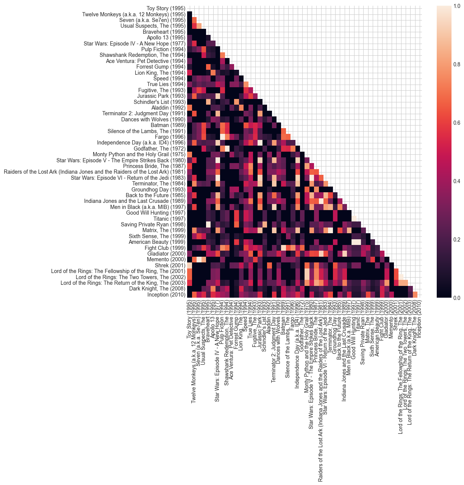
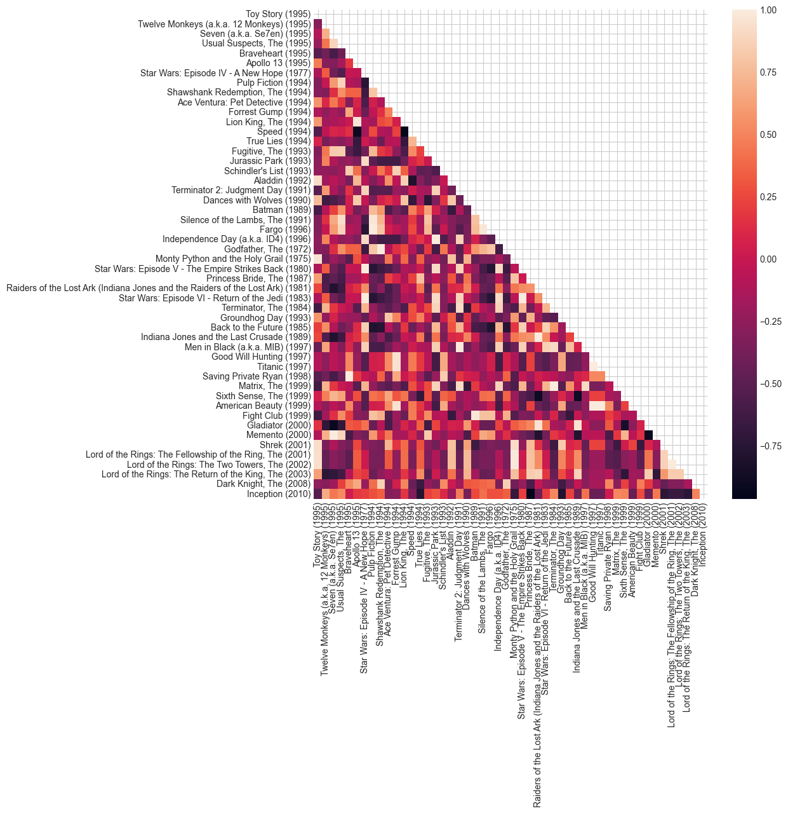

# TF-IDF for movie similarities

How can we apply TF-IDF to find similarities between movies?


```python
import matplotlib.pyplot as plt
import seaborn as sns
import numpy as np
import polars as pl

plt.style.use("seaborn-v0_8-whitegrid")
```

### TF IDF (Term Frequency-Inverse Document Frequency)

This gives each document a weight for each member in a vocab.
The vocab represents all words across all documents (the corpus).

The weights represent the frequent of the word in the document relative to the frequency of that word in the corpus.
Common words like 'is' get a low weighting as they are common in the corpus.
The weights are higher for uncommon words.

$$
\mathrm {tf} (t,d)={\frac {f_{t,d}}{\sum _{t'\in d}{f_{t',d}}}},
$$

where $f_{t,d}$ is the count of token $t$ in document $d$ and $\sum _{t'\in d}{f_{t',d}}$ is the count of all tokens in the document.

$$
\mathrm {idf} (t,D)=\log {\frac {N}{|\{d\in D:t\in d\}|}},
$$

where $N$ is the count of documents $D$ and $|\{d\in D:t\in d\}|$ is count of documents where the term $t$ appears.

The final TF-IDF is the product of the two:

$$
\mathrm {tfidf} (t,d,D)=\mathrm {tf} (t,d)\cdot \mathrm {idf} (t,D)
$$

We make a trivial example below. We have a vocabulary of 4 tokens and we inflate the token `a1` to make it common.
In the TF-IDF vectors we see that the `a1` values are lower than `b2` and `c3` as `a1` is commonly represented in the corpus.
*Note: the `TfidfVectorizer` normalises values by default.*


```python
from sklearn.feature_extraction.text import TfidfVectorizer

documents = [
    "a1 b2 c3",
    "b2 c3",
    "c3 b2 a1",  # order is not relevant
    "d4",
]
documents.extend(["a1"] * 100)  # artificially make a1 very common

vectorizer = TfidfVectorizer(norm=None)
tfidf_matrix = vectorizer.fit_transform(documents)

print("TF-IDF Matrix (dense representation) (documents x vocab size):")
df = pl.DataFrame(tfidf_matrix.toarray())
df.columns = vectorizer.get_feature_names_out()
display(df)
```

    TF-IDF Matrix (dense representation) (documents x vocab size):


<div><style>
.dataframe > thead > tr,
.dataframe > tbody > tr {
  text-align: right;
  white-space: pre-wrap;
}
</style>
<small>shape: (104, 4)</small><table border="1" class="dataframe"><thead><tr><th>a1</th><th>b2</th><th>c3</th><th>d4</th></tr><tr><td>f64</td><td>f64</td><td>f64</td><td>f64</td></tr></thead><tbody><tr><td>1.019231</td><td>4.267666</td><td>4.267666</td><td>0.0</td></tr><tr><td>0.0</td><td>4.267666</td><td>4.267666</td><td>0.0</td></tr><tr><td>1.019231</td><td>4.267666</td><td>4.267666</td><td>0.0</td></tr><tr><td>0.0</td><td>0.0</td><td>0.0</td><td>4.960813</td></tr><tr><td>1.019231</td><td>0.0</td><td>0.0</td><td>0.0</td></tr><tr><td>&hellip;</td><td>&hellip;</td><td>&hellip;</td><td>&hellip;</td></tr><tr><td>1.019231</td><td>0.0</td><td>0.0</td><td>0.0</td></tr><tr><td>1.019231</td><td>0.0</td><td>0.0</td><td>0.0</td></tr><tr><td>1.019231</td><td>0.0</td><td>0.0</td><td>0.0</td></tr><tr><td>1.019231</td><td>0.0</td><td>0.0</td><td>0.0</td></tr><tr><td>1.019231</td><td>0.0</td><td>0.0</td><td>0.0</td></tr></tbody></table></div>


### Applying to MovieLens

We will apply the idea of TF-IDF to find similarities across movies, taken from the MovieLens dataset.
In the dataset each movie is associated with a list of genres.
Multiple genres are listed for each movie in the dataset.
Find similarity across movies by comparing their genres.
Movies with the same genre list are more meaningfully related if those genre lists are rare.
Movies with the same genre list that are common are not necessarily related closely.

Movie genres are given as follows:


```python
import utilities

movies_df = utilities.load_movies()
movies_df
```


<div><style>
.dataframe > thead > tr,
.dataframe > tbody > tr {
  text-align: right;
  white-space: pre-wrap;
}
</style>
<small>shape: (62_423, 3)</small><table border="1" class="dataframe"><thead><tr><th>movieId</th><th>title</th><th>genres</th></tr><tr><td>i64</td><td>str</td><td>str</td></tr></thead><tbody><tr><td>1</td><td>&quot;Toy Story (1995)&quot;</td><td>&quot;Adventure|Animation|Children|C…</td></tr><tr><td>2</td><td>&quot;Jumanji (1995)&quot;</td><td>&quot;Adventure|Children|Fantasy&quot;</td></tr><tr><td>3</td><td>&quot;Grumpier Old Men (1995)&quot;</td><td>&quot;Comedy|Romance&quot;</td></tr><tr><td>4</td><td>&quot;Waiting to Exhale (1995)&quot;</td><td>&quot;Comedy|Drama|Romance&quot;</td></tr><tr><td>5</td><td>&quot;Father of the Bride Part II (1…</td><td>&quot;Comedy&quot;</td></tr><tr><td>&hellip;</td><td>&hellip;</td><td>&hellip;</td></tr><tr><td>209157</td><td>&quot;We (2018)&quot;</td><td>&quot;Drama&quot;</td></tr><tr><td>209159</td><td>&quot;Window of the Soul (2001)&quot;</td><td>&quot;Documentary&quot;</td></tr><tr><td>209163</td><td>&quot;Bad Poems (2018)&quot;</td><td>&quot;Comedy|Drama&quot;</td></tr><tr><td>209169</td><td>&quot;A Girl Thing (2001)&quot;</td><td>&quot;(no genres listed)&quot;</td></tr><tr><td>209171</td><td>&quot;Women of Devil&#x27;s Island (1962)&quot;</td><td>&quot;Action|Adventure|Drama&quot;</td></tr></tbody></table></div>


Fit vectorizer to get TF-IDF values across the 24 genres.


```python
vectorizer = TfidfVectorizer()
vectorizer.fit(movies_df["genres"])

print("Vocab")
print(vectorizer.vocabulary_)
```

    Vocab
    {'adventure': 1, 'animation': 2, 'children': 3, 'comedy': 4, 'fantasy': 8, 'romance': 19, 'drama': 7, 'action': 0, 'crime': 5, 'thriller': 21, 'horror': 12, 'mystery': 16, 'sci': 20, 'fi': 9, 'imax': 13, 'documentary': 6, 'war': 22, 'musical': 15, 'western': 23, 'film': 10, 'noir': 18, 'no': 17, 'genres': 11, 'listed': 14}


We will limit our analysis to the top 50 movies to make things faster and easier.


```python
import utilities

ratings_df = utilities.load_ratings()
top_movie_ids = utilities.get_most_frequent_movies(ratings_df)
top_movies_df = movies_df.join(top_movie_ids, on="movieId", how="inner")
```

We get the TF-IDF vectors for each of those movies.


```python
tfidf_matrix = vectorizer.transform(top_movies_df["genres"])
tf_idf = pl.DataFrame(tfidf_matrix.toarray())
tf_idf.columns = vectorizer.get_feature_names_out()
display(tf_idf)
```


<div><style>
.dataframe > thead > tr,
.dataframe > tbody > tr {
  text-align: right;
  white-space: pre-wrap;
}
</style>
<small>shape: (50, 24)</small><table border="1" class="dataframe"><thead><tr><th>action</th><th>adventure</th><th>animation</th><th>children</th><th>comedy</th><th>crime</th><th>documentary</th><th>drama</th><th>fantasy</th><th>fi</th><th>film</th><th>genres</th><th>horror</th><th>imax</th><th>listed</th><th>musical</th><th>mystery</th><th>no</th><th>noir</th><th>romance</th><th>sci</th><th>thriller</th><th>war</th><th>western</th></tr><tr><td>f64</td><td>f64</td><td>f64</td><td>f64</td><td>f64</td><td>f64</td><td>f64</td><td>f64</td><td>f64</td><td>f64</td><td>f64</td><td>f64</td><td>f64</td><td>f64</td><td>f64</td><td>f64</td><td>f64</td><td>f64</td><td>f64</td><td>f64</td><td>f64</td><td>f64</td><td>f64</td><td>f64</td></tr></thead><tbody><tr><td>0.0</td><td>0.446566</td><td>0.48833</td><td>0.488084</td><td>0.277717</td><td>0.0</td><td>0.0</td><td>0.0</td><td>0.496748</td><td>0.0</td><td>0.0</td><td>0.0</td><td>0.0</td><td>0.0</td><td>0.0</td><td>0.0</td><td>0.0</td><td>0.0</td><td>0.0</td><td>0.0</td><td>0.0</td><td>0.0</td><td>0.0</td><td>0.0</td></tr><tr><td>0.0</td><td>0.0</td><td>0.0</td><td>0.0</td><td>0.0</td><td>0.0</td><td>0.0</td><td>0.0</td><td>0.0</td><td>0.519453</td><td>0.0</td><td>0.0</td><td>0.0</td><td>0.0</td><td>0.0</td><td>0.0</td><td>0.547243</td><td>0.0</td><td>0.0</td><td>0.0</td><td>0.519453</td><td>0.401075</td><td>0.0</td><td>0.0</td></tr><tr><td>0.0</td><td>0.0</td><td>0.0</td><td>0.0</td><td>0.0</td><td>0.0</td><td>0.0</td><td>0.0</td><td>0.0</td><td>0.0</td><td>0.0</td><td>0.0</td><td>0.0</td><td>0.0</td><td>0.0</td><td>0.0</td><td>0.806571</td><td>0.0</td><td>0.0</td><td>0.0</td><td>0.0</td><td>0.591137</td><td>0.0</td><td>0.0</td></tr><tr><td>0.0</td><td>0.0</td><td>0.0</td><td>0.0</td><td>0.0</td><td>0.566703</td><td>0.0</td><td>0.0</td><td>0.0</td><td>0.0</td><td>0.0</td><td>0.0</td><td>0.0</td><td>0.0</td><td>0.0</td><td>0.0</td><td>0.664551</td><td>0.0</td><td>0.0</td><td>0.0</td><td>0.0</td><td>0.487051</td><td>0.0</td><td>0.0</td></tr><tr><td>0.54055</td><td>0.0</td><td>0.0</td><td>0.0</td><td>0.0</td><td>0.0</td><td>0.0</td><td>0.325614</td><td>0.0</td><td>0.0</td><td>0.0</td><td>0.0</td><td>0.0</td><td>0.0</td><td>0.0</td><td>0.0</td><td>0.0</td><td>0.0</td><td>0.0</td><td>0.0</td><td>0.0</td><td>0.0</td><td>0.775745</td><td>0.0</td></tr><tr><td>&hellip;</td><td>&hellip;</td><td>&hellip;</td><td>&hellip;</td><td>&hellip;</td><td>&hellip;</td><td>&hellip;</td><td>&hellip;</td><td>&hellip;</td><td>&hellip;</td><td>&hellip;</td><td>&hellip;</td><td>&hellip;</td><td>&hellip;</td><td>&hellip;</td><td>&hellip;</td><td>&hellip;</td><td>&hellip;</td><td>&hellip;</td><td>&hellip;</td><td>&hellip;</td><td>&hellip;</td><td>&hellip;</td><td>&hellip;</td></tr><tr><td>0.0</td><td>0.668545</td><td>0.0</td><td>0.0</td><td>0.0</td><td>0.0</td><td>0.0</td><td>0.0</td><td>0.743672</td><td>0.0</td><td>0.0</td><td>0.0</td><td>0.0</td><td>0.0</td><td>0.0</td><td>0.0</td><td>0.0</td><td>0.0</td><td>0.0</td><td>0.0</td><td>0.0</td><td>0.0</td><td>0.0</td><td>0.0</td></tr><tr><td>0.0</td><td>0.668545</td><td>0.0</td><td>0.0</td><td>0.0</td><td>0.0</td><td>0.0</td><td>0.0</td><td>0.743672</td><td>0.0</td><td>0.0</td><td>0.0</td><td>0.0</td><td>0.0</td><td>0.0</td><td>0.0</td><td>0.0</td><td>0.0</td><td>0.0</td><td>0.0</td><td>0.0</td><td>0.0</td><td>0.0</td><td>0.0</td></tr><tr><td>0.471902</td><td>0.557946</td><td>0.0</td><td>0.0</td><td>0.0</td><td>0.0</td><td>0.0</td><td>0.284261</td><td>0.620645</td><td>0.0</td><td>0.0</td><td>0.0</td><td>0.0</td><td>0.0</td><td>0.0</td><td>0.0</td><td>0.0</td><td>0.0</td><td>0.0</td><td>0.0</td><td>0.0</td><td>0.0</td><td>0.0</td><td>0.0</td></tr><tr><td>0.37214</td><td>0.0</td><td>0.0</td><td>0.0</td><td>0.0</td><td>0.410438</td><td>0.0</td><td>0.224167</td><td>0.0</td><td>0.0</td><td>0.0</td><td>0.0</td><td>0.0</td><td>0.801749</td><td>0.0</td><td>0.0</td><td>0.0</td><td>0.0</td><td>0.0</td><td>0.0</td><td>0.0</td><td>0.0</td><td>0.0</td><td>0.0</td></tr><tr><td>0.279438</td><td>0.0</td><td>0.0</td><td>0.0</td><td>0.0</td><td>0.308197</td><td>0.0</td><td>0.168326</td><td>0.0</td><td>0.343058</td><td>0.0</td><td>0.0</td><td>0.0</td><td>0.60203</td><td>0.0</td><td>0.0</td><td>0.36141</td><td>0.0</td><td>0.0</td><td>0.0</td><td>0.343058</td><td>0.264878</td><td>0.0</td><td>0.0</td></tr></tbody></table></div>


We note that on the first movie we have a genre of movies 'Adventure|Animation|Children|Comedy|Fantasy'.
The TF-IDF vector represents each of these genres based on their frequency in the corpus of all movies.
Therefore a popular genre like comedy get a lower value than fantasy.

We will measure similarity across movies using cosine similarity, which measures the difference in the cosine of the angle between the vectors of each movie pairing.


```python
from sklearn.metrics.pairwise import cosine_similarity

similarity_matrix = cosine_similarity(tf_idf)
# limit to lower triangle only
similarity_matrix[np.triu_indices(similarity_matrix.shape[0], k=0)] = np.nan
```

We then plot the similarities for all 50x50 pairs.


```python
labels = top_movies_df["title"].to_list()
utilities.plot_similarities(similarity_matrix=similarity_matrix, labels=labels)
```

    /Users/stantoon/Documents/VariousProjects/github/data-analysis/neural_networks/unfinished-movie_similarity/utilities.py:60: UserWarning: FigureCanvasAgg is non-interactive, and thus cannot be shown
      fig.show()


    

    


The strongest and weakest similarities make some sense here.


```python
utilities.get_extreme_similarities(similarity_matrix=similarity_matrix, labels=labels)
```

    Most similar:
    1.00 - Saving Private Ryan (1998), Braveheart (1995)
    1.00 - Star Wars: Episode V - The Empire Strikes Back (1980), Star Wars: Episode IV - A New Hope (1977)
    1.00 - Star Wars: Episode VI - Return of the Jedi (1983), Star Wars: Episode IV - A New Hope (1977)
    1.00 - Fargo (1996), Pulp Fiction (1994)
    1.00 - Star Wars: Episode VI - Return of the Jedi (1983), Star Wars: Episode V - The Empire Strikes Back (1980)
    
    Least similar:
    0.00 - Twelve Monkeys (a.k.a. 12 Monkeys) (1995), Toy Story (1995)
    0.00 - Good Will Hunting (1997), Star Wars: Episode V - The Empire Strikes Back (1980)
    0.00 - Good Will Hunting (1997), Raiders of the Lost Ark (Indiana Jones and the Raiders of the Lost Ark) (1981)
    0.00 - Good Will Hunting (1997), Star Wars: Episode VI - Return of the Jedi (1983)
    0.00 - Good Will Hunting (1997), Terminator, The (1984)


If we want to use the TF-IDF vector as an embedding its not entirely suitable.
The TF-IDF vector dimension is a function here of the number of genres.
So if the number of genres goes up so does our vector.
We can use PCA to ensure the dimension of the embedding is fixed.

Here we limit to an embedding size of 5.


```python
from sklearn.decomposition import PCA

pca = PCA(n_components=5)
movie_embeddings = pca.fit_transform(tfidf_matrix.toarray())
movie_embeddings[:4]
```


    array([[ 0.26407289, -0.54674565, -0.38404016, -0.08910036, -0.14765967],
           [-0.01218075,  0.61137931, -0.1809349 , -0.47297639, -0.27672617],
           [-0.4374161 ,  0.27504172, -0.42177443, -0.38369993, -0.08590811],
           [-0.61721769,  0.28347689, -0.45075525, -0.0403723 , -0.03846642]])


We loose some detail in the similarities.


```python
similarity_matrix = cosine_similarity(movie_embeddings)
similarity_matrix[np.triu_indices(similarity_matrix.shape[0], k=0)] = np.nan

utilities.plot_similarities(
    similarity_matrix=similarity_matrix, labels=top_movies_df["title"].to_list()
)
```

    /Users/stantoon/Documents/VariousProjects/github/data-analysis/neural_networks/unfinished-movie_similarity/utilities.py:60: UserWarning: FigureCanvasAgg is non-interactive, and thus cannot be shown
      fig.show()


    

    


Extreme of the similarities look reasonable as before.


```python
utilities.get_extreme_similarities(similarity_matrix=similarity_matrix, labels=labels)
```

    Most similar:
    1.00 - Godfather, The (1972), Shawshank Redemption, The (1994)
    1.00 - Memento (2000), Seven (a.k.a. Se7en) (1995)
    1.00 - Lord of the Rings: The Two Towers, The (2002), Lord of the Rings: The Fellowship of the Ring, The (2001)
    1.00 - Star Wars: Episode VI - Return of the Jedi (1983), Star Wars: Episode V - The Empire Strikes Back (1980)
    1.00 - Independence Day (a.k.a. ID4) (1996), Jurassic Park (1993)
    
    Least similar:
    -0.96 - Inception (2010), Princess Bride, The (1987)
    -0.94 - Speed (1994), Lion King, The (1994)
    -0.91 - Speed (1994), Apollo 13 (1995)
    -0.91 - Gladiator (2000), Seven (a.k.a. Se7en) (1995)
    -0.91 - Memento (2000), Gladiator (2000)


We will apply this method to all the movies to use at a later date.


```python
from pathlib import Path

tfidf_matrix = vectorizer.transform(movies_df["genres"])
pca = PCA(n_components=5)
movie_embeddings = pca.fit_transform(tfidf_matrix.toarray())

movie_embeddings_df = pl.DataFrame(movie_embeddings)
movie_embeddings_df = movie_embeddings_df.insert_column(
    index=0, column=movies_df["movieId"]
)
display(movie_embeddings_df)

Path("data/embeddings").mkdir(parents=True, exist_ok=True)
movie_embeddings_df.write_parquet("data/embeddings/tf_idf.parquet")
```


<div><style>
.dataframe > thead > tr,
.dataframe > tbody > tr {
  text-align: right;
  white-space: pre-wrap;
}
</style>
<small>shape: (62_423, 6)</small><table border="1" class="dataframe"><thead><tr><th>movieId</th><th>column_0</th><th>column_1</th><th>column_2</th><th>column_3</th><th>column_4</th></tr><tr><td>i64</td><td>f64</td><td>f64</td><td>f64</td><td>f64</td><td>f64</td></tr></thead><tbody><tr><td>1</td><td>-0.293057</td><td>0.049286</td><td>-0.015613</td><td>0.062947</td><td>0.01893</td></tr><tr><td>2</td><td>-0.174829</td><td>-0.175218</td><td>-0.019354</td><td>0.079596</td><td>0.083039</td></tr><tr><td>3</td><td>-0.331659</td><td>0.486516</td><td>-0.002736</td><td>-0.05339</td><td>0.64031</td></tr><tr><td>4</td><td>0.082251</td><td>0.526241</td><td>0.009123</td><td>-0.099687</td><td>0.509489</td></tr><tr><td>5</td><td>-0.507267</td><td>0.68719</td><td>0.005605</td><td>-0.049001</td><td>-0.204164</td></tr><tr><td>&hellip;</td><td>&hellip;</td><td>&hellip;</td><td>&hellip;</td><td>&hellip;</td><td>&hellip;</td></tr><tr><td>209157</td><td>0.766441</td><td>0.090956</td><td>0.021121</td><td>-0.110573</td><td>-0.130891</td></tr><tr><td>209159</td><td>-0.272379</td><td>-0.423134</td><td>0.783925</td><td>-0.317768</td><td>-0.047578</td></tr><tr><td>209163</td><td>0.144679</td><td>0.648684</td><td>0.020468</td><td>-0.111679</td><td>-0.250299</td></tr><tr><td>209169</td><td>-0.270156</td><td>-0.427931</td><td>-0.601973</td><td>-0.598266</td><td>-0.063921</td></tr><tr><td>209171</td><td>0.154303</td><td>-0.135781</td><td>-0.036427</td><td>0.179147</td><td>0.016933</td></tr></tbody></table></div>

