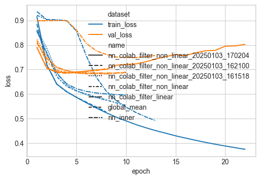
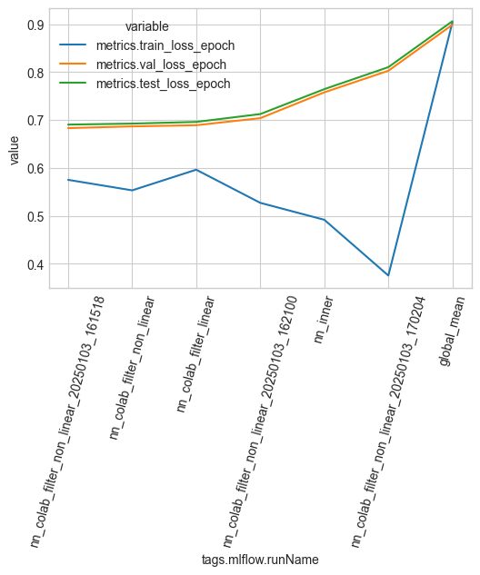

# Explore runs

Load and explore embeddings from different methods

TODO:
1. test performance


```python
import matplotlib.pyplot as plt
import seaborn as sns
import numpy as np
import polars as pl

plt.style.use("seaborn-v0_8-whitegrid")

import sys
from pathlib import Path

sys.path.append(str(Path().absolute().parent))

import utilities
```

Models summary


```python
import mlflow

experiment = mlflow.get_experiment_by_name("movie_lens_rating_prediction")
runs_df = mlflow.search_runs(experiment_ids=[experiment.experiment_id])
runs_df = pl.DataFrame(runs_df)

start_cols = [
    "tags.mlflow.runName",
    "params.layer_sizes",
    "params.embedding_dim",
    "params.learning_rate",
    "metrics.epoch",
    "metrics.train_loss_epoch",
    "metrics.val_loss_epoch",
    "metrics.test_loss_epoch",
]
runs_df.select(
    start_cols + [col for col in runs_df.columns if col not in start_cols]
).sort("metrics.val_loss_epoch")
```


<div><style>
.dataframe > thead > tr,
.dataframe > tbody > tr {
  text-align: right;
  white-space: pre-wrap;
}
</style>
<small>shape: (7, 24)</small><table border="1" class="dataframe"><thead><tr><th>tags.mlflow.runName</th><th>params.layer_sizes</th><th>params.embedding_dim</th><th>params.learning_rate</th><th>metrics.epoch</th><th>metrics.train_loss_epoch</th><th>metrics.val_loss_epoch</th><th>metrics.test_loss_epoch</th><th>run_id</th><th>experiment_id</th><th>status</th><th>artifact_uri</th><th>start_time</th><th>end_time</th><th>metrics.train_loss_step</th><th>metrics.val_loss_step</th><th>metrics.test_loss_step</th><th>metrics.running_mean_epoch</th><th>metrics.running_mean_step</th><th>params.n_users</th><th>params.n_movies</th><th>tags.mlflow.user</th><th>tags.mlflow.source.name</th><th>tags.mlflow.source.type</th></tr><tr><td>str</td><td>str</td><td>str</td><td>str</td><td>f64</td><td>f64</td><td>f64</td><td>f64</td><td>str</td><td>str</td><td>str</td><td>str</td><td>datetime[ns, UTC]</td><td>datetime[ns, UTC]</td><td>f64</td><td>f64</td><td>f64</td><td>f64</td><td>f64</td><td>str</td><td>str</td><td>str</td><td>str</td><td>str</td></tr></thead><tbody><tr><td>&quot;nn_colab_filter_non_linear_202…</td><td>&quot;[10, 16, 16, 16]&quot;</td><td>&quot;5&quot;</td><td>&quot;0.005&quot;</td><td>8.0</td><td>0.575203</td><td>0.683122</td><td>0.69046</td><td>&quot;279967b6a0e04b87a647d9fb1978bc…</td><td>&quot;548785546609954188&quot;</td><td>&quot;FINISHED&quot;</td><td>&quot;/Users/stantoon/Documents/Vari…</td><td>2025-01-03 16:15:20.091 UTC</td><td>2025-01-03 16:18:37.701 UTC</td><td>0.562218</td><td>0.667108</td><td>0.632752</td><td>null</td><td>null</td><td>&quot;157481&quot;</td><td>&quot;50&quot;</td><td>&quot;stantoon&quot;</td><td>&quot;/Users/stantoon/Documents/Vari…</td><td>&quot;LOCAL&quot;</td></tr><tr><td>&quot;nn_colab_filter_non_linear&quot;</td><td>&quot;[10, 32, 16]&quot;</td><td>&quot;5&quot;</td><td>&quot;0.005&quot;</td><td>10.0</td><td>0.553263</td><td>0.686721</td><td>0.692531</td><td>&quot;c6ea1003fba24d60bcf76b6ade3e4d…</td><td>&quot;548785546609954188&quot;</td><td>&quot;FINISHED&quot;</td><td>&quot;/Users/stantoon/Documents/Vari…</td><td>2025-01-03 16:06:37.610 UTC</td><td>2025-01-03 16:10:41.429 UTC</td><td>0.550876</td><td>0.663941</td><td>0.624704</td><td>null</td><td>null</td><td>&quot;157481&quot;</td><td>&quot;50&quot;</td><td>&quot;stantoon&quot;</td><td>&quot;/Users/stantoon/Documents/Vari…</td><td>&quot;LOCAL&quot;</td></tr><tr><td>&quot;nn_colab_filter_linear&quot;</td><td>null</td><td>&quot;5&quot;</td><td>&quot;0.005&quot;</td><td>10.0</td><td>0.596353</td><td>0.689189</td><td>0.696053</td><td>&quot;810f0251cd224736af423a49add084…</td><td>&quot;548785546609954188&quot;</td><td>&quot;FINISHED&quot;</td><td>&quot;/Users/stantoon/Documents/Vari…</td><td>2025-01-03 15:47:43.362 UTC</td><td>2025-01-03 15:51:36.666 UTC</td><td>0.60917</td><td>0.670025</td><td>0.635586</td><td>null</td><td>null</td><td>&quot;157481&quot;</td><td>&quot;50&quot;</td><td>&quot;stantoon&quot;</td><td>&quot;/Users/stantoon/Documents/Vari…</td><td>&quot;LOCAL&quot;</td></tr><tr><td>&quot;nn_colab_filter_non_linear_202…</td><td>&quot;[40, 16, 16, 16]&quot;</td><td>&quot;20&quot;</td><td>&quot;0.005&quot;</td><td>8.0</td><td>0.527207</td><td>0.703884</td><td>0.712426</td><td>&quot;159454faf49f44ae997e83a72fb9ef…</td><td>&quot;548785546609954188&quot;</td><td>&quot;FINISHED&quot;</td><td>&quot;/Users/stantoon/Documents/Vari…</td><td>2025-01-03 16:21:01.271 UTC</td><td>2025-01-03 16:24:39.991 UTC</td><td>0.563091</td><td>0.704185</td><td>0.636437</td><td>null</td><td>null</td><td>&quot;157481&quot;</td><td>&quot;50&quot;</td><td>&quot;stantoon&quot;</td><td>&quot;/Users/stantoon/Documents/Vari…</td><td>&quot;LOCAL&quot;</td></tr><tr><td>&quot;nn_inner&quot;</td><td>null</td><td>&quot;5&quot;</td><td>&quot;0.005&quot;</td><td>13.0</td><td>0.491839</td><td>0.75777</td><td>0.764444</td><td>&quot;954ab9584e474a59acbcfa89e31756…</td><td>&quot;548785546609954188&quot;</td><td>&quot;FINISHED&quot;</td><td>&quot;/Users/stantoon/Documents/Vari…</td><td>2025-01-03 15:27:15.519 UTC</td><td>2025-01-03 15:32:58.294 UTC</td><td>0.49926</td><td>0.719026</td><td>0.709034</td><td>null</td><td>null</td><td>&quot;157481&quot;</td><td>&quot;50&quot;</td><td>&quot;stantoon&quot;</td><td>&quot;/Users/stantoon/Documents/Vari…</td><td>&quot;LOCAL&quot;</td></tr><tr><td>&quot;nn_colab_filter_non_linear_202…</td><td>&quot;[40, 16, 16, 16]&quot;</td><td>&quot;20&quot;</td><td>&quot;0.005&quot;</td><td>22.0</td><td>0.375483</td><td>0.802818</td><td>0.810343</td><td>&quot;e85b677c3c9a4caba6a9ce08572fa6…</td><td>&quot;548785546609954188&quot;</td><td>&quot;FINISHED&quot;</td><td>&quot;/Users/stantoon/Documents/Vari…</td><td>2025-01-03 17:02:06.189 UTC</td><td>2025-01-03 17:18:46.378 UTC</td><td>0.426075</td><td>0.758802</td><td>0.79079</td><td>null</td><td>null</td><td>&quot;157481&quot;</td><td>&quot;50&quot;</td><td>&quot;stantoon&quot;</td><td>&quot;/Users/stantoon/Documents/Vari…</td><td>&quot;LOCAL&quot;</td></tr><tr><td>&quot;global_mean&quot;</td><td>null</td><td>null</td><td>&quot;0.1&quot;</td><td>2.0</td><td>0.903731</td><td>0.898837</td><td>0.906213</td><td>&quot;c3f801aac2494b6cacfafd69e0ee4b…</td><td>&quot;548785546609954188&quot;</td><td>&quot;FINISHED&quot;</td><td>&quot;/Users/stantoon/Documents/Vari…</td><td>2025-01-03 15:34:17.775 UTC</td><td>2025-01-03 15:35:08.310 UTC</td><td>0.91259</td><td>0.79787</td><td>0.784174</td><td>3.979776</td><td>3.97883</td><td>null</td><td>null</td><td>&quot;stantoon&quot;</td><td>&quot;/Users/stantoon/Documents/Vari…</td><td>&quot;LOCAL&quot;</td></tr></tbody></table></div>


Plot training logs


```python
plot_df = utilities.get_training_logs_for_experiment("movie_lens_rating_prediction")
display(plot_df)


fig, ax = plt.subplots(figsize=(6, 4))
sns.lineplot(data=plot_df, x="epoch", y="loss", style="name", hue="dataset", ax=ax)
fig.show()
```


<div><style>
.dataframe > thead > tr,
.dataframe > tbody > tr {
  text-align: right;
  white-space: pre-wrap;
}
</style>
<small>shape: (146, 5)</small><table border="1" class="dataframe"><thead><tr><th>epoch</th><th>step</th><th>dataset</th><th>loss</th><th>name</th></tr><tr><td>u32</td><td>i64</td><td>str</td><td>f64</td><td>str</td></tr></thead><tbody><tr><td>1</td><td>434</td><td>&quot;train_loss&quot;</td><td>0.915455</td><td>&quot;nn_colab_filter_non_linear_202…</td></tr><tr><td>2</td><td>869</td><td>&quot;train_loss&quot;</td><td>0.719124</td><td>&quot;nn_colab_filter_non_linear_202…</td></tr><tr><td>3</td><td>1304</td><td>&quot;train_loss&quot;</td><td>0.641523</td><td>&quot;nn_colab_filter_non_linear_202…</td></tr><tr><td>4</td><td>1739</td><td>&quot;train_loss&quot;</td><td>0.610411</td><td>&quot;nn_colab_filter_non_linear_202…</td></tr><tr><td>5</td><td>2174</td><td>&quot;train_loss&quot;</td><td>0.586742</td><td>&quot;nn_colab_filter_non_linear_202…</td></tr><tr><td>&hellip;</td><td>&hellip;</td><td>&hellip;</td><td>&hellip;</td><td>&hellip;</td></tr><tr><td>9</td><td>3914</td><td>&quot;val_loss&quot;</td><td>0.751022</td><td>&quot;nn_inner&quot;</td></tr><tr><td>10</td><td>4349</td><td>&quot;val_loss&quot;</td><td>0.749691</td><td>&quot;nn_inner&quot;</td></tr><tr><td>11</td><td>4784</td><td>&quot;val_loss&quot;</td><td>0.749204</td><td>&quot;nn_inner&quot;</td></tr><tr><td>12</td><td>5219</td><td>&quot;val_loss&quot;</td><td>0.752262</td><td>&quot;nn_inner&quot;</td></tr><tr><td>13</td><td>5654</td><td>&quot;val_loss&quot;</td><td>0.75777</td><td>&quot;nn_inner&quot;</td></tr></tbody></table></div>


    /var/folders/_v/nlh4h1yx2n1gd6f3szjlgxt40000gr/T/ipykernel_47851/621457871.py:7: UserWarning: FigureCanvasAgg is non-interactive, and thus cannot be shown
      fig.show()


    

    


Dataset losses


```python
plot_df = runs_df.sort("metrics.val_loss_epoch").unpivot(
    index="tags.mlflow.runName",
    on=[
        "metrics.train_loss_epoch",
        "metrics.val_loss_epoch",
        "metrics.test_loss_epoch",
    ],
)

fig, ax = plt.subplots(figsize=(6, 4))
sns.lineplot(data=plot_df, x="tags.mlflow.runName", y="value", hue="variable", ax=ax)
ax.tick_params(axis="x", labelrotation=75)
fig.show()
```

    /var/folders/_v/nlh4h1yx2n1gd6f3szjlgxt40000gr/T/ipykernel_47851/1685359539.py:13: UserWarning: FigureCanvasAgg is non-interactive, and thus cannot be shown
      fig.show()


    

    

