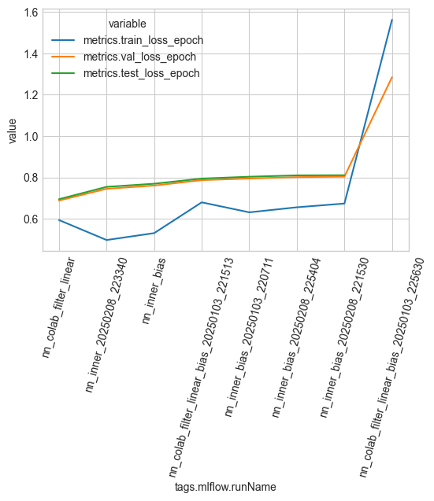

# Explore runs

Load and explore embeddings from different methods

TODO:
1. test performance


```python
import matplotlib.pyplot as plt
import seaborn as sns
import numpy as np
import polars as pl

plt.style.use("seaborn-v0_8-whitegrid")

import sys
from pathlib import Path

sys.path.append(str(Path().absolute().parent))

import utilities
```

Models summary


```python
import mlflow

experiment = mlflow.get_experiment_by_name("movie_lens_rating_prediction")
runs_df = mlflow.search_runs(experiment_ids=[experiment.experiment_id])
runs_df = pl.DataFrame(runs_df)

runs_df = runs_df.filter(
    pl.col("tags.mlflow.runName").str.contains("nn_inner_no_bias_").not_()
)

start_cols = [
    "tags.mlflow.runName",
    # "params.layer_sizes",
    "params.embedding_dim",
    "params.learning_rate",
    "metrics.epoch",
    "metrics.train_loss_epoch",
    "metrics.val_loss_epoch",
    "metrics.test_loss_epoch",
]
runs_df.select(
    start_cols + [col for col in runs_df.columns if col not in start_cols]
).sort("metrics.val_loss_epoch")
```


<div><style>
.dataframe > thead > tr,
.dataframe > tbody > tr {
  text-align: right;
  white-space: pre-wrap;
}
</style>
<small>shape: (10, 23)</small><table border="1" class="dataframe"><thead><tr><th>tags.mlflow.runName</th><th>params.embedding_dim</th><th>params.learning_rate</th><th>metrics.epoch</th><th>metrics.train_loss_epoch</th><th>metrics.val_loss_epoch</th><th>metrics.test_loss_epoch</th><th>run_id</th><th>experiment_id</th><th>status</th><th>artifact_uri</th><th>start_time</th><th>end_time</th><th>metrics.train_loss_step</th><th>metrics.test_loss_step</th><th>metrics.val_loss_step</th><th>params.include_bias</th><th>params.avg_rating</th><th>params.n_users</th><th>params.n_movies</th><th>tags.mlflow.source.name</th><th>tags.mlflow.source.type</th><th>tags.mlflow.user</th></tr><tr><td>str</td><td>str</td><td>str</td><td>f64</td><td>f64</td><td>f64</td><td>f64</td><td>str</td><td>str</td><td>str</td><td>str</td><td>datetime[ns, UTC]</td><td>datetime[ns, UTC]</td><td>f64</td><td>f64</td><td>f64</td><td>str</td><td>str</td><td>str</td><td>str</td><td>str</td><td>str</td><td>str</td></tr></thead><tbody><tr><td>&quot;nn_colab_filter_linear_2025010…</td><td>&quot;5&quot;</td><td>&quot;0.005&quot;</td><td>null</td><td>null</td><td>null</td><td>null</td><td>&quot;b79a2e9dbd424525957ed71ccb7543…</td><td>&quot;486488097731553569&quot;</td><td>&quot;FAILED&quot;</td><td>&quot;/Users/rich/Developer/Github/V…</td><td>2025-01-03 22:14:46.718 UTC</td><td>2025-01-03 22:14:49.674 UTC</td><td>null</td><td>null</td><td>null</td><td>null</td><td>&quot;None&quot;</td><td>&quot;157481&quot;</td><td>&quot;50&quot;</td><td>&quot;/Users/rich/Developer/Github/V…</td><td>&quot;LOCAL&quot;</td><td>&quot;rich&quot;</td></tr><tr><td>&quot;nn_inner_bias_20250103_220456&quot;</td><td>&quot;5&quot;</td><td>&quot;0.005&quot;</td><td>0.0</td><td>null</td><td>null</td><td>null</td><td>&quot;38a76fa1422943868f1f66ae1c70fd…</td><td>&quot;486488097731553569&quot;</td><td>&quot;FAILED&quot;</td><td>&quot;/Users/rich/Developer/Github/V…</td><td>2025-01-03 22:04:57.776 UTC</td><td>2025-01-03 22:05:00.333 UTC</td><td>8.796578</td><td>null</td><td>null</td><td>null</td><td>&quot;None&quot;</td><td>&quot;157481&quot;</td><td>&quot;50&quot;</td><td>&quot;/Users/rich/Developer/Github/V…</td><td>&quot;LOCAL&quot;</td><td>&quot;rich&quot;</td></tr><tr><td>&quot;nn_colab_filter_linear&quot;</td><td>&quot;5&quot;</td><td>&quot;0.005&quot;</td><td>12.0</td><td>0.594095</td><td>0.688266</td><td>0.694987</td><td>&quot;5c003cf04b744e5792d42292724f21…</td><td>&quot;486488097731553569&quot;</td><td>&quot;FINISHED&quot;</td><td>&quot;/Users/rich/Developer/Github/V…</td><td>2025-01-03 21:33:12.731 UTC</td><td>2025-01-03 21:37:45.863 UTC</td><td>0.598961</td><td>0.629046</td><td>0.668312</td><td>null</td><td>null</td><td>&quot;157481&quot;</td><td>&quot;50&quot;</td><td>&quot;/Users/rich/Developer/Github/V…</td><td>&quot;LOCAL&quot;</td><td>&quot;rich&quot;</td></tr><tr><td>&quot;nn_inner_20250208_223340&quot;</td><td>&quot;5&quot;</td><td>&quot;0.005&quot;</td><td>13.0</td><td>0.497633</td><td>0.745106</td><td>0.75453</td><td>&quot;67068637eee64d9e9e469b4a93ddf9…</td><td>&quot;486488097731553569&quot;</td><td>&quot;FINISHED&quot;</td><td>&quot;/Users/rich/Developer/Github/V…</td><td>2025-02-08 22:33:41.217 UTC</td><td>2025-02-08 22:37:27.876 UTC</td><td>0.498578</td><td>0.688663</td><td>0.694154</td><td>null</td><td>null</td><td>&quot;157481&quot;</td><td>&quot;50&quot;</td><td>&quot;/Users/rich/Developer/Github/V…</td><td>&quot;LOCAL&quot;</td><td>&quot;rich&quot;</td></tr><tr><td>&quot;nn_inner_bias&quot;</td><td>&quot;5&quot;</td><td>&quot;0.005&quot;</td><td>20.0</td><td>0.530948</td><td>0.760835</td><td>0.769678</td><td>&quot;2443aa58fd5d4e44a5238735d0d80f…</td><td>&quot;486488097731553569&quot;</td><td>&quot;FINISHED&quot;</td><td>&quot;/Users/rich/Developer/Github/V…</td><td>2025-01-03 21:47:02.652 UTC</td><td>2025-01-03 21:53:13.610 UTC</td><td>0.509934</td><td>0.721077</td><td>0.750463</td><td>null</td><td>null</td><td>&quot;157481&quot;</td><td>&quot;50&quot;</td><td>&quot;/Users/rich/Developer/Github/V…</td><td>&quot;LOCAL&quot;</td><td>&quot;rich&quot;</td></tr><tr><td>&quot;nn_colab_filter_linear_bias_20…</td><td>&quot;5&quot;</td><td>&quot;0.005&quot;</td><td>40.0</td><td>0.679742</td><td>0.786938</td><td>0.794565</td><td>&quot;fe18b2d579064abb9d41cb04002bbe…</td><td>&quot;486488097731553569&quot;</td><td>&quot;FINISHED&quot;</td><td>&quot;/Users/rich/Developer/Github/V…</td><td>2025-01-03 22:15:15.348 UTC</td><td>2025-01-03 22:38:35.928 UTC</td><td>0.708095</td><td>0.73971</td><td>0.76419</td><td>null</td><td>&quot;None&quot;</td><td>&quot;157481&quot;</td><td>&quot;50&quot;</td><td>&quot;/Users/rich/Developer/Github/V…</td><td>&quot;LOCAL&quot;</td><td>&quot;rich&quot;</td></tr><tr><td>&quot;nn_inner_bias_20250103_220711&quot;</td><td>&quot;5&quot;</td><td>&quot;0.005&quot;</td><td>15.0</td><td>0.631388</td><td>0.794841</td><td>0.803507</td><td>&quot;698214c596cf4542a056fe19422272…</td><td>&quot;486488097731553569&quot;</td><td>&quot;FINISHED&quot;</td><td>&quot;/Users/rich/Developer/Github/V…</td><td>2025-01-03 22:07:13.399 UTC</td><td>2025-01-03 22:12:20.020 UTC</td><td>0.641938</td><td>0.733008</td><td>0.761376</td><td>null</td><td>&quot;3.979540382205255&quot;</td><td>&quot;157481&quot;</td><td>&quot;50&quot;</td><td>&quot;/Users/rich/Developer/Github/V…</td><td>&quot;LOCAL&quot;</td><td>&quot;rich&quot;</td></tr><tr><td>&quot;nn_inner_bias_20250208_225404&quot;</td><td>&quot;5&quot;</td><td>&quot;0.005&quot;</td><td>14.0</td><td>0.655814</td><td>0.801583</td><td>0.810041</td><td>&quot;557b4c3c128343c08c1112a2c95f3b…</td><td>&quot;486488097731553569&quot;</td><td>&quot;FINISHED&quot;</td><td>&quot;/Users/rich/Developer/Github/V…</td><td>2025-02-08 22:54:05.968 UTC</td><td>2025-02-08 22:58:16.520 UTC</td><td>0.671247</td><td>0.74266</td><td>0.817706</td><td>&quot;True&quot;</td><td>&quot;3.979540382205255&quot;</td><td>&quot;157481&quot;</td><td>&quot;50&quot;</td><td>&quot;/Users/rich/Developer/Github/V…</td><td>&quot;LOCAL&quot;</td><td>&quot;rich&quot;</td></tr><tr><td>&quot;nn_inner_bias_20250208_221530&quot;</td><td>&quot;5&quot;</td><td>&quot;0.005&quot;</td><td>15.0</td><td>0.6739</td><td>0.80381</td><td>0.810755</td><td>&quot;80ca35affbb34e9ca65997c0b016a7…</td><td>&quot;486488097731553569&quot;</td><td>&quot;FINISHED&quot;</td><td>&quot;/Users/rich/Developer/Github/V…</td><td>2025-02-08 22:15:31.679 UTC</td><td>2025-02-08 22:20:51.320 UTC</td><td>0.693912</td><td>0.711201</td><td>0.798488</td><td>null</td><td>&quot;3.979540382205255&quot;</td><td>&quot;157481&quot;</td><td>&quot;50&quot;</td><td>&quot;/Users/rich/Developer/Github/V…</td><td>&quot;LOCAL&quot;</td><td>&quot;rich&quot;</td></tr><tr><td>&quot;nn_colab_filter_linear_bias_20…</td><td>&quot;5&quot;</td><td>&quot;0.005&quot;</td><td>1.0</td><td>1.561767</td><td>1.284164</td><td>null</td><td>&quot;0f17270c8f2f40bcbe15ce06ba1c3a…</td><td>&quot;486488097731553569&quot;</td><td>&quot;FAILED&quot;</td><td>&quot;/Users/rich/Developer/Github/V…</td><td>2025-01-03 22:56:31.702 UTC</td><td>2025-01-03 22:57:08.842 UTC</td><td>1.290683</td><td>null</td><td>1.195203</td><td>null</td><td>&quot;3.979540382205255&quot;</td><td>&quot;157481&quot;</td><td>&quot;50&quot;</td><td>&quot;/Users/rich/Developer/Github/V…</td><td>&quot;LOCAL&quot;</td><td>&quot;rich&quot;</td></tr></tbody></table></div>


Plot training logs


```python
plot_df = utilities.get_training_logs_for_experiment("movie_lens_rating_prediction")
plot_df = plot_df.filter(pl.col("name").str.contains("nn_inner_no_bias_").not_())
display(plot_df)


fig, ax = plt.subplots(figsize=(6, 4))
sns.lineplot(data=plot_df, x="epoch", y="loss", style="name", hue="dataset", ax=ax)
fig.show()
```


<div><style>
.dataframe > thead > tr,
.dataframe > tbody > tr {
  text-align: right;
  white-space: pre-wrap;
}
</style>
<small>shape: (260, 5)</small><table border="1" class="dataframe"><thead><tr><th>epoch</th><th>step</th><th>dataset</th><th>loss</th><th>name</th></tr><tr><td>u32</td><td>i64</td><td>str</td><td>f64</td><td>str</td></tr></thead><tbody><tr><td>1</td><td>434</td><td>&quot;train_loss&quot;</td><td>2.035982</td><td>&quot;nn_inner_bias_20250208_225404&quot;</td></tr><tr><td>2</td><td>869</td><td>&quot;train_loss&quot;</td><td>1.275522</td><td>&quot;nn_inner_bias_20250208_225404&quot;</td></tr><tr><td>3</td><td>1304</td><td>&quot;train_loss&quot;</td><td>1.072888</td><td>&quot;nn_inner_bias_20250208_225404&quot;</td></tr><tr><td>4</td><td>1739</td><td>&quot;train_loss&quot;</td><td>0.93226</td><td>&quot;nn_inner_bias_20250208_225404&quot;</td></tr><tr><td>5</td><td>2174</td><td>&quot;train_loss&quot;</td><td>0.838973</td><td>&quot;nn_inner_bias_20250208_225404&quot;</td></tr><tr><td>&hellip;</td><td>&hellip;</td><td>&hellip;</td><td>&hellip;</td><td>&hellip;</td></tr><tr><td>8</td><td>3479</td><td>&quot;val_loss&quot;</td><td>0.687667</td><td>&quot;nn_colab_filter_linear&quot;</td></tr><tr><td>9</td><td>3914</td><td>&quot;val_loss&quot;</td><td>0.685636</td><td>&quot;nn_colab_filter_linear&quot;</td></tr><tr><td>10</td><td>4349</td><td>&quot;val_loss&quot;</td><td>0.684599</td><td>&quot;nn_colab_filter_linear&quot;</td></tr><tr><td>11</td><td>4784</td><td>&quot;val_loss&quot;</td><td>0.685297</td><td>&quot;nn_colab_filter_linear&quot;</td></tr><tr><td>12</td><td>5219</td><td>&quot;val_loss&quot;</td><td>0.688266</td><td>&quot;nn_colab_filter_linear&quot;</td></tr></tbody></table></div>


    /var/folders/ky/4qby95090jbbq38_mh94x72r0000gn/T/ipykernel_51928/1214080125.py:8: UserWarning: FigureCanvasAgg is non-interactive, and thus cannot be shown
      fig.show()


    

    


Dataset losses


```python
plot_df = runs_df.sort("metrics.val_loss_epoch").unpivot(
    index="tags.mlflow.runName",
    on=[
        "metrics.train_loss_epoch",
        "metrics.val_loss_epoch",
        "metrics.test_loss_epoch",
    ],
)

fig, ax = plt.subplots(figsize=(6, 4))
sns.lineplot(data=plot_df, x="tags.mlflow.runName", y="value", hue="variable", ax=ax)
ax.tick_params(axis="x", labelrotation=75)
fig.show()
```

    /var/folders/ky/4qby95090jbbq38_mh94x72r0000gn/T/ipykernel_51928/1685359539.py:13: UserWarning: FigureCanvasAgg is non-interactive, and thus cannot be shown
      fig.show()


    

    

