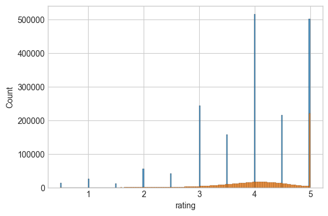

# NN inner product of embeddings

Collaborative filter:
Movies and customer embeddings.
Predict the rates as inner product of the two embeddings.
Include a bias term per user/movie to account for general bias.

References:
1. http://d2l.ai/chapter_recommender-systems/mf.html


```python
import matplotlib.pyplot as plt
import numpy as np
import polars as pl
import seaborn as sns

plt.style.use("seaborn-v0_8-whitegrid")

import sys
from pathlib import Path

sys.path.append(str(Path().absolute().parent))

import utilities
```

### Loading and transforming MovieLens


```python
ratings_df, user_id_mapping, movie_id_mapping = utilities.load_torch_data()
ratings_df
```


<div><style>
.dataframe > thead > tr,
.dataframe > tbody > tr {
  text-align: right;
  white-space: pre-wrap;
}
</style>
<small>shape: (2_544_549, 6)</small><table border="1" class="dataframe"><thead><tr><th>userId</th><th>movieId</th><th>rating</th><th>timestamp</th><th>userIdMapped</th><th>movieIdMapped</th></tr><tr><td>i64</td><td>i64</td><td>f64</td><td>i64</td><td>u32</td><td>u32</td></tr></thead><tbody><tr><td>1</td><td>5952</td><td>4.0</td><td>1147868053</td><td>0</td><td>46</td></tr><tr><td>1</td><td>296</td><td>5.0</td><td>1147880044</td><td>0</td><td>7</td></tr><tr><td>2</td><td>5952</td><td>5.0</td><td>1141415528</td><td>1</td><td>46</td></tr><tr><td>2</td><td>150</td><td>4.0</td><td>1141415790</td><td>1</td><td>5</td></tr><tr><td>2</td><td>3578</td><td>5.0</td><td>1141415803</td><td>1</td><td>42</td></tr><tr><td>&hellip;</td><td>&hellip;</td><td>&hellip;</td><td>&hellip;</td><td>&hellip;</td><td>&hellip;</td></tr><tr><td>162541</td><td>1136</td><td>4.5</td><td>1240953505</td><td>157480</td><td>25</td></tr><tr><td>162541</td><td>296</td><td>3.5</td><td>1240953510</td><td>157480</td><td>7</td></tr><tr><td>162541</td><td>1197</td><td>4.5</td><td>1240953534</td><td>157480</td><td>27</td></tr><tr><td>162541</td><td>593</td><td>4.0</td><td>1240953576</td><td>157480</td><td>21</td></tr><tr><td>162541</td><td>47</td><td>4.5</td><td>1240953606</td><td>157480</td><td>2</td></tr></tbody></table></div>


Make into torch datasets


```python
dataloader_train, dataloader_val, dataloader_test = utilities.get_data_loaders(
    ratings_df=ratings_df  # , sample=int(1e5)
)
```

MLflow logging


```python
from pytorch_lightning.loggers import MLFlowLogger
from datetime import datetime

timestamp = datetime.now().strftime("%Y%m%d_%H%M%S")
mlf_logger = MLFlowLogger(
    experiment_name="movie_lens_rating_prediction",
    tracking_uri="mlruns",
    run_name="nn_inner_bias_" + timestamp,
)
```

### Model definition

Fit a model to learn embeddings


```python
import pytorch_lightning as pyl
import torch
import torch.nn as nn


class MovieEmbeddingModel(pyl.LightningModule):
    def __init__(
        self,
        n_users,
        n_movies,
        include_bias: bool = True,
        embedding_dim=10,
        avg_rating: float = None,
        learning_rate: float = 5e-3,
    ):
        super().__init__()
        self.user_embedding = nn.Embedding(n_users, embedding_dim)
        self.movie_embedding = nn.Embedding(n_movies, embedding_dim)
        self.user_biases = nn.Embedding(n_users, 1)
        self.movie_biases = nn.Embedding(n_movies, 1)
        self.include_bias = include_bias
        if avg_rating:
            self.movie_biases.weight.data.fill_(avg_rating)

        self.max_rating = 5.0
        self.min_rating = 0.5
        self.learning_rate = learning_rate
        self.save_hyperparameters()

    def forward(self, user_ids, movie_ids):
        user_embeds = self.user_embedding(user_ids)
        movie_embeds = self.movie_embedding(movie_ids)

        dot_product = torch.sum(user_embeds * movie_embeds, dim=1)

        if self.include_bias:
            user_bias = self.user_biases(user_ids).squeeze()
            movie_bias = self.movie_biases(movie_ids).squeeze()
            prediction = dot_product + user_bias + movie_bias
        else:
            prediction = dot_product

        prediction = torch.clamp(prediction, min=self.min_rating, max=self.max_rating)
        return prediction

    def training_step(self, batch, batch_idx):
        user_ids, movie_ids, ratings = batch
        predictions = self(user_ids, movie_ids)
        loss = nn.MSELoss()(predictions, ratings)
        self.log("train_loss", loss, on_step=True, on_epoch=True, prog_bar=True)
        return loss

    def validation_step(self, batch, batch_idx):
        user_ids, movie_ids, ratings = batch
        predictions = self(user_ids, movie_ids)
        loss = nn.MSELoss()(predictions, ratings)
        self.log("val_loss", loss, on_step=True, on_epoch=True, prog_bar=True)

    def test_step(self, batch, batch_idx):
        user_ids, movie_ids, ratings = batch
        predictions = self(user_ids, movie_ids)
        loss = nn.MSELoss()(predictions, ratings)
        self.log("test_loss", loss, on_step=True, on_epoch=True, prog_bar=True)

    def configure_optimizers(self):
        return torch.optim.Adam(self.parameters(), lr=self.learning_rate)
```

Check it works with a small sample


```python
n_users = ratings_df["userIdMapped"].unique().count()
n_movies = ratings_df["movieIdMapped"].unique().count()
batch = next(iter(dataloader_train))
model = MovieEmbeddingModel(n_users, n_movies)
model(batch[0], batch[1])
```


    tensor([5.0000, 0.5000, 3.9309,  ..., 1.3515, 0.5000, 0.5000],
           grad_fn=<ClampBackward1>)


Add early stopping and enforce a minimum of 6 epochs (it takes a few epochs to start improving over a mean baseline)


```python
from pytorch_lightning.callbacks import EarlyStopping, ModelCheckpoint

checkpoint_callback = ModelCheckpoint(
    dirpath="checkpoints", save_top_k=1, monitor="val_loss"
)

early_stop_callback = EarlyStopping(monitor="val_loss", patience=3, mode="min")
```

Train the model

Using an embedding size of 5.


```python
model = MovieEmbeddingModel(
    n_users, n_movies, embedding_dim=5, avg_rating=ratings_df["rating"].mean()
)
trainer = pyl.Trainer(
    max_epochs=40,
    logger=mlf_logger,
    log_every_n_steps=1,
    callbacks=[early_stop_callback, checkpoint_callback],
)
trainer.fit(model, dataloader_train, dataloader_val)
```

    GPU available: True (mps), used: True
    TPU available: False, using: 0 TPU cores
    HPU available: False, using: 0 HPUs
    /Users/rich/Developer/Github/VariousDataAnalysis/.venv/lib/python3.12/site-packages/pytorch_lightning/callbacks/model_checkpoint.py:654: Checkpoint directory /Users/rich/Developer/Github/VariousDataAnalysis/neural_networks/movie_lens/rating_prediction/checkpoints exists and is not empty.
    
      | Name            | Type      | Params | Mode 
    ------------------------------------------------------
    0 | user_embedding  | Embedding | 787 K  | train
    1 | movie_embedding | Embedding | 250    | train
    2 | user_biases     | Embedding | 157 K  | train
    3 | movie_biases    | Embedding | 50     | train
    ------------------------------------------------------
    945 K     Trainable params
    0         Non-trainable params
    945 K     Total params
    3.781     Total estimated model params size (MB)
    4         Modules in train mode
    0         Modules in eval mode


    Sanity Checking: |          | 0/? [00:00<?, ?it/s]

    /Users/rich/Developer/Github/VariousDataAnalysis/.venv/lib/python3.12/site-packages/pytorch_lightning/trainer/connectors/data_connector.py:424: The 'val_dataloader' does not have many workers which may be a bottleneck. Consider increasing the value of the `num_workers` argument` to `num_workers=7` in the `DataLoader` to improve performance.


                                                                               

    /Users/rich/Developer/Github/VariousDataAnalysis/.venv/lib/python3.12/site-packages/pytorch_lightning/trainer/connectors/data_connector.py:424: The 'train_dataloader' does not have many workers which may be a bottleneck. Consider increasing the value of the `num_workers` argument` to `num_workers=7` in the `DataLoader` to improve performance.


    Epoch 13: 100%|██████████| 435/435 [00:20<00:00, 21.22it/s, v_num=3bfb, train_loss_step=0.671, val_loss_step=0.818, val_loss_epoch=0.802, train_loss_epoch=0.656]


Evaluate test set performance


```python
trainer.test(model, dataloader_test)
```

    /Users/rich/Developer/Github/VariousDataAnalysis/.venv/lib/python3.12/site-packages/pytorch_lightning/trainer/connectors/data_connector.py:424: The 'test_dataloader' does not have many workers which may be a bottleneck. Consider increasing the value of the `num_workers` argument` to `num_workers=7` in the `DataLoader` to improve performance.


    Testing: |          | 0/? [00:00<?, ?it/s]

    Testing DataLoader 0: 100%|██████████| 63/63 [00:02<00:00, 29.21it/s]
    ────────────────────────────────────────────────────────────────────────────────────────────────────────────────────────
           Test metric             DataLoader 0
    ────────────────────────────────────────────────────────────────────────────────────────────────────────────────────────
         test_loss_epoch        0.8100411891937256
    ────────────────────────────────────────────────────────────────────────────────────────────────────────────────────────


    [{'test_loss_epoch': 0.8100411891937256}]


Store model


```python
mlf_logger.experiment.log_artifact(
    mlf_logger.run_id, checkpoint_callback.best_model_path
)
```

Plotting train/val epoch loss


```python
plot_df = utilities.training_logs_to_df(run_id=mlf_logger.run_id)
fig, ax = plt.subplots(figsize=(6, 4))
sns.lineplot(data=plot_df, x="epoch", y="loss", hue="dataset", ax=ax)
fig.show()
```

    /var/folders/ky/4qby95090jbbq38_mh94x72r0000gn/T/ipykernel_47635/2428333827.py:4: UserWarning: FigureCanvasAgg is non-interactive, and thus cannot be shown
      fig.show()


    

    


### Check prediction results

We will use a baseline prediction from mean ratings to sanity check


```python
train_data, val_data, test_data = utilities.split_train_test(ratings_df=ratings_df)
train_data = train_data.with_columns(pl.col("rating").mean().alias("baseline"))

preds = model(
    torch.tensor(train_data["userIdMapped"]), torch.tensor(train_data["movieIdMapped"])
)
train_data = train_data.with_columns(pl.lit(preds.detach().numpy()).alias("nn"))

train_data
```


<div><style>
.dataframe > thead > tr,
.dataframe > tbody > tr {
  text-align: right;
  white-space: pre-wrap;
}
</style>
<small>shape: (1_781_184, 8)</small><table border="1" class="dataframe"><thead><tr><th>userId</th><th>movieId</th><th>rating</th><th>timestamp</th><th>userIdMapped</th><th>movieIdMapped</th><th>baseline</th><th>nn</th></tr><tr><td>i64</td><td>i64</td><td>f64</td><td>i64</td><td>u32</td><td>u32</td><td>f64</td><td>f32</td></tr></thead><tbody><tr><td>5150</td><td>79132</td><td>2.5</td><td>1459431773</td><td>5008</td><td>49</td><td>3.979833</td><td>2.928873</td></tr><tr><td>79646</td><td>150</td><td>3.5</td><td>1554224374</td><td>77175</td><td>5</td><td>3.979833</td><td>3.802965</td></tr><tr><td>63956</td><td>318</td><td>4.0</td><td>948005318</td><td>61981</td><td>8</td><td>3.979833</td><td>4.443114</td></tr><tr><td>66248</td><td>1291</td><td>4.5</td><td>1189775094</td><td>64204</td><td>33</td><td>3.979833</td><td>3.997561</td></tr><tr><td>57849</td><td>527</td><td>4.5</td><td>1322993994</td><td>56060</td><td>16</td><td>3.979833</td><td>3.580617</td></tr><tr><td>&hellip;</td><td>&hellip;</td><td>&hellip;</td><td>&hellip;</td><td>&hellip;</td><td>&hellip;</td><td>&hellip;</td><td>&hellip;</td></tr><tr><td>7160</td><td>780</td><td>3.0</td><td>848676694</td><td>6942</td><td>23</td><td>3.979833</td><td>2.816551</td></tr><tr><td>108304</td><td>527</td><td>4.0</td><td>1419181402</td><td>104945</td><td>16</td><td>3.979833</td><td>3.967705</td></tr><tr><td>150532</td><td>380</td><td>3.5</td><td>1181551976</td><td>145835</td><td>13</td><td>3.979833</td><td>3.176163</td></tr><tr><td>142477</td><td>260</td><td>5.0</td><td>832244201</td><td>138046</td><td>6</td><td>3.979833</td><td>4.85944</td></tr><tr><td>141844</td><td>1136</td><td>4.5</td><td>1111183788</td><td>137436</td><td>25</td><td>3.979833</td><td>4.959461</td></tr></tbody></table></div>


We are beating the mean baseline in the training dataset


```python
print(
    "baseline loss: ",
    nn.MSELoss()(
        torch.tensor(train_data["baseline"]), torch.tensor(train_data["rating"])
    ),
)
print(
    "NN loss: ",
    nn.MSELoss()(torch.tensor(train_data["nn"]), torch.tensor(train_data["rating"])),
)
```

    baseline loss:  tensor(0.9037)
    NN loss:  tensor(0.6218)


The histogram of predictions looks reasonable


```python
fig, ax = plt.subplots(figsize=(6, 4))
sns.histplot(data=train_data, x="rating", ax=ax)
sns.histplot(data=train_data, x="nn", ax=ax)
fig.show()
```

    /var/folders/ky/4qby95090jbbq38_mh94x72r0000gn/T/ipykernel_47635/2656779169.py:4: UserWarning: FigureCanvasAgg is non-interactive, and thus cannot be shown
      fig.show()


    

    


# Repeating without bias

Takes ages to converge


```python
mlf_logger = MLFlowLogger(
    experiment_name="movie_lens_rating_prediction",
    tracking_uri="mlruns",
    run_name="nn_inner_no_bias_" + timestamp,
)
```


```python
checkpoint_callback = ModelCheckpoint(
    dirpath="checkpoints", save_top_k=1, monitor="val_loss"
)

early_stop_callback = EarlyStopping(monitor="val_loss", patience=3, mode="min")
model = MovieEmbeddingModel(
    n_users,
    n_movies,
    embedding_dim=5,
    avg_rating=ratings_df["rating"].mean(),
    include_bias=False,
)
trainer = pyl.Trainer(
    max_epochs=40,
    logger=mlf_logger,
    log_every_n_steps=1,
    callbacks=[early_stop_callback, checkpoint_callback],
)
trainer.fit(model, dataloader_train, dataloader_val)
```

    GPU available: True (mps), used: True
    TPU available: False, using: 0 TPU cores
    HPU available: False, using: 0 HPUs
    /Users/rich/Developer/Github/VariousDataAnalysis/.venv/lib/python3.12/site-packages/pytorch_lightning/callbacks/model_checkpoint.py:654: Checkpoint directory /Users/rich/Developer/Github/VariousDataAnalysis/neural_networks/movie_lens/rating_prediction/checkpoints exists and is not empty.
    
      | Name            | Type      | Params | Mode 
    ------------------------------------------------------
    0 | user_embedding  | Embedding | 787 K  | train
    1 | movie_embedding | Embedding | 250    | train
    2 | user_biases     | Embedding | 157 K  | train
    3 | movie_biases    | Embedding | 50     | train
    ------------------------------------------------------
    945 K     Trainable params
    0         Non-trainable params
    945 K     Total params
    3.781     Total estimated model params size (MB)
    4         Modules in train mode
    0         Modules in eval mode


                                                                                

    /Users/rich/Developer/Github/VariousDataAnalysis/.venv/lib/python3.12/site-packages/pytorch_lightning/trainer/connectors/data_connector.py:424: The 'val_dataloader' does not have many workers which may be a bottleneck. Consider increasing the value of the `num_workers` argument` to `num_workers=7` in the `DataLoader` to improve performance.
    /Users/rich/Developer/Github/VariousDataAnalysis/.venv/lib/python3.12/site-packages/pytorch_lightning/trainer/connectors/data_connector.py:424: The 'train_dataloader' does not have many workers which may be a bottleneck. Consider increasing the value of the `num_workers` argument` to `num_workers=7` in the `DataLoader` to improve performance.


    Epoch 39: 100%|██████████| 435/435 [00:18<00:00, 24.14it/s, v_num=aa12, train_loss_step=2.540, val_loss_step=3.400, val_loss_epoch=3.460, train_loss_epoch=2.720]

    `Trainer.fit` stopped: `max_epochs=40` reached.


    Epoch 39: 100%|██████████| 435/435 [00:18<00:00, 24.11it/s, v_num=aa12, train_loss_step=2.540, val_loss_step=3.400, val_loss_epoch=3.460, train_loss_epoch=2.720]


Evaluate test set performance


```python
trainer.test(model, dataloader_test)
```

    /Users/rich/Developer/Github/VariousDataAnalysis/.venv/lib/python3.12/site-packages/pytorch_lightning/trainer/connectors/data_connector.py:424: The 'test_dataloader' does not have many workers which may be a bottleneck. Consider increasing the value of the `num_workers` argument` to `num_workers=7` in the `DataLoader` to improve performance.


    Testing DataLoader 0: 100%|██████████| 63/63 [00:01<00:00, 34.56it/s]
    ────────────────────────────────────────────────────────────────────────────────────────────────────────────────────────
           Test metric             DataLoader 0
    ────────────────────────────────────────────────────────────────────────────────────────────────────────────────────────
         test_loss_epoch        3.4841225147247314
    ────────────────────────────────────────────────────────────────────────────────────────────────────────────────────────


    [{'test_loss_epoch': 3.4841225147247314}]


Store model


```python
mlf_logger.experiment.log_artifact(
    mlf_logger.run_id, checkpoint_callback.best_model_path
)
```

Plotting train/val epoch loss


```python
plot_df = utilities.training_logs_to_df(run_id=mlf_logger.run_id)
fig, ax = plt.subplots(figsize=(6, 4))
sns.lineplot(data=plot_df, x="epoch", y="loss", hue="dataset", ax=ax)
fig.show()
```

    /var/folders/ky/4qby95090jbbq38_mh94x72r0000gn/T/ipykernel_47635/2428333827.py:4: UserWarning: FigureCanvasAgg is non-interactive, and thus cannot be shown
      fig.show()


    

    


### Check prediction results

We will use a baseline prediction from mean ratings to sanity check


```python
train_data, val_data, test_data = utilities.split_train_test(ratings_df=ratings_df)
train_data = train_data.with_columns(pl.col("rating").mean().alias("baseline"))

preds = model(
    torch.tensor(train_data["userIdMapped"]), torch.tensor(train_data["movieIdMapped"])
)
train_data = train_data.with_columns(pl.lit(preds.detach().numpy()).alias("nn"))

train_data
```


<div><style>
.dataframe > thead > tr,
.dataframe > tbody > tr {
  text-align: right;
  white-space: pre-wrap;
}
</style>
<small>shape: (1_781_184, 8)</small><table border="1" class="dataframe"><thead><tr><th>userId</th><th>movieId</th><th>rating</th><th>timestamp</th><th>userIdMapped</th><th>movieIdMapped</th><th>baseline</th><th>nn</th></tr><tr><td>i64</td><td>i64</td><td>f64</td><td>i64</td><td>u32</td><td>u32</td><td>f64</td><td>f32</td></tr></thead><tbody><tr><td>5150</td><td>79132</td><td>2.5</td><td>1459431773</td><td>5008</td><td>49</td><td>3.979833</td><td>0.5</td></tr><tr><td>79646</td><td>150</td><td>3.5</td><td>1554224374</td><td>77175</td><td>5</td><td>3.979833</td><td>3.653964</td></tr><tr><td>63956</td><td>318</td><td>4.0</td><td>948005318</td><td>61981</td><td>8</td><td>3.979833</td><td>2.791123</td></tr><tr><td>66248</td><td>1291</td><td>4.5</td><td>1189775094</td><td>64204</td><td>33</td><td>3.979833</td><td>3.997059</td></tr><tr><td>57849</td><td>527</td><td>4.5</td><td>1322993994</td><td>56060</td><td>16</td><td>3.979833</td><td>3.578678</td></tr><tr><td>&hellip;</td><td>&hellip;</td><td>&hellip;</td><td>&hellip;</td><td>&hellip;</td><td>&hellip;</td><td>&hellip;</td><td>&hellip;</td></tr><tr><td>7160</td><td>780</td><td>3.0</td><td>848676694</td><td>6942</td><td>23</td><td>3.979833</td><td>3.146914</td></tr><tr><td>108304</td><td>527</td><td>4.0</td><td>1419181402</td><td>104945</td><td>16</td><td>3.979833</td><td>3.875523</td></tr><tr><td>150532</td><td>380</td><td>3.5</td><td>1181551976</td><td>145835</td><td>13</td><td>3.979833</td><td>3.031628</td></tr><tr><td>142477</td><td>260</td><td>5.0</td><td>832244201</td><td>138046</td><td>6</td><td>3.979833</td><td>5.0</td></tr><tr><td>141844</td><td>1136</td><td>4.5</td><td>1111183788</td><td>137436</td><td>25</td><td>3.979833</td><td>5.0</td></tr></tbody></table></div>


We are beating the mean baseline in the training dataset


```python
print(
    "baseline loss: ",
    nn.MSELoss()(
        torch.tensor(train_data["baseline"]), torch.tensor(train_data["rating"])
    ),
)
print(
    "NN loss: ",
    nn.MSELoss()(torch.tensor(train_data["nn"]), torch.tensor(train_data["rating"])),
)
```

    baseline loss:  tensor(0.9037)
    NN loss:  tensor(2.6358)


The histogram of predictions looks reasonable


```python
fig, ax = plt.subplots(figsize=(6, 4))
sns.histplot(data=train_data, x="rating", ax=ax)
sns.histplot(data=train_data, x="nn", ax=ax)
fig.show()
```

    /var/folders/ky/4qby95090jbbq38_mh94x72r0000gn/T/ipykernel_47635/2656779169.py:4: UserWarning: FigureCanvasAgg is non-interactive, and thus cannot be shown
      fig.show()


    

    


We will use a baseline prediction from mean ratings to sanity check
