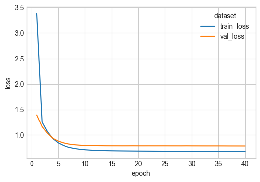
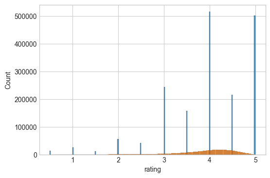

# NN Collaborative filter

Collaborative filter:
Movies and customer embeddings.
Replacing the inner product with a concat and a dense NN on top to make a neural collaborative filter.

Adding a bias term for each customer and item to control for differences in averages between customers and items.


```python
import matplotlib.pyplot as plt
import numpy as np
import polars as pl
import seaborn as sns

plt.style.use("seaborn-v0_8-whitegrid")

import sys
from pathlib import Path

sys.path.append(str(Path().absolute().parent))

import utilities
```

### Loading and transforming MovieLens


```python
ratings_df, user_id_mapping, movie_id_mapping = utilities.load_torch_data()
ratings_df
```


<div><style>
.dataframe > thead > tr,
.dataframe > tbody > tr {
  text-align: right;
  white-space: pre-wrap;
}
</style>
<small>shape: (2_544_549, 6)</small><table border="1" class="dataframe"><thead><tr><th>userId</th><th>movieId</th><th>rating</th><th>timestamp</th><th>userIdMapped</th><th>movieIdMapped</th></tr><tr><td>i64</td><td>i64</td><td>f64</td><td>i64</td><td>u32</td><td>u32</td></tr></thead><tbody><tr><td>1</td><td>5952</td><td>4.0</td><td>1147868053</td><td>0</td><td>46</td></tr><tr><td>1</td><td>296</td><td>5.0</td><td>1147880044</td><td>0</td><td>7</td></tr><tr><td>2</td><td>5952</td><td>5.0</td><td>1141415528</td><td>1</td><td>46</td></tr><tr><td>2</td><td>150</td><td>4.0</td><td>1141415790</td><td>1</td><td>5</td></tr><tr><td>2</td><td>3578</td><td>5.0</td><td>1141415803</td><td>1</td><td>42</td></tr><tr><td>&hellip;</td><td>&hellip;</td><td>&hellip;</td><td>&hellip;</td><td>&hellip;</td><td>&hellip;</td></tr><tr><td>162541</td><td>1136</td><td>4.5</td><td>1240953505</td><td>157480</td><td>25</td></tr><tr><td>162541</td><td>296</td><td>3.5</td><td>1240953510</td><td>157480</td><td>7</td></tr><tr><td>162541</td><td>1197</td><td>4.5</td><td>1240953534</td><td>157480</td><td>27</td></tr><tr><td>162541</td><td>593</td><td>4.0</td><td>1240953576</td><td>157480</td><td>21</td></tr><tr><td>162541</td><td>47</td><td>4.5</td><td>1240953606</td><td>157480</td><td>2</td></tr></tbody></table></div>


Make into torch datasets


```python
dataloader_train, dataloader_val, dataloader_test = utilities.get_data_loaders(
    ratings_df=ratings_df  # , sample=int(1e5)
)
```

MLflow logging


```python
from pytorch_lightning.loggers import MLFlowLogger
from datetime import datetime

timestamp = datetime.now().strftime("%Y%m%d_%H%M%S")
mlf_logger = MLFlowLogger(
    experiment_name="movie_lens_rating_prediction",
    tracking_uri="mlruns",
    run_name="nn_colab_filter_linear_bias_" + timestamp,
)
```

### Model definition

Fit a model to learn embeddings


```python
import pytorch_lightning as pyl
import torch
import torch.nn as nn


class MovieEmbeddingModel(pyl.LightningModule):
    def __init__(
        self,
        n_users,
        n_movies,
        embedding_dim=10,
        avg_rating: float = None,
        learning_rate: float = 5e-3,
    ):
        super().__init__()
        self.user_embedding = nn.Embedding(n_users, embedding_dim)
        self.movie_embedding = nn.Embedding(n_movies, embedding_dim)
        self.user_biases = nn.Embedding(n_users, 1)
        self.movie_biases = nn.Embedding(n_movies, 1)

        self.output = nn.Linear(embedding_dim * 2, 1)
        if avg_rating:
            self.output.bias.data.fill_(avg_rating)

        self.max_rating = 5.0
        self.min_rating = 0.5
        self.learning_rate = learning_rate
        self.save_hyperparameters()

    def forward(self, user_ids, movie_ids):
        user_embeds = self.user_embedding(user_ids)
        movie_embeds = self.movie_embedding(movie_ids)

        embeds_concat = torch.concat([user_embeds, movie_embeds], dim=1)

        user_bias = self.user_biases(user_ids).squeeze()
        movie_bias = self.movie_biases(movie_ids).squeeze()

        prediction = self.output(embeds_concat) + user_bias + movie_bias

        prediction = torch.clamp(prediction, min=self.min_rating, max=self.max_rating)
        return prediction

    def training_step(self, batch, batch_idx):
        user_ids, movie_ids, ratings = batch
        predictions = self(user_ids, movie_ids)
        loss = nn.MSELoss()(predictions, ratings)
        self.log("train_loss", loss, on_step=True, on_epoch=True, prog_bar=True)
        return loss

    def validation_step(self, batch, batch_idx):
        user_ids, movie_ids, ratings = batch
        predictions = self(user_ids, movie_ids)
        loss = nn.MSELoss()(predictions, ratings)
        self.log("val_loss", loss, on_step=True, on_epoch=True, prog_bar=True)

    def test_step(self, batch, batch_idx):
        user_ids, movie_ids, ratings = batch
        predictions = self(user_ids, movie_ids)
        loss = nn.MSELoss()(predictions, ratings)
        self.log("test_loss", loss, on_step=True, on_epoch=True, prog_bar=True)

    def configure_optimizers(self):
        return torch.optim.Adam(self.parameters(), lr=self.learning_rate)
```

Check it works with a small sample


```python
n_users = ratings_df["userIdMapped"].unique().count()
n_movies = ratings_df["movieIdMapped"].unique().count()
batch = next(iter(dataloader_train))
model = MovieEmbeddingModel(n_users, n_movies, avg_rating=ratings_df["rating"].mean())
model(batch[0], batch[1])
```


    tensor([[5.0000, 4.5383, 4.9106,  ..., 2.9509, 4.1891, 1.6791],
            [4.2945, 3.7057, 4.0780,  ..., 2.1183, 3.3565, 0.8465],
            [4.3798, 3.7911, 4.1633,  ..., 2.2037, 3.4418, 0.9319],
            ...,
            [4.6332, 4.0445, 4.4168,  ..., 2.4571, 3.6952, 1.1853],
            [5.0000, 4.6479, 5.0000,  ..., 3.0606, 4.2987, 1.7887],
            [5.0000, 5.0000, 5.0000,  ..., 3.4994, 4.7375, 2.2276]],
           grad_fn=<ClampBackward1>)


Add early stopping and enforce a minimum of 6 epochs (it takes a few epochs to start improving over a mean baseline)


```python
from pytorch_lightning.callbacks import EarlyStopping, ModelCheckpoint

checkpoint_callback = ModelCheckpoint(
    dirpath="checkpoints", save_top_k=1, monitor="val_loss"
)

early_stop_callback = EarlyStopping(monitor="val_loss", patience=3, mode="min")
```

Train the model

Using an embedding size of 5.


```python
model = MovieEmbeddingModel(
    n_users, n_movies, embedding_dim=5, avg_rating=ratings_df["rating"].mean()
)
trainer = pyl.Trainer(
    max_epochs=40,
    logger=mlf_logger,
    log_every_n_steps=1,
    callbacks=[early_stop_callback, checkpoint_callback],
)
trainer.fit(model, dataloader_train, dataloader_val)
```

    GPU available: True (mps), used: True
    TPU available: False, using: 0 TPU cores
    HPU available: False, using: 0 HPUs
    /Users/rich/Developer/Github/VariousDataAnalysis/.venv/lib/python3.12/site-packages/pytorch_lightning/callbacks/model_checkpoint.py:654: Checkpoint directory /Users/rich/Developer/Github/VariousDataAnalysis/neural_networks/movie_lens/rating_prediction/checkpoints exists and is not empty.
    
      | Name            | Type      | Params | Mode 
    ------------------------------------------------------
    0 | user_embedding  | Embedding | 787 K  | train
    1 | movie_embedding | Embedding | 250    | train
    2 | user_biases     | Embedding | 157 K  | train
    3 | movie_biases    | Embedding | 50     | train
    4 | output          | Linear    | 11     | train
    ------------------------------------------------------
    945 K     Trainable params
    0         Non-trainable params
    945 K     Total params
    3.781     Total estimated model params size (MB)
    5         Modules in train mode
    0         Modules in eval mode


    Sanity Checking: |          | 0/? [00:00<?, ?it/s]

    /Users/rich/Developer/Github/VariousDataAnalysis/.venv/lib/python3.12/site-packages/pytorch_lightning/trainer/connectors/data_connector.py:424: The 'val_dataloader' does not have many workers which may be a bottleneck. Consider increasing the value of the `num_workers` argument` to `num_workers=7` in the `DataLoader` to improve performance.


    Sanity Checking DataLoader 0:   0%|          | 0/2 [00:00<?, ?it/s]

    /Users/rich/Developer/Github/VariousDataAnalysis/.venv/lib/python3.12/site-packages/torch/nn/modules/loss.py:608: UserWarning: Using a target size (torch.Size([4096])) that is different to the input size (torch.Size([4096, 4096])). This will likely lead to incorrect results due to broadcasting. Please ensure they have the same size.
      return F.mse_loss(input, target, reduction=self.reduction)


                                                                               

    /Users/rich/Developer/Github/VariousDataAnalysis/.venv/lib/python3.12/site-packages/pytorch_lightning/trainer/connectors/data_connector.py:424: The 'train_dataloader' does not have many workers which may be a bottleneck. Consider increasing the value of the `num_workers` argument` to `num_workers=7` in the `DataLoader` to improve performance.


    Epoch 0: 100%|█████████▉| 434/435 [00:27<00:00, 15.95it/s, v_num=3a35, train_loss_step=1.240]

    /Users/rich/Developer/Github/VariousDataAnalysis/.venv/lib/python3.12/site-packages/torch/nn/modules/loss.py:608: UserWarning: Using a target size (torch.Size([3520])) that is different to the input size (torch.Size([3520, 3520])). This will likely lead to incorrect results due to broadcasting. Please ensure they have the same size.
      return F.mse_loss(input, target, reduction=self.reduction)


    Epoch 0: 100%|██████████| 435/435 [00:33<00:00, 13.18it/s, v_num=3a35, train_loss_step=1.300, val_loss_step=1.200, val_loss_epoch=1.280, train_loss_epoch=1.560]

    /Users/rich/Developer/Github/VariousDataAnalysis/.venv/lib/python3.12/site-packages/torch/nn/modules/loss.py:608: UserWarning: Using a target size (torch.Size([1006])) that is different to the input size (torch.Size([1006, 1006])). This will likely lead to incorrect results due to broadcasting. Please ensure they have the same size.
      return F.mse_loss(input, target, reduction=self.reduction)


    Epoch 1:  11%|█▏        | 49/435 [00:02<00:21, 17.60it/s, v_num=3a35, train_loss_step=1.290, val_loss_step=1.200, val_loss_epoch=1.280, train_loss_epoch=1.560] 

    
    Detected KeyboardInterrupt, attempting graceful shutdown ...


    ---------------------------------------------------------------------------

    KeyboardInterrupt                         Traceback (most recent call last)

    File ~/Developer/Github/VariousDataAnalysis/.venv/lib/python3.12/site-packages/pytorch_lightning/trainer/call.py:47, in _call_and_handle_interrupt(trainer, trainer_fn, *args, **kwargs)
         46         return trainer.strategy.launcher.launch(trainer_fn, *args, trainer=trainer, **kwargs)
    ---> 47     return trainer_fn(*args, **kwargs)
         49 except _TunerExitException:


    File ~/Developer/Github/VariousDataAnalysis/.venv/lib/python3.12/site-packages/pytorch_lightning/trainer/trainer.py:574, in Trainer._fit_impl(self, model, train_dataloaders, val_dataloaders, datamodule, ckpt_path)
        568 ckpt_path = self._checkpoint_connector._select_ckpt_path(
        569     self.state.fn,
        570     ckpt_path,
        571     model_provided=True,
        572     model_connected=self.lightning_module is not None,
        573 )
    --> 574 self._run(model, ckpt_path=ckpt_path)
        576 assert self.state.stopped


    File ~/Developer/Github/VariousDataAnalysis/.venv/lib/python3.12/site-packages/pytorch_lightning/trainer/trainer.py:981, in Trainer._run(self, model, ckpt_path)
        978 # ----------------------------
        979 # RUN THE TRAINER
        980 # ----------------------------
    --> 981 results = self._run_stage()
        983 # ----------------------------
        984 # POST-Training CLEAN UP
        985 # ----------------------------


    File ~/Developer/Github/VariousDataAnalysis/.venv/lib/python3.12/site-packages/pytorch_lightning/trainer/trainer.py:1025, in Trainer._run_stage(self)
       1024 with torch.autograd.set_detect_anomaly(self._detect_anomaly):
    -> 1025     self.fit_loop.run()
       1026 return None


    File ~/Developer/Github/VariousDataAnalysis/.venv/lib/python3.12/site-packages/pytorch_lightning/loops/fit_loop.py:205, in _FitLoop.run(self)
        204 self.on_advance_start()
    --> 205 self.advance()
        206 self.on_advance_end()


    File ~/Developer/Github/VariousDataAnalysis/.venv/lib/python3.12/site-packages/pytorch_lightning/loops/fit_loop.py:363, in _FitLoop.advance(self)
        362 assert self._data_fetcher is not None
    --> 363 self.epoch_loop.run(self._data_fetcher)


    File ~/Developer/Github/VariousDataAnalysis/.venv/lib/python3.12/site-packages/pytorch_lightning/loops/training_epoch_loop.py:140, in _TrainingEpochLoop.run(self, data_fetcher)
        139 try:
    --> 140     self.advance(data_fetcher)
        141     self.on_advance_end(data_fetcher)


    File ~/Developer/Github/VariousDataAnalysis/.venv/lib/python3.12/site-packages/pytorch_lightning/loops/training_epoch_loop.py:269, in _TrainingEpochLoop.advance(self, data_fetcher)
        267     self.batch_progress.is_last_batch = data_fetcher.done
    --> 269 call._call_callback_hooks(trainer, "on_train_batch_end", batch_output, batch, batch_idx)
        270 call._call_lightning_module_hook(trainer, "on_train_batch_end", batch_output, batch, batch_idx)


    File ~/Developer/Github/VariousDataAnalysis/.venv/lib/python3.12/site-packages/pytorch_lightning/trainer/call.py:218, in _call_callback_hooks(trainer, hook_name, monitoring_callbacks, *args, **kwargs)
        217         with trainer.profiler.profile(f"[Callback]{callback.state_key}.{hook_name}"):
    --> 218             fn(trainer, trainer.lightning_module, *args, **kwargs)
        220 if pl_module:
        221     # restore current_fx when nested context


    File ~/Developer/Github/VariousDataAnalysis/.venv/lib/python3.12/site-packages/pytorch_lightning/callbacks/progress/tqdm_progress.py:279, in TQDMProgressBar.on_train_batch_end(self, trainer, pl_module, outputs, batch, batch_idx)
        278 _update_n(self.train_progress_bar, n)
    --> 279 self.train_progress_bar.set_postfix(self.get_metrics(trainer, pl_module))


    File ~/Developer/Github/VariousDataAnalysis/.venv/lib/python3.12/site-packages/pytorch_lightning/callbacks/progress/progress_bar.py:198, in ProgressBar.get_metrics(self, trainer, pl_module)
        197 standard_metrics = get_standard_metrics(trainer)
    --> 198 pbar_metrics = trainer.progress_bar_metrics
        199 duplicates = list(standard_metrics.keys() & pbar_metrics.keys())


    File ~/Developer/Github/VariousDataAnalysis/.venv/lib/python3.12/site-packages/pytorch_lightning/trainer/trainer.py:1635, in Trainer.progress_bar_metrics(self)
       1629 """The metrics sent to the progress bar.
       1630 
       1631 This includes metrics logged via :meth:`~pytorch_lightning.core.LightningModule.log` with the
       1632 :paramref:`~pytorch_lightning.core.LightningModule.log.prog_bar` argument set.
       1633 
       1634 """
    -> 1635 return self._logger_connector.progress_bar_metrics


    File ~/Developer/Github/VariousDataAnalysis/.venv/lib/python3.12/site-packages/pytorch_lightning/trainer/connectors/logger_connector/logger_connector.py:253, in _LoggerConnector.progress_bar_metrics(self)
        252 if self.trainer._results:
    --> 253     metrics = self.metrics["pbar"]
        254     self._progress_bar_metrics.update(metrics)


    File ~/Developer/Github/VariousDataAnalysis/.venv/lib/python3.12/site-packages/pytorch_lightning/trainer/connectors/logger_connector/logger_connector.py:234, in _LoggerConnector.metrics(self)
        233 assert self.trainer._results is not None
    --> 234 return self.trainer._results.metrics(on_step)


    File ~/Developer/Github/VariousDataAnalysis/.venv/lib/python3.12/site-packages/pytorch_lightning/trainer/connectors/logger_connector/result.py:490, in _ResultCollection.metrics(self, on_step)
        489     if result_metric.meta.prog_bar:
    --> 490         metrics["pbar"][forked_name] = convert_tensors_to_scalars(value)
        492 return metrics


    File ~/Developer/Github/VariousDataAnalysis/.venv/lib/python3.12/site-packages/lightning_fabric/utilities/apply_func.py:136, in convert_tensors_to_scalars(data)
        134     return value.item()
    --> 136 return apply_to_collection(data, Tensor, to_item)


    File ~/Developer/Github/VariousDataAnalysis/.venv/lib/python3.12/site-packages/lightning_utilities/core/apply_func.py:64, in apply_to_collection(data, dtype, function, wrong_dtype, include_none, allow_frozen, *args, **kwargs)
         63 if isinstance(data, dtype):  # single element
    ---> 64     return function(data, *args, **kwargs)
         65 if data.__class__ is list and all(isinstance(x, dtype) for x in data):  # 1d homogeneous list


    File ~/Developer/Github/VariousDataAnalysis/.venv/lib/python3.12/site-packages/lightning_fabric/utilities/apply_func.py:134, in convert_tensors_to_scalars.<locals>.to_item(value)
        131     raise ValueError(
        132         f"The metric `{value}` does not contain a single element, thus it cannot be converted to a scalar."
        133     )
    --> 134 return value.item()


    KeyboardInterrupt: 

    
    During handling of the above exception, another exception occurred:


    NameError                                 Traceback (most recent call last)

    Cell In[8], line 8
          1 model = MovieEmbeddingModel(n_users, n_movies, embedding_dim=5, avg_rating=ratings_df["rating"].mean())
          2 trainer = pyl.Trainer(
          3     max_epochs=40,
          4     logger=mlf_logger,
          5     log_every_n_steps=1,
          6     callbacks=[early_stop_callback, checkpoint_callback],
          7 )
    ----> 8 trainer.fit(model, dataloader_train, dataloader_val)


    File ~/Developer/Github/VariousDataAnalysis/.venv/lib/python3.12/site-packages/pytorch_lightning/trainer/trainer.py:538, in Trainer.fit(self, model, train_dataloaders, val_dataloaders, datamodule, ckpt_path)
        536 self.state.status = TrainerStatus.RUNNING
        537 self.training = True
    --> 538 call._call_and_handle_interrupt(
        539     self, self._fit_impl, model, train_dataloaders, val_dataloaders, datamodule, ckpt_path
        540 )


    File ~/Developer/Github/VariousDataAnalysis/.venv/lib/python3.12/site-packages/pytorch_lightning/trainer/call.py:64, in _call_and_handle_interrupt(trainer, trainer_fn, *args, **kwargs)
         62     if isinstance(launcher, _SubprocessScriptLauncher):
         63         launcher.kill(_get_sigkill_signal())
    ---> 64     exit(1)
         66 except BaseException as exception:
         67     _interrupt(trainer, exception)


    NameError: name 'exit' is not defined


Evaluate test set performance


```python
trainer.test(model, dataloader_test)
```

    /Users/rich/Developer/Github/VariousDataAnalysis/.venv/lib/python3.12/site-packages/pytorch_lightning/trainer/connectors/data_connector.py:424: The 'test_dataloader' does not have many workers which may be a bottleneck. Consider increasing the value of the `num_workers` argument` to `num_workers=7` in the `DataLoader` to improve performance.


    Testing DataLoader 0:  98%|█████████▊| 62/63 [00:03<00:00, 16.43it/s]

    /Users/rich/Developer/Github/VariousDataAnalysis/.venv/lib/python3.12/site-packages/torch/nn/modules/loss.py:608: UserWarning: Using a target size (torch.Size([503])) that is different to the input size (torch.Size([503, 503])). This will likely lead to incorrect results due to broadcasting. Please ensure they have the same size.
      return F.mse_loss(input, target, reduction=self.reduction)


    Testing DataLoader 0: 100%|██████████| 63/63 [00:04<00:00, 15.11it/s]
    ────────────────────────────────────────────────────────────────────────────────────────────────────────────────────────
           Test metric             DataLoader 0
    ────────────────────────────────────────────────────────────────────────────────────────────────────────────────────────
         test_loss_epoch        0.7945646047592163
    ────────────────────────────────────────────────────────────────────────────────────────────────────────────────────────


    [{'test_loss_epoch': 0.7945646047592163}]


Store model


```python
mlf_logger.experiment.log_artifact(
    mlf_logger.run_id, checkpoint_callback.best_model_path
)
```

Plotting train/val epoch loss


```python
plot_df = utilities.training_logs_to_df(run_id=mlf_logger.run_id)
fig, ax = plt.subplots(figsize=(6, 4))
sns.lineplot(data=plot_df, x="epoch", y="loss", hue="dataset", ax=ax)
fig.show()
```

    /var/folders/ky/4qby95090jbbq38_mh94x72r0000gn/T/ipykernel_56496/2428333827.py:4: UserWarning: FigureCanvasAgg is non-interactive, and thus cannot be shown
      fig.show()


    

    


### Check prediction results

We will use a baseline prediction from mean ratings to sanity check


```python
train_data, val_data, test_data = utilities.split_train_test(ratings_df=ratings_df)
train_data = train_data.with_columns(pl.col("rating").mean().alias("baseline"))

preds = model(
    torch.tensor(train_data["userIdMapped"]), torch.tensor(train_data["movieIdMapped"])
)
train_data = train_data.with_columns(pl.lit(preds.detach().numpy()).alias("nn"))

train_data
```

We are beating the mean baseline in the training dataset


```python
print(
    "baseline loss: ",
    nn.MSELoss()(
        torch.tensor(train_data["baseline"]), torch.tensor(train_data["rating"])
    ),
)
print(
    "NN loss: ",
    nn.MSELoss()(torch.tensor(train_data["nn"]), torch.tensor(train_data["rating"])),
)
```

    baseline loss:  tensor(0.9037)
    NN loss:  tensor(0.5780)


The histogram of predictions looks reasonable


```python
fig, ax = plt.subplots(figsize=(6, 4))
sns.histplot(data=train_data, x="rating", ax=ax)
sns.histplot(data=train_data, x="nn", ax=ax)
fig.show()
```

    /var/folders/ky/4qby95090jbbq38_mh94x72r0000gn/T/ipykernel_48476/2656779169.py:4: UserWarning: FigureCanvasAgg is non-interactive, and thus cannot be shown
      fig.show()


    

    

