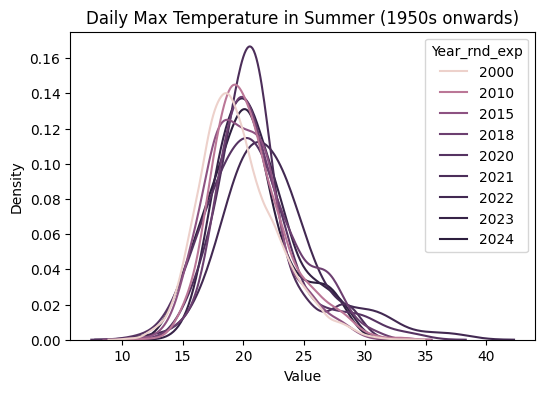
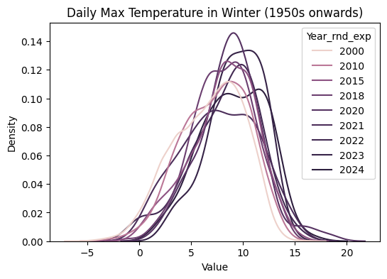

# UK temperature trends

Load data

Source:
https://www.metoffice.gov.uk/hadobs/hadcet/data/download.html


```python
import polars as pl

df = pl.read_csv("daily_max_temp.txt", has_header=True)

df = (
    df.select(
        pl.col(df.columns[0])
        .str.split(" ")
        .list.get(0)
        .str.strptime(pl.Date, "%Y-%m-%d")
        .alias("Date"),
        pl.col(df.columns[0]).str.split(" ").list.get(-1).cast(float).alias("Value"),
    )
    .with_columns(
        pl.col("Date").dt.year().alias("Year"), pl.col("Date").dt.month().alias("Month")
    )
    .with_columns(
        ((pl.col("Year") / 5).round() * 5).alias("Year_rnd"),
        ((pl.col("Year").clip(lower_bound=1999) / 10).round() * 10).alias("Year_rnd2"),
        # round the year based on an exponential scale
        pl.when(pl.col("Year") <= 2000)
        .then(2000)
        .when(pl.col("Year") <= 2010)
        .then(2010)
        .when(pl.col("Year") <= 2015)
        .then(2015)
        .when(pl.col("Year") <= 2018)
        .then(2018)
        .when(pl.col("Year") <= 2020)
        .then(2020)
        .otherwise(pl.col("Year"))
        .alias("Year_rnd_exp"),
        (pl.col("Date").dt.month().is_in([6, 7, 8])).alias("Summer"),
        (pl.col("Date").dt.month().is_in([12, 1, 2])).alias("Winter"),
    )
)
df
```


<div><style>
.dataframe > thead > tr,
.dataframe > tbody > tr {
  text-align: right;
  white-space: pre-wrap;
}
</style>
<small>shape: (53_873, 9)</small><table border="1" class="dataframe"><thead><tr><th>Date</th><th>Value</th><th>Year</th><th>Month</th><th>Year_rnd</th><th>Year_rnd2</th><th>Year_rnd_exp</th><th>Summer</th><th>Winter</th></tr><tr><td>date</td><td>f64</td><td>i32</td><td>i8</td><td>f64</td><td>f64</td><td>i32</td><td>bool</td><td>bool</td></tr></thead><tbody><tr><td>1878-01-01</td><td>6.2</td><td>1878</td><td>1</td><td>1880.0</td><td>2000.0</td><td>2000</td><td>false</td><td>true</td></tr><tr><td>1878-01-02</td><td>7.8</td><td>1878</td><td>1</td><td>1880.0</td><td>2000.0</td><td>2000</td><td>false</td><td>true</td></tr><tr><td>1878-01-03</td><td>8.8</td><td>1878</td><td>1</td><td>1880.0</td><td>2000.0</td><td>2000</td><td>false</td><td>true</td></tr><tr><td>1878-01-04</td><td>8.4</td><td>1878</td><td>1</td><td>1880.0</td><td>2000.0</td><td>2000</td><td>false</td><td>true</td></tr><tr><td>1878-01-05</td><td>7.7</td><td>1878</td><td>1</td><td>1880.0</td><td>2000.0</td><td>2000</td><td>false</td><td>true</td></tr><tr><td>&hellip;</td><td>&hellip;</td><td>&hellip;</td><td>&hellip;</td><td>&hellip;</td><td>&hellip;</td><td>&hellip;</td><td>&hellip;</td><td>&hellip;</td></tr><tr><td>2025-06-27</td><td>24.7</td><td>2025</td><td>6</td><td>2025.0</td><td>2030.0</td><td>2025</td><td>true</td><td>false</td></tr><tr><td>2025-06-28</td><td>26.0</td><td>2025</td><td>6</td><td>2025.0</td><td>2030.0</td><td>2025</td><td>true</td><td>false</td></tr><tr><td>2025-06-29</td><td>26.3</td><td>2025</td><td>6</td><td>2025.0</td><td>2030.0</td><td>2025</td><td>true</td><td>false</td></tr><tr><td>2025-06-30</td><td>29.5</td><td>2025</td><td>6</td><td>2025.0</td><td>2030.0</td><td>2025</td><td>true</td><td>false</td></tr><tr><td>2025-07-01</td><td>26.8</td><td>2025</td><td>7</td><td>2025.0</td><td>2030.0</td><td>2025</td><td>true</td><td>false</td></tr></tbody></table></div>


Plot KDE


```python
import seaborn as sns
import matplotlib.pyplot as plt

fig, ax = plt.subplots(figsize=(6, 4))
sns.kdeplot(
    data=df.filter(pl.col("Year_rnd_exp") < 2025).filter(pl.col("Summer")).to_pandas(),
    x="Value",
    hue="Year_rnd_exp",
    fill=False,
    common_norm=False,
    ax=ax,
)
# ax.set_xlim(20, 40)
ax.set_title("Daily Max Temperature in Summer (1950s onwards)")

fig, ax = plt.subplots(figsize=(6, 4))
sns.kdeplot(
    data=df.filter(pl.col("Year_rnd_exp") < 2025).filter(pl.col("Winter")).to_pandas(),
    x="Value",
    hue="Year_rnd_exp",
    fill=False,
    common_norm=False,
    ax=ax,
)
# ax.set_xlim(20, 30)
ax.set_title("Daily Max Temperature in Winter (1950s onwards)")
fig.show()
```

    /var/folders/ky/4qby95090jbbq38_mh94x72r0000gn/T/ipykernel_83347/2399390047.py:27: UserWarning: FigureCanvasAgg is non-interactive, and thus cannot be shown
      fig.show()


    

    


    

    

