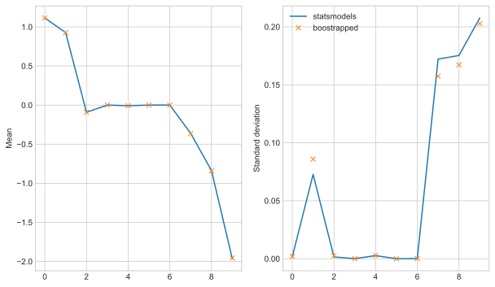

# Bootstrapped Regression Coefficients

Here we explore the theoretical coefficient distributions from a linear regression model. When fitting a regression model we can get estimates for the standard deviation of the coefficients. We use bootstrapping to get an empiracle distribution of the regression coefficients to compare against those distributions.

The outline is as follows:
* Collect some data
* Fit a regression model
* Fit many models on bootstrapped samples of the training data
* Compare the distribution of bootstrapped coefficients to the theoretical distribution of coefficients


The data used is weather data collect from kaggle:
[https://www.kaggle.com/budincsevity/szeged-weather](https://www.kaggle.com/budincsevity/szeged-weather)


```python
import os
import pandas as pd
import numpy as np

dir_path = os.getcwd()
data = pd.read_csv(os.path.join(dir_path, "data", "weatherHistory.csv"))
data.head()
```


<div>
<style scoped>
    .dataframe tbody tr th:only-of-type {
        vertical-align: middle;
    }

    .dataframe tbody tr th {
        vertical-align: top;
    }

    .dataframe thead th {
        text-align: right;
    }
</style>
<table border="1" class="dataframe">
  <thead>
    <tr style="text-align: right;">
      <th></th>
      <th>Formatted Date</th>
      <th>Summary</th>
      <th>Precip Type</th>
      <th>Temperature (C)</th>
      <th>Apparent Temperature (C)</th>
      <th>Humidity</th>
      <th>Wind Speed (km/h)</th>
      <th>Wind Bearing (degrees)</th>
      <th>Visibility (km)</th>
      <th>Loud Cover</th>
      <th>Pressure (millibars)</th>
      <th>Daily Summary</th>
    </tr>
  </thead>
  <tbody>
    <tr>
      <th>0</th>
      <td>2006-04-01 00:00:00.000 +0200</td>
      <td>Partly Cloudy</td>
      <td>rain</td>
      <td>9.472222</td>
      <td>7.388889</td>
      <td>0.89</td>
      <td>14.1197</td>
      <td>251.0</td>
      <td>15.8263</td>
      <td>0.0</td>
      <td>1015.13</td>
      <td>Partly cloudy throughout the day.</td>
    </tr>
    <tr>
      <th>1</th>
      <td>2006-04-01 01:00:00.000 +0200</td>
      <td>Partly Cloudy</td>
      <td>rain</td>
      <td>9.355556</td>
      <td>7.227778</td>
      <td>0.86</td>
      <td>14.2646</td>
      <td>259.0</td>
      <td>15.8263</td>
      <td>0.0</td>
      <td>1015.63</td>
      <td>Partly cloudy throughout the day.</td>
    </tr>
    <tr>
      <th>2</th>
      <td>2006-04-01 02:00:00.000 +0200</td>
      <td>Mostly Cloudy</td>
      <td>rain</td>
      <td>9.377778</td>
      <td>9.377778</td>
      <td>0.89</td>
      <td>3.9284</td>
      <td>204.0</td>
      <td>14.9569</td>
      <td>0.0</td>
      <td>1015.94</td>
      <td>Partly cloudy throughout the day.</td>
    </tr>
    <tr>
      <th>3</th>
      <td>2006-04-01 03:00:00.000 +0200</td>
      <td>Partly Cloudy</td>
      <td>rain</td>
      <td>8.288889</td>
      <td>5.944444</td>
      <td>0.83</td>
      <td>14.1036</td>
      <td>269.0</td>
      <td>15.8263</td>
      <td>0.0</td>
      <td>1016.41</td>
      <td>Partly cloudy throughout the day.</td>
    </tr>
    <tr>
      <th>4</th>
      <td>2006-04-01 04:00:00.000 +0200</td>
      <td>Mostly Cloudy</td>
      <td>rain</td>
      <td>8.755556</td>
      <td>6.977778</td>
      <td>0.83</td>
      <td>11.0446</td>
      <td>259.0</td>
      <td>15.8263</td>
      <td>0.0</td>
      <td>1016.51</td>
      <td>Partly cloudy throughout the day.</td>
    </tr>
  </tbody>
</table>
</div>


Next we do some data preparation. We create a model to predict apparent temperature using most of the remaining columns:


```python
# Calculate apprent temperature
X = data.loc[
    :,
    [
        "Temperature (C)",
        "Humidity",
        "Wind Speed (km/h)",
        "Wind Bearing (degrees)",
        "Visibility (km)",
        "Loud Cover",
        "Pressure (millibars)",
    ],
]
X = X.join(pd.get_dummies(data["Precip Type"]))

# add constant column
X["Constant"] = 1

y = data.loc[:, "Apparent Temperature (C)"]

X.head()
```


<div>
<style scoped>
    .dataframe tbody tr th:only-of-type {
        vertical-align: middle;
    }

    .dataframe tbody tr th {
        vertical-align: top;
    }

    .dataframe thead th {
        text-align: right;
    }
</style>
<table border="1" class="dataframe">
  <thead>
    <tr style="text-align: right;">
      <th></th>
      <th>Temperature (C)</th>
      <th>Humidity</th>
      <th>Wind Speed (km/h)</th>
      <th>Wind Bearing (degrees)</th>
      <th>Visibility (km)</th>
      <th>Loud Cover</th>
      <th>Pressure (millibars)</th>
      <th>rain</th>
      <th>snow</th>
      <th>Constant</th>
    </tr>
  </thead>
  <tbody>
    <tr>
      <th>0</th>
      <td>9.472222</td>
      <td>0.89</td>
      <td>14.1197</td>
      <td>251.0</td>
      <td>15.8263</td>
      <td>0.0</td>
      <td>1015.13</td>
      <td>1</td>
      <td>0</td>
      <td>1</td>
    </tr>
    <tr>
      <th>1</th>
      <td>9.355556</td>
      <td>0.86</td>
      <td>14.2646</td>
      <td>259.0</td>
      <td>15.8263</td>
      <td>0.0</td>
      <td>1015.63</td>
      <td>1</td>
      <td>0</td>
      <td>1</td>
    </tr>
    <tr>
      <th>2</th>
      <td>9.377778</td>
      <td>0.89</td>
      <td>3.9284</td>
      <td>204.0</td>
      <td>14.9569</td>
      <td>0.0</td>
      <td>1015.94</td>
      <td>1</td>
      <td>0</td>
      <td>1</td>
    </tr>
    <tr>
      <th>3</th>
      <td>8.288889</td>
      <td>0.83</td>
      <td>14.1036</td>
      <td>269.0</td>
      <td>15.8263</td>
      <td>0.0</td>
      <td>1016.41</td>
      <td>1</td>
      <td>0</td>
      <td>1</td>
    </tr>
    <tr>
      <th>4</th>
      <td>8.755556</td>
      <td>0.83</td>
      <td>11.0446</td>
      <td>259.0</td>
      <td>15.8263</td>
      <td>0.0</td>
      <td>1016.51</td>
      <td>1</td>
      <td>0</td>
      <td>1</td>
    </tr>
  </tbody>
</table>
</div>


We reduce the training data size just to enlarge the coefficient distributino for the purpose of this article.


```python
from sklearn.model_selection import train_test_split

X_train, X_test, y_train, y_test = train_test_split(X, y, test_size=0.9)
X_train.reset_index(inplace=True, drop=True)
y_train.reset_index(inplace=True, drop=True)
X_train.shape
```


    (9645, 10)


## Statsmodels approach

With `statsmodels` we can apply the ordinary least squares solution to the above data to recover estimates of the model coefficients. When we fit a linear regression model the Hessian (2nd order derivatives) determines how sensitive the coefficients are to changes in the data. This in turn is used to calculate the standard deviation of the coefficients.


```python
import statsmodels.api as sm

results = sm.OLS(y_train, X_train).fit()
print(results.summary())
# extract coefficient distributions
w_sm_mu = results.params
w_sm_std = np.sqrt(np.diag(results.normalized_cov_params))
```

    OLS Regression Results                               
    ====================================================================================
    Dep. Variable:     Apparent Temperature (C)   R-squared:                       0.990
    Model:                                  OLS   Adj. R-squared:                  0.990
    Method:                       Least Squares   F-statistic:                 1.175e+05
    Date:                      Thu, 11 Jun 2020   Prob (F-statistic):               0.00
    Time:                              00:00:29   Log-Likelihood:                -14401.
    No. Observations:                      9645   AIC:                         2.882e+04
    Df Residuals:                          9636   BIC:                         2.888e+04
    Df Model:                                 8                                         
    Covariance Type:                  nonrobust                                         
    ==========================================================================================
                                 coef    std err          t      P>|t|      [0.025      0.975]
    ------------------------------------------------------------------------------------------
    Temperature (C)            1.1138      0.002    607.061      0.000       1.110       1.117
    Humidity                   0.9269      0.078     11.828      0.000       0.773       1.081
    Wind Speed (km/h)         -0.0919      0.002    -54.661      0.000      -0.095      -0.089
    Wind Bearing (degrees)     0.0006      0.000      5.584      0.000       0.000       0.001
    Visibility (km)           -0.0082      0.003     -2.805      0.005      -0.014      -0.002
    Loud Cover              2.722e-15   1.54e-15      1.764      0.078   -3.03e-16    5.75e-15
    Pressure (millibars)       0.0002   9.24e-05      2.550      0.011    5.45e-05       0.000
    rain                      -0.3603      0.186     -1.942      0.052      -0.724       0.003
    snow                      -0.8371      0.189     -4.432      0.000      -1.207      -0.467
    Constant                  -1.9649      0.224     -8.783      0.000      -2.403      -1.526
    ==============================================================================
    Omnibus:                      240.963   Durbin-Watson:                   1.987
    Prob(Omnibus):                  0.000   Jarque-Bera (JB):              262.505
    Skew:                           0.378   Prob(JB):                     9.95e-58
    Kurtosis:                       3.287   Cond. No.                     3.57e+20
    ==============================================================================
    
    Warnings:
    [1] Standard Errors assume that the covariance matrix of the errors is correctly specified.
    [2] The smallest eigenvalue is 7.96e-32. This might indicate that there are
    strong multicollinearity problems or that the design matrix is singular.


The above model coefficients suggest that the apparent temperature is mostly made up of the actual temperature. Humidity has a positive relationship and wind a negative relationship.

## Bootstrapping approach

To get an empirical idea of the distribution of the regression coefficients we can refit the model on many bootstrapped samples. A bootstrap sample is when we take random samples from our training set, with replacement. If we take 1000 bootstrap samples and fit a model on each we gain 1000 estimates of the regression coefficients.

We do this as follows:


```python
w_bs = []
n = X_train.shape[0]
for i in range(1000):
    samp = np.random.randint(n, size=n)
    results_bs = sm.OLS(y_train.loc[samp], X_train.loc[samp, :]).fit()
    w_bs.append(results_bs.params)
w_bs = np.array(w_bs)

# summarise coefficient distributions
w_bs_mu = np.mean(w_bs, axis=0)
w_bs_std = np.std(w_bs, axis=0)
```

## Results comparison
We can now compare the coefficient distributions to the theoretical results from statsmodels.

Below we plot the coefficient means and standard deviations from both statsmodels and the bootstrapped models.


```python
import matplotlib.pyplot as plt

plt.style.use("seaborn-whitegrid")

fig, ax = plt.subplots(ncols=2, figsize=(10, 6))
ax[0].plot(range(X.shape[1]), w_sm_mu, label="statsmodels")
ax[0].plot(range(X.shape[1]), w_bs_mu, "x", label="boostrapped")
ax[0].set_ylabel("Mean")

ax[1].plot(range(X.shape[1]), w_sm_std, label="statsmodels")
ax[1].plot(range(X.shape[1]), w_bs_std, "x", label="boostrapped")
ax[1].set_ylabel("Standard deviation")

plt.legend()
plt.show()
```


    

    


The above figures show that both the means and standard deviations are close. This suggests the coefficient distribution from the theory are likely correct. The numbers should converge with more bootstrap samples.


I would expect the bootstrapped coefficients to maybe over estimate the coefficient standard deviations - each bootstrap sample will have fewer unique data entries to fit the model, as such the coefficients may not be as tightly fit. It doesn't seem like we have enough evidence to clarify this.

The raw result numbers are shown below:


```python
coefficients = pd.concat(
    [
        w_sm_mu,
        pd.DataFrame(data=w_bs_mu, index=X_train.columns),
        pd.DataFrame(data=w_sm_std, index=X_train.columns),
        pd.DataFrame(data=w_bs_std, index=X_train.columns),
    ],
    axis=1,
)

coefficients.columns = [
    "statsmodels_mu",
    "bootstrapped_mu",
    "statsmodels_std",
    "bootstrapped_std",
]
coefficients
```


<div>
<style scoped>
    .dataframe tbody tr th:only-of-type {
        vertical-align: middle;
    }

    .dataframe tbody tr th {
        vertical-align: top;
    }

    .dataframe thead th {
        text-align: right;
    }
</style>
<table border="1" class="dataframe">
  <thead>
    <tr style="text-align: right;">
      <th></th>
      <th>statsmodels_mu</th>
      <th>bootstrapped_mu</th>
      <th>statsmodels_std</th>
      <th>bootstrapped_std</th>
    </tr>
  </thead>
  <tbody>
    <tr>
      <th>Temperature (C)</th>
      <td>1.113766e+00</td>
      <td>1.113721e+00</td>
      <td>1.702782e-03</td>
      <td>1.919617e-03</td>
    </tr>
    <tr>
      <th>Humidity</th>
      <td>9.269036e-01</td>
      <td>9.255212e-01</td>
      <td>7.272990e-02</td>
      <td>8.587625e-02</td>
    </tr>
    <tr>
      <th>Wind Speed (km/h)</th>
      <td>-9.193476e-02</td>
      <td>-9.207228e-02</td>
      <td>1.560984e-03</td>
      <td>2.599598e-03</td>
    </tr>
    <tr>
      <th>Wind Bearing (degrees)</th>
      <td>5.787597e-04</td>
      <td>5.797346e-04</td>
      <td>9.620203e-05</td>
      <td>1.074969e-04</td>
    </tr>
    <tr>
      <th>Visibility (km)</th>
      <td>-8.162228e-03</td>
      <td>-8.096304e-03</td>
      <td>2.701086e-03</td>
      <td>2.871113e-03</td>
    </tr>
    <tr>
      <th>Loud Cover</th>
      <td>2.722203e-15</td>
      <td>2.385971e-17</td>
      <td>1.432384e-15</td>
      <td>2.841603e-15</td>
    </tr>
    <tr>
      <th>Pressure (millibars)</th>
      <td>2.355312e-04</td>
      <td>2.313375e-04</td>
      <td>8.573335e-05</td>
      <td>9.545615e-05</td>
    </tr>
    <tr>
      <th>rain</th>
      <td>-3.603448e-01</td>
      <td>-3.645398e-01</td>
      <td>1.721736e-01</td>
      <td>1.573641e-01</td>
    </tr>
    <tr>
      <th>snow</th>
      <td>-8.370791e-01</td>
      <td>-8.412777e-01</td>
      <td>1.753044e-01</td>
      <td>1.671947e-01</td>
    </tr>
    <tr>
      <th>Constant</th>
      <td>-1.964852e+00</td>
      <td>-1.954745e+00</td>
      <td>2.076308e-01</td>
      <td>2.028931e-01</td>
    </tr>
  </tbody>
</table>
</div>


