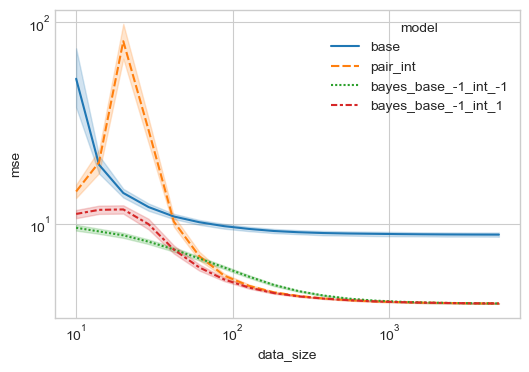

# Interaction models data convergence
How fast do models converge? With interaction terms, a more complex model should take longer to converge.
Can we show this by training against different data lengths.

Can we get the best of both worlds by converging the main effects fast, and then introduce complexity when needed?

Start by importing stuff:


```python
import pandas as pd
import polars as pl

import matplotlib.pyplot as plt
import seaborn as sns

plt.style.use("seaborn-whitegrid")
```

    /var/folders/_v/nlh4h1yx2n1gd6f3szjlgxt40000gr/T/ipykernel_55296/563970410.py:7: MatplotlibDeprecationWarning: The seaborn styles shipped by Matplotlib are deprecated since 3.6, as they no longer correspond to the styles shipped by seaborn. However, they will remain available as 'seaborn-v0_8-<style>'. Alternatively, directly use the seaborn API instead.
      plt.style.use("seaborn-whitegrid")


Let's generate some data.
We will generate some linear data and include interaction terms.

Data is generated as follows:


```python
import numpy as np
import sklearn.preprocessing

RND = np.random.default_rng(0)


def gen_data(
    n: int = 100_000,
    x_dim: int = 6,
    noise_level: float = 2.0,
    interaction_scale: float = 0.01,
):
    # base features
    x_base = pd.DataFrame(RND.uniform(-1, 1, size=(n, x_dim)))

    # add interactions
    int_trans = sklearn.preprocessing.PolynomialFeatures(
        interaction_only=True, degree=2, include_bias=False
    ).set_output(transform="pandas")
    x = int_trans.fit_transform(x_base)

    # make weights
    bias = RND.uniform(-1, 1, size=(1))
    w = RND.uniform(-1, 1, size=(x.shape[1]))
    # scale interaction weights
    w[x_dim:] = interaction_scale * w[x_dim:]

    # make outcomes
    z = np.dot(x, w)
    y = bias + z + noise_level * RND.normal(size=(n))

    return x, y, w, bias, z


n = 100_000
x_dim = 6
x, y, w, bias, z = gen_data(n=n, x_dim=x_dim)
```

## Train models

Split train/test


```python
x_train = x[: n // 2]
x_test = x[n // 2 :]
y_train = y[: n // 2]
y_test = y[n // 2 :]
```

### Linear models


```python
import sklearn.linear_model


def predict_model(
    x_train: np.array, y_train: np.array, x_test: np.array
) -> np.array: ...


def predict_model_pair_int(
    x_train: np.array, y_train: np.array, x_test: np.array
) -> np.array:
    _model = sklearn.linear_model.LinearRegression()
    _model.fit(x_train, y_train)
    return _model.predict(x_test)


def predict_model_base(
    x_train: np.array, y_train: np.array, x_test: np.array
) -> np.array:
    _model = sklearn.linear_model.LinearRegression()
    _model.fit(x_train[:, :x_dim], y_train)
    return _model.predict(x_test[:, :x_dim])


def train_models(
    models: dict[str, callable],
    x_train: np.array,
    y_train: np.array,
    x_test: np.array,
    no_batches: int = 20,
) -> dict:
    y_est = {}
    for _name in models.keys():
        y_est[_name] = {}

    batch_blocks = np.unique(
        np.clip(
            np.logspace(1, np.ceil(np.log10(x_train.shape[0])), no_batches).astype(int),
            1,
            x_train.shape[0],
        )
    )

    for _data_filt in batch_blocks:
        for _name, _model in models.items():
            y_est[_name][_data_filt] = _model(
                x_train[1:_data_filt], y_train[1:_data_filt], x_test
            )
    return y_est


y_est = train_models(
    models={"base": predict_model_base, "pair_int": predict_model_pair_int},
    x_train=x_train.to_numpy(),
    y_train=y_train,
    x_test=x_test.to_numpy(),
)
```

Evaluate


```python
import sklearn.metrics


def get_metrics(y_est, y_test) -> pl.DataFrame:
    metrics = {}
    for _name, _model_est in y_est.items():
        metrics[_name] = {}
        for _data_filt, _y_est in _model_est.items():
            metrics[_name][_data_filt] = sklearn.metrics.mean_squared_error(
                y_test, _y_est
            )

    metrics = pl.DataFrame(
        pd.DataFrame(metrics).reset_index().rename(columns={"index": "data_size"})
    )
    return metrics


metrics = get_metrics(y_est=y_est, y_test=y_test)
metrics
```


<div><style>
.dataframe > thead > tr > th,
.dataframe > tbody > tr > td {
  text-align: right;
}
</style>
<small>shape: (19, 3)</small><table border="1" class="dataframe"><thead><tr><th>data_size</th><th>base</th><th>pair_int</th></tr><tr><td>i64</td><td>f64</td><td>f64</td></tr></thead><tbody><tr><td>10</td><td>7.021291</td><td>5.908158</td></tr><tr><td>16</td><td>5.209511</td><td>14.097194</td></tr><tr><td>26</td><td>4.39508</td><td>35.045385</td></tr><tr><td>42</td><td>4.57206</td><td>5.576258</td></tr><tr><td>69</td><td>4.411355</td><td>5.976907</td></tr><tr><td>112</td><td>4.361497</td><td>5.000326</td></tr><tr><td>183</td><td>4.282209</td><td>4.518509</td></tr><tr><td>297</td><td>4.115095</td><td>4.410294</td></tr><tr><td>483</td><td>4.030166</td><td>4.115449</td></tr><tr><td>784</td><td>4.007926</td><td>4.070176</td></tr><tr><td>1274</td><td>3.988579</td><td>4.007178</td></tr><tr><td>2069</td><td>3.981494</td><td>3.993713</td></tr><tr><td>3359</td><td>3.984491</td><td>3.992081</td></tr><tr><td>5455</td><td>3.981747</td><td>3.989064</td></tr><tr><td>8858</td><td>3.98022</td><td>3.985193</td></tr><tr><td>14384</td><td>3.979952</td><td>3.986001</td></tr><tr><td>23357</td><td>3.979837</td><td>3.984299</td></tr><tr><td>37926</td><td>3.979853</td><td>3.982656</td></tr><tr><td>50000</td><td>3.979462</td><td>3.980511</td></tr></tbody></table></div>


```python
def plot_metrics(metrics: pl.DataFrame):
    fig, ax = plt.subplots(figsize=(6, 4))
    sns.lineplot(
        data=metrics.melt(id_vars="data_size", value_name="mse", variable_name="model"),
        x="data_size",
        y="mse",
        hue="model",
        style="model",
        ax=ax,
    )
    ax.set_xscale("log")
    ax.set_yscale("log")
    fig.show()
```


```python
plot_metrics(metrics)
```

    /var/folders/_v/nlh4h1yx2n1gd6f3szjlgxt40000gr/T/ipykernel_55296/1525875327.py:13: UserWarning: Matplotlib is currently using module://matplotlib_inline.backend_inline, which is a non-GUI backend, so cannot show the figure.
      fig.show()


    

    


## Simulating multiple datasets

We repeat the above but repeating over multiple random datasets.
This gives us performance on average.

Low interaction effect


```python
import tqdm

default_models = {"base": predict_model_base, "pair_int": predict_model_pair_int}


def train_loop(models: dict = default_models, gen_data_kwargs: dict = None):
    if gen_data_kwargs is None:
        gen_data_kwargs = {}
    x, y, w, bias, z = gen_data(**gen_data_kwargs)

    n = x.shape[0]
    x_train = x[: n // 2]
    x_test = x[n // 2 :]
    y_train = y[: n // 2]
    y_test = y[n // 2 :]

    y_est = train_models(
        models=models,
        x_train=x_train.to_numpy(),
        y_train=y_train,
        x_test=x_test.to_numpy(),
    )
    _metrics = get_metrics(y_est=y_est, y_test=y_test)
    return _metrics


metrics = []
for _i in tqdm.trange(100):
    metrics.append(
        train_loop(gen_data_kwargs=dict(n=10_000, x_dim=6, interaction_scale=0.01))
    )
metrics = pl.concat(metrics)

plot_metrics(metrics)
```

    100%|██████████| 100/100 [00:04<00:00, 24.80it/s]
    /var/folders/_v/nlh4h1yx2n1gd6f3szjlgxt40000gr/T/ipykernel_55296/1525875327.py:13: UserWarning: Matplotlib is currently using module://matplotlib_inline.backend_inline, which is a non-GUI backend, so cannot show the figure.
      fig.show()


    

    


High interaction effects

Interactions model asymptotically outperforms. But it still under performs at the beginning.


```python
metrics = []
for _i in tqdm.trange(100):
    metrics.append(
        train_loop(gen_data_kwargs=dict(n=10_000, x_dim=6, interaction_scale=1.0))
    )
metrics = pl.concat(metrics)

plot_metrics(metrics)
```

    100%|██████████| 100/100 [00:03<00:00, 26.66it/s]
    /var/folders/_v/nlh4h1yx2n1gd6f3szjlgxt40000gr/T/ipykernel_55296/1525875327.py:13: UserWarning: Matplotlib is currently using module://matplotlib_inline.backend_inline, which is a non-GUI backend, so cannot show the figure.
      fig.show()


    

    


Super High interaction effects

The interactions model still under performs at the beginning, but the asymptotic performance is improved.


```python
metrics = []
for _i in tqdm.trange(100):
    metrics.append(
        train_loop(gen_data_kwargs=dict(n=10_000, x_dim=6, interaction_scale=3.0))
    )
metrics = pl.concat(metrics)

plot_metrics(metrics)
```

    100%|██████████| 100/100 [00:04<00:00, 23.88it/s]
    /var/folders/_v/nlh4h1yx2n1gd6f3szjlgxt40000gr/T/ipykernel_55296/1525875327.py:13: UserWarning: Matplotlib is currently using module://matplotlib_inline.backend_inline, which is a non-GUI backend, so cannot show the figure.
      fig.show()


    

    


We see that the base effects model performs between for smaller amounts of data. This makes sense as there are fewer parameters to learn.
The asymptotic performance of the interactions model is better whenever there are interactions in the data, or at least as good as the base model when interactions are not present.

Can we find models that perform better across all these scenarios?

### Standard regularisation (L1/L2)
It makes sense that regularisation would help here to prevent the poor performance with loss data sizes.

It has asymptotic performance similar to the interactions model but slightly worse.
It does improve performance degradation at small data sizes.

Grid search could be used to optimise this.


```python
def predict_model_elastic_reg(
    x_train: np.array, y_train: np.array, x_test: np.array
) -> np.array:
    _model = sklearn.linear_model.ElasticNet(alpha=0.01, l1_ratio=0.1, max_iter=5000)
    _model.fit(x_train, y_train)
    return _model.predict(x_test)


def predict_model_ridge_reg(
    x_train: np.array, y_train: np.array, x_test: np.array, alpha: float = 1.0
) -> np.array:
    _model = sklearn.linear_model.Ridge(alpha=alpha)
    _model.fit(x_train, y_train)
    return _model.predict(x_test)
```


```python
metrics = []
for _i in tqdm.trange(100):
    metrics.append(
        train_loop(
            gen_data_kwargs=dict(n=10_000, x_dim=6, interaction_scale=1.0),
            models={
                "base": predict_model_base,
                "pair_int": predict_model_pair_int,
                "ridge_0.1": lambda *x: predict_model_ridge_reg(*x, alpha=0.1),
                "ridge_1.0": lambda *x: predict_model_ridge_reg(*x, alpha=1.0),
                "ridge_10.0": lambda *x: predict_model_ridge_reg(*x, alpha=10.0),
            },
        )
    )
metrics = pl.concat(metrics)

plot_metrics(metrics)
```

    100%|██████████| 100/100 [00:06<00:00, 15.77it/s]
    /var/folders/_v/nlh4h1yx2n1gd6f3szjlgxt40000gr/T/ipykernel_55296/1525875327.py:13: UserWarning: Matplotlib is currently using module://matplotlib_inline.backend_inline, which is a non-GUI backend, so cannot show the figure.
      fig.show()


    

    


## Bayesian prior based

Ridge regression adds regularisation evenly across all parameters.
It doesn't distinquish between base effects and interactions.

Can we use Bayesian regression to solve this?
We could add priors on each model weight, and treat the interactions with a different prior to the base effects.

How can we add different priors to each weights?
We can adjust the weights covariance matrix for the prior distribution.
We typically use a multi-variate Gaussian distribution over the model weights, with a diagonal covariance matrix.
The standard deviation of these diagonal terms denote the spread of each model weight.
For the interactions we make these terms lower to denote a stronger prior that the interactions should not deviate as much as the base effects.

This should make the model focus training on the base effects, and the interactions will start to deviate more when there is more data available.

The implementation was based a [previous notebook](https://github.com/stanton119/data-analysis/blob/master/regression/sequential_bayesian_regression/sequential_bayesian_linear_regression.ipynb).


```python
class BayesLinearRegressor:
    def __init__(
        self,
        number_of_features,
        mean=None,
        cov=None,
        alpha=1e6,
        beta=1,
        fit_intercept: bool = True,
    ):
        self.fit_intercept = fit_intercept
        self.number_of_features = number_of_features

        if self.fit_intercept:
            self.number_of_features = self.number_of_features + 1

        # prior distribution on weights
        if mean is None:
            self.mean = np.array([[0] * (self.number_of_features)], dtype=float).T

        if cov is None:
            self.cov = alpha * np.identity(self.number_of_features)
        else:
            self.cov = cov
        self.cov_inv = np.linalg.inv(self.cov)
        self.cov_init = self.cov

        self.beta = beta  # process noise

    def fit(self, X, y):
        return self.update(X, y)

    def update(self, X, y, inc_alpha=None):
        """
        Perform a bayesian update step
        """
        if isinstance(X, pd.DataFrame):
            X = X.to_numpy()
        if self.fit_intercept:
            X = np.hstack([np.full((X.shape[0], 1), 1), X])
        if len(X.shape) == 1:
            X = X[np.newaxis, :]
        if len(y.shape) == 1:
            y = y[:, np.newaxis]
        if X.shape[1] > self.number_of_features:
            X = X[:, : self.number_of_features]

        # update state of covariance and means
        cov_n_inv = self.cov_inv + self.beta * X.T @ X
        cov_n = np.linalg.inv(cov_n_inv)
        mean_n = cov_n @ (self.cov_inv @ self.mean + self.beta * X.T @ y)

        if inc_alpha is not None:
            # cov_n = cov_n - (cov_n - self.cov_init) * inc_alpha
            cov_n = cov_n + inc_alpha * np.identity(self.number_of_features)

            cov_n_inv = np.linalg.inv(cov_n)

        self.cov_inv = cov_n_inv
        self.cov = cov_n
        self.mean = mean_n

    def predict(self, X, return_std: bool = False) -> [np.array, np.array]:
        if isinstance(X, pd.DataFrame):
            X = X.to_numpy()
        if self.fit_intercept:
            X = np.hstack([np.full((X.shape[0], 1), 1), X])
        if X.shape[1] > self.number_of_features:
            X = X[:, : self.number_of_features]

        mean = X @ self.mean
        if not return_std:
            return mean

        if X.shape[0] < 1_000:
            scale = np.sqrt(np.sum(X @ self.cov @ X.T, axis=1))
        else:
            scale = None
        return mean, scale

    @property
    def coef_(self):
        return self.mean.flatten()

    @property
    def scale_(self):
        return np.sqrt(np.diag(self.cov))

    @staticmethod
    def callback(model) -> dict:
        return {"coef": model.coef_, "scale": model.scale_}


def cov_split_base_int(
    n_base: int,
    n_int: int,
    alpha_base: float = 1e6,
    alpha_int: float = 1e3,
    fit_intercept: bool = True,
) -> np.array:
    fit_intercept = int(fit_intercept)
    cov = np.identity(fit_intercept + n_base + n_int)
    cov[fit_intercept : n_base + fit_intercept] = (
        cov[fit_intercept : n_base + fit_intercept] * alpha_base
    )
    cov[n_base + fit_intercept :] = cov[n_base + fit_intercept :] * alpha_int
    return cov


def predict_model_bayes(
    x_train: np.array,
    y_train: np.array,
    x_test: np.array,
    alpha_base=1e6,
    alpha_int=1e6,
) -> np.array:
    cov = cov_split_base_int(
        n_base=x_dim,
        n_int=x_train.shape[1] - x_dim,
        alpha_base=alpha_base,
        alpha_int=alpha_int,
    )
    _model = BayesLinearRegressor(number_of_features=x_train.shape[1], cov=cov)
    _model.fit(x_train, y_train)
    return _model.predict(x_test)
```

Using the same uninformed prior for everything gives the same performance as the normal linear regression with the interaction effects.


```python
metrics = []
for _i in tqdm.trange(100):
    metrics.append(
        train_loop(
            gen_data_kwargs=dict(n=10_000, x_dim=6, interaction_scale=1.0),
            models={
                "base": predict_model_base,
                "pair_int": predict_model_pair_int,
                "bayes_wide_prior": predict_model_bayes,
                "ridge_10.0": lambda *x: predict_model_ridge_reg(*x, alpha=10.0),
                "bayes_base_-1_int_-1": lambda *x: predict_model_bayes(
                    *x, alpha_base=1e-1, alpha_int=1e-1
                ),
            },
        )
    )
metrics = pl.concat(metrics)

plot_metrics(metrics)
```

    100%|██████████| 100/100 [00:10<00:00,  9.29it/s]
    /var/folders/_v/nlh4h1yx2n1gd6f3szjlgxt40000gr/T/ipykernel_55296/1525875327.py:13: UserWarning: Matplotlib is currently using module://matplotlib_inline.backend_inline, which is a non-GUI backend, so cannot show the figure.
      fig.show()


    

    


We can see that the Bayesian regression is similar to the interactions model when uninformed priors are used for the weights.
We also see that ridge regression is equivalent to Bayesian regression with a strong prior which is equal between base and interaction effects.

However the benefit of the Bayesian regression is that we can have stronger priors for the interaction terms only.
All the other models can be represented as a subset of the Bayesian regression model.

For example a very strong prior on the interactions is similar to the base model:


```python
metrics = []
for _i in tqdm.trange(100):
    metrics.append(
        train_loop(
            gen_data_kwargs=dict(n=10_000, x_dim=6, interaction_scale=1.0),
            models={
                "base": predict_model_base,
                "bayes_base_10_int_-30": lambda *x: predict_model_bayes(
                    *x, alpha_base=1e10, alpha_int=1e-30
                ),
            },
        )
    )
metrics = pl.concat(metrics)

plot_metrics(metrics)
```

    100%|██████████| 100/100 [00:04<00:00, 23.99it/s]
    /var/folders/_v/nlh4h1yx2n1gd6f3szjlgxt40000gr/T/ipykernel_55296/1525875327.py:13: UserWarning: Matplotlib is currently using module://matplotlib_inline.backend_inline, which is a non-GUI backend, so cannot show the figure.
      fig.show()


    

    


### How to find the optimal priors?

Can we beat ridge regression? What scenarios is ridge regression not sufficient?

Lets plot some scenarios between ridge as Bayesian regression with a higher interaction regularisation

Low interaction effect

Should need high regularisation on the interactions only here


```python
metrics = []
for _i in tqdm.trange(100):
    metrics.append(
        train_loop(
            gen_data_kwargs=dict(n=10_000, x_dim=6, interaction_scale=0.0),
            models={
                "base": predict_model_base,
                "pair_int": predict_model_pair_int,
                "bayes_base_-1_int_-1": lambda *x: predict_model_bayes(
                    *x, alpha_base=1e-1, alpha_int=1e-1
                ),
                "bayes_base_-1_int_-3": lambda *x: predict_model_bayes(
                    *x, alpha_base=1e-1, alpha_int=1e-3
                ),
            },
        )
    )
metrics = pl.concat(metrics)

plot_metrics(metrics)
```

    100%|██████████| 100/100 [00:10<00:00,  9.18it/s]
    /var/folders/_v/nlh4h1yx2n1gd6f3szjlgxt40000gr/T/ipykernel_55296/1525875327.py:13: UserWarning: Matplotlib is currently using module://matplotlib_inline.backend_inline, which is a non-GUI backend, so cannot show the figure.
      fig.show()


    

    


Medium interaction effect


```python
metrics = []
for _i in tqdm.trange(100):
    metrics.append(
        train_loop(
            gen_data_kwargs=dict(n=10_000, x_dim=6, interaction_scale=1.0),
            models={
                "base": predict_model_base,
                "pair_int": predict_model_pair_int,
                "bayes_base_-1_int_-1": lambda *x: predict_model_bayes(
                    *x, alpha_base=1e-1, alpha_int=1e-1
                ),
                "bayes_base_-1_int_-3": lambda *x: predict_model_bayes(
                    *x, alpha_base=1e-1, alpha_int=1e-3
                ),
            },
        )
    )
metrics = pl.concat(metrics)

plot_metrics(metrics)
```

    100%|██████████| 100/100 [00:10<00:00,  9.16it/s]
    /var/folders/_v/nlh4h1yx2n1gd6f3szjlgxt40000gr/T/ipykernel_55296/1525875327.py:13: UserWarning: Matplotlib is currently using module://matplotlib_inline.backend_inline, which is a non-GUI backend, so cannot show the figure.
      fig.show()


    

    


High interaction effect

We want lower regularisation on the interactions here to prevent degrading asymptotic performance.


```python
metrics = []
for _i in tqdm.trange(100):
    metrics.append(
        train_loop(
            gen_data_kwargs=dict(n=10_000, x_dim=6, interaction_scale=3.0),
            models={
                "base": predict_model_base,
                "pair_int": predict_model_pair_int,
                "bayes_base_-1_int_-1": lambda *x: predict_model_bayes(
                    *x, alpha_base=1e-1, alpha_int=1e-1
                ),
                "bayes_base_-1_int_1": lambda *x: predict_model_bayes(
                    *x, alpha_base=1e-1, alpha_int=1e1
                ),
            },
        )
    )
metrics = pl.concat(metrics)

plot_metrics(metrics)
```

    100%|██████████| 100/100 [00:09<00:00, 10.05it/s]
    /var/folders/_v/nlh4h1yx2n1gd6f3szjlgxt40000gr/T/ipykernel_55296/1525875327.py:13: UserWarning: Matplotlib is currently using module://matplotlib_inline.backend_inline, which is a non-GUI backend, so cannot show the figure.
      fig.show()


    

    


## Scenario testing
When is regularisation necessary? When is it necessary to regularise the interactions more or less?

* Low noise (0.5) = base model still the best, too much regularisation on base effects?
* Low noise, low interactions = base model still the best, too much regularisation on base effects?
  * less base regularised + high interaction regularisation = good
* Low noise, low interactions, more features = base model needs more regularisation due to more features. Regularised models out perform all.
* High noise (2.0), low interactions, few features = high regularisation is the best
* Few features, high interaction, low noise = Regularisation is bad

Low noise, low interactions


```python
metrics = []
for _i in tqdm.trange(100):
    metrics.append(
        train_loop(
            gen_data_kwargs=dict(
                n=10_000, x_dim=6, interaction_scale=0.05, noise_level=0.5
            ),
            models={
                "base": predict_model_base,
                "pair_int": predict_model_pair_int,
                "bayes_base_-1_int_-1": lambda *x: predict_model_bayes(
                    *x, alpha_base=1e-1, alpha_int=1e-1
                ),
                "bayes_base_1_int_-1": lambda *x: predict_model_bayes(
                    *x, alpha_base=1e1, alpha_int=1e-1
                ),
            },
        )
    )
metrics = pl.concat(metrics)

plot_metrics(metrics)
```

    100%|██████████| 100/100 [00:14<00:00,  7.07it/s]
    /var/folders/_v/nlh4h1yx2n1gd6f3szjlgxt40000gr/T/ipykernel_55296/1525875327.py:13: UserWarning: Matplotlib is currently using module://matplotlib_inline.backend_inline, which is a non-GUI backend, so cannot show the figure.
      fig.show()


    

    


More features


```python
metrics = []
for _i in tqdm.trange(100):
    metrics.append(
        train_loop(
            gen_data_kwargs=dict(
                n=10_000, x_dim=10, interaction_scale=0.05, noise_level=0.5
            ),
            models={
                "base": predict_model_base,
                "pair_int": predict_model_pair_int,
                "bayes_base_-1_int_-1": lambda *x: predict_model_bayes(
                    *x, alpha_base=1e-1, alpha_int=1e-1
                ),
                "bayes_base_1_int_-1": lambda *x: predict_model_bayes(
                    *x, alpha_base=1e1, alpha_int=1e-1
                ),
            },
        )
    )
metrics = pl.concat(metrics)

plot_metrics(metrics)
```

    100%|██████████| 100/100 [00:30<00:00,  3.30it/s]
    /var/folders/_v/nlh4h1yx2n1gd6f3szjlgxt40000gr/T/ipykernel_55296/1525875327.py:13: UserWarning: Matplotlib is currently using module://matplotlib_inline.backend_inline, which is a non-GUI backend, so cannot show the figure.
      fig.show()


    

    


Fewer features, high noise


```python
metrics = []
for _i in tqdm.trange(100):
    metrics.append(
        train_loop(
            gen_data_kwargs=dict(
                n=10_000, x_dim=2, interaction_scale=0.05, noise_level=2.0
            ),
            models={
                "base": predict_model_base,
                "pair_int": predict_model_pair_int,
                "bayes_base_-1_int_-1": lambda *x: predict_model_bayes(
                    *x, alpha_base=1e-1, alpha_int=1e-1
                ),
                "bayes_base_1_int_-1": lambda *x: predict_model_bayes(
                    *x, alpha_base=1e1, alpha_int=1e-1
                ),
            },
        )
    )
metrics = pl.concat(metrics)

plot_metrics(metrics)
```

    100%|██████████| 100/100 [00:03<00:00, 30.95it/s]
    /var/folders/_v/nlh4h1yx2n1gd6f3szjlgxt40000gr/T/ipykernel_55296/1525875327.py:13: UserWarning: Matplotlib is currently using module://matplotlib_inline.backend_inline, which is a non-GUI backend, so cannot show the figure.
      fig.show()


    

    


Few features, high interaction, low noise
Regularisation is bad


```python
metrics = []
for _i in tqdm.trange(100):
    metrics.append(
        train_loop(
            gen_data_kwargs=dict(
                n=10_000, x_dim=2, interaction_scale=1.0, noise_level=0.1
            ),
            models={
                "base": predict_model_base,
                "pair_int": predict_model_pair_int,
                "bayes_base_-1_int_-1": lambda *x: predict_model_bayes(
                    *x, alpha_base=1e-1, alpha_int=1e-1
                ),
                "bayes_base_1_int_-1": lambda *x: predict_model_bayes(
                    *x, alpha_base=1e1, alpha_int=1e-1
                ),
            },
        )
    )
metrics = pl.concat(metrics)

plot_metrics(metrics)
```

    100%|██████████| 100/100 [00:03<00:00, 30.97it/s]
    /var/folders/_v/nlh4h1yx2n1gd6f3szjlgxt40000gr/T/ipykernel_55296/1525875327.py:13: UserWarning: Matplotlib is currently using module://matplotlib_inline.backend_inline, which is a non-GUI backend, so cannot show the figure.
      fig.show()


    

    


# TODO

* Partial fit the models to speed up training
* Test each iteration
* Compare partial fit on SGD regressors to bayesian updates and full data fits
* Measure as 'cumulative regret'
* Check model coefficients are learning something reasonable
* Test scenarios with more/less noise so less regularisation is require


Model options
* Fit base effects model, use coefficients as priors in an interaction model
* Interactions model with tight priors on interaction terms
  * Use the bayesian model to have different priors - scale the covariance matrix accordingly
  * Use MCMC
* Pytorch to apply L2 regularisation to half the weights
  * Example notebook - https://github.com/stanton119/data-analysis/blob/master/PyTorchStuff/elastic_net/elastic_linear.ipynb


## Specifing priors
How do we specify the interaction priors as a function of the interaction level?

* Can we learn this as a hyper prior we train at the same time?
  * Two priors - interactions and base effects
  * Find sigma for each from a gamma distribution
  * MCMC to optimise (pymc)
* Function of the training size?
* Within bandits - function of performance? If we have converged then increase complexity?


```python
import pymc
```


```python
with (
    pymc.Model() as model
):  # model specifications in PyMC are wrapped in a with-statement
    # Define priors
    sigma = pymc.HalfCauchy("sigma", beta=10)
    intercept = pymc.Normal("Intercept", 0, sigma=20)
    slope = pymc.Normal("slope", 0, sigma=20)

    # Define likelihood
    likelihood = pymc.Normal("y", mu=intercept + slope * x, sigma=sigma, observed=y)

    # Inference!
    # draw 3000 posterior samples using NUTS sampling
    idata = pymc.sample(3000)
```

# Appendix

### Statsmodel sanity check

Using statsmodels gives the same answer to our sklearn approach.


```python
import statsmodels.api as sm


def predict_model_sm(
    x_train: np.array, y_train: np.array, x_test: np.array
) -> np.array:
    _model = sm.OLS(y_train, sm.add_constant(x_train))
    _res = _model.fit()
    return _res.predict(sm.add_constant(x_test))


metrics = []
for _i in tqdm.trange(100):
    metrics.append(
        train_loop(
            gen_data_kwargs=dict(n=10_000, x_dim=6, interaction_scale=1.0),
            models={
                "base": predict_model_base,
                "pair_int": predict_model_pair_int,
                "sm": predict_model_sm,
            },
        )
    )
metrics = pl.concat(metrics)

plot_metrics(metrics)
```

    100%|██████████| 100/100 [00:13<00:00,  7.67it/s]
    /var/folders/_v/nlh4h1yx2n1gd6f3szjlgxt40000gr/T/ipykernel_55296/1525875327.py:13: UserWarning: Matplotlib is currently using module://matplotlib_inline.backend_inline, which is a non-GUI backend, so cannot show the figure.
      fig.show()


    

    

