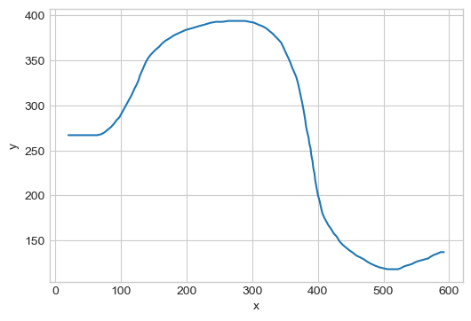
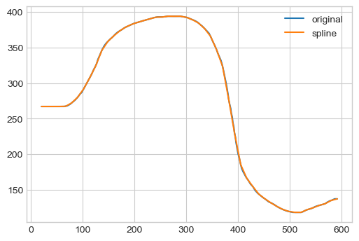
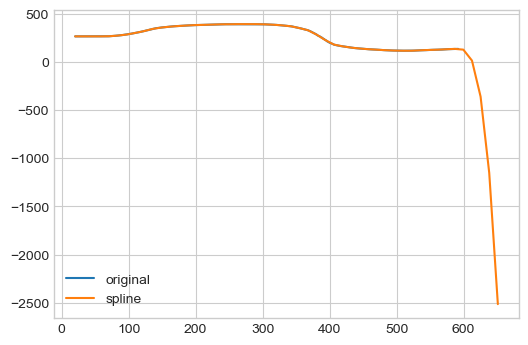
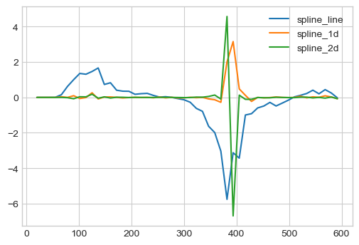
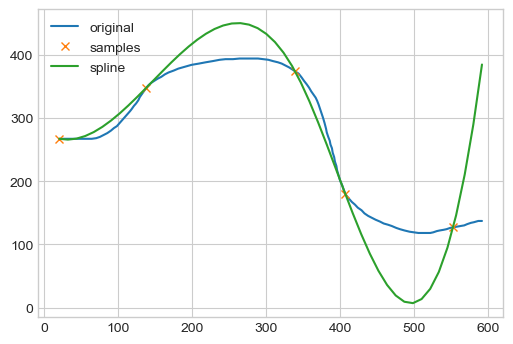
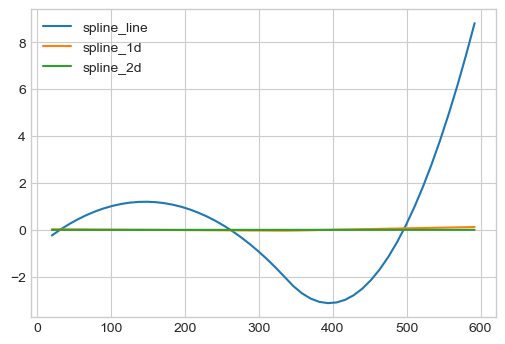
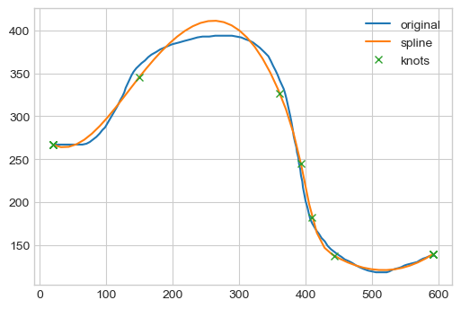
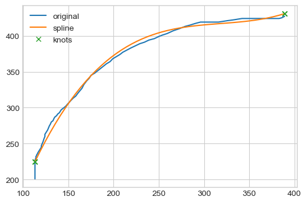
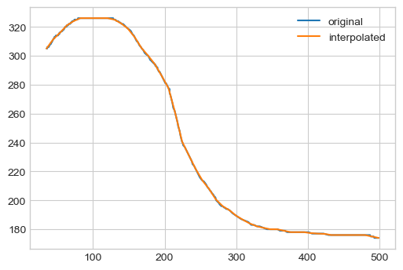
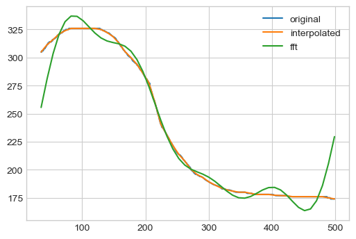

# Data generating functions from drawing data
This post will explore creating a data generating function from drawing data.

We draw some random looking function and collect data points using `https://drawdata.xyz/`

Start by importing stuff:


```python
import pandas as pd
import polars as pl
import matplotlib.pyplot as plt
import seaborn as sns

plt.style.use("seaborn-v0_8-whitegrid")
```

Let's generate some data.

We use `https://drawdata.xyz/` to draw a line of our choice.

Here's a line I created earlier:
```
x,y,z
20,267,a
21,267,a
24,267,a
29,267,a
35,267,a
41,267,a
47,267,a
53,267,a
59,267,a
64,267,a
70,268,a
75,270,a
80,273,a
85,276,a
90,280,a
94,284,a
98,287,a
101,291,a
104,295,a
107,299,a
110,303,a
113,307,a
116,311,a
118,314,a
121,319,a
124,323,a
127,328,a
129,333,a
132,338,a
135,343,a
138,348,a
141,352,a
145,356,a
149,359,a
153,362,a
158,365,a
163,369,a
168,372,a
175,375,a
181,378,a
190,381,a
199,384,a
209,386,a
218,388,a
228,390,a
237,392,a
245,393,a
255,393,a
264,394,a
272,394,a
281,394,a
289,394,a
296,393,a
303,392,a
309,390,a
316,388,a
321,386,a
326,383,a
331,380,a
335,377,a
339,374,a
344,370,a
348,364,a
351,359,a
355,353,a
358,348,a
361,342,a
364,337,a
367,332,a
369,327,a
371,321,a
373,314,a
375,307,a
377,300,a
379,292,a
381,283,a
382,277,a
384,270,a
386,264,a
387,258,a
389,252,a
390,245,a
392,238,a
393,231,a
395,224,a
396,217,a
398,209,a
400,201,a
403,193,a
405,186,a
407,180,a
410,175,a
413,171,a
416,167,a
420,163,a
424,158,a
429,154,a
433,149,a
438,145,a
443,142,a
448,139,a
454,136,a
459,133,a
465,131,a
470,129,a
476,126,a
481,124,a
487,122,a
494,120,a
500,119,a
506,118,a
511,118,a
516,118,a
522,118,a
526,119,a
531,121,a
535,122,a
540,123,a
544,124,a
549,126,a
553,127,a
558,128,a
563,129,a
568,130,a
572,132,a
577,134,a
581,135,a
584,136,a
587,137,a
590,137,a
591,137,a
592,137,a
```

We can then copy to csv and use pandas to create a dataframe from the clipboard:

```
df = pd.read_clipboard(sep=',')
df
```


```python
import io

data = """x,y,z
20,267,a
21,267,a
24,267,a
29,267,a
35,267,a
41,267,a
47,267,a
53,267,a
59,267,a
64,267,a
70,268,a
75,270,a
80,273,a
85,276,a
90,280,a
94,284,a
98,287,a
101,291,a
104,295,a
107,299,a
110,303,a
113,307,a
116,311,a
118,314,a
121,319,a
124,323,a
127,328,a
129,333,a
132,338,a
135,343,a
138,348,a
141,352,a
145,356,a
149,359,a
153,362,a
158,365,a
163,369,a
168,372,a
175,375,a
181,378,a
190,381,a
199,384,a
209,386,a
218,388,a
228,390,a
237,392,a
245,393,a
255,393,a
264,394,a
272,394,a
281,394,a
289,394,a
296,393,a
303,392,a
309,390,a
316,388,a
321,386,a
326,383,a
331,380,a
335,377,a
339,374,a
344,370,a
348,364,a
351,359,a
355,353,a
358,348,a
361,342,a
364,337,a
367,332,a
369,327,a
371,321,a
373,314,a
375,307,a
377,300,a
379,292,a
381,283,a
382,277,a
384,270,a
386,264,a
387,258,a
389,252,a
390,245,a
392,238,a
393,231,a
395,224,a
396,217,a
398,209,a
400,201,a
403,193,a
405,186,a
407,180,a
410,175,a
413,171,a
416,167,a
420,163,a
424,158,a
429,154,a
433,149,a
438,145,a
443,142,a
448,139,a
454,136,a
459,133,a
465,131,a
470,129,a
476,126,a
481,124,a
487,122,a
494,120,a
500,119,a
506,118,a
511,118,a
516,118,a
522,118,a
526,119,a
531,121,a
535,122,a
540,123,a
544,124,a
549,126,a
553,127,a
558,128,a
563,129,a
568,130,a
572,132,a
577,134,a
581,135,a
584,136,a
587,137,a
590,137,a
591,137,a
592,137,a
"""


df = pd.read_csv(io.StringIO(data))
```


```python
fig, ax = plt.subplots(figsize=(6, 4))
sns.lineplot(data=df, x="x", y="y", ax=ax)
fig.show()
```

    /var/folders/_v/nlh4h1yx2n1gd6f3szjlgxt40000gr/T/ipykernel_26588/1701487723.py:3: UserWarning: Matplotlib is currently using module://matplotlib_inline.backend_inline, which is a non-GUI backend, so cannot show the figure.
      fig.show()


    

    


## Summarising data

We need to summarise the line to be able to generate data points from it.
One flexible convenient way is to use cubic splines.

### Cubic splines

The standard scipy implementation fits a new spline to each new data point so we get a very close fit, but a complex function.


```python
import scipy.interpolate

splines = scipy.interpolate.CubicSpline(x=df["x"], y=df["y"])
```

To see how well over function has been learnt we can plot it again:


```python
import numpy as np

x_est = np.linspace(df["x"].min(), df["x"].max())
y_est = splines(x_est)

fig, ax = plt.subplots(figsize=(6, 4))
ax.plot(df["x"], df["y"], label="original")
ax.plot(x_est, y_est, label="spline")
ax.legend()
fig.show()
```

    /var/folders/_v/nlh4h1yx2n1gd6f3szjlgxt40000gr/T/ipykernel_26588/3555637029.py:10: UserWarning: Matplotlib is currently using module://matplotlib_inline.backend_inline, which is a non-GUI backend, so cannot show the figure.
      fig.show()


    

    


Beware if we try to extrapolate cubic splines will not be appropriate as they will quickly point up or down.
Here we extend the max range by 10% and see very odd looking results.


```python
x_est_extra = np.linspace(df["x"].min(), df["x"].max() * 1.1)
y_est = splines(x_est_extra)

fig, ax = plt.subplots(figsize=(6, 4))
ax.plot(df["x"], df["y"], label="original")
ax.plot(x_est_extra, y_est, label="spline")
ax.legend()
fig.show()
```

    /var/folders/_v/nlh4h1yx2n1gd6f3szjlgxt40000gr/T/ipykernel_26588/2547315597.py:8: UserWarning: Matplotlib is currently using module://matplotlib_inline.backend_inline, which is a non-GUI backend, so cannot show the figure.
      fig.show()


    

    


We can plot the spline derivatives which show this is rather too complex a representation.


```python
x_est = np.linspace(df["x"].min(), df["x"].max())
y_est = splines(x_est)

fig, ax = plt.subplots(figsize=(6, 4))
# ax.plot(x_est, y_est, label='spline')
ax.plot(x_est, splines(x_est, 1), label="spline_line")
ax.plot(x_est, splines(x_est, 2), label="spline_1d")
ax.plot(x_est, splines(x_est, 3), label="spline_2d")
ax.legend()
fig.show()
```

    /var/folders/_v/nlh4h1yx2n1gd6f3szjlgxt40000gr/T/ipykernel_26588/4198977419.py:10: UserWarning: Matplotlib is currently using module://matplotlib_inline.backend_inline, which is a non-GUI backend, so cannot show the figure.
      fig.show()


    

    


The scipy implementation creates a spline between each point.
If we subsample the data points we can get a smoother representation.

Here we uniformly sample, but there are likely better ways to distribute the knots to reduce overall error to the original dataset.


```python
samp_rate = 30

splines = scipy.interpolate.CubicSpline(
    x=df["x"][0::samp_rate], y=df["y"][0::samp_rate]
)

y_est = splines(x_est)

fig, ax = plt.subplots(figsize=(6, 4))
ax.plot(df["x"], df["y"], label="original")
ax.plot(
    df["x"][0::samp_rate],
    df["y"][0::samp_rate],
    marker="x",
    linestyle="",
    label="samples",
)
ax.plot(x_est, y_est, label="spline")
ax.legend()
fig.show()
```

    /var/folders/_v/nlh4h1yx2n1gd6f3szjlgxt40000gr/T/ipykernel_26588/453723476.py:20: UserWarning: Matplotlib is currently using module://matplotlib_inline.backend_inline, which is a non-GUI backend, so cannot show the figure.
      fig.show()


    

    


```python
fig, ax = plt.subplots(figsize=(6, 4))
ax.plot(x_est, splines(x_est, 1), label="spline_line")
ax.plot(x_est, splines(x_est, 2), label="spline_1d")
ax.plot(x_est, splines(x_est, 3), label="spline_2d")
ax.legend()
fig.show()
```

    /var/folders/_v/nlh4h1yx2n1gd6f3szjlgxt40000gr/T/ipykernel_26588/4243488250.py:6: UserWarning: Matplotlib is currently using module://matplotlib_inline.backend_inline, which is a non-GUI backend, so cannot show the figure.
      fig.show()


    

    


We can use B-Splines in scipy which gives us knot allocation as well. We control a smoothness parameter which controls how many knots are used and their placement.


```python
splines = scipy.interpolate.splrep(x=df["x"], y=df["y"], s=10000)
y_est = scipy.interpolate.splev(x_est, splines)
y_knots = scipy.interpolate.splev(splines[0], splines)

fig, ax = plt.subplots(figsize=(6, 4))
ax.plot(df["x"], df["y"], label="original")
ax.plot(x_est, y_est, label="spline")
ax.plot(splines[0], y_knots, marker="x", linestyle="", label="knots")
ax.legend()
fig.show()

splines
```

    /var/folders/_v/nlh4h1yx2n1gd6f3szjlgxt40000gr/T/ipykernel_26588/1178800980.py:10: UserWarning: Matplotlib is currently using module://matplotlib_inline.backend_inline, which is a non-GUI backend, so cannot show the figure.
      fig.show()


    (array([ 20.,  20.,  20.,  20., 149., 361., 393., 410., 443., 592., 592.,
            592., 592.]),
     array([266.57874368, 251.24793662, 387.89628971, 464.64881606,
            270.68803167, 151.10293172, 115.82479818, 113.7866661 ,
            139.4434958 ,   0.        ,   0.        ,   0.        ,
              0.        ]),
     3)


    

    


The data is now condensed into a small number of parameters.

We can abstract all the above into a simple function that reads from the clipboard and generates a B-Splines object:


```python
import scipy.interpolate
import numpy as np


def smooth_spline_from_clipboard(s=10_000, plot: bool = False):
    df = pd.read_clipboard(sep=",")

    if s is None:
        splines_params = scipy.interpolate.splrep(x=df["x"], y=df["y"])
    else:
        splines_params = scipy.interpolate.splrep(x=df["x"], y=df["y"], s=s)
    splines = scipy.interpolate.BSpline(*splines_params, extrapolate=False)

    if not plot:
        return df, splines

    x_est = np.linspace(df["x"].min(), df["x"].max())
    y_est = splines(x_est)
    y_knots = splines(splines_params[0])

    fig, ax = plt.subplots(figsize=(6, 4))
    ax.plot(df["x"], df["y"], label="original")
    ax.plot(x_est, y_est, label="spline")
    ax.plot(splines_params[0], y_knots, marker="x", linestyle="", label="knots")
    ax.legend()
    fig.show()

    return df, splines


df, splines = smooth_spline_from_clipboard(plot=True)
```

    /var/folders/_v/nlh4h1yx2n1gd6f3szjlgxt40000gr/T/ipykernel_22298/3230242958.py:25: UserWarning: Matplotlib is currently using module://matplotlib_inline.backend_inline, which is a non-GUI backend, so cannot show the figure.
      fig.show()


    

    


```python
splines.tck
```


    (array([113., 113., 113., 113., 389., 389., 389., 389.]),
     array([224.93053175, 465.45977346, 394.56839914, 430.7190121 ,
              0.        ,   0.        ,   0.        ,   0.        ]),
     3)


Persist splines for loading


```python
import pickle
import io

splines_io = io.BytesIO(pickle.dumps(splines))
splines_loaded = pickle.load(splines_io)
y_est = splines_loaded(np.linspace(0, 1000))
y_est
```


    array([         nan,          nan, 306.04218256, 321.65634248,
           329.72599665, 331.14377902, 326.80232351, 317.59426407,
           304.41223461, 288.14886909, 269.76777584, 250.53042248,
           231.77640175, 214.8453067 , 200.89596761, 190.00857411,
           181.86490973, 176.14612226, 172.5333595 , 170.70776925,
           170.3504993 , 171.14269745, 172.76551149, 174.90008922,
           177.22757845,          nan,          nan,          nan,
                    nan,          nan,          nan,          nan,
                    nan,          nan,          nan,          nan,
                    nan,          nan,          nan,          nan,
                    nan,          nan,          nan,          nan,
                    nan,          nan,          nan,          nan,
                    nan,          nan])


### Signal processing techniques

We can also use:
* truncated Fourier series
* truncated discrete cosine transform
* wavelets


#### Linear interpolation
We need to have uniform sampled data points.
We can use linear/sinc interpolation for this.


```python
import scipy.interpolate

x_interpolater = scipy.interpolate.interp1d(x=df["x"], y=df["y"])
x_int = np.linspace(df["x"].min(), df["x"].max())
y_int = x_interpolater(x_int)

fig, ax = plt.subplots(figsize=(6, 4))
ax.plot(df["x"], df["y"], label="original")
ax.plot(x_int, y_int, label="interpolated")
ax.legend()
fig.show()
```

    /var/folders/_v/nlh4h1yx2n1gd6f3szjlgxt40000gr/T/ipykernel_26588/151921116.py:11: UserWarning: Matplotlib is currently using module://matplotlib_inline.backend_inline, which is a non-GUI backend, so cannot show the figure.
      fig.show()


    

    


#### FFT
Approximate with FFT


```python
import scipy.fft

fft = scipy.fft.fft(y_int)

if 1:
    # truncate fft
    fft_filt = fft
    fft_filt[np.abs(fft) < 300] = 0
else:
    # low pass
    fft_filt = fft
    fft_filt[len(fft) // 2 :] = 0

y_fft = np.abs(scipy.fft.ifft(fft_filt))

fig, ax = plt.subplots(figsize=(6, 4))
ax.plot(df["x"], df["y"], label="original")
ax.plot(x_int, y_int, label="interpolated")
ax.plot(x_int, y_fft, label="fft")
ax.legend()
fig.show()
```

    /var/folders/_v/nlh4h1yx2n1gd6f3szjlgxt40000gr/T/ipykernel_26588/1444341180.py:21: UserWarning: Matplotlib is currently using module://matplotlib_inline.backend_inline, which is a non-GUI backend, so cannot show the figure.
      fig.show()


    

    


#### DCT
Approximate with DCT


```python
import scipy.fft

dct = scipy.fft.dct(y_int)

if 0:
    # truncate dct
    dct_filt = dct
    dct_filt[np.abs(dct) < 300] = 0
else:
    # low pass
    dct_filt = dct
    dct_filt[8:] = 0

y_dct = np.abs(scipy.fft.idct(dct_filt))

fig, ax = plt.subplots(figsize=(6, 4))
ax.plot(df["x"], df["y"], label="original")
ax.plot(x_int, y_int, label="interpolated")
ax.plot(x_int, y_dct, label="dct")
ax.legend()
fig.show()
```

    /var/folders/_v/nlh4h1yx2n1gd6f3szjlgxt40000gr/T/ipykernel_26588/3685423727.py:21: UserWarning: Matplotlib is currently using module://matplotlib_inline.backend_inline, which is a non-GUI backend, so cannot show the figure.
      fig.show()


    

    

